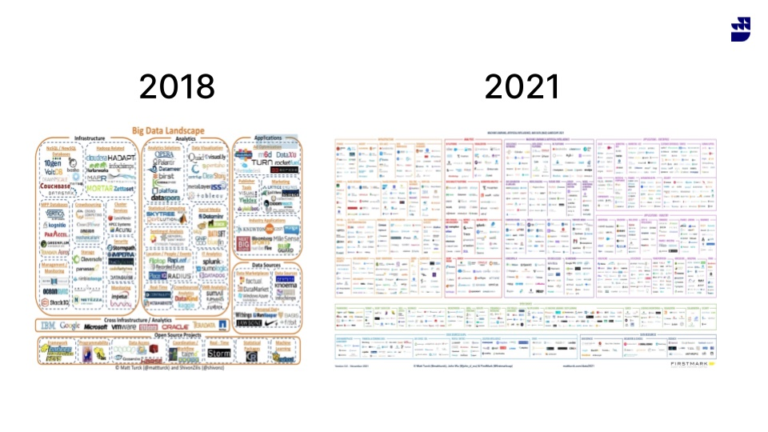

## Introduction

Recently, I had the opportunity to be a part of a discussion panel for industry newcomers at 2U and their partner universities. We discussed a wide array of topics from building professional networks to describing what success looks like once they've landed their first position in data. Of everything covered, the topic that stuck out most to me was navigating emerging data trends in an industry that has seen extreme growth in recent years. 

Since I began my Data Engineering journey in 2018, the data ecosystem has blown up with amount of tools and platforms at our disposal. Some tools used three years ago may be considered legacy or over taken as the best by emerging technologies. One of the biggest challenges in my early career has been building the fundamentals while staying relevant with the new technologies. Constantly playing catch up can feel overwhelming and at times introduce the dreaded imposter syndrome. 

## What's Worked

Like most things in Computer Science, focusing your learning on the fundamentals and principles rather than the latest technology has proven to be the best course to success. You'll quickly discover that the industry is rarely introduced to new technology that isn't built on top of Data Engineering fundamentals/principles. 

With the foundation of fundamentals and principles in place, every organization has different needs and nuances that drive their data tooling decisions. Having a clear understanding of the business objectives and policy towards data is essential in determining the tools that will and will not work to achieve its goals. The first objective in curating Maxwell's data stack was to accomplish our business objectives while looking forward to the new challenges that arise with Business/Team growth. Secondly, as a new team, Maxwell chose a data stack attractive to industry professionals looking to advance their careers while working with the latest tools. For me, Data Engineering requires full days and sometimes late nights to be successful. So consider aligning your personal learning objects with a company that understands how quickly the data ecosystem is evolving and an engineer's desire to stay relevant. 

Leveraging the two basic concepts of starting with first principles and keeping an eye on the organization's needs and nuances, we were able to build an ideal platform that accomplishes Maxwell's business objectives while giving Data Engineers the opportunity to work with a modern data stack. Our data warehouse (Snowflake), orchestration platform (Airflow), and transformation tool (DBT - Data Build Tool) has already given the business a competitive advantage in data offerings and has attracted a lot of potential talent.

## Wrap Up

As it is with all things Computer Science and Engineering, there isn’t enough time in our busy lives for career growth and personal development to be worked on separetly. If solving the mortgage industry’s toughest data related questions and working with our new data stack interests you - feel free to check out [Maxwell’s career page](https://ats.comparably.com/api/v1/lvr/himaxwell) or reach out to me directly, michael.shaw@himaxwell.com. 
