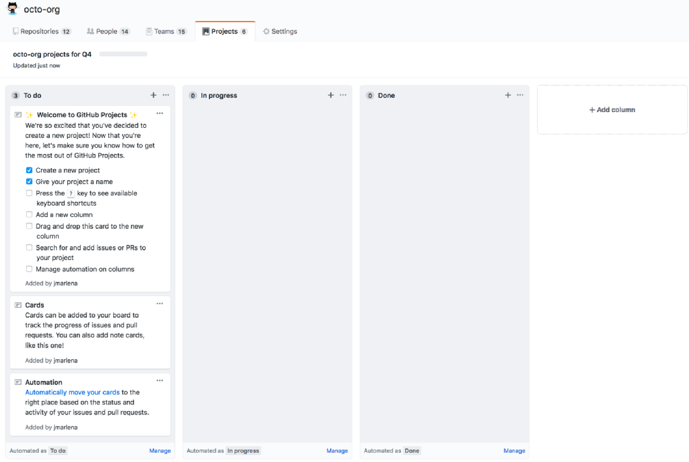

칸반(Kanban)은 제조 업계에서부터 시작된 생산 방법론 중 하나로, 일의 흐름을 시각적으로 표현하여 작업량을 조절하고 작업 프로세스를 개선하는 방법입니다.

칸반은 "칸"(Kan)과 "반"(Ban)이라는 두 가지 요소로 이루어져 있습니다. "칸"은 작업을 수행할 때 필요한 자료, 부품, 도구 등의 물리적인 자원을 나타내며, "반"은 작업을 수행하는데 필요한 시간과 능력 등의 인적 자원을 나타냅니다.

칸반에서는 작업을 수행하는데 필요한 모든 자원을 최소한의 수로 줄이고, 필요한 시점에서 필요한 자원을 즉시 제공하여 작업을 원활하게 수행할 수 있도록 합니다. 이를 위해 작업의 상태와 진행 상황을 시각적으로 표현하는 칸반 보드(Kanban Board)와 같은 도구를 사용합니다.

칸반 방법론은 일의 진행 상황을 시각적으로 파악하고, 작업량을 효율적으로 분산하여 작업의 우선순위를 결정하며, 작업 프로세스의 개선을 지속적으로 수행함으로써 더 나은 결과물을 만들어내는 것을 목표로 합니다. 이를 통해 생산성을 향상시키고, 불필요한 작업을 줄이며, 빠른 대응이 가능한 유연한 작업 환경을 구축할 수 있습니다.