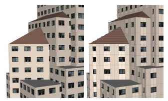

그림 2: 새로운 모양 문법의 동기. 모델링된 건물은 확률적 모양 문법에 의해 배치된 14개의 체적 프리미티브(큐브, 지붕)로 구성됩니다. 왼쪽: 절차적 아키텍처의 기존 방법은 셰이더를 개별 볼륨에 배치하거나 절차적 개선을 위해 분할 규칙을 사용할 수 있습니다. 두 경우 모두 볼륨이 서로를 인식하지 못하기 때문에 원치 않는 여러 교차로 인해 부자연스러운 방식으로 창(또는 기타 요소)이 잘립니다. 오른쪽: 우리의 접근 방식을 통해 이러한 갈등을 해결할 수 있습니다. 또한 지붕 표면과 같이 방향이 다른 다각형에 형상을 배치할 수 있습니다. 이 예제는 6개의 규칙만 사용하여 생성되었습니다.
<!-- Figure 2: The motivation for our novel shape grammar. The modeled building consists of 14 volumetric primitives (cubes, roofs) placed by a stochastic shape grammar. Left: Existing methods of procedural architecture can either place shaders on the individual volumes or use split rules for procedural refinement. In both cases several unwanted intersections will cut windows (or other elements) in unnatural ways, as the volumes are not aware of each other. Right: Our approach allows the resolution of these conflicts. Additionally, we can place geometry on polygons of different orientation such as roof surfaces. This example was created using only 6 rules. -->

