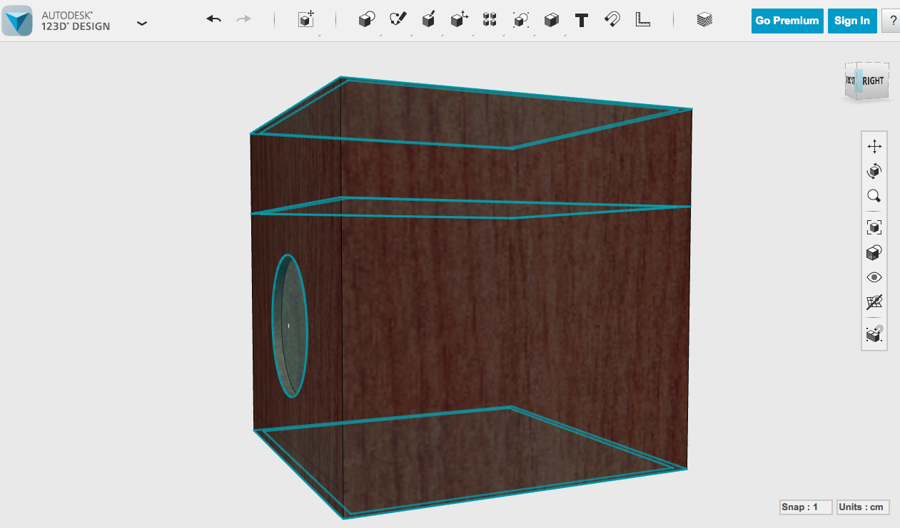

# Sandstorm Box

The Sandstorm Box is part of a larger art project called Interactive Picture Frames.
The Interactive Picture Frames project consists of a collection of five picture frames, which combine photographs with responsive technology (sensors and actuators), each frame aiming to affect one of the five senses. That is, these frames presents still images and associate the idea or the meaning of each image to a experience of sight, sound, smell, taste or touch.EXAMPLES
For a photo of the sea, the interactive picture frame could play sounds of the ocean when the presence of a viewer is detected. For a picture of a perfume flask, the scent of sandalo could be spayed. For a picture of the desert, a box with sand
and fans could simulate the experience of a dust storm just for a hand of the viewer.

BACKGROUND
I have no knowledge of any project in which frames hold print photos, sensors and actuators. Usually, projects that combine photographs and interactivity make use of digital photos. One example is the work of David Breashears, who created a two billion pixel interactive image of the Khumbu 1glacier, which is in the Khumbu region of northeastern Nepal between Mount
Everest and the Lhotse-Nuptse ridge. The project is composed by 477 separate high resolution shots and his website allows the user to zoom to different areas of the region and see in detail the story of the climate change in the area. Another interesting project is a subway billboard shampoo ad in Sweden. A digital display fitted with motion sensors detects the movement of trains arriving in the station. As trains arrive and depart the woman’s hair begins
to blow around as though it is windswept by the vehicle. This project makes use of a technology called ”cinemagraphs”, which is the product of still photo with minor elements moving repeatedly in contrast with the rest of the image that stays still. This technique brings back certain part of the photo to life. The idea was developed by photographer Jamie Beck and Web designer Kevin Burg and it was first implemented for the Fashion Week in New York in 2011.

CONCEPT
The idea of this project came from a philosofical discussion about what is the essence of photography. In Camera Lucida, Roland Barthes quotes philosopher Maurice Blanchot, defining the essence of photograph as “unrevealed yet manifest, having that absence-as-presence which constitutes the lure and the fascination of the sirens.”(106) That is, both of them endorse the conception thatthe essence of photograph is precisely the absence of what constituted that instant framed in the photo. That
moment passed and will never exist again. People and places are continuously changing. Sounds and smells that a photo can evoke are, precisely, absent. It is the complete absence of all its elements that photograph manifests.
As an attempt to give the spectator a restitution for that essential absence, this project intends to offer sensory experiences somehow connected to the meaning of pictures. 

Sandstorm Box

The Sandstorm Box is the project that brings up the experience of touch. 
The frame holds a picture of a sandstorm and a box with a hole is positioned right under it. When the user introduces a hand inside of the box, a sensor detects that motion. Then, a microcontroler activate fans that blows the sand sitting on the bottom of the box. As long as the user keeps a hand inside of the box, she will experience the sand coliding with the hand, simulating tactile experience of a contained sandstorm.

Who is it for?
Age, Demographics
What design choices or usability choice did you make for your project based on Demographics?
What is it for?
Teaching, Tool, Entertainment
How are you going access if it is fun or a good teaching tool?
Why does this need to exist?
What goals will your project achieve
When will it be used?
Time, Place, Location
Explain how Time, Place, Location, etc affect how your project is being used?
Explain how specifically your project is affect by Time, Place, etc
ie. Materials Used
Sensors
How Does it work? (Diagram)
Present a 3D model of project
top
left
bottom
perspective
Parts list
Senors
Components – Resistors, Capacitors, Transistors, etc
Materials List
Wood, ABS, PLA, etc
Fastening
Screw types – Size
Glues
Sketches/Mood Board

Next you can update your site name, avatar and other options using the _config.yml file in the root of your repository (shown below).

The easiest way to make your first post is to edit this one. Go into /_posts/ and update the Hello World markdown file. For more instructions head over to the [Jekyll Now repository](https://github.com/barryclark/jekyll-now) on GitHub.
