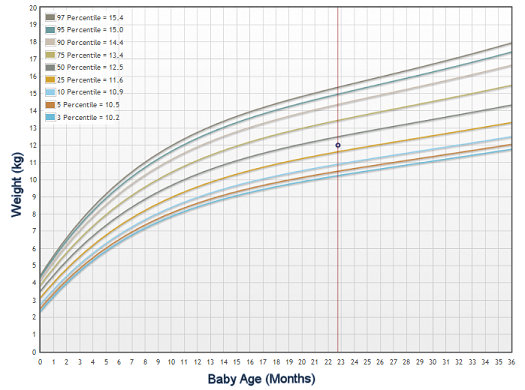

One very important (but more-often-than-not forgotten) aspect of building and deploying any new system is [capacity planning][1].

## Capacity planning? 

Yes. 

Only the most trivial of systems can "just go live" without a second thought (and even for these one would argue against).
For everyone else, not planning ahead is the same as wishing that noone ever uses your system.

A few hours spent a priori doing a paper or Excel exercise can save orders of magnitude more hours trying to fix things a posteriori. 
 
A good way to consider capacity planning is like a baby growth chart.
If you have not seen one, it looks something like this

In other words, based on some "realistic guesstimations" (see what I did there?) you are projecting a low- and high-watermark 
for the future. 

This exercise will allow you to do 2 things:

* plan your resource expenditure if things go as (or worse-than, or better-than) expected
* and, most importantly, force you to actually sit down and study the intricate details and implications of your technology choices 

Even if you are in a situation like "Yeah, ok! I am only working on this little project on the side. How big can it be?".

Allow me to tell you a little story. It was a big lesson for me, it may help you as well. 

## Once upon a time...

The year is 2006-2007 and a friend's friend needs my help.
He has a small business which monitors the performance of large refrigeration systems. 
He installs a small internet-connected sensor, this gathers some metrics every 3' or so, uploads at night to an FTP server as a small CSV. 
My friend then copies the files manually and does some (simple) processing to calculate some aggregates, convert from 3' to 15'. 
This is the time-consuming bit that he wants to automate. 
Oh, yes! and keep old 3' and 15' measurements somewhere in order to re-visit them in the future (e.g. for simulation).  

A nice repetition of keywords in the requirements: small, small, simple.
Yeap, that's what I thought

So let's see some basic figures

* Each sensor generates a CSV file **24Kb** in size, sent nightly over FTP (1)
* ...containing **480 individual measurements/rows** (2)
* He currently had **10 clients** (3)
* ...each one with **120 sensors** per site (4)

Which gave us a mere **576000 rows per day** and **~28 Mb** to be processed.
Ok, nothing unmanageable! A run-of-the-mill system with JDBC/MySQL/Hibernate would be more than enough, right?
I was already considering how he could perhaps start small with some computers installed on-premise to keep costs down.
 
Let's expand on the above, though. I asked him for his optimistic growth plans/targets 1, 2, 3 years out.
(Optimistic for business is almost always pessimistic for IT ;-)) 

So, he aimed to have **100 new clients** per year. 

Hmm, how did this all add up?
Excel is our friend here. 

3 years on, the system would have to be accepting, processing in a couple of hours and storing perpetually **17 million new rows per day** and **864 Mb** of new data.
The database would need to store over **2 billion** additional rows per year with an additional disk footprint of **300 Gb** 

Remember, this is 2007. 
BigData is an unknown term, Hadoop has only just span out of Nutch (so not even alpha), storage and hosting is *friggin' expensive* (Amazon web services were at their infancy still).

## ...and they lived happily ever after

It may sound silly now, but that was really an eye-opening moment.
 
Unfortunately, the project did not go past the proof-of-concept stage, but that was a really important lesson for me.

  > Never, EVER, forget to do some pessimistic capacity planning

   [1]: https://en.wikipedia.org/wiki/Capacity_planning