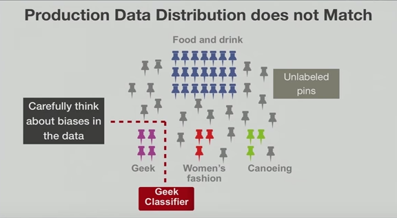

In the [first of these posts](http://blog.innodatalabs.com/building_datasets_part_1/), we covered the now conventional wisdom that having a bigger dataset is better for training machine learning algorithms. But size is not the only metric for success, quality is also critical.

The most important consideration for quality is the relevance of the dataset. You have to be sure your algorithm is learning the right thing.

For example, in [this video](https://www.youtube.com/watch?v=mN6MrzL1i78), Pinterest Chief Scientist Jure Leskovec describes the lessons he learned by training systems using data 'slightly' different from real-world production data.

Pinterest created a powerful 'Interest Classifier' by isolating and labelling a subset of 'pins' (this is Pinterest, remember) for some popular areas of interest. Once deployed in production, however, it never really generalized as promised, since the real-world data had a different distribution than their artificial training dataset.

If you don’t have access to a large, high-quality dataset, your options include:

### Using synthetic datasets
Synthetic datasets can be created from unsupervised crawling/scraping or random/pattern-based/database-dump content generation. Synthetic data is quite useful for regularization and for bootstrapping a learning loop, but ultimately can't beat real data in terms of quality results.

### Cleaning existing datasets
Using tools such as [Open Refine](http://openrefine.org/) and [Data Wrangler](https://www.trifacta.com/products/wrangler/) can help refine your dataset and make it higher quality, but doing is repetitive and very challenging work that can consume most of a data scientist’s time! The bigger the dataset, the bigger the pain in cleaning it.

### Using annotation services
Annotation services, such as Mechanical Turk, CrowdFlower and Mighty AI (Spare 5) can outsource the drudgery from cleaning datasets, but have their own issues and limitations that require time to set up properly.

### Attaining the right dataset for the job
When defining the [Rules of Machine Learning](http://martin.zinkevich.org/rules_of_ml.pdf), Google’s Martin Zinkevich devotes at least seven of his rules to obtaining the best dataset:

#### Rule #5: Test the infrastructure independently from the machine learning.
Test moving data into the system skeleton early. This will help understand the problem and the data structure required.

#### Rule #8: Know the freshness requirements of your system.
Real-time systems are exponentially more costly and difficult to build. How real-time must your data be? How quickly is it changing? Think about it: categorizing news, sports or politics can be built using old content, and will probably work well with new data. But predicting movements of the stock market requires up-to-the millisecond information.

Drop real-time constraint on your dataset if you can.

#### Rule #30: The importance of weight-sampled data, don’t arbitrarily drop it!
In the academic world, the term 'Independent and identically distributed' (iid) is used. Using a dataset that reflects the real world is fundamental.

#### Rule #32: Re-use code in your training pipeline and your serving pipeline.
The tricks, heuristics and manipulation performed on the training data set must make sense in production. Small changes to data might significantly diminish accuracy.

#### Rule #33: If you produce a model based on the data until January 5th, test the model on
the data from January 6th and after.
If you are going to predict the future, validate your algorithm on future data as well.

#### Rule #34: In binary classification for filtering (such as spam detection or determining interesting e-mails), make small, short-term sacrifices in performance to ensure you get very clean data.
It is so tempting to build retroaction loops based only on low-confidence or erroneous guesses made by an algorithm. This introduces severe bias, however, and will degrade performance instead of increasing it in the long term. It is better to ask for retroaction on both low- and high-confidence / validated true positive guesses.

#### Rule #42: Don’t expect diversity, personalization, or relevance to be as correlated with popularity as you think they are.
It is very tempting to use readily available data (e.g., weblog, transaction log or click log) as a proxy to learn something else. In practice, is often fails. 

In summary, size and quality are the yin and yang for training data sets. Size without quality will produce reliable, yet potentially inaccurate results, while having only a small amount of quality data brings generalization into question. 

In the next post of this serie, we will answer the question "but where is all the data?"
