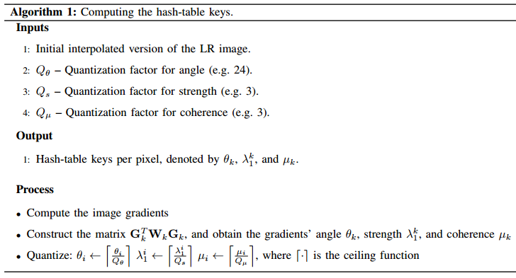
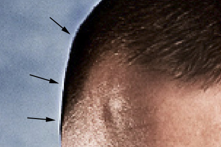
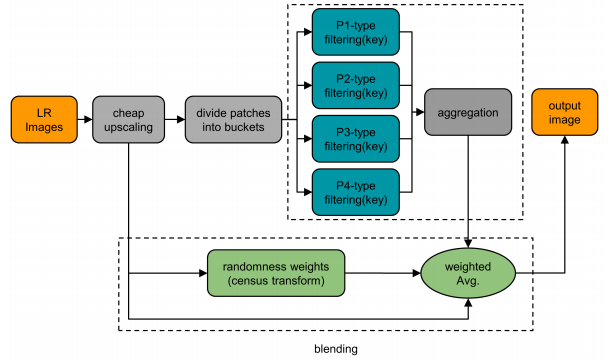
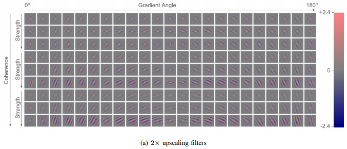
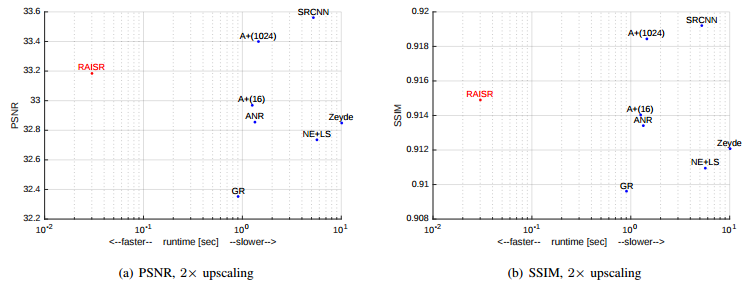
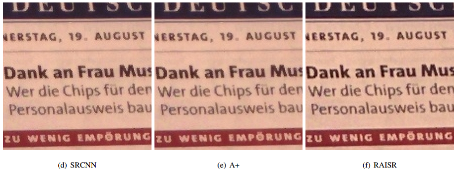

### TL;DR
- その１の内容は理解しているという前提で進める
- 画像を同じような輝度勾配情報を持つbucketに分け、ローカルの情報を考慮してフィルタを学習する
- 処理高速化のために勾配情報をハッシュ化したテーブルを構築する
- 他のstate of the artと比べて遜色のない精度で、速度は2桁も速い
 

Googleが出した超解像の論文 RAISR:Rapid and Accurate Image Super Resolution [（原論文へのリンク）](https://arxiv.org/abs/1606.01299) を読んだ。
 

## 3.RAISR
その１で見たglobalフィルタは高速だが性能はもうひとつであり、その理由は画像を少数のパッチに分けそれに対応するフィルタのみ学習しているからである。
画像というのはlocalに情報を保持しているものであり、それをどう捉えるかがポイントとなる。

例えば昨今の流れとして画像の局所性をうまく捉えることができるCNNを使うというアプローチがある。
これは確かに高い性能を発揮しているが、いかんせん処理が重い。

この論文の偉いところは、globalフィルタの考えをlocalフィルタに拡張して適用し、かつ計算負荷を抑えるよう工夫を施した点にある。

globalフィルタからの拡張として、少数のパッチに分けていたものを、より細かいグループ（bucketと呼ぶ）に分けることを考える。
このグループ分けが画像の局所特徴量をうまく捉えた上で実施できていれば、高性能なフィルタが学習できるものと期待される。
最適化は、$$ q $$ を各bucketを表す添字としたときに、以下のように定式化できる。

$$
\begin{align}
\min_{\textbf{h}_q} || \textbf{A}^T_q \textbf{A}_q \textbf{h}_q - \textbf{A}^T_q \textbf{b}_q ||^2.
\end{align}
$$

問題はどうやってこのグループ分けを実行するかということである。
画像の特徴を表現するのにポピュラーなものは輝度勾配情報であるため、これを使う。
ただし、画像の一部で計算してこれらの輝度勾配情報を計算した後に、それらをグループ分けするのには結構なコストがかかる。
例えば k-means では $$ \mathcal{O}(Nk) $$ （$$N:$$データ数、$$k:$$クラスタ数）の計算負荷がかかってしまう。
これを解決するために論文ではハッシュテーブルを作成することで高速にグループ分けを実現する。

### 3.1.輝度勾配の統計量を用いたハッシュテーブルの作成
ここではどのようにハッシュテーブルを作成するかを概説する。

輝度勾配の統計量に関しては[この論文](http://ai2-s2-pdfs.s3.amazonaws.com/9598/30cd23642fa316eb66370fa756895f2ce21c.pdf)に依拠していて説明が結構すっ飛ばされているので、論文を読む際はこちらも読んでおいた方がよい。

あるピクセル $$k$$ のまわりの $$ n = \sqrt{n} \times \sqrt{n} $$ ピクセルをローカルなエリアとして輝度勾配の統計量を計算する。
ピクセル値を表す関数を $$ f(x_{k_i},y_{k_i}) $$ where $$ i = 1,\cdots,n $$ とした際に、勾配を $$ \nabla f(x_{k_i},y_{k_i}) =  (g_{xk_i},g_{yk_i}) $$ とする。
特徴量としては、方向、強度、コヒーレンス（これが高いとフィルタが干渉縞のようになると思っとけばよい）、を採用する。

まず、ローカルなエリアの勾配情報を以下のような $$n \times 2 $$ 行列で表現する。

$$
\begin{align}
\textbf{G}_k = \left(
    \begin{array}{cc}
      g_{xk_1} & g_{yk_1} \\
      \vdots & \vdots \\
      g_{xk_n} & g_{yk_n}
    \end{array}
\right) 
\end{align}
$$

上で引用した論文ではこれを直接特異値分解してその特異値を用いて議論を展開しているが、ここでは効率的な計算にするため $$ \textbf{G}_k^T \textbf{G} $$ という $$2 \times 2$$ 行列の形にする。
さらに、あるピクセルに注目した時にその近傍のピクセルの影響を考慮できるように、正規化したガウシアンカーネル $$\textbf{W}_k$$ を挿入して $$\textbf{G}_k^T \textbf{W}_k \textbf{G} $$ とする。
論文ではこのあたりはさらっと書かれているが、この $$ \textbf{W}_k $$ は diagonal が 1 でそこから分散 1 で値が減衰していくような行列になっているということだろう（規格化定数は今の場合本質的な意味を持たないので無視している）。

この $$\textbf{G}_k^T \textbf{W}_k \textbf{G} $$ が得られれば、あとは固有値と固有ベクトルを求めて上述の統計量を構築すればよい。

まずは方向だが、これは最大固有値に対応する固有ベクトル $$ \phi^k_1 = (\phi^k_{1,x},\phi^k_{1,y}) $$ を用いて次のように求められる。
この方向は $$ \theta + \pi = \theta $$ という対称性を持っていることに注意。

$$
\begin{align}
\theta_k = \arctan (\phi^k_{1,y},\phi^k_{1,x})
\end{align}
$$

次に強度だが、これは最大固有値 $$ \lambda^k_1 $$ を用いて $$ \sqrt{\lambda^k_1} $$ と表す。

最後にコヒーレンスは、２つの固有値を用いて次のように表す。

$$
\begin{align}
\mu_k = \frac{\sqrt{\lambda^k_1} - \sqrt{\lambda^k_2}}{\sqrt{\lambda^k_1} + \sqrt{\lambda^k_2}}
\end{align}
$$

以上で道具は全て揃った。
あとはこれをよしなに量子化してハッシュテーブルを作ろう。
ここでは論文の Algorithm 1 をそのまま載せておく。

{: .center}

特に難しいことはしていない。
unitを決めてそれで割ったものに天井関数をかまして量子化している。
後は各ローカルエリアで輝度勾配統計量を計算し、ここで作ったハッシュテーブルに基づきグループ分けしていけばよい。

ただし、このままハッシュテーブルを作ると特定のグループに偏った結果が得られてしまう可能性がある。
例えば、画像の多くに空が写っているような場合、輝度勾配が乏しい部分が多くなって有用なフィルタを学習するにはパッチ数が不十分になる。
ちなみにこの論文によると $$ 9 \times 9 $$ or $$ 11 \times 11 $$ のフィルタを学習するには各bucketに対して $$ 10^5 $$ 程度のパッチが必要とのこと。
これを回避するために、パッチを計算して得られた統計量を対称性を使って複製するという手法を使う（論文のFig.8）。

{: .center}

これは A~D の統計量が得られた時に、x軸方向のflip、y軸方向のflip、x=y軸対象のflipというflipで統計量を複製していることを意味している（$$\pi \sim 2 \pi $$に入る場合は $$ \theta + \pi = \theta $$ の対称性を使っていることに注意）。
これらの組み合わせで $$ 2^3 = 8 $$ 個の異なるpatchを生成できる。
実際に画像を変換するわけでなく統計量からinduceされるものなので、計算コストをかけずに学習データをrichにできるのが良いところである。

### 3.2.RAISRの効用
その１の一番最初に定義した線形の超解像の定式化はよく使われるが現実に即していない場合も多い。
例えばガンマ補正やノイズは非線形な効果である。
RASIRでは非線形な効果も取り込んでフィルタを学習できることが観測できたというのが著者らの主張となっている。
具体的な例としては、非線形なJPEG圧縮後の画像と圧縮前の画像をペアにして学習すると、圧縮された画像から滑らかな高解像度の画像が得られるようなフィルタが学習されたということである。

同様なことは画像のsharpnessに関しても言える。
低解像度の画像とsharpnessを高めた高解像度の画像のペアで学習すると、フィルタとしてはsharpnessを高めるものが得られたということである。

これは割とnon-trivialな結果である気がするが、論文中ではこの部分の詳しい解析はなされていない。
ナイーブに考えれば、各パッチで学習されるフィルタは線形であるが、それらのパッチの組み合わせでうまく非線形性を表現できるということだろう。
この論文での局所的な勾配統計量によってグループ分けすることがそのような目的を達成するために有用な方法だということが言えれば面白いとは思うが、具体的な非線形変換をターゲットにするならまだしも一般論の展開は厳しいかな。

### 3.3.構造を保持するためのblending
実はフィルタには副作用が存在する。
例えばsharpeningに関していえば、副作用としてhaloの出現やノイズの増幅が生じることが知られている（このようなものをartifactと呼んだりもする）。
haloとは何かというと、下の画像のようにedge付近に後光が指すように白い部分が生じる現象である。
画像は [https://www.dpchallenge.com/tutorial.php?TUTORIAL_ID=80](https://www.dpchallenge.com/tutorial.php?TUTORIAL_ID=80) から引用。

{: .center}
{:height="150px" width="250px"}

これを防ぐために、このような副作用が生じる場合には、その部分の構造がcheapなupscaling画像と比較すると大きく書き換えられているという事実に注目する。
フィルタ前後の局所的な変化を比較して、変化が小さい部分はフィルタがうまく機能したと考えフィルタ後のものを採用し、変化が大きい場合はフィルタがおかしな振る舞いをしてしまったと考えフィルタ前のものを採用するというアプローチを採る。

この変化を捉えるものとして、この論文では Census Transform (CT) という手法を採用している。
これは次図（論文のFig.9）のように、あるピクセルを中心として周りのピクセルがその中心の値より大きいか小さいかをバイナリのbit列として表現するというものである。

{: .center}

ここでは周波数の値に対してこのCTを適用し、高周波数（こちらのほうがartifactが発生しやすい）のエリアのみフィルタ前後の画像がblendされるようにする。
この辺は論文にちゃんと書いてないしちょっと理解がイマイチだなー。
ちなみに論文では別パターンも提案しているが、ここでは割愛する。

{: .center}

 
## 4.実験
学習されたフィルタとRAISRによる超解像の結果に関して紹介する。

### 4.1.学習されたフィルタ
RAISRで学習したフィルタとしては以下のようなものが得られる（論文のFig.7）。
横軸は方向で、縦軸は3つずつを1単位としてcoherenceが{low, mid, high}が並んでいて、1単位の中の3つは上から強度が低いものから高いものになるように並べられている。

{: .center}

この結果を見ると、coherenceが高まるとフィルタの方向性がはっきりして、強度が高まるとフィルタがくっきりすることが読み取れる。

### 4.2.RAISRによる超解像
紹介していない部分も多々あるのだが、最低限の道具立ては揃っているので実際の結果を眺めてみることにしよう。

学習には10,000枚の広告バナー画像を使い、フィルタのサイズは $$11 \times 11$$ で、勾配統計量の計算には周辺の $$ 9 \times 9 $$ ピクセルを使う。
cheap upscalingにはbicubic補間を採用し、upscalingはRGB色空間でなくYCbCr空間で実施する。
輝度信号チャンネル（Y）でのみRAISRを適用し、色差信号チャンネルに関してはRAISRを適用せず単にbicubic補間のみを行う。
これは、なめらかな画像を生成したいという観点からは輝度が重要であるという事実を反映している。
得られた高解像度画像はRGB色空間へと変換され最終的な結果となる。

評価指標としては Peak Signal to Noise Ratio (PSMR) と Structural Similarity (SSIM) を用いるが、これはとりあえずはどちらも高い方が良い性能という理解だけしておけばよい。

他手法との比較として、2倍のupscalingの結果だけを次図（論文のFig.13）で示しておく。
縦軸は性能で横軸は処理時間（logスケール！）である。

{: .center}

圧倒的な速さではないか、RAISRは。
CNNと比べると性能は少し落ちるが、これは人間の目で見てもそれほど違いがわからないレベルである。
それを確認するために実際の画像を貼ってみる（論文のFig.14）。

{: .center}

一番左のbicubicは他のものと比べると確かにぼやけているのが確認できる。
しかし、残りの3つに関しては遜色がないと言ってよいだろう。
これならば100倍早く処理ができるRAISRが圧倒的に有用であろう。

さらに、RAISRの方が優れた結果が得られる場合もある。
その例が次の図（論文のFig.17）である。
ただしこの結果は本ブログでは省略したcontrast-enhancement schemaという、異なるblendingをしたモデルでの結果である。
詳しくは論文見てください。

{: .center}

 
## 5.まとめ
Googleが発表した超解像手法RAISRに関して概説した。
cheapなupscalingの手法に対して学習したフィルタを適用して良いアウトプットを得るという手法であり、patchをbucket化して局所性も取り入れることで高性能でかつ爆速の超解像を可能にしたという手法だった。

何よりもいま流行りのDeep Learningの手法を使ってないところがクールである。
使っている手法も一つ一つは特に新しくもなく、速度を担保するための工夫は機械学習というよりエンジニアリングの知恵が光るものだった。

ちなみにこの論文には [supplementary material](https://drive.google.com/file/d/0BzCe024Ewz8ab2RKUFVFZGJ4OWc/view) が準備されていて、色々な画像での比較をより詳しく見ることができる。

 
いやーだいぶ長くなってしまったな。
次はもうちょっとさらりとしたエントリーを書きたいところだ。

---
---
 

