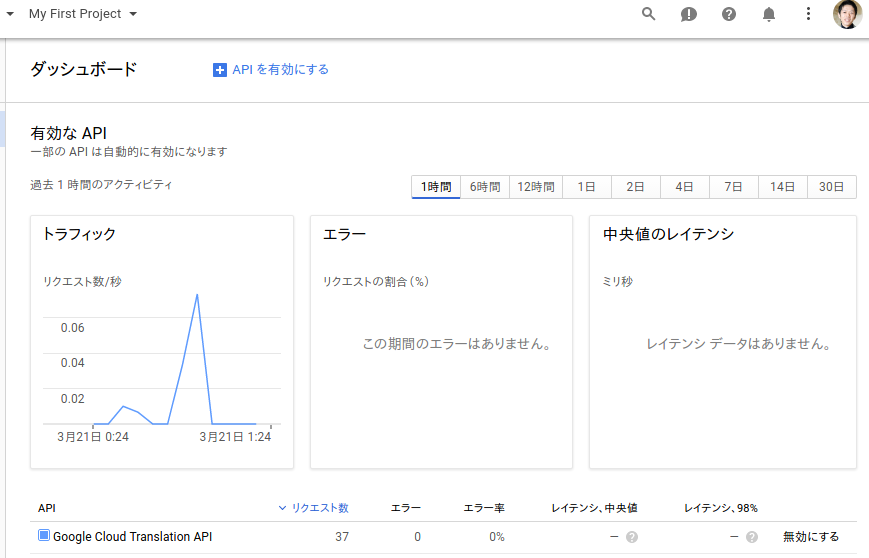
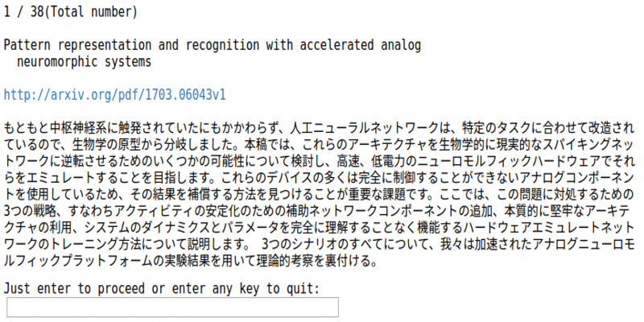

### TL;DR
- Google Cloud Translation API premium edition ではニューラル機械翻訳が使用可能
- arXivのAPIを使用して論文のsummaryを取得し、日本語でチェックできるnotebookを作った
  ( [repository](https://github.com/yoheikikuta/arxiv_summary_translation) )
- ニューラル機械翻訳おもしろい


<br>

## 0. 背景
[arXiv](https://arxiv.org/) には毎日たくさん論文が出る。
当然全部読むのは不可能なので、abstract（以降ではsummaryと呼ぶ）だけ見て詳しく読む論文を決める人も多いだろう。
しかしながら、summaryを読んでも英語を斜め読みするのは難しいので、結局途中までしか読めないこともままある。

そうだ、精度が上がったと専らの噂であるGoogle翻訳を使って日本語でサクッとチェックすることにしよう！

<br>
## 1. 前準備
Google翻訳を使うにはGoogle APIを使えるように登録をしなければならない。
なんと$300相当のクレジットを12ヶ月間無料で使える（2017年3月20日時点）ので、嬉しい限りである。

まずは [Google API console](https://console.developers.google.com/apis/library?hl=JA) の無料トライアルの登録から登録をする。
登録をすれば使えるようになる。コンソール画面は以下のような感じになる。
上の方に書いてある My First Project というのが一つの単位となるプロジェクトという概念である。

{: .center}
{:height="500px" width="700px"}

しかしながらまだニューラル機械翻訳は使うことはできない。これを使うにはbeta版であるpremium editionに申し込む必要がある。
この申請の単位がプロジェクト単位となる。
[こちらのフォーム](https://services.google.com/fb/forms/translationapi-beta/)から申請すると1週間くらいで連絡がきて使えるようになる。
また、使用に際しては[こちら](https://cloud.google.com/translate/docs/premium)を参照のこと。

premium editionが使えるようになったらconsoleから認証情報に進み、credentialsをjsonファイルで取得しておこう。
[このへん](https://cloud.google.com/storage/docs/authentication)とか[このへん](http://www.yoheim.net/blog.php?q=20160411)が参考になる。

<br>
## 2. 実際の翻訳結果
arXivからsummary情報を取得して和訳して確認できるjupyter notebookを作った。
詳細な内容は [repository](https://github.com/yoheikikuta/arxiv_summary_translation) を見てもらうことにして、ここでは結果だけ。
以下のようにsummaryの和訳がチェックできる（gif作るためにアス比を変えてるものもあるのでちと醜いですが）。

{: .center}
{:height="300px" width="550px"}

- title と summary の和訳が確認できる
- enter を押すと次の論文に移る
- 気になるものがあったらPDFのリンクを辿って詳しく読める

かなり単純なのでwebアプリケーションくらい作れよという声も聞こえてきそうだが、それはそういうのが好きな人に任せておこう。

具体的に機械学習系の論文を適当に一つピックアップして翻訳をチェックしてみよう。<br>
まずは機械翻訳を使わない以前のバージョン。
```
知識ベースは、例えば、質問応答及び情報検索のために、多くの用途において重要な役割を果たしています。
作成し、それらを維持するに投資多大な努力にもかかわらず、でも最大規模の代表者（例えば、YAGO、
DBpediaのか、ウィキデータ）は非常に不完全です。
私たちは、リレーショナルグラフ畳み込みネットワーク（R-GCNs）を導入し、2の標準知識ベース完了タスクに
適用します：リンク予測（不足している事実の回復、すなわち対象述語オブジェクトトリプル）と
エンティティの分類（エンティティの欠落している属性の回復）。
R-GCNsはグラフ畳み込みネットワークの一般化、グラフ上で動作するニューラルネットワークの最近のクラス
であり、かつ高度にマルチ・リレーショナル・データ、現実的な知識ベースの特性に対処するために特別に
開発されています。
私たちの方法は、両方のタスクのための標準的なベンチマークに競争力のある結果を達成します。
```
不自然な日本語がちらほらと見られるが、これも読めば言いたいことはわかる感じ。<br>
次はニューラル機械翻訳の場合。
```
ナレッジベースは、質問応答や情報検索など、多くのアプリケーションで重要な役割を果たします。
それらの作成と保守に多大な努力を払ったにもかかわらず、最大の代理人（例えば、Yago、DBPedia、Wkidata）
でさえも、非常に不完全です。
我々は、関係グラフ畳み込みネットワーク（R-GCNs）を導入し、リンク予測（欠落事実、
すなわち主題 - 述語 - オブジェクトトリプル）およびエンティティ分類（エンティティの欠落属性の回復）
の2つの標準ナレッジベース完了タスクに適用する。
R-GCNは、グラフ畳み込みネットワークの一般化であり、グラフ上で動作する最近のクラスのニューラルネットワーク
であり、現実的な知識ベースに特有の高度に多種多様なデータに特化して開発されている。
私たちの方法は、両方のタスクの標準的なベンチマークで競争力のある結果を達成します。
```
日本語がだいぶいい感じになっている。
この例ではそこまで大きな差はないが、ニューラル機械翻訳は全体的に素晴らしい結果を返してくれる。

せっかくなのでもうひとつ。hep-phの論文をチェックしてみる。<br>
まずは機械翻訳を使わない場合。
```
我々は最初のLHC実験の光の中で、最近提案されたUV-完全な複合ヒッグスシナリオを調査します。
モデルは、グローバルフレーバー対称性ヒッグスダブレットに加えて、南部・ゴールドストーンボソンを擬似する
ために生じる、（5）SO  にSU（5）にSU（5） を壊すとSU（4）ゲージ群に基づいています。
これは本物とエキゾチックな電荷を持つ複雑な電トリプレットが含まれています。
これらだけでなく、他のエキゾチックな状態の制約を含め、我々はLHCの測定はまだ大幅にモデルの低エネルギー定数
を制約するのに十分な感度ではないことを示しています。
ヒッグス電位はUV-完全な理論的相関関数から計算することができるヒッグス質量とヒッグス崩壊チャネルのLHC測定
によって制約一方と他方にある2つのパラメータで記述されています。
したがって、少なくとも一つの一定のニーズが決定するモデルを除外すると、両方の定数は、UV-理論によって
再生される必要があるヒッグスポテンシャルを検証します。
モデルUV-完全な理論に基づいているため、低エネルギー定数は、このモデルの妥当性を確立するのに役立つことが
できる格子に製剤化理論の第一原理数値シミュレーションから計算することができます。
我々は、モンテカルロシミュレーションに向けた予備的なステップとして、現象学的研究のための格子計算の潜在的な影響を評価します。
```
わからなくはないけど日本語として破綻しているところも見受けられる。<br>
次はニューラル機械翻訳の場合。
```
我々は、最近提案されたUVコンプリート複合Higgsシナリオを、最初のLHC実行に照らして調査する。
このモデルは、世界的な味の対称性がSU（5） 〜〜  SO（5）になるSU（4）ゲージグループに基づいており、
Higgsダブレットに加えて擬似ナンブ - ゴールドストーンボゾンを生じさせる。
これには、エキゾチックな電荷を持つ実際の複雑な電気三重項が含まれます。
これらを含めて、他のエキゾチックな状態の制約も含めて、我々は、LHC測定が、モデルの低エネルギー定数を著しく
制限するのに十分なほどには感度がないことを示す。
Higgsポテンシャルは、一方ではHiggs質量およびHiggs減衰チャネルのLHC測定によって制約され、
他方ではUV完全理論における相関関数から計算され得る2つのパラメータによって記述される。
したがって、モデルを除外するために、少なくとも1つの定数を決定する必要があり、
ヒッグスのポテンシャルを検証するためには、両方の定数をUV理論によって再現する必要があります。
このモデルはUV完全理論に基づいているため、低エネルギー定数は格子上に定式化された理論の第1原理数値
シミュレーションから計算することができ、このモデルの妥当性を確立するのに役立ちます。
我々は、モンテカルロシミュレーションに向けた予備的ステップとして、現象計算のための格子計算の潜在的な影響を評価する。
```
世界的な味の対称性だと。。。まあでも全体的にはこちらのほうが全体的にmake senseではある。


<br>
arXivのsummaryを日本語（もしくは他の言語）でチェックするnotebookを作った。
英語で斜め読みするのは大変なので、サクッとチェックするにはなかなか便利な気がする。
性能の高い翻訳モデルとかがすぐに使えるとは良い時代だなぁ。

---
---
<br>

