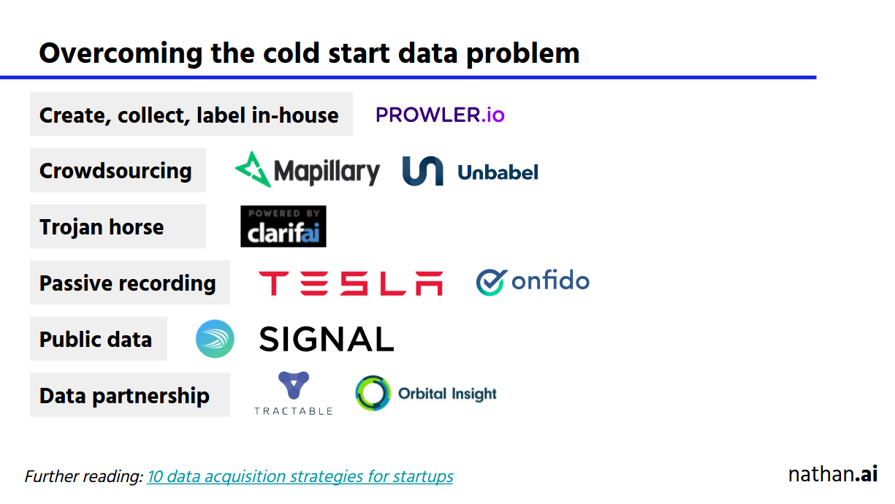

In the [first of these posts](http://blog.innodatalabs.com/building_datasets_part_1/), we covered the (now) conventional wisdom that having a bigger dataset is better for training machine learning algorithms. The [second of the series](http://blog.innodatalabs.com/building_datasets_part_2/) detailed a few rules of thumb for creating quality datasets. This time around, we'll look at how to start building datasets.

 [This slide](https://docs.google.com/presentation/d/11Ki7j7oTxI8Y9pZxyrxk3m3dTdjz4t1ir4QRCWnY7-g/edit#slide=id.g1d25704031_0_210) from [@NathanBenaich](https://twitter.com/NathanBenaich) summarizes the available options quite well: 

Adding a crowdsourcing tab to the above image, and a list of those types of companies, such as Crowdflower, Spare5/MightyAI and Mechanical Turk, would really provide a comprehensive picture of the process and options available.

Let's narrow down all the potential [data acquisition strategies](https://medium.com/@muellerfreitag/10-data-acquisition-strategies-for-startups-47166580ee48#.rsab3pb64) available and highlight some of the well- and lesser-known public datasets. 

### Without any specific order, here are some large initiatives:

* [The Common Crawl](http://commoncrawl.org/) is a an open repository of web crawl data that can be accessed and analyzed by anyone.

* [DBPedia](http://wiki.dbpedia.org/services-resources/datasets/dbpedia-datasets) is a crowd-sourced community effort to extract structured information from Wikipedia and make this information available on the Web. 

* [Kaggle](https://www.kaggle.com/datasets), the Machine Learning competition platform, hosts a large inventory of more than 400 public datasets.

* [Dataverse](http://dataverse.org/) connects a community that shares close to 50,000 datasets, mostly for reproductible science.

* [Data.gov](https://www.data.gov/) and [Open Data in Canada](http://open.canada.ca/en/maps/open-data-canada) are two of the many open governmental data initiatives.

* [AI2](http://allenai.org/data.html) has a great list of datasets for AI benchmarks.

* Ever heard of 'Linked data'? Well there are more and more datasets published in linked data-compatible format. [Here's a visualization](http://lod-cloud.net/):

### Some more specific datasets:

* The [Ubuntu Dialogue Corpus](https://github.com/rkadlec/ubuntu-ranking-dataset-creator) is a massive body of 1 million multi-turn dialogs, often FAQ-style.

* [Quora Question Pairs](https://data.quora.com/First-Quora-Dataset-Release-Question-Pairs) is 400,000 lines of potential question duplicates.

* [Microsoft Concept Graph](https://concept.research.microsoft.com/Home/Download) contains 85 million "is a" relations for 5 million concepts and 12 million instances. 

### Want more?

In Mediums' [Fueling the Gold Rush](https://medium.com/startup-grind/fueling-the-ai-gold-rush-7ae438505bc2#.8371yne65), Luke de Oliveira lists over 30 more datasets specific to AI.

And that's just scratching the surface...

