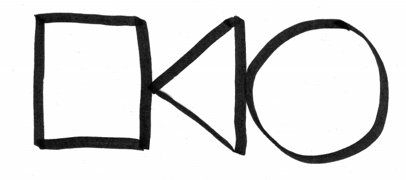
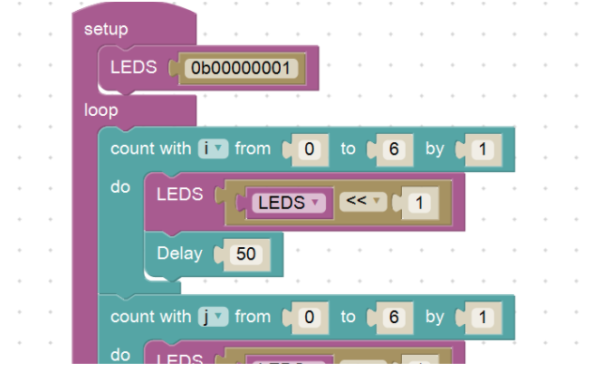

Do you remember the first time you felt like a scientist or an engineer? Yesterday, I had the pleasure to be one of the more than 200 volunteers of the [WeGoSTEM](http://www.wegostem.be/) project. Jacotte, Luc and myself showed the children Sint-Vincentius school how to build and program a simple drawing robot.

WeGoSTEM is an initiative by [Dwengo](http://dwengo.be/) and She Goes ICT to popularize science, technology, engineering and mathematics (STEM) to elementary school children. They place much emphasis on reaching all children. Not only white boys with well-educated parents, but also girls, children with foreign roots and children from a poorer background. Everybody will have to deal with STEM at some point in their life. Science and technology will key tools to solve global problems from social inequality to climate change. We cannot afford young people not being to discovery their talents because they missed the opportunity.

At the start of our lecture, we asked the children what they thought a robot was. If they could give some examples of robots (Wall-E, a Roomba, a smartphone, their parents espresso machine,...). Then, we asked them what you need to build a robot (motors, a battery, metal, antennas, a camera, microchips,...). At the end, we more or less settle on the fact that a robot is some kind of machine that you can tell to do different things.

A robot has to be programmed and this is illustrated by an 'unplugged' exercise in which one child is a programmer and the other children are drawing robots. The programmer is asked to sit in front of the class and receives a drawing like the one below.

Without showing it to his or her friends, the programmer has to tell the robots exactly what they have to do in order to end up with the same picture. Some programmers simply order to draw a square, a triangle and a circle, resulting in a collection of drawings with the shapes in the wrong orientation, order and size. Others meticulously describe every stroke their robots have to put on paper. This results in much more consistent drawings, but takes much longer to explain. Conclusion: when programming you have to be specific and exact.

Then the real fun starts (even though my classes already had plenty of fun ordering each other around): building their very own drawing robot! Every pair of children has little box containing everything they need to build a small motorized arm that can hold an move a marker. We did not provide them with detailed building instructing, merely a drawing what the robot should look like. Most children have no problem to build the thing using some old-fashioned trail and error. When their robot is build, we show them how to program it using Dwenguino Blockly, a graphical programming language. They can write their name on the LCD screen of the microcontroller, set the speed of their motors and, if they want to annoy you, make high-pitched beeping noised with the built-in speaker.

When they are set, the robot starts drawing vigorously on a sheet of paper: from relaxing curves to chaotic patterns. Everybody ended up with their very own robot-drawn artwork to remember their first they were truly an engineer!

This activity truly contained all the steps you have to do as an engineer: thinking about things, building something, figuring out why it does not work and enjoying the victory when it eventually does. When we ended the activity, many children craved for more. Luckily, we were provided with a little book for the teacher filled with other STEM-related activities. We hope they will have fun doing them.

Are you a scientist or an engineer yourself? Do you also want to inspire children to do STEM? There are many initiative were you can 
