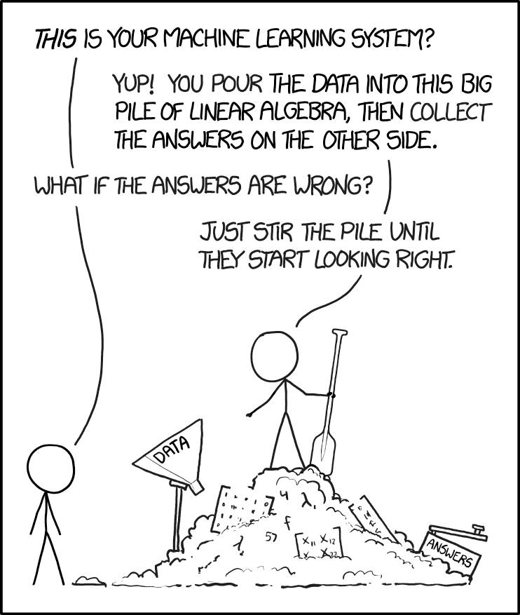
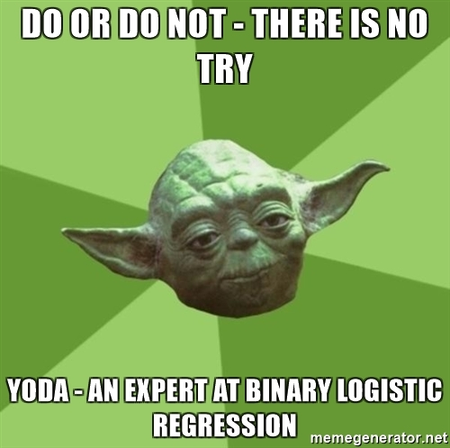
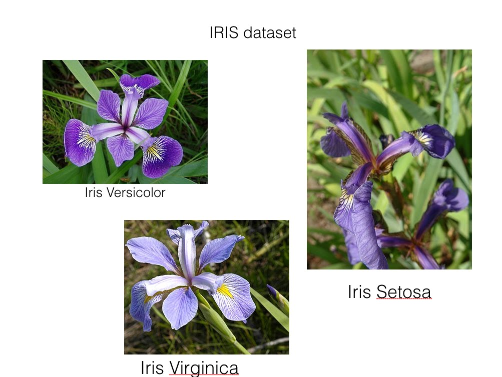
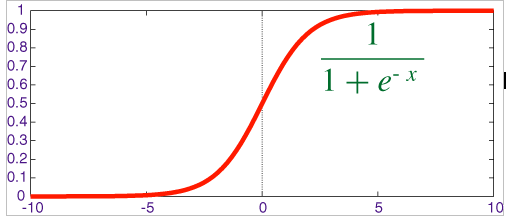
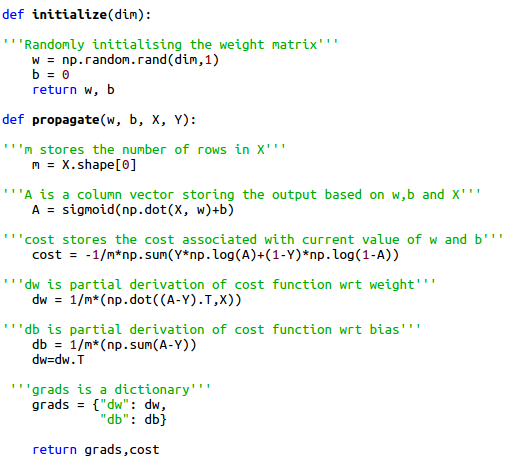
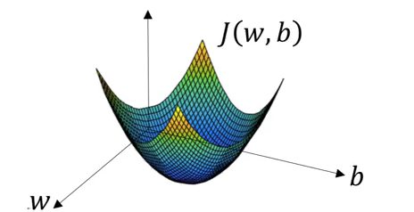
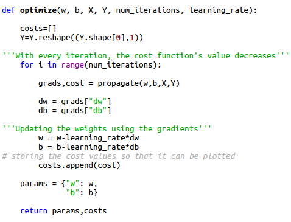
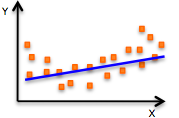
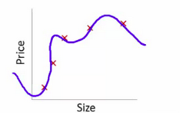
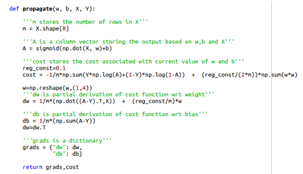

 **Logistic regression** is a statistical method for analyzing a dataset in which there are one or more independent variables that determine an outcome.  Machine learning borrows this technique from the field of statistics for solving classification problems.

Before we delve deeper into logistic regression we need to familiarize ourselves with what exactly do we mean by a classification problem.

### **CLASSIFICATION**

The simplest form of classification is binary classification and as the name suggests it classifies the data into two classes. Say if our data is being  divided into two classes A and B,then if it belongs to class A it must be absent from class B.

Let us understand this with the help of an example, say we have been transported into the world of Game of Thrones(not really that exciting since Valar Morghulis, see what i did there :P)  and we are trying to predict who wins in a fight between Viserion and Drogon( Mother of Dragons won&#39;t want any harm to come to either but then that is not possible in the world of Binary Classification :P). So if Viserion wins Drogon can&#39;t and vice versa,this is binary classification.If Drogon wins the output will be 1 and if he loses which implies that  Viserion wins  the output will be 0. So the output can belong to only one of those two classes.

OK so far so good, now let us move on to multiclass classification. As the name suggests instead of two classes we now have many. Let us consider the very famous Iris dataset which contains information regarding  four features of an Iris flower and based on these four features the Iris flower is classified into its three subspecies . This is multiclass classification involving 3 classes corresponding to the 3 subspecies of the iris flower. In this blog we have explained how to perform multiclass classification on the Iris dataset using Python. You can download the dataset from [here](../assets/Iris.csv)

So that is all regarding classification, I hope that now based on the dataset you will be able to identify what sort of classification problem it is.

#### **LOGISTIC REGRESSION**

So finally we come to the main topic, things are going to get intersting now!(We sincerely hope you feel the same way we do :P).

Logistic Regression is so called because the name of the function used at the core is the logistic function or sigmoid function.

Let us suppose that Y is the output ie 0 or 1 and X is the input feature. Hence the operation performed by logistic regression is : Given X calculate the probablity that Y=1. This is implemented with the help of the sigmoid function.

This can be represented mathematically as :

$$Z = P(Y = 1/X)$$

We mentioned sigmoid function right? Here is a brief explanation regarding it.

A **sigmoid function** is a mathematical function having &quot;S&quot;-shaped curve. For which the formula and the graph is -

 

So why do we use this function ? To know that let&#39;s first have a look at its graph. From the graph we can see that for any value of variable &#39;x&#39;, the output is always between 0 and 1. In logistic regression we want to predict the type of flower given its features ( sepal length, sepal width, petal length and petal width). So if the flower is of the type say &quot;Iris-setosa&quot;   then our model should output a value of 1 saying that the flower type is &quot;Iris-setosa&quot;. Otherwise it should output 0. So finally when our model has done all the calculations and wants to output 1 (true) or 0 (false)  then it uses sigmoid function to do so. Since the ouput of sigmoid function is between 0 and 1 we need to round it off to either  0 or 1. Say the output of sigmoid function is 0.8 ,this means that the model is 80% sure about its prediction. Generally for  any value of the sigmoid function &gt; 0.5 we classify it as 1 and for values &lt; 0.5 it is classified as .

In our code the sigmoid function has been calculated as follows:

 

Ok that was a lot of maths but hang on there is  more to come :P .If you are finding this to be a  little intimidating no issues just skip to the code at the end.

#### **LOADING, SPLITTING DATASET**

Before we start coding our logistic regression model, we&#39;ll discuss some of the features of python and its packages that we require. The first package that we use is pandas. We use it to load the dataset into our program. The dataset is read into a dataframe ( it is a 2-Dimensional labelled data structure). Second package is numpy. It is used to work with n-dimensional arrays. In this article we have used arrays of maximum order 2, that is  2-D matrix.

 

So our entire dataset is stored into it. Now we need to extract the useful data from it. All the feature (&quot;SepalLengthCm&quot;,&quot;SepalWidthCm&quot;,&quot;PetalLengthCm&quot;,&quot;PetalWidthCm&quot;) values are stored into the  variable X of dimension (150 rows, 4 columns ).The dimensions of X are 150 X 4 because the number of rows(examples) in the dataset is 150 and it has 4 features in total. The class label (&quot;Species&quot;) for each data is stored into a variable Y of dimension (150 rows, 1 column) .

 

We scale our features values between 0 and 1 using Min-Max scaling. We first find the maximum and minimum value in each of the 4 columns. Then apply the formula discussed above. The final matrix &#39;X&#39; will have numbers only between 0 and 1 (including both).

The values in Y are non-numeric but we need numeric values to train our model on. So we convert it into numeric values using an encoding technique. We create another variable called Y\_num with dimensions (same number of rows as in &#39;Y&#39;, 3 columns) . So for each row of X, we have 3 corresponding columns of Y\_num . If the data in a given row is sayof  the 1st species then the 1st column of that row in Y\_num will store 1 and the other two columns 0 .  Similarly if the data is of 3rd species then Y\_num will store 0 in the first two columns and 1 and the last column.

 

From scikit-learn package we use a function &quot;train\_test\_split&quot; to randomly divide our dataset into training and testing data. The training data is used to train our classifer while the testing model is used to test its classifying ability on &quot;unseen&quot; data . This function returns 4 numpy arrays. &quot;train\_x&quot; and &quot;train\_y&quot; are used to train the model while &quot;test\_x&quot; and &quot;test\_y&quot; are used to test it .

**Then we send these arrays to our own function named &quot;model&quot; which trains and tests the classifier .**

#### **LOSS FUNCTION AND COST FUNCTION**

Loss function basically helps us predict how far our predicted output is from the actual output.

Hence by minimizing our loss function we arrive at the best possible accuracy for our model.

Loss function is calculated for only one training example. Cost function is calculated when there are m number of training examples involved, it is the average of all the loss functions. In the code snippet above we have calculated the cost function.

In here the prediction of our model is  A, in mathematical terms $$A = sigmoid(wx+b)$$,  (wx+b is a linear model of the form $$y = mx + c$$ where b is the bias term equivalent to c in the equation $$y = mx + c$$) where w is the weight matrix and x is the input matrix. Weights basically decide the priority or influence of a particular feature in deciding the output. For example, if two candidates get the same marks in an engineering entrance exam the ranks are decided based on the maths score of the candidate, so we can say that maths is the feature that is given more weightage than the other features that is physics and chemistry in deciding the rank.  Looking at the dataset we can&#39;t predict which feature carries more weightage than the other hence initially the weight matrix is initialised with random values(as demonstrated in the function initialize) and then the model is trained to find the weights that provide the best possible accuracy by minimizing the cost function(in the optimize function).  These final weights are used to predict the output based on test data. The cost function basically helps us determine the performance of our w and b on the dataset.

This is a graph of cost function vs w and b, as we can see the cost function reaches a minimum value at a particular point corresponding to a particular value of w and b(let&#39;s call that w as w0 and b as b0).  This graph clearly depicts that after each iteration our cost function minimizes and finally reaches the value of w0 and b0 which are used as the final w and b for testing the data.

In the code snippet we have used the function np.dot (numpy is imported as np)to perform element wise multiplication of the two matrices X and W.

The loss function is :

 

Hence as per the definition of cost function it is calculated as:

 

y(i)  is the actual output of the training dataset and h(x(i)) is the prediction of our model  corresponding to each example in the training datset . In our case h(x(i)) is a sigmoid function in x .

As we can see in the code snippet and the formula for cost function when y=1  the second term in the function vanishes and when y=0 the first term in the function vanishes ,  this is the combined  cost function for logistic regression .

In the cost function the functions  np.log  and np.sum perform element wise log and sum of each term of the numpy array respectively .

#### **GRADIENT DESCENT**

 

As mentioned , in order to arrive at the best possible result we need to minimize the cost function. This is where gradient descent comes into picture. In mathematical terms , the gradient of a function is a vector which points towards the direction of maximum increase. Hence,in order to minimize a function we need to take the gradient of a function and head towards a direction opposite to the direction of gradient.

 In order to understand gradient descent properly one needs to have an idea regarding partial derivative .

 

 Let us assume a function $$y = mx + z$$, here y is a function of two variables x and z hence the partial derivative of y with respect to z represents differentiating y with respect to z by keeping x constant.

  Since we need to minimize our loss function(L), we need to find its gradient, hence we need to find $$\frac{\partial L}{\partial w}$$ and $$\frac{\partial L}{\partial b}$$ since L is a function of w and b so minimizes for a particular value of w and b as we saw in the graph of J vs w and b.
  So as we can see from this computational graph, our loss function is a function of a which in turn is function of z where z is a function of w, x and b.( in this example we have assumed only two features so dealing with only two weights w1 and w2). Hence $$\frac{\partial L}{\partial w}= \frac{\partial L}{\partial a}.\frac{\partial a}{\partial z}.\frac{\partial z}{\partial w}$$

   on solving we get

   $$\frac{\partial L}{\partial a}=\frac{1-y}{1-a}-\frac{y}{a}$$

   $$\frac{\partial a}{\partial z}=\frac{e^{z}}{(e^{z}+1)^{2}}$$

  On combining these two results we get dL/dz and which can be represented by dz

 
 $$dz = a-z$$

 this can be calculated by solving equation 1 and 2 simultaneously.

 $$\frac{\partial dz}{\partial dw}=x$$   
 $$\frac{\partial dL}{\partial dw}$$ can be represented as dw, hence $$dw1 =dz.x1$$ and $$dw2= dz.x2$$.

 Similarly,  $$\frac{\partial dL}{\partial db} = \frac{\partial dL}{\partial da}.\frac{\partial da}{\partial dz}.\frac{\partial dz}{\partial db}$$

 $$\frac{\partial dz}{\partial db} = 1$$

 Hence  $$db = dz$$

 Since cost function is the average of loss function so the value of dw1 when we consider m training examples is $$dw1 / m$$, similarly for db it is $$db / m$$.

 If we refer to the code snippet we can observe that after each iteration the value of dw and db changes and so do the values of w and b since $$w = w- alpha.dw$$ and $$b = b - alpha.db$$

 In the above code snippet &quot;alpha&quot; is the learning rate which decides the nature of convergence of gradient descent.

 If alpha is too small then it results in slow convergence whereas large value of alpha results in overshooting .

 You can play around with the learning rate in the code provided in the link at the end of this article and see how the graph of cost function v/s number of iteration varies.

#### **REGULARIZATION AND OVERFITTING**

 Usually during training and testing our model shows two types of undesired behaviour. In the first case we obtain a very poor accuracy on both the training data as well as testing data and our model is said to underfit the data. This problem can be resolved by various methods such as increasing the number of iterations, increasing the number of training examples etc. The following graph explains underfitting.

 

The second case is overfitting.  This occurs when the model gives a very high accuracy when tested on the original dataset but gives very poor results on a new and unseen dataset. This happens because the model memorizes the data it has seen and hence is unable to provide a generalized solution to the unseen data.

The following graph explains overfitting.

 

The solution to the problem of overfitting is regularization .

Regularization adds an extra bias term to the cost function so that in case of more complex functions(since overfitting results in the model fitting too well to the data points, this results in functions that are mathematically complex as we can see in the image depicting overfitting) ,the cost function increases preventing overfitting.

The formula for regularization in logistic regression is as follows :

 

Here the theta function is the weight matrix and lambda is parameter that can be varied to obtain best results, m represents the number of training examples and n is the number of features.

Since dw is partial differentiation of the cost function with respect to w ,hence for dw1 the regularization term becomes:

 

where theta1 is the weight for the first feature.

 

In our model we have assumed the value of lambda to be 0.1, fine tuning of this value can be done by hit and trial.  In the code given below you can vary the value of lambda and check how the training accuracy and test accuracy varies accordingly.

#### **FEATURE SCALING**

 

Looking at the dataset we can see that the features ( sepal length, sepal width, petal length and petal width ) are all not in the same range. For example, sepal length of most of the flowers is between 5 and 7, while petal width is between 0.1 and 2.5 . This can make our gradient descent algorithm a little slower. This is because the parameters ( w and b ) will descend quickly on small ranges and slowly on large ranges, and so will oscillate inefficiently down to the local optima when the variables are very uneven. We&#39;ll use Min-Max scaling to scale all the feature values between 0 and 1. So for any particular feature, the minimum value is scaled to 0. The maximum value is scaled to 1 and eveything else is scaled to between 0 and 1. The formula used is -

 

Here x is the value of the feature, min(x) is the lowest and max(x) is the highest value of the feature in all the examples. So using this formula we scale all the 4 features of this dataset to between 0 and 1. For this dataset it wasn&#39;t really necessary to use feature scaling but we still have done it because it is generally required.

OK so that&#39;s all folks!! Now go take a break. Please feel free to ask any questions that you have or to point out mistakes that I might have made. You can find the code enclosed in this [code](../assets/Log_reg_iris_dataset.py).

Written by [Anisha Pal](https://www.linkedin.com/in/anisha-pal-10b2bb147/) and [Shourya Jaiswal](https://www.linkedin.com/in/shourya-jaiswal-1992a2b6/) for ActiveAI.

#### REFERENCES

* https://www.coursera.org/learn/machine-learning

* https://www.coursera.org/specializations/deep-learning

* https://www.facebook.com/convolutionalmemes/
