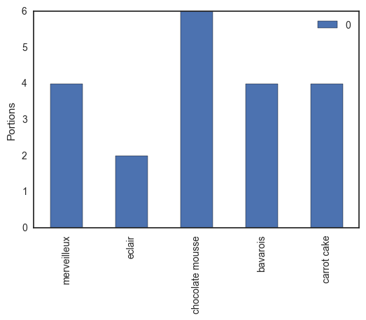
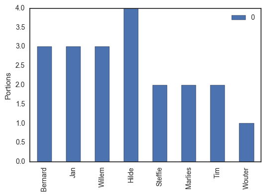
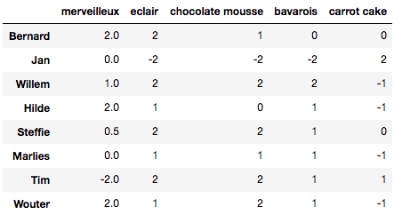
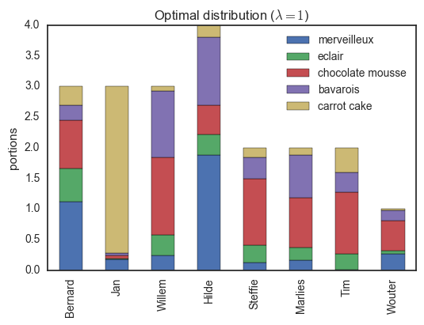
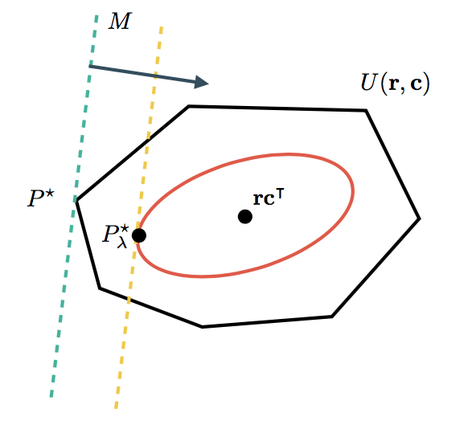
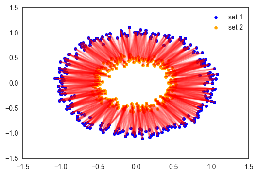
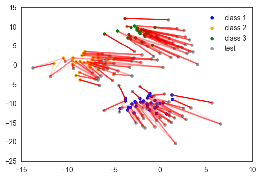

This summer I stumbled upon the optimal transportation problem, an optimization paradigm where the goal is to transform one probability distribution into another with a minimal cost. It is so simple to understand, yet it has a mind-boggling number of applications in probability, computer vision, machine learning, computational fluid dynamics and computational biology. I recently gave a seminar on this topic and this post is an overview on the topic. Slides can be found on my [SlideShare](https://www.slideshare.net/Sebashan/a-tour-in-optimal-transport-81159131) and some [implementations](https://github.com/MichielStock/Teaching/tree/master/Optimal_transport) can are shown in a [Jupyter notebook](https://github.com/MichielStock/Teaching/blob/master/Optimal_transport/Optimal_transport_examples.ipynb) in my Github repo. Enjoy!

## A party in the lab

Let's have a party in our research unit! Pastries and party hats for everyone! We ask Tinne, our laboratory manager, to make some desserts: an airy merveilleux, some delicious eclairs, a big bowl of dark chocolate mousse, a sweet passion fruit-flavored bavarois and moist carrot cake (we got to have our vegetables). If we mentally cut all these sweets into portions, we have twenty portions as shown in the table below.



Since this is academia, we respect the hierarchy: people higher on the ladder are allowed to take more dessert. The professors, Bernard, Jan and Willem each get three pieces each, our senior post-doc Hilde will take four portions (one for each of her children) and the teaching assistants are allowed two portions per person. Since Wouter is a shared teaching assistant with the Biomath research group, he can only take one (sorry Wouter).



As engineers and mathematicians, we pride ourselves in doing things the optimal way. So how can we divide the desserts to make everybody as happy as possible? As I am preparing a course on optimization, I went around and asked which of those treats they liked. On a scale between -2 and 2, with -2 being something they hated and 2 being their absolute favorite, the desert preferences of the teaching staff is given below (students: take note!).



See how most people like eclairs and chocolate mousse, but merveilleus are a more polarizing dessert! Jan is lactose intolerant, so he only gave a high score to the carrot cake by default.

My task is clear: divide these desserts in such a way that people get their portions of the kinds they like the most!

## The optimal transport problem

Let us introduce some notation so we can formally state this as an optimization problem. Let $$\mathbf{r}$$ be the vector containing the amount of dessert every person can eat. In this case $$\mathbf{r} = (3,3,3,4,2,2,2,1)^\intercal$$ (in general the dimension of $$\mathbf{r}$$ is $$n$$). Similarly, $$\mathbf{c}$$ denotes the vector of how much there is of every dessert, i.e. $$\mathbf{c}=(4, 2, 6, 4, 4)^\intercal$$ (in general the dimension of $$\mathbf{c}$$ is $$m$$). Often $$\mathbf{r}$$ and $$\mathbf{c}$$ represent marginal probability distributions, hence their values sum to one.

Let $$U(\mathbf{r}, \mathbf{c})$$ be the set of positive $$n\times m$$ matrices for which the rows sum to $$\mathbf{r}$$ and the columns sum to $$\mathbf{c}$$:

$$U(\mathbf{r}, \mathbf{c}) = \{P\in \mathbb{R}_{>0}^{n\times m}\mid P\mathbf{1}_m = \mathbf{r}, P^\intercal\mathbf{1}_n = \mathbf{c}\}\,.$$

For our problem, $$U(\mathbf{r}, \mathbf{c})$$ contains all the ways of dividing the desserts for my colleagues. Note that we assume here that we can slice every dessert however we like. We do not have to only give whole pieces of pie but can give any fraction we like.

The preferences of each person for each dessert is also stored in a matrix. In order to be consistent with the literature, this will be stored in an $$n\times m$$ *cost* matrix $$M$$. The above matrix is a preference matrix which can easily changed into a cost matrix by flipping the sign of every element.

So finally, the problem we want to solve is formally posed as

$$
d_M(\mathbf{r}, \mathbf{c}) = \min_{P\in U(\mathbf{r}, \mathbf{c})}\, \sum_{i,j}P_{ij}M_{ij}\,.
$$

This is called the *optimal transport* between $$\mathbf{r}$$ and $$\mathbf{c}$$. It can be solved relatively easily using linear programming.

The optimum, $$d_M(\mathbf{r}, \mathbf{c})$$, is called the *Wasserstein metric*. Is a basically a distance between two probability distributions. It is sometimes also called the *earth mover distance* as it can be interpreted as how much 'dirt' you have to move to change one 'landscape' (distribution) in another.

## Choosing a bit of everything

Consider a slightly modified form of the optimal transport:

$$
d_M^\lambda(\mathbf{r}, \mathbf{c}) = \min_{P\in U(\mathbf{r}, \mathbf{c})}\, \sum_{i,j}P_{ij}M_{ij} - \frac{1}{\lambda}h(P)\,,
$$

in which the minimizer $$d^\lambda_M(\mathbf{r}, \mathbf{c})$$ is called the *Sinkhorn distance*. Here, the extra term

$$
h(P) = -\sum_{i,j}P_{ij}\log P_{ij}
$$

is the *information entropy* of $$P$$. One can increase the entropy by making the distribution more homogeneous, i.e. giving everybody a more equal share of every dessert. The parameter $$\lambda$$ determines the trade-off between the two terms: trying to give every person only their favorites or encouraging equal distributions. Machine learners will recognize this as similar to regularization in, for example, ridge regression. Similar as that for machine learning problems a tiny bit of shrinkage of the parameter can lead to an improved performance, the Sinkhorn distance is also observed to work better than the Wasserstein distance on some problems. This is because we use a very natural prior on the distribution matrix $$P$$: in absence of a cost, everything should be homogeneous!

If you squint your eyes a bit, you can also recognize a Gibbs free energy minization problem into this, containing energy, entropy, physical restrictions ($$U(\mathbf{r}, \mathbf{c})$$) and a temperature ($$1/\lambda$$). This could be used to describe a system of two types of molecules (for example proteins and ligands) which have a varying degree of cross-affinity for each other.  

## An elegant algorithm for Sinkhorn distances

Even though the entropic regularization can be motivated, to some extent, it appears that we have made the problem harder to solve because we added an extra term. Remarkably, there exists a very simple and efficient algorithm to obtain the optimal distribution matrix $$P_\lambda^\star$$ and the associated $$d_M^\lambda(\mathbf{r}, \mathbf{c})$$! This algorithm starts form the observation that the elements of the optimal distribution matrices are of the form

$$(P_\lambda^\star)_{ij} = \alpha_i\beta_j e^{-\lambda M_{ij}}\,,$$

with $$\alpha_1,\ldots,\alpha_n$$ and $$\beta_1,\ldots,\beta_n$$ some constants that have to be determined such that the rows, resp. columns, sum to $$\mathbf{r}$$, resp. $$\mathbf{c}$$! The optimal distribution matrix can be obtained by the following algorithm.

> **given**: $$M$$, $$\mathbf{r}$$, $$\mathbf{c}$$ and $$\lambda$$
>
> **initialize**: $$P_\lambda = e^{-\lambda M}$$
>
> **repeat**
>> 1. **scale the rows** such that the row sums match $$\mathbf{r}$$
>> 2. **scale the columns** such that the column sums match $$\mathbf{c}$$
>
> **until** convergence

An implementation in python is given below (note that the docstring is longer than the actual code).

```python
def compute_optimal_transport(M, r, c, lam, epsilon=1e-8):
    """
    Computes the optimal transport matrix and Slinkhorn distance using the
    Sinkhorn-Knopp algorithm

    Inputs:
        - M : cost matrix (n x m)
        - r : vector of marginals (n, )
        - c : vector of marginals (m, )
        - lam : strength of the entropic regularization
        - epsilon : convergence parameter

    Outputs:
        - P : optimal transport matrix (n x m)
        - dist : Sinkhorn distance
    """
    n, m = M.shape
    P = np.exp(- lam * M)
    P /= P.sum()
    u = np.zeros(n)
    # normalize this matrix
    while np.max(np.abs(u - P.sum(1))) > epsilon:
        u = P.sum(1)
        P *= (r / u).reshape((-1, 1))
        P *= (c / P.sum(0)).reshape((1, -1))
    return P, np.sum(P * M)
```

Using this algorithm we can compute the optimal distribution of desserts, shown below.


Here, everybody only has desserts they like. Note that for example Jan gets three pieces of carrot cake (the only thing he can eat) while Tim gets the remaining piece (he is the only person with some fondness of this dessert). If we decrease the regularization parameter $$\lambda$$, we encourage a more homogeneous distribution, though some people will have to try some desserts which are not their favorites...



The optimal transport problem, with or without entropic regularization has a nice geometric interpretation, shown below.



The cost matrix determines a direction in which distributions are better or worse. The set $$U(\mathbf{r}, \mathbf{c})$$ contains all feasible distributions. In the unregularized case, the optimum $$P^\star$$ is usually found in one of the corners of such a set. When adding the entropic regularizer, we restrict ourselves to distributions with a minimum of entropy, lying within the smooth red curve. Because we don't have to deal with the sharp corners of $$U(\mathbf{r}, \mathbf{c})$$ any more, it is easier to find the optimum. As special cases, when $$\lambda\rightarrow \infty$$, then $$P^\star_\lambda$$ will become closers to $$P^\star$$ (until the algorithm runs into numerical difficulties). For $$\lambda\rightarrow 0$$ on the other hand, only the entropic term is taken into account and $$P_\lambda^\star=\mathbf{r}\mathbf{c}^\intercal$$, a homogeneous distribution.

## The many applications of optimal transport

So optimal transport has two big applications: *matching distributions* (being interested in $$P_\lambda^\star$$) or computing a *distance between distributions* (being interested in $$d^\lambda_M(\mathbf{r}, \mathbf{c})$$).

### Matching distributions

Optimal transport provides the tools to transform one distribution into anther. For data scientists, the most commonly encountered distribution is simply a data set: a collection of points in some space, each having the same weight. Below is an example of two sets of points, each distributed around two concentric circles with different diameters.



Each point of the first set is matched softly to the most related points of the other sets according to an Euclidian distance. Why could this be useful? Suppose you want to interpolate between these two data sets to obtain a new set 3, in between set 1 and 2. This can be done by simply taking a weighted average between each point of the first set and its analogues of set 2.

Domain adaptation is an interesting machine learning application of matching distributions. Suppose you have a labeled training data set, say a bunch of images of dogs and cats. You want to use this data set to build a dog/cat classifier for a set of testing images. But there is a problem: all images from the training set are taking during the day, while the images of the test set are taking during the night. This is called *domain shift*, the distributions between train and test sets differ. Courty et al. provided a simple solution:

1. Link the instances of the train and test sets using optimal transport.
2. Learn the mapping from train to test or apply a transformation to the training set to minimize the Wasserstein or Sinkhorn distance.
3. Build a classifier on the training data transformed to match the testing distribution.

Below is an illustration of this idea on a toy data set.



A final, rather neat, application of matching distributions is *color transfer*: changing the color scheme of one image to match that of another image. We simply represent an image as a distribution of pixels in a three-dimensional color space. Similar to the domain transfer, we can use optimal transport and a simple multivariate regression method to map one color scheme to another. It is no [neural style transfer](https://github.com/jcjohnson/neural-style), but then again this 'model' is trained from scratch in a fraction of a second. Try it for yourself using the  [code](https://github.com/MichielStock/Teaching/tree/master/Optimal_transport/color_transfer.py) on my Github repo!


### Finding a distance between two distributions

Often, we are interested in comparing complex objects or distributions, for example, if we use kernel-based learning algorithms. The Wasserstein or Sinkhorn distance is a much more flexible way to compare distributions than, say, the [Kullback-Leibler divergence](https://en.wikipedia.org/wiki/Kullback%E2%80%93Leibler_divergence). This is because the cost function allows us to incorporate valuable prior knowledge into the metric!

For example, suppose you want to compare different recipes, where every recipe is a set of different ingredients. There is a meaningful distance or similarity between two ingredients, but how do you compare the recipes? Simple! Use optimal transport, which basically boils down to finding the effort needed to turn one recipe into another. Have information about the relative amount of each ingredient in every recipe? Perfect, just incorporate them into the marginals!

## Conclusion

This has been a rather long blog post. Sufficient to say, I am very enthusiastic about this topic. So in summary: optimal transport is way to transform one distribution into another using a minimal 'cost'. If you are enforcing your solution to have a minimal amount of entropy, this optimization problem can be solved extremely efficiently using the Sinkhorn-Knopp algorithm.

## References

Courty, N., Flamary, R., Tuia, D. and Rakotomamonjy, A. (2016). *Optimal transport for domain adaptation*. [arxiv](https://arxiv.org/abs/1507.00504)

Cuturi, M. (2013) *Sinkhorn distances: lightspeed computation of optimal transportation distances*. [arxiv](https://arxiv.org/abs/1306.0895)

Lévy, B. and Schwindt, E. (2017). *Notions of optimal transport theory and how to implement them on a computer*.  [arxiv](https://arxiv.org/abs/1710.02634)
