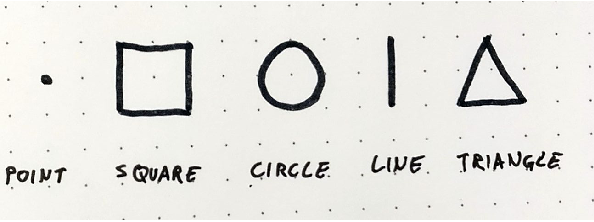
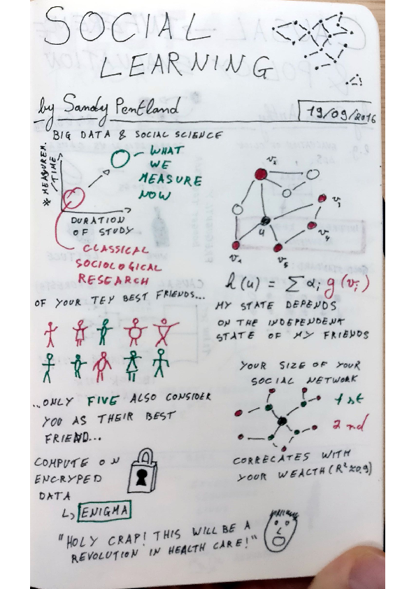
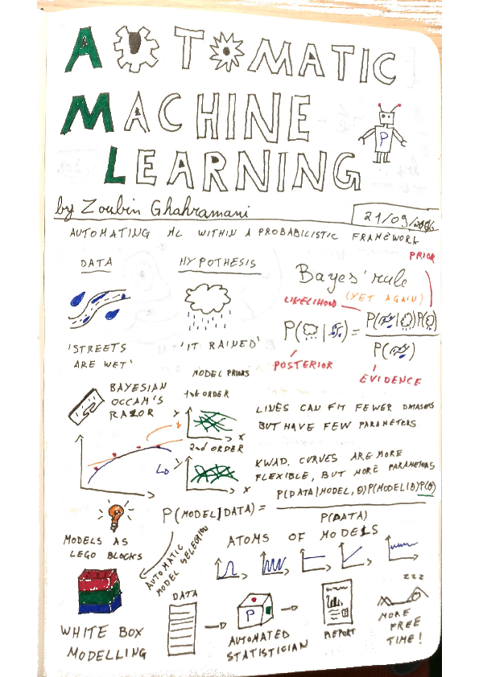
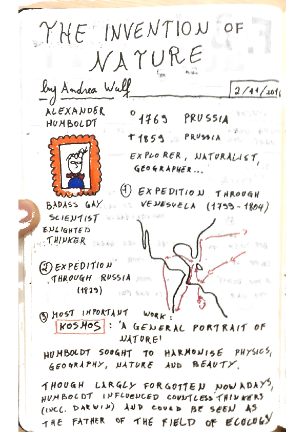
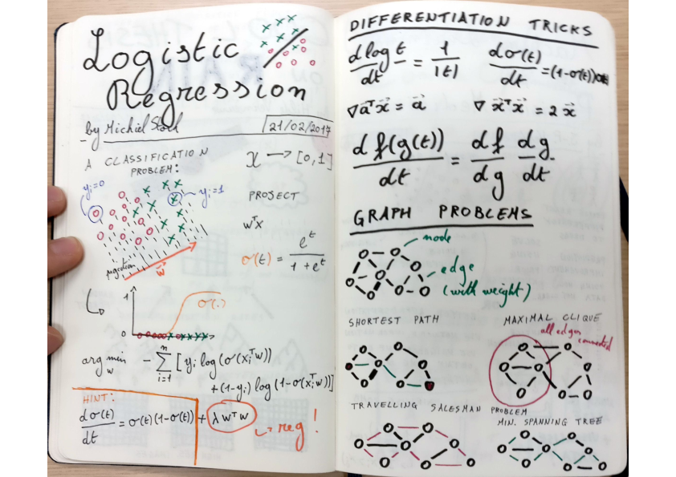
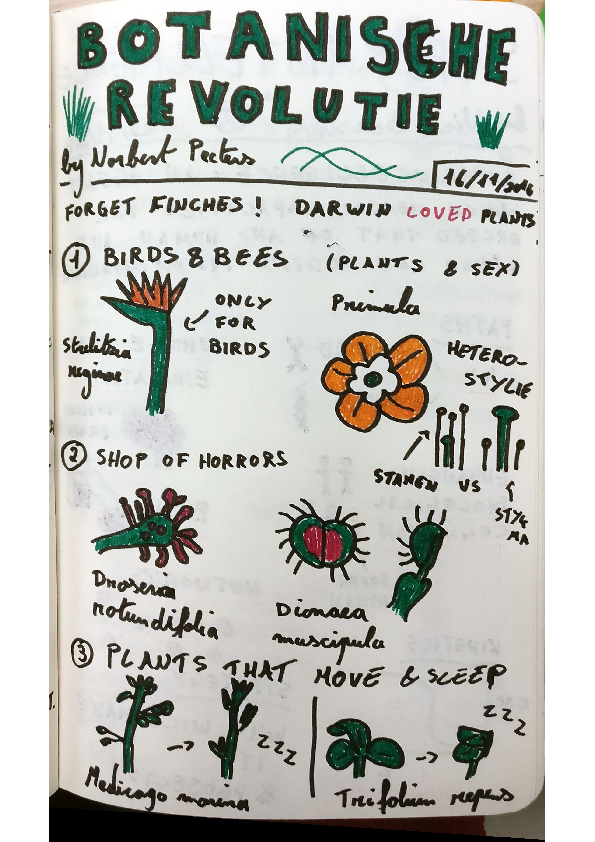
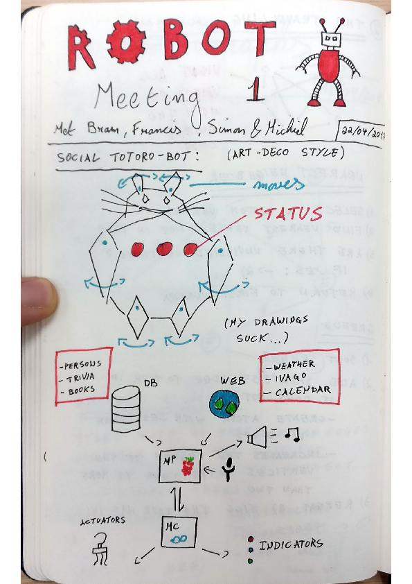
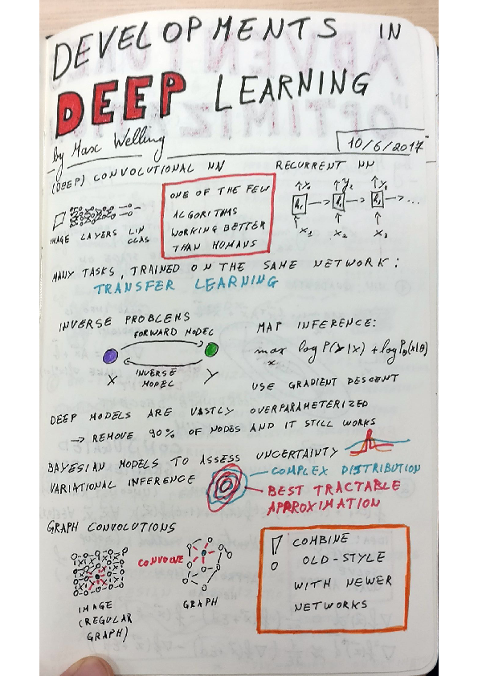
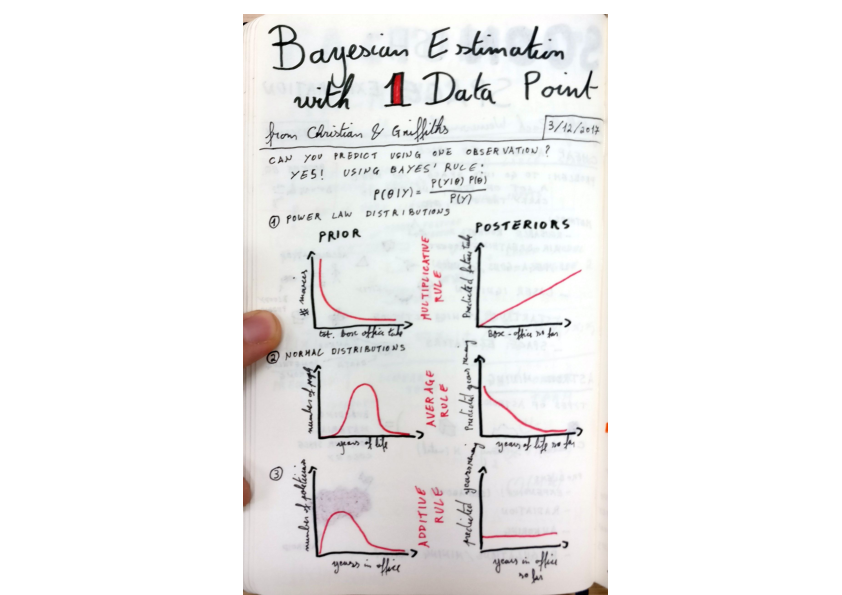
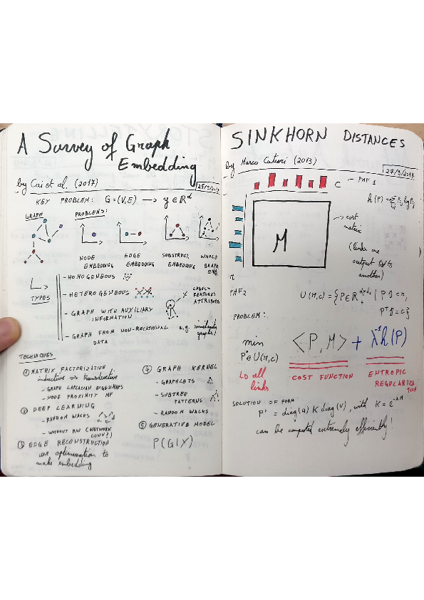

Since the summer of 2016, I try to frequently make [sketchnotes](http://rohdesign.com/sketchnotes/). Sketchnotes are the hipster way of taking notes. The idea is that you document meetings, presentations and the like using a combination of doodles, text and diagrams. That way you end up with a summary that is something a hybrid between a scheme and a comic book page.

Not only is making sketchnotes much more fun than traditional boring noting, it is in my opinion also much more effective! When I am trying to make a simple and visually appealing record, I am much more actively processing the content. I generally make sketchnotes in the following situations:

1. **Live, during presentations.** This is the most intense, as I have to distill the main ideas of the talk and find a good way to draw them in a very short time. Ideally, I also want to have a sketchnote that completely fills one or two pages. For this reason, I often draw a 'filler' doodle during the Q&A. The difficulty notwithstanding, some of my best sketchnotes are drawn during a talk. If I can convey the main message, it is usually an indication that the presenter gave a very lucid talk!
2. **To summarize papers and books.** Sketchnoting is an excellent way to retain information from books or papers. Since I always carry my notebook with me, I can rapidly look back to the main points of something I read. Since the sketches are often quite distinctive, I can quickly find back the relevant page.  
3. **To organize my thoughts.** When preparing a lecture or presentation, writing out a project proposal or brainstorming for new research ideas, I like to make a sketchnote as well. If I can outline the crux in a page or two, I can usually explain it well to other people. Since sketchnoting is quite visually stimulating, I also better remember the content.

I always thought of myself as being spectacularly bad at drawing. Being friends with [Koen van den Eeckhout](http://www.koenvandeneeckhout.be/category/artwork/), who is the official sketchnoter of the [Science Café](http://www.wetenschapscafe.be/) at Ghent, does *not* help my self esteem. The philosophy of sketchnoting however is to keep the artwork simple and having fun is more important than a crisp end result. Remember, there are only five basic shapes to draw just about anything: point, square, circle, line and triangle. Though I still do not find my drawings very appealing, I do see quite an improvement of my artwork in the last years.

Sketchnotes are an good way to have a bit of presence on the social media. Posting the notes on Twitter during a conference is a good way to meet some people and people will be grateful that you documents the talks for them! I also find that tweeting sketchnotes of papers is a good way to signal what your research interests are! And sometimes one of them gets picked up and results in a bunch of new followers! Furthermore, if the chief storyteller of the Flemish news want to use your notes of the [media school](https://michielstock.github.io/Media-school/) in his course, it is a huge ego-boost =)

Below are some examples of sketchnotes about various topics I did in the last years.

P.S. Since this year I have taken up [bullet journalling](http://bulletjournal.com/) as well. I find that this is a good way to keep track of my work and what I read and it is another way to express my love for fancy notebooks.
