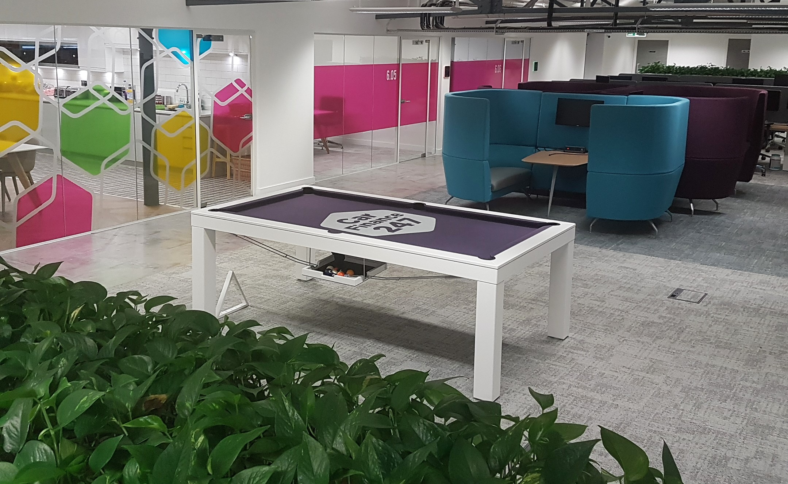

Coming from a very traditional workplace where strict dress code was required, personal mobile phones had to be switched off, snacking frowned-upon, and a Managing Director that excelled in micro-micromanagement, I now realise the importance that the company’s culture has in the long-term employment. The company’s culture is the company’s personality, I believe it’s how the company treats their employees in the present time, and a glimpse on how it will treat them in the future when change comes. Can you relate with my previous workplace? Maybe you believe I was subject to modern slavery because your workplace has a Head of Happiness. Well, Carfinance247 doesn’t have that, yet…

<!--more-->

It is definitely cool to work in a place where you have free coffee & fruit, banked hours, standing desks, pod couches, pool table, live dashboards & sticky notes everywhere, etc.. However, I prefer to focus my attention on a particular point of our culture - the Guiding Principles of product development in our IT department.
 
Let’s go straight into it.

### 1 - We fail fast and learn quick
Yes we fail fast, as in we’re not afraid of taking risks and try new things out. By doing that, we learn and grow from our customers’ feedback to continually build something better.

This principle translates into having a culture of A/B testing, experimenting different versions of our product, seeing which one performs better and then driving the next design iteration of the product in that direction.

We also need fast feedback from our releases or products. We have embraced the ELK stack that allows us to gather distributed log data and quickly report if our customers goals are being met. In regards to alerting, we fire real-time events through our communication tool, Slack, to enable faster detection and recovery.

### 2 - We keep it simple and iterate
We focus on building just the essential, a minimum valuable product, and then keep adding value during each development cycle. Why get a product out with a million features in a year from now, if the customer will only use 30% of those?

We try to keep ourselves agile, and that has many advantages. Business wise, the faster we bring a product out to the market, the faster the business generates a return over the invested capital plus increasing market share. Also, achieving a high-level quality product that caters for the customer real needs is the result of integrating the customer feedback into the early stages of the design/development.

In CF247 we tend to do weekly or bi-weekly sprints. We focus on small batches of work, and try to bring out new features at the end of each sprint. This way we can rapidly deliver value to the business as well as get customer behaviour data that will feed back the further development of the product.
Technically we promote a continuous integration and continuous deployment culture, which allow to maximise the flow of work and enable us to ship software rapidly. 

### 3 - We own and deliver experiences to be proud of
This principle is about fostering a culture that puts customer’s interests first. I see this principle as the glue that tightens all other principles together, because the customer experience is the key reason to make customers use the product in the first place, as well as to keep them coming back. If the customers are not satisfied with the experience, they will definitely look somewhere else, regardless of how many great features were built.

I believe this principle translates into having a user-centred design approach - like a symbiotic relationship between design, compliance and development, with the user in the middle. In CF247 when building products we have a UX team that designs a visual experience, aligned with high design standards and passing it onto the devs to implement it. We’re not afraid to use the latest tech, which allows us to deliver modern products to enhance the customer journey. We are big advocates of responsive web-design and [user testing](/user-experience-testing-a-short-cut-to-design-thinking).

## Conclusion
These principles drive the way we design and build our software: constant improvement, not being afraid to fail, little by little we keep it simple, but laser focused on our goal, that is, own and deliver a customer experience to be proud of. You can read more on the process behind how they were crafted [here](/bridging-the-design-developer-gap-design-and-build-principles). Some of these principles were inspired by the Agile Manifesto and both of them are part of our DNA. However, they would mean nothing if the context where they were set was a workplace, say traditional, restrictive, or depressive - they, in my opinion, would just be fancy frames hung on the wall. A stimulating workplace allows the guiding principles to be motivating and actually guide someone.