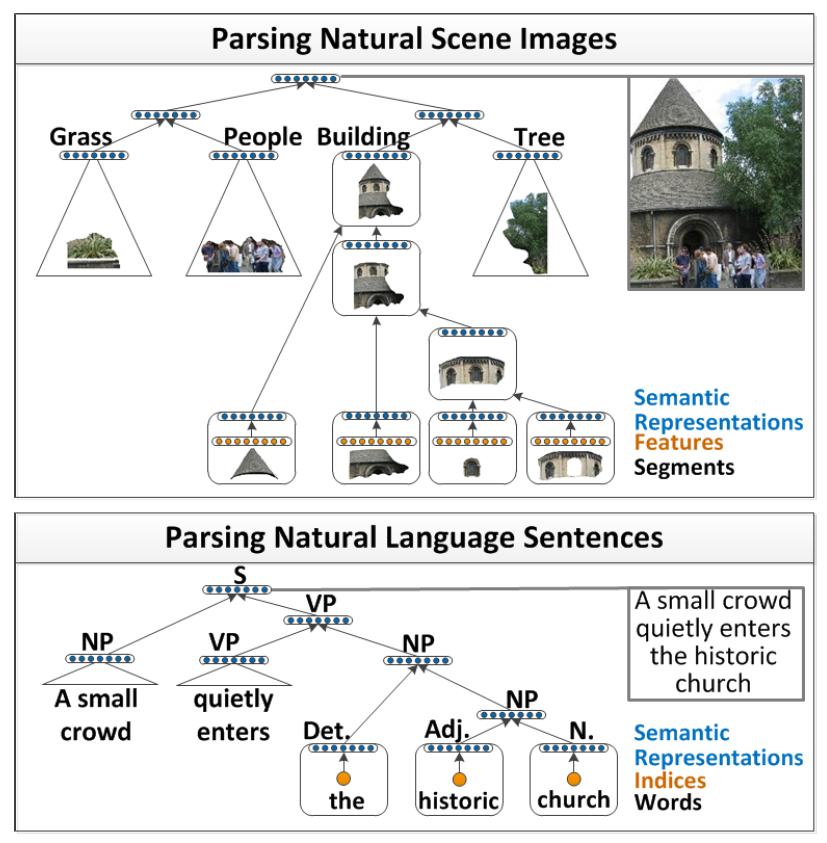

19.10.2018
02.11

In this post, the paper "Parsing Natural Scenes and Natural Language
with Recursive Neural Networks" is investigated and summarized.

*Richard Socher, Cliff C. Lin, Andrew Y. Ng, and Christopher D. Manning. Parsing natural scenes and natural language with recursive neural networks. In Proceedings of the 26th International Conference on Machine Learning (ICML), volume 2, 2011.*

## Summary:

Our program will need to understand that it needs to speak about a tree, independent of its shape, lightning or even type. It should extract the information that it is a “tree” (annotation), where it is located (segmentation) and combined with all the different patterns in the image what general scene type is (classification) and it should generate a subtitle accordingly.
In their paper, Socher et al. proven out that recursive structure perfectly fits this problem for both NLP and vision purposes. It helps us to figure out the interaction between the units, besides their existence. 
Recursive Neural Networks (RNN) merges smaller pieces into a large meaningful totality as seen in Figure 1., determine a new semantic feature representation for this larger region and label its class. Both the image segments and the words are mapped (independently) to the semantic space of RNN. It learns the best fit from all possible binary parse trees, where the inputs are the mapped instances of images and words, and the adjacency matrix showing which ones are available to be merged.
RNN promotes neighboring regions that have same class label and merge them into a larger region, in a tree-like manner. Other than previous DL applications on NLP, where fixed size inputs are used, Socher et al. handled variable sized sentences with this tree like structure. Same logic with the visual part is utilized and “Noun -> NounPhrase -> VerbPhrase -> Sentence” structure is established, as an example in again Figure 1. 

*Figure 1.: Recursive neural network architecture, for (i) images and (ii) sentences.*

In conclusion, this method is very much applicable for our currently-thought project since we can use the same algorithm for both visual and verbal parts. (i) Time and effort will be saved and (ii) we might be able to connect these features better in a wider range. 
      
        
          
*Created by*

- *Emre Doğan*

- *Dersu Giritlioğlu*

- *Gözde Nur Güneşli*

