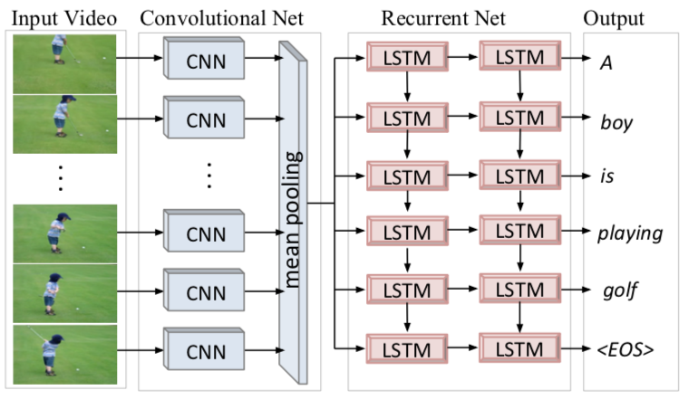

2018/11/01

In this post, the paper *"Translating Videos to Natural Language Using Deep Recurrent Neural Networks"* is ivestigated and summarized.

*Venugopalan, Subhashini & Xu, Huijuan & Donahue, Jeff & Rohrbach, Marcus & Mooney, Raymond & Saenko, Kate. (2014). Translating Videos to Natural Language Using Deep Recurrent Neural Networks. 10.3115/v1/N15-1173.*

## Summary:

In this paper, the main challenge is to translate videos directly to sentences using several neural network structures.

The authors reference some other papers in which similar works have been done. What makes this paper special is that different methodologies are used to be able to enhance the performance metrics. To give examples:
- (Barbu et al., 2012 [1]; Rohrbach et al., 2013 [2]) were succesful in a limited set of actions.

- (Guadarrama et al., 2013[3]; Thomason et al., 2014[4]) were succesful by simplifying an action to a fixed set of semantic roles i.e. subject, verb and object.

But these kind of studies could not be generalized as they could not show the similar success in large datasets and these models lead strict sentence structures.

So the authors came with a new approach and used LSTM model to generate output descriptions from the inputs: *video features and previous word.* This approach is used because of the recent success of LSTM on machine translation tasks.

The structure of the whole system can be observed below in Figure 1.

*Figure 1. The structure of the video description network*

To summarize the process in 3 steps:

   1. By using CNN, a fixed length visual data that summarizes the video is generated. (via Caffe framework)

   2. Then, the frames are sampled (10:1) and a vector of sized [1,4096] is generated to represent video.

   3. These vectors are fed to the LSTM Units to generate word outputs.

## Results

The model implemented in this paper with different training set (the ones shown as LSTM in the tables) are compared with the previous studies. It can be observed that mostly better results are achieved, especially in the subject-verb-object triple prediction.

*Table 1. SVO Triple Accuracy Comparison of the Implemented Models with the Older Studies*

*Table 2. Relevance and Grammar Comparison of the Implemented Models with the Older Studies*

HVC: Highest Vision Confidence model described in (Thomason et al., 2014)[4].

FGM: Factor Graph Model described in FGM (Thomason et al., 2014)[4].

LSTM Models: Models implemented by the authors with different datasets.

References:
- [1] Andrei Barbu, Alexander Bridge, Zachary Burchill, Dan Coroian, Sven Dickinson, Sanja Fidler, Aaron Michaux, Sam Mussman, Siddharth Narayanaswamy, Dhaval Salvi, Lara Schmidt, Jiangnan Shangguan, Jef- frey Mark Siskind, Jarrell Waggoner, Song Wang, Jin- lian Wei, Yifan Yin, and Zhiqi Zhang. 2012. Video in sentences out. In Association for Uncertainty in Arti- ficial Intelligence (UAI).

- [2] Marcus Rohrbach, Wei Qiu, Ivan Titov, Stefan Thater, Manfred Pinkal, and Bernt Schiele. 2013. Trans- lating video content to natural language descriptions. In IEEE International Conference on Computer Vision (ICCV).

- [3] Sergio Guadarrama, Niveda Krishnamoorthy, Girish Malkarnenkar, Subhashini Venugopalan, Raymond Mooney, Trevor Darrell, and Kate Saenko. 2013. Youtube2text: Recognizing and describing arbitrary activities using semantic hierarchies and zero-shot recognition. In IEEE International Conference on Computer Vision (ICCV), December.

- [4] J. Thomason, S. Venugopalan, S. Guadarrama, K. Saenko, and R.J. Mooney. 2014. Integrating language and vision to generate natural language descriptions of videos in the wild. In Proceedings of the 25th International Conference on Computational Linguistics (COLING), August.

*Created by*

- *Emre Doğan*

- *Dersu Giritlioğlu*

- *Gözde Nur Güneşli*
