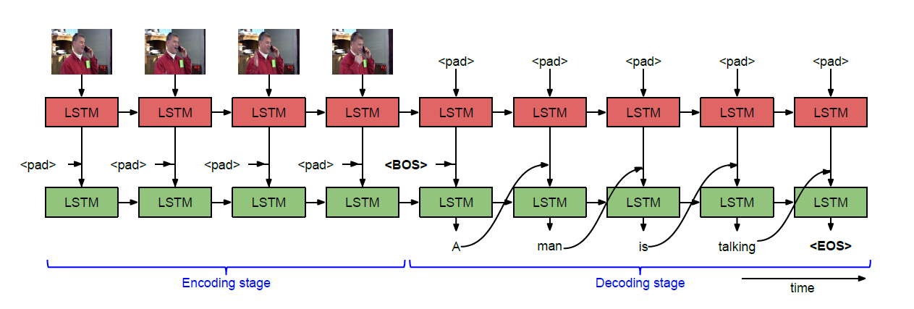

2018/11/08

In this post, the paper "Sequence to Sequence – Video to Text" is investigated and summarized.

Venugopalan, S. et. al., 2015, “Sequence to Sequence – Video to Text”, pp. 4534-4542 in: International Conference on Computer Vision-ICCV, Las Condes, Chile.

## Summary:

Motivation behind the paper, Sequence to Sequence – Video to Text by Venugopalan et. al., 2015, is to create seq-to-seq model that allows both sequence of words and frames to be variable length (crucial when dealing with videos) and accurate in temporality as well as semantics. Direct mapping between sequences of frames and words are aimed.

Long Short-Term Memory (LSTM), which is a type of RNN, is utilized as the network since there are relations with the previous frames in videos and the connections mean a lot. LSTM has shown a great success in those topics in which we might need this connection, like speech recognition. Different from Srivastava et. al., 2015, letting LSTM both to encode and decode allows it to arrange the weights between them more properly. An optical flow CNN is also used to increase activity recognition quality.

In language aspect, some previous work included a template-based approach that tags words as objects, subjects and verbs. While it simplifies the task, it makes the program to stuck in a block and creativity decreases by decreasing the influence area. Creating a direct mapping between human-provided sentences and images sequences provides a better understanding of the scene and results in a richer grammatical language. 

In Figure 1, the red LSTM layer is responsible for modeling the visual frame sequence whereas the green one models the output word sequence. But they are stacked together and encoding and decoding are all done in one LSTM bunch.

*Figure 1: Whole process with visual inputs, visual modeling and verbal modeling LSTM layers, encoding and decoding stages and the corresponding sentence.*

This simple sequential model reaches the state-of-the-art performance on the MSVD dataset and with some of the open source materials that can be really useful in our project, it is guiding us what possible solutions we can use.

Bonus: In the introduction part, they stated “Video description has so far seen less attention despite its
important applications in human-robot interaction, video indexing, and describing movies for the blind.” and I found it meaningful since our project is more of a challenge rather than stating a direct real-life problem, and could be a host to more interesting developments in those areas.  
        
          
*Created by*

- *Emre Doğan*

- *Dersu Giritlioğlu*

- *Gözde Nur Güneşli*
