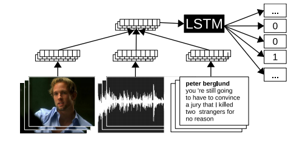
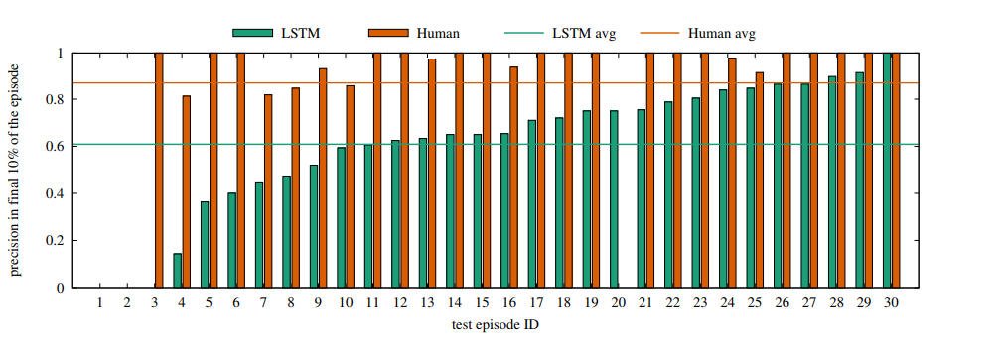

2018/11/15

In this post, the paper "Whodunnit? Crime Drama as a Case for Natural Language Understanding" is investigated and summarized.

Frermann, L., Cohen, S. B., & Lapata, M. (2018). Whodunnit? Crime Drama as a Case for Natural Language Understanding. Transactions of the Association of Computational Linguistics, 6, 1-15.

## Summary:

In this study, Frermann et al. pose an interesting (and novel) problem to understand the needs of natural language understanding models: Can an NLP model be a detective and identify the correct perpetrator of a crime scene?

For this problem, they develop a new dataset based on 39 episodes of the TV series “CSI: Crime Scene Investigation”, containing gold-standard perpetrator as well as three viewers’ guesses about the perpetrator during each episode. The task is approached as an incremental inference problem. The guesses are collected in time, so they change while the episode continues revealing more information. The model is also trained and tested with this incremental approach. The main task is to decide whether the words which refer to a person (e.g. you,me, Peter, Catherine, strangers, victims) refer to a perpetrator or not. 

They use a combination of various modalities (text, audio, image), the feature representations of them are fused and passed to an LSTM which predicts whether a perpetrator is mentioned (label l = 1) or not (l = 0) . An overview of their model can be seen on *Figure 1*.

*Figure 1: Overview of the model.*

They analyze the differences between model and human behavior to study whether humans and models are similar while making decisions. *Figure 1* shows precision results of both human and model in the final 10% of an episode.  

*Figure 2: Precision in the final 10% of an episode, for 30 test episodes from five cross-validation splits. Scores per episode and global averages (horizontal bars) are shown. Episodes are ordered by increasing model precision*
             

They also test the model and the human viewers with an episode which there is no perpetrator (it is  a suicide case). *Figure 3* shows cumulative counts of false positives (fp) for both human and model for this case.  

*Figure 3: Cumulative counts of false positives (fp) for the LSTM and a human viewer for an episode with no perpetrator. Red vertical bars show the times at which the viewer pressed the red button indicating that they (think they) have identified the perpetrator.*
            

Although human results are higher than the model, this is a difficult task even for the humans and the incremental learning approach with multi modalities seems to be promising for natural language understanding tasks.

*Created by*

- *Emre Doğan*

- *Dersu Giritlioğlu*

- *Gözde Nur Güneşli*

