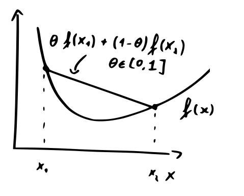
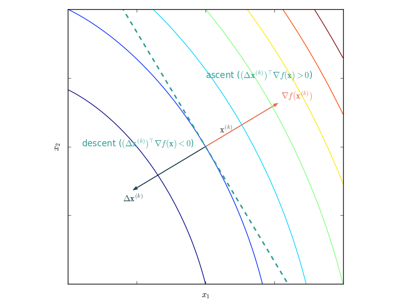
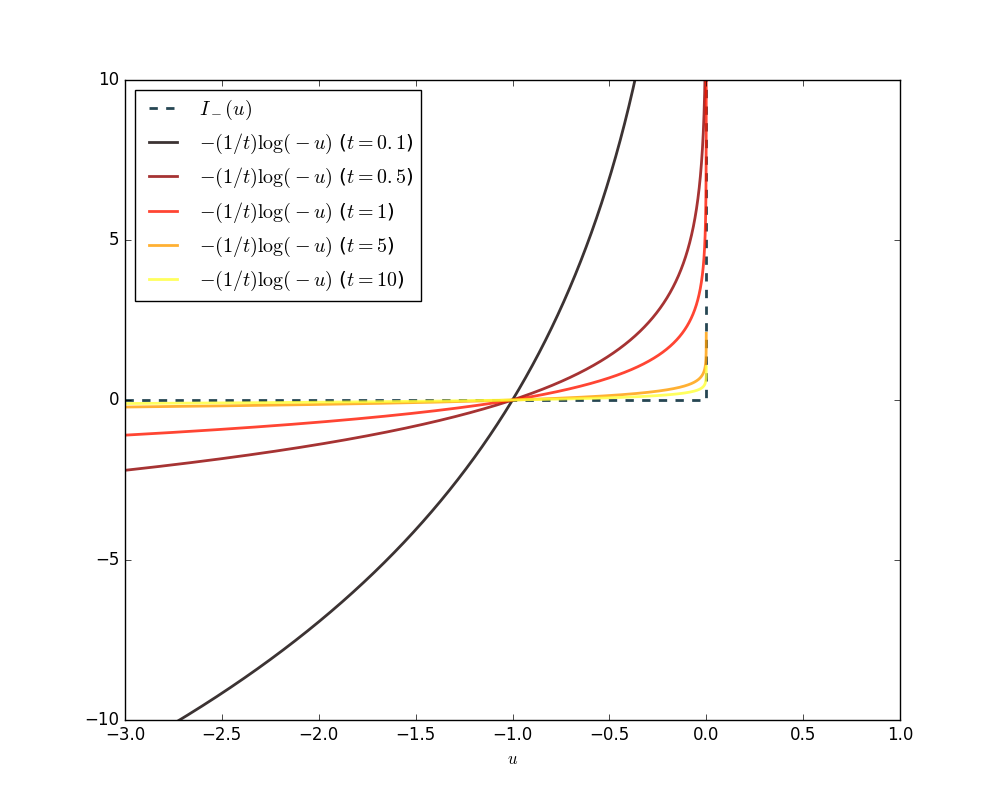

In the last four weeks, I taught about convex optimization to my bioinformatics students. Since this topic is of general interest to those working with data and models, I will try to summarize the main points that the 'casual optimizer' should know. For a much more comprehensive overview, I refer to the excellent textbook of Boyd and Vandenberghe referenced below.

## Convex functions

A *convex set* $$\mathcal{C}$$ is a set for which every element on a line segment connecting two points $$\mathbf{x},\mathbf{x}'\in\mathcal{C}$$ is also in this set.

A *convect function* $$f$$ is a function for which the input domain is convex and for which it holds that

$$
f(\theta\mathbf{x}+(1-\theta)\mathbf{x}')\leq \theta f(\mathbf{x})+(1-\theta)f(\mathbf{x}')\quad \forall \theta\in[0,1]\,,
$$

meaning that any line segment connecting two points on this curve lies above the curve.

If the function is differentiable it also holds that the first-order Taylor approximation lies below the curve:
$$
f(\mathbf{x})\geq f(\mathbf{x}')+\nabla f(\mathbf{x}')^\top(\mathbf{x}-\mathbf{x}')\,.
$$

Convex functions are nice because when it has a minimum, this minimum is a global minimum. Such functions frequently arise in statistics and machine learning. Many machine learning methods, such as the support vector machine, are specifically posed as convex optimization problems.

## Quadratic function

An important special case of convex functions are *quadratic minimization problems*:

$$
\min_\mathbf{x}\,\frac{1}{2}\mathbf{x}^\top P \mathbf{x} + \mathbf{q}^\top\mathbf{x} + r\,,
$$

with $$P$$ symmetric and positive-definite (i.e. all eigenvectors are greater than zero).

These have a closed-form solution:

$$
\mathbf{x}^\star = -P^{-1}\mathbf{q}\,.
$$

Quadratic systems are important for least-squares-based learning and in certain graph problems. From a theoretical point of view, they are important because convex problems can be closely approximated by quadratic functions near their minimum, the region we are interested in!

## General descent algorithms

For general convex optimization problems, one usually uses *descent algorithms*. The pseudocode of the general algorithm is given below.

> **given** a starting point $$\mathbf{x}$$
>
> **repeat**
>> 1. Determine descent direction $$\Delta \mathbf{x}$$
>> 2. *Line search*. Choose $$t>0$$.
>> 3. *Update*. $$\mathbf{x}:=\mathbf{x} + t \Delta \mathbf{x}$$.
>
> **until** stopping criterion is reached.
>
> **Output**: $$\mathbf{x}$$

Descent algorithms differ by their *descent direction*, method for choosing the *step size* and the *convergence criterion*  (often based on the norm of the gradient).

Proper descent methods have that

$$
(\Delta \mathbf{x})^\top \nabla f(\mathbf{x})\leq 0\,.
$$

## Gradient descent

A straightforward choice for the step size is the negative gradient:

$$
\Delta \mathbf{x} = -\nabla f(\mathbf{x})\,.
$$

Though this seems to make sense, in practice the convergence is rather poor. If $$f$$ is strongly convex (constants $$m$$ and $$M$$ exist such that $$mI\prec \nabla^2 f(\mathbf{x})\prec MI$$), it holds that $$f(\mathbf{x}^{(k)}) - p^*\leq \varepsilon$$ after at most

$$
\frac{\log((f(\mathbf{x}^{(0)}) - p^*)/\varepsilon)}{\log(1/c)}
$$

iterations, where $$c =1-\frac{m}{M}<1$$.

We conclude:

- The number of steps needed for a given quality is proportional to the logarithm of the initial error.
- To increase the accuracy with an order of magnitude, only a few more steps are needed.
- Convergence is again determined by the *condition number* $$M/m$$. Note that for large condition numbers: $$\log(1/c)=-\log(1-\frac{m}{M})\approx m/M$$, so the number of required iterations increases linearly with increasing $$M/m$$.

So the convergence is mainly determined by the shape of the function. See below for the example of the convergence on a quadratic and non-quadratic function.

Note that even for such simple two-dimensional problems, pure gradient descent takes a long time to converge.

## Newton's method

The main idea of **Newton's method** is approximating a function with a second-order Taylor approximation $$\hat{f}$$ of $$f$$ at $$\mathbf{x}$$:

$$
f(\mathbf{x}+\mathbf{v})\approx\hat{f}(\mathbf{x}+\mathbf{v}) = f(\mathbf{x}) + \nabla f(\mathbf{x})^\top \mathbf{v} + \frac{1}{2} \mathbf{v}^\top \nabla^2 f(\mathbf{x}) \mathbf{v}\,
$$

which is a convex quadratic function of $$\mathbf{v}$$. The *Newton step* is the step that minimizes this approximation in $$\mathbf{v}$$. The step is hence given by

$$
\Delta \mathbf{x} = -(\nabla^2 f(\mathbf{x}))\nabla f(\mathbf{x})\,.
$$

Using the newton step in the general descent algorithm generally leads to a very fast convergence, especially when close to the minimum. Newton's method is much more robust to bad condition numbers and is *affine invariant*, scaling, translating or rotating the input domain does not influence its performance.

## Linear equality constraints

Sometimes we want to minimize a function with respect to a *linear equality constraint*:

$$
\min_\mathbf{x} f(\mathbf{x})
$$

$$
\text{subject to } A\mathbf{x}=\mathbf{b}
$$

where $$f : \mathbb{R}^n \rightarrow \mathbb{R}$$ is convex and twice continuously differentiable and $$A\in \mathbb{R}^{p\times n}$$ with a rank $$p < n$$.

A special Newton step which respects these constraints can be obtained by solving the following system:

$$
\begin{bmatrix}
 \nabla^2 f(\mathbf{x})&  A^\top \\
A & 0 \\
     \end{bmatrix}
     \begin{bmatrix}
\Delta \mathbf{x}_\text{nt}\\
\mathbf{w}
     \end{bmatrix}
     =
     -\begin{bmatrix}
\nabla f(\mathbf{x}) \\
A\mathbf{x}-\mathbf{b}
     \end{bmatrix}\,.
$$

Note that:

- If the starting point $$\mathbf{x}^{(0)}$$ is chosen such that $$A\mathbf{x}^{(0)}=\mathbf{b}$$, the residual term vanishes and steps will remain in the feasible region. This is the **feasible start Newton method**.
- If we choose an arbitrary $$\mathbf{x}^{(0)}\in$$ **dom** $$f$$, not satisfying the constraints, this is the **infeasible start Newton method**. It will usually converge rapidly to the feasible region (check the final solution!).

## Inequality constraints

Dealing with inequality constrains is more complex. In general, we want to solve

$$
\min_\mathbf{x}  f_0(\mathbf{x})
$$

$$
\text{subject to } f_i(\mathbf{x}) \leq 0, \quad i=1,\ldots,m
$$

where $$f_0,\ldots,f_m\ :\ \mathbb{R}^n \rightarrow \mathbb{R}$$ are convex and twice continuously differentiable.

A trick is reformulating the problem using soft constraints in the objective function:

$$
\min_\mathbf{x}  tf_0(\mathbf{x})-\sum_{i=1}^m\log(-f_i(\mathbf{x}))\,,
$$

where we used the *logarithmic barrier* to approximate the inequality constraints. The parameter $$t$$ determines the sharpness of the approximation, as illustrated below.

High values of $$t$$ result in a very good approximation but are hard to optimize because they are ill-conditioned. *Interior point methods* start with a low value of $$t$$ to obtain an initial solution and iteratively use the previous solution as a starting point for the soft-constrained optimization problem with increased $$t$$.

## References

- Boyd, S. and Vandenberghe, L., '*[Convex Optimization](https://web.stanford.edu/~boyd/cvxbook/bv_cvxbook.pdf)*'. Cambridge University Press (2004)
- Bishop, C., *Pattern Recognition and Machine Learning*. Springer (2006)
