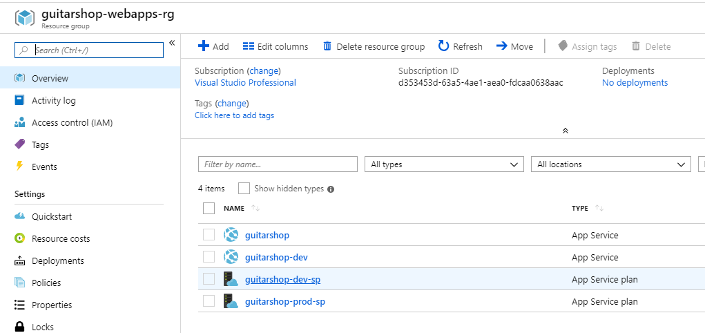
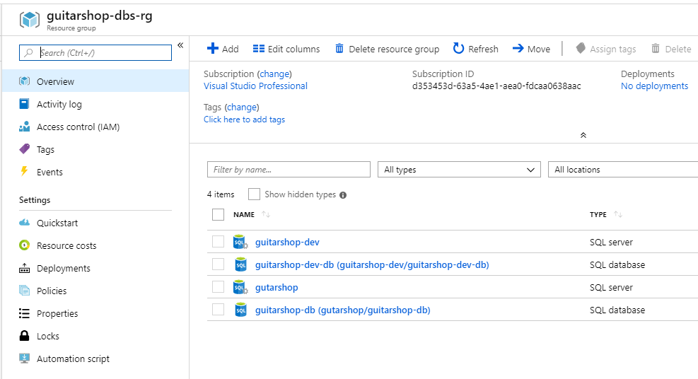
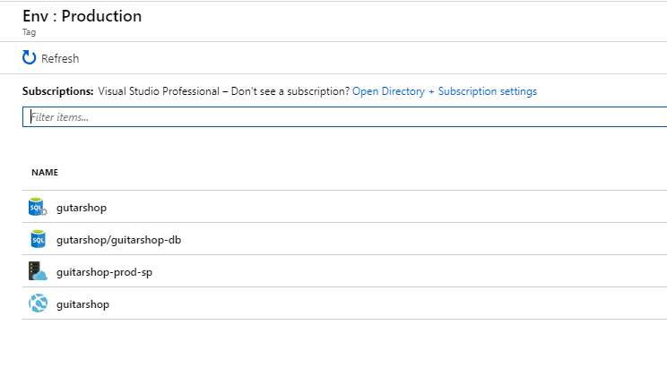

Tags represent metadata you can apply to your resources introducing logical organization. A tag consists of a name and a value pair. They allow you to introduce taxonomy that will help you by working with your resources more efficiently.

## Organizing resources
In Azure, you put all your resources into resource groups. There are many ways to organize resources by creating the naming conventions for the resource groups and putting the resources in there. For example, you can put all your databases in one resource group and all the web applications in another one, or you can create one resource group for all the resources belonging to the production environment and another resource group for all the resources of the development environment. The choice should really correspond to your needs but you should try and be consistent about it.

What we can see here that resource groups allow you to organize your resources only in one way and this can be very limiting most of the time. This is where tags step in and make your life easier by allowing you to add several layers of the logical organization. 

In our example, we have two resource groups **guitarshop-webapps-rg**, containing production and development versions of the web client and the **guitarshop-dbs-rg** containing production and development databases for the imaginary **Guitar Shop** application.

||
|:--:|
| *Resource groups* |

In **guitarshop-webapps-rg** we have production and development app services and app service plans

||
|:--:|
| *WebApps resource group* |

In **guitarshop-dbs-rg** we have production and development databases and servers

||
|:--:|
| *DBs resource group* |

## Filtering by tag
Additional to our resource group organization we can add a tag to our resources representing environment resources are belonging to. I have assigned **Env** tag with values **Dev** and **Production** to corresponding databases and web applications which allows me to see all the resources belonging to Production and Development environments. 
By clicking on **Env:Production** tag you can filter for all the resources with that tag

||
|:--:|
| *Resources under Production tag* |

## Where to use tags?
You can add additional grouping using tags like grouping resources by cost center, company department, data center location and so on. You can also use tags to automate your infrastructure. For example, having your VMs shut down at a certain time of the day in order to reduce cost, you can add tag **shutdown:7pm** which you can use in combination with Logic Apps or Aure Functions to make this happen.

## Use tags to do cost analysis
One very important thing from the business perspective we can do using tags is cost analysis. In the Azure portal, if you go to your subscription and then to Cost Analysis section you can see the list of your resources and their cost. Now, using tags, you can filter for Production and you can get a list of resources belonging to Production environment and their costs. 

## Managing tags
You can assign tags using the Azure portal, Powershell or Azure CLI. There is also some limitation when creating and using tags, some of which are:
1. You can add up to 15 tags to a resource
2. You cannot add a tag to all resources
3. The tag name is limited to 512 characters, and the tag value is limited to 256 characters
4. Tags applied to the resource group are not inherited by the resources in that resource group

For the full list of limitation please check [here](https://docs.microsoft.com/en-us/azure/azure-resource-manager/resource-group-using-tags)

## Manage tags using Powershell

<pre>
  <code class="bash">
    # Adding tag Env with value Test when creating new resource
    New-AzureRmStorageAccount -Name guitarshopteststoracc `
    -ResourceGroupName guitarshop-dbs-rg `
    -Location 'West Europe' `
    -SkuName Standard_LRS `
    -Tag @{ Env="Test"}

    # Reading the tags after resource creation
    $resource = Get-AzureRmResource -ResourceName guitarshopteststoracc `
    -ResourceGroupName guitarshop-dbs-rg

    $resource.Tags
  </code>
</pre>

||
|:--:|
| *Resource tags after creating a resource* |

<pre>
  <code class="bash">
    # Update tags on existing resource
    Set-AzureRmResource -ResourceName $resource.ResourceName `
    -ResourceGroupName $resource.ResourceGroupName `
    -ResourceType $resource.ResourceType `
    -Tag @{ Env='Test'; Department='IT' } `
    -Force

    # Reading the tags after updating resource
    $resource = Get-AzureRmResource -ResourceName guitarshopteststoracc `
    -ResourceGroupName guitarshop-dbs-rg

    $resource.Tags
  </code>
</pre>

||
|:--:|
| *Resource tags after updating a resource* |

<pre>
  <code class="bash">
    # Removing tags from the resource
    Set-AzureRmResource -ResourceName $resource.ResourceName `
    -ResourceGroupName $resource.ResourceGroupName `
    -ResourceType $resource.ResourceType `
    -Tag @{} `
    -Force

    # Reading tags after removing them from resource
    $resource = Get-AzureRmResource -ResourceName guitarshopteststoracc `
    -ResourceGroupName guitarshop-dbs-rg
    
    $resource.Tags
  </code>
</pre>

||
|:--:|
| *No resource tags after removing them from a resource* |

## Manage tags using Azure CLI

## Summary