One of the objectives of the Code for Canada program is for fellows to conduct user research in order to understand user needs, develop a product plan, and test assumptions about the problem space with candidates applying for middle-management level positions in the federal public service. User research provides a valuable baseline of data from which to scope an appropriate solution.

[Learn more about our project.](https://medium.com/code-for-canada/inboxing-clever-db6a334dda7d)

Since early November, we have been in the "discovery" phase of this project. We've done a number of interviews with internal stakeholders, read existing research on the problem space from our government partners, and recently concluded a month of interviews and field studies with current and prospective managers in the federal government. We also spoke to Scorers and Test Administrators -- our goal was to get a sense of who might come in contact with our product, and to make sure we understand their needs. We'd like to share some of our findings from the managerial experiences we've recorded.

**User Research Results Presentation**

What kind of research was done?
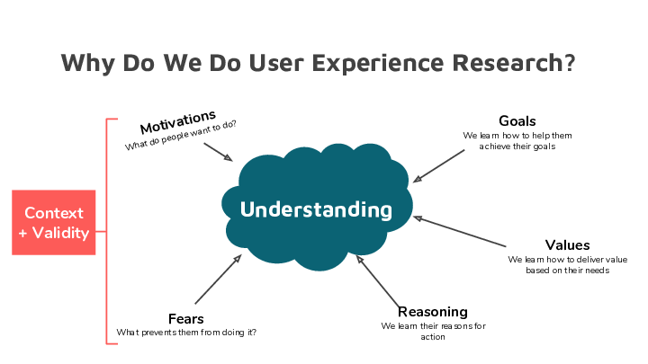
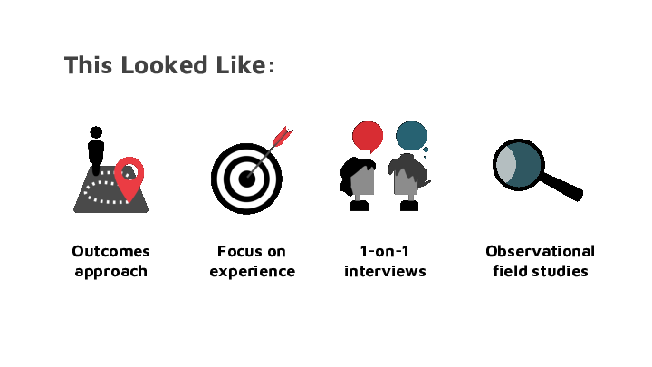

Who did we talk to?

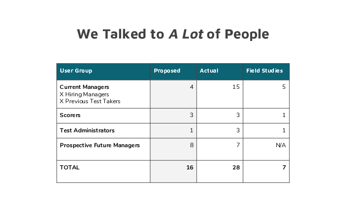
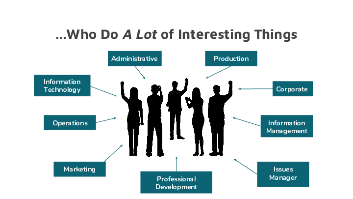
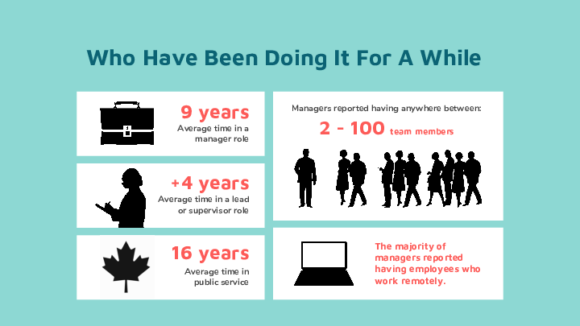
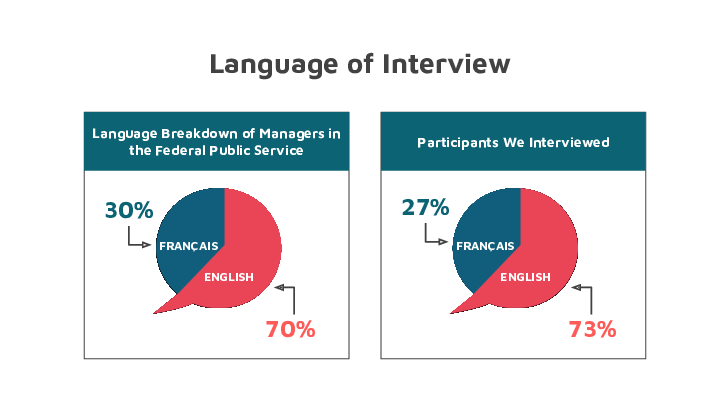
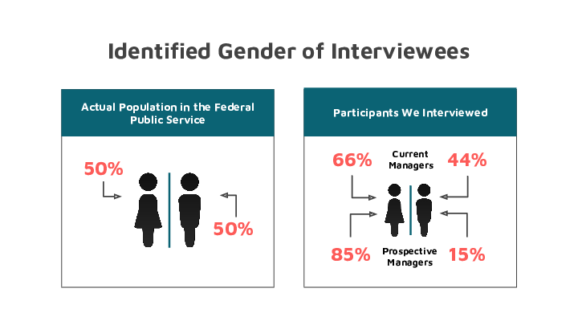
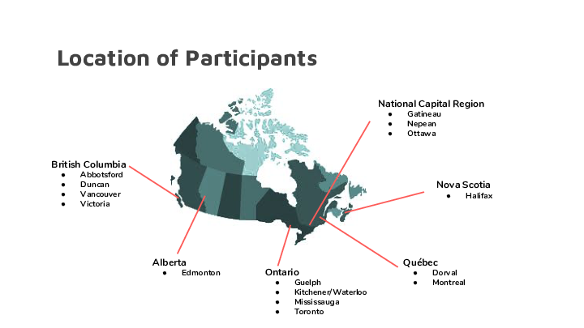
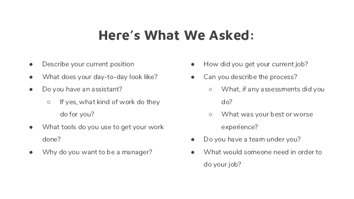

What did we learn?

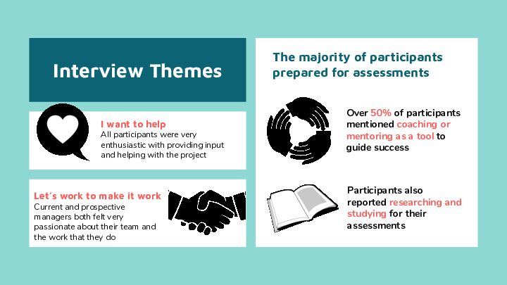
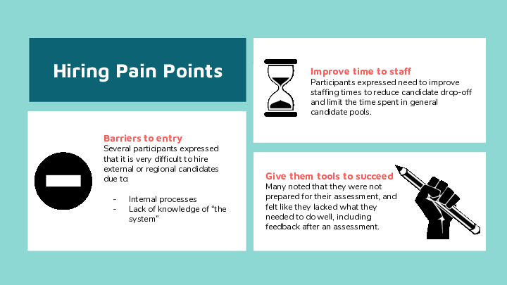
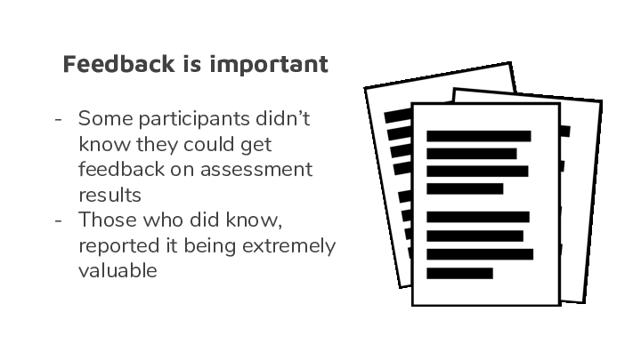
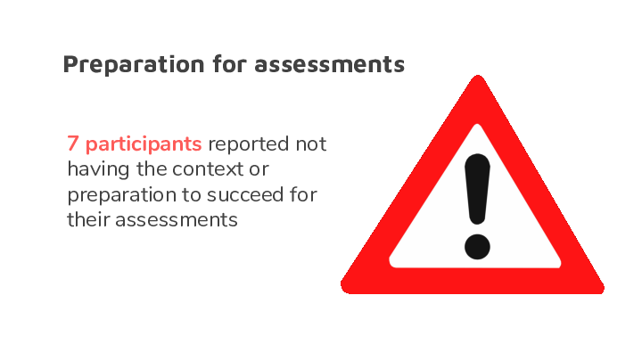
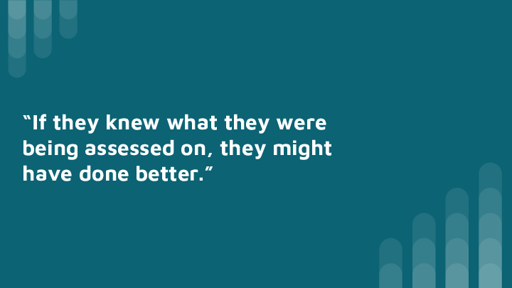
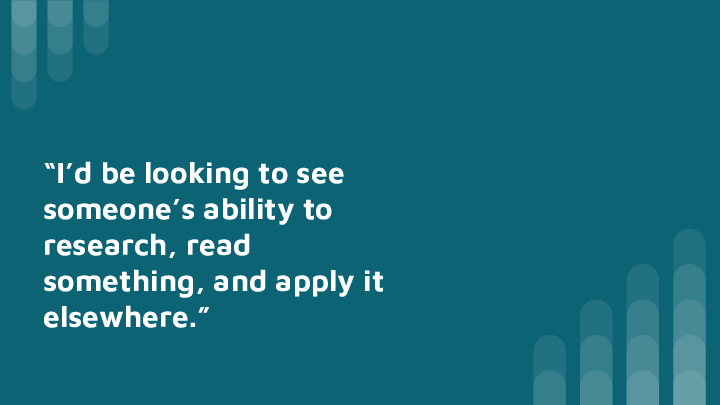
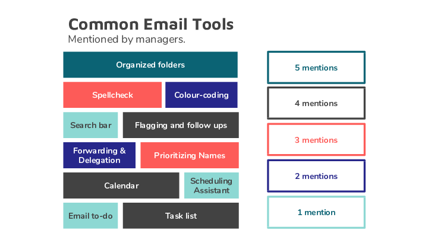
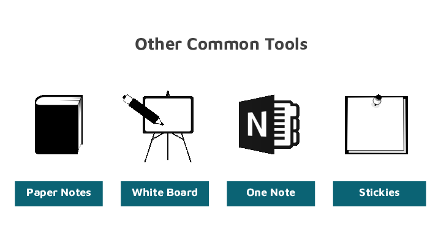

What's next for UX?

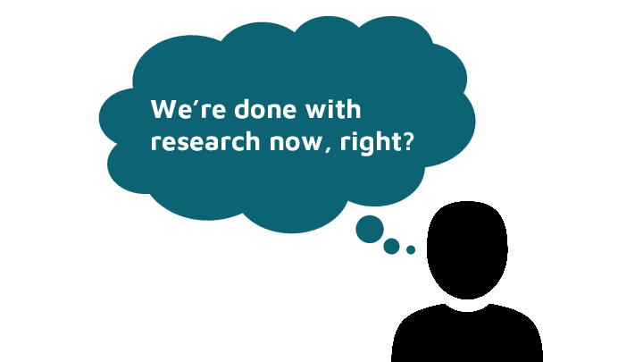

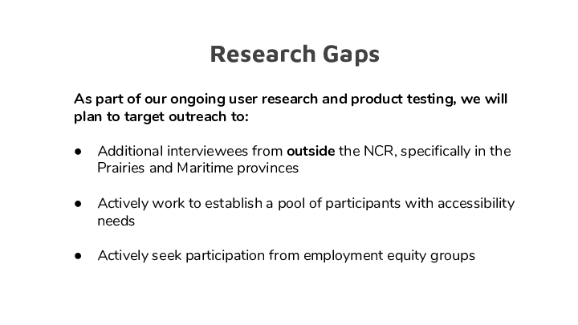

**Next**

But what happens next? To develop the best product, we believe that UXR never really stops, though it takes a different shape. We've identified some gaps in our existing research, and intend to undertake more targeted outreach to persons with disabilities, visible persons, and those living outside the national capital region. We'll also begin product testing in a few weeks. If you know someone who might be interested in this project, or if you're interested in being a part of product testing, check out our [recruitment page](https://github.com/code-for-canada/psc-partnership).
