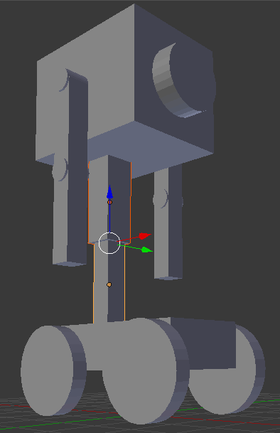
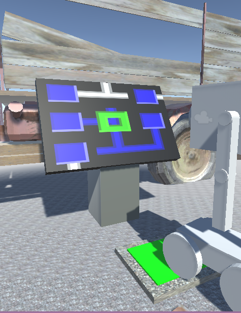

Let's finish it for now!

# Purpose and Despair

Purpose and Despaitr is a first person puzzle game.
It aims to challenge the the player by providing interesting level that needs out of the box thinking.

You are a small roboter the is stranded on a lonely planet.
The task you have to tackle is to leave th planet.

To achieve you goal you will have to learn new skills on order to complete more difficult tasks.
And if you complete your journey you might have learned your purpose or are in despair.

## Demo
- video
- graphics

## Architecture

## Analytics

In the picture you can see most of the information we collected during our test period.
We collected the following activities with these events:

| Event             | Activity                                  |
| ----------------- |-------------------------------------------|
| AchievementGained | An achievemnt is unlocked by the player   |
| ButtonsPressed	| The player uses a button                  |
| CubeSpawned	    | The player spawns a cube                  |
| DoorOpened	    | A door is opened                          |
| NetgameCompleted	| A NetGame is completed                    |
| NetgameCreated	| A new NetGameis created                   |
| PickedUp	        | The player picked up a cube               |
| SteppedUp	        | The player stepped upa stair              |

We have quickly realised that the SteppedUp event is rather useless, so we removed this event.

There have been a couple of things we learned from the analytics.
The analytics help us find problems in our code and we were able to solve them.
In the following graph you can see the amount a door is opend (orange) and the times a button is pressed (black).

What you can see is that there are way more DoorOpend events than ButtonPressed events. Currently the only way to open a door is by pressing a button. This mean, that there is a problem in the door mechanic. A door is opened multiple times per button press. We were able to resolve this problem that we found because of the analytics.

In the following graph you can see the amount an achievemnts was gained (yellow) and the amount a netgame is created. 

We can see that most of the time both graphs are the same. The reason for this is, because if you complete the first NetGame in the game, you will unlock an achievement.
this analytics gets interesting at the points where the graphs are no the same.
Currently you can unlock two different achiements. But as you can see at the 24th of  april there were three achievements and only one NetGame completion. 
There are two different NteGames in the gameworl and at the end of each, there is a different achievement.
So this is rather unusual. There should either be 3 NetGames completed or only 1 achievement gained. Interesting to note is also that a single player gained all the achievement. This can be seen if you display the number of unique users for each event (this graph is not shown here since it doesn't give any additional information).

There are two things that could have happend here. The player could have cheated and got more achievemnts that are currently in the game. We consider this to be very unlikly. Because why would you spend the time and effort to cheat more achievements that are in to game. So we discarded this thought and went on to the probable reason. There is another bug in the game that lets you gain an achievemnt multiple times. This Bug was fixed as well.

What the analytics showed us so far is that the game is not perfect (yet). They helped us improved the game and this in itself is a good gain from the analytics.
But there were a couple things we learned from the analytics game design wise.

In the above graph you can see unique player count that created a NetGame (yellow) and the unique player count that completed a Netgame.

We can see there is a difference inbetween both. This means that the Netgame was not finished by some of the players at all. If we now take a look at the graph below which has the same categories but shows the number of events rather than the unique player count. We cann see, that the player have created a lot more NetGames than they solved.

The question is why do the player not solve the first NetGame they created.
This could have a couple of reasons. First of the NetGame, that was randomly created, was too hard for them. Or the player simply didn't know how to solve it.
The NetGame of the tutorial is almost the soimplest NetGame you can create (as seen below). The only things you could do to make it easier is to make it a 2x2 NetGame. Since we would argue that the 3x3 NetGame of the tutorial is quite easy. The probable solution for this problem is to give the player more help with the NetGame and the interaction with it. Currently you only get see all the keys you can use in the game befor you started the game. We might have to consider changing this in some way. More regarding this change in the ovreall evaluation of the analytics.

The last categories we thought are interesting is achievements gained (yellow) and cubes picked up (orange) by the unique user count as well.

What we can see is that there are a couple of players, that learned the new pickup skill (the second skill) and managed to use it. But there are a some that learned the new skill but did not use it. This most likely means that they didn't knowhow to use it. This could be used with some more help that will be explained in the overall evaluation.

### Overall Evaluation of the analytics

The analytics have showed us some problems we have to tackle. The tutorial has only partially achieved the goal of teaching the player how to play. It has to be redesigned to be easier to understand. It didn't help the player enough to get them into the game, so this design pattern was used inefficiently.

The other design pattern we used were achievements. We have seen that the users earned some achievements and even unlocked multiple. Since part of the playerbase went though the entire game we would say that the achevements were successful, but in order for them to fully show there potential we need more of them and a bigger game where more of them can be earned.

After we analysied our current implementation we have the following ideas to improve the game:

We initialy didn't want any explanations in the game at all but created a displayed keymap to help the player out in the beginning. As we now know, this is not enought and we need more help for the player.
We thought about a help feature that highlights certain thing on the screen. For example if you created a NetGame but do not start to solve it in a given time, a computer mouse will be shown. This might help the player know that he has to use the mouse to solve the NetGame.
This will also be ablt to help with new skills you learned. So if you unlocked a new skill. A small schemantic of the new skill could be shown. F.e. if you learned how to pick up a cube, you will see a schemantic of a root that drives to a cube, presses "space" and lifts the cube. This schemantic will be shown as solng as the player didn't pick up a cube for the first time.

It would make sense to provide the player with these helping features even after they should lready know them. Because if you return to the gae after a breal you might now remember the keys you need. So we thought about giving the player the option to show the helps on some sort of menu or at a certain place in the game (like a traing ground for the abilities).

## Design Patterns and Achievements
- graphics

## Future Work

## Things we learned 

There were a lot of things we were able to learn during the course.
There are a couple of obvious things we learn. For example we created a unity game, which improved our C# skills since unity uses C#.
While we created new code, we had to refactor our own old code and improve it.
We were also able to learn about modeling of characters and a game world in general. There have been multiple occasions were we learned how hard it can be to create the simpleset of a level. You have to consider alot of different thing, especially the "user that wants to break stuff". 
We had to change our levels numerous times in order for them to provide the gameplay we are aiming at.
Another thing we never really thought about was the time it takes to create a 3D environment. It take way more effort than we thought.

Since we created the game with unity we were able to learn about the ins and outs of unity. Unity provides a lot of useful features, but if you are not aware of how unity does certain thing, you can ran into problems.

Since we were working in a team, we were able improve our team work skills. This started with the planning of the project. We had to communicate a lot in the group.
The use of the version control system git allowed us the efficently work together and we had the ability to tests out a couple different things using Git.
We tested out GitHub pages to create this blog, and we were impressed how easy it is. 
Another thing we were not expecting is the fast you can make your game publicly available.
We used the WebGL build feature unity provides to create a WebGL build. We were than able to upload this build GitHub pages and provide a way to play the game in a browser.
If you click  or on the "Play it Now!" button you can test it out yourself!

Next to the game itself we had to think about the user that is supposed to play the game. We weren't ablt the just code a game and call it done, we had to think about our users behavior and adapt accordingly. To help us understand our users we created some analytics.
We learned alot about creating them and how you could use them to improve the game. 
Unity provides a free, easy to use analytics service that we could enable ad use to our own liking.

## Contributions of team members

### Contribution for this post and fixes

Hermann: 5h

Tim: 5h

### Overall time investement

Hermann: 36h

Tim: 36h