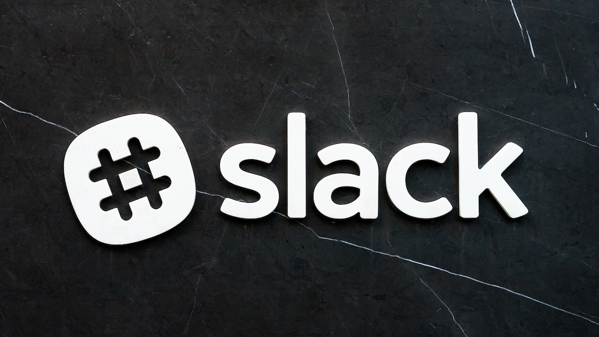

I have been using [Slack][1] quite a lot this last year for my day-to-day work.  
Late adopter as I am, I have been using it both in a geographically distributed startup as well as
a tightly-knit mature company. 

In both cases, it is a force multiplier.

The benefits it brings are [pretty][2] [well][3] [documented][4] and I will not go over them here.

What I will cover is how to easily utilize [Slack's API][5] for historical data processing.   

## The use case


> Photo by Franck V. on Unsplash

We have a long-running business-critical process.
Let's say an automatic apple tree care-taker and harvester. 
  
Upon hitting an important "milestone" or completing a task, it sends a message to Slack channel
`farm-ops`.  
For example   
`Weed removal: Starting at orchard A23`  
`Apple harvesting: Box of 30 Gala apples loaded on truck 26`

The same happens for failures which need immediate operator attention.  
For example  
`@here Failure of harvester John Deere 25, orchard B5. Operator attention required`

Having the process running for a period of time, we have the questions:
* _Are failures happening more often?_
* _Is there a correlation with the harvester type?_
* _Is there a correlation with the orchard location?_     

Let's get cracking!

## Slack API


> Photo by Taskin Ashiq on Unsplash

The API endpoint for searching messages is... umm, the [`search.messages`][6] endpoint.  
What a surprise! :-)

There are 3 things to note in this method:  
* `query`  
This is the text you are looking for, plus any other filters (e.g. dates).  
Check the extensive docs on the [Slack query language][7]. 
* pagination  
Results will come in pages, to save bandwidth.  
If you want to iterate through them, you need to utilize the pagination handles.
* sorting  
Last but not least, decide how you want to scroll through the messages.

Here is the anatomy of the JSON search result  
```
{
    "ok": true,
    "query": "\"some text\" in:my-channel",   -> what we searched for
    "messages": {
        "total": 158,
        "pagination": {
            "total_count": 158,               -> total pages of results
            "page": 1,                        -> current page
            "per_page": 20,
            "page_count": 8,
            "first": 1,
            "last": 20
        },
        "paging": {
            "count": 20,
            "total": 158,
            "page": 1,
            "pages": 8
        },
        "matches": [
            {
                "iid": "ff78fa59-ce6f-4714-901a-XXX",
                "team": "TEAM",
                "channel": {                  -> channel information
                    "id": "C126MA0QM",
                    "is_channel": true,
                    "is_group": false,
                    "is_im": false,
                    "name": "my-channel",
                    "is_shared": false,
                    "is_org_shared": false,
                    "is_ext_shared": false,
                    "is_private": false,
                    "is_mpim": false,
                    "pending_shared": [],
                    "is_pending_ext_shared": false
                },
                "type": "message",
                "user": "Foo",                 -> user wo sent the message
                "username": "someone",
                "ts": "1558001085.186500",     -> epoch timestasmp in seconds plus a unique counter
                "text": "Hello. This is some text!",
                "permalink": "https:\/\/my-workspace.slack.com\/archives\/C126MAFOO\/p1558001085186500"
            },
            ...
        ]
    }
}    
```

## ...with a token 


> Photo by Scott Webb on Unsplash

To call the API you need to 
* create a Slack application
* install it in your workspace
* ...and generate the OAuth token.

To create the application, go to [Slack's apps page][8] and click `Create New App`.  
Pick the right workspace where it lives in, if you belong to more than one.  
This is the workspace from where you will be able to make changes to the app's settings. 
This is important if you plan to share the same app between multiple workspaces.

After it has been created, you edit its features.  
The only thing we are interested here are the permissioned [OAuth scopes][9], which will allow
us to call the different endpoints. In our case, the scope in question is `search:read`.

Finally, you need to install the app in your workspace.  
If you are not the workspace's admin, then a request is generated for them to approve.
You do not need to worry about distribution, unless you plan to use it from multiple workspaces.   
Once the app is added, you can access the OAuth token.

## ...and some code


> Photo by Chris Ried on Unsplash

Tempted as you might be to write one yourself, Slack has published a number of client libraries 
in various languages.  
I will use the [Python library][10] in a simple script. 

_The code can be found on [Github][11]._

We are going to generate a CSV with 5 columns:  
* UTC timestamp in ISO format
* machinery type, e.g. 'harvester'
* machinery make, e.g. 'John Deere 25'
* farm type, e.g. 'orchard'
* farm id, e.g. 'B5'
 
First we need the query string.  
From the problem description, something like `"Operator attention required" in:farm-ops` will do just fine.

Then once we have located the messages in question we need to extract the fields.  
A regexp pattern will work for now: `\<\!here\> Failure of (\w+) (\w\s)+\, (\w+) (\w+)\. Operator attention required`.
Note how `@here` needs to change in the search string.

We need to initialize the Slack client passing the API token.  
Reading it from an env var will do in this simple example.  
```python
slack_token = os.environ["SLACK_API_TOKEN"]
sc = SlackClient(slack_token)
```

Calling an API endpoint requires passing the name of it to the `api_call` method, along with the URL
parameter key/value pairs.  
```python
results = sc.api_call(
    "search.messages",
    query = 'Operator attention required in:farm-ops',
    sort = "timestamp",
    sort_dir = "asc",
    page = current_page 
)
has_matches = len(results['messages']['matches'])
total_pages = results['messages']['pagination']['page_count']
current_page = current_page + 1

msg_processor(results['messages']['matches'])
```  
We can use the size of the `messages.matches` array as an indication of whether we have reached the end of the resultset.
`page_count` is helpful in case we want to display progress.

Once we have our messages (the items in the `matches.messages` array), we can process them.  
```python
def msg_processor(message_matches):

    for msg in message_matches:
        # timestamp format: 1554287378.728900
        int_ts = int(msg['ts'].split('.')[0])
        utc_ts = datetime.utcfromtimestamp(int_ts)
        
        # extract full ISO-8601
        ts = utc_ts.isoformat()
        
        # extract fields from message
        msg_match = re.search(MSG_PATTERN, msg['text'], re.IGNORECASE)
        machinery_name = msg_match.group(1) if msg_match else ''
        machinery_make = msg_match.group(2) if msg_match else ''
        farm_type = msg_match.group(3) if msg_match else ''
        farm_id = msg_match.group(4) if msg_match else ''
        
        print_out(','.join([ts, machinery_name, machinery_make, farm_type, farm_id]))
```

And that's pretty much it!  
When the script runs, we will have our results in a nice CSV, ready for analysis in the tool of our
choice.

You can view the full script and clone [here][11].

## Parting thought


> Photo by NeONBRAND on Unsplash

Slack is a versatile and mature communication tool.  
Its open API and large number of apps and integrations allow for some extremely interesting use cases 
even on the free plan.   


   [1]: https://en.wikipedia.org/wiki/Slack_(software)
   [2]: https://www.linkedin.com/pulse/slack-chatops-revolution-dinis-cruz/
   [3]: https://www.ibm.com/cloud/garage/practices/manage/chatops/tool_slack
   [4]: https://www.quora.com/How-useful-is-Slack-for-a-small-business
   [5]: https://api.slack.com/methods
   [6]: https://api.slack.com/methods/search.messages
   [7]: https://get.slack.help/hc/en-gb/articles/202528808-Guide-to-search-in-Slack-#understand
   [8]: https://api.slack.com/apps
   [9]: https://api.slack.com/docs/oauth-scopes
   [10]: https://github.com/slackapi/python-slackclient
   [11]: https://github.com/sgerogia/slack-search-example