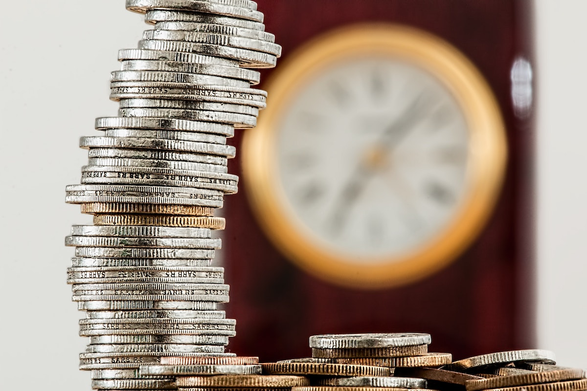
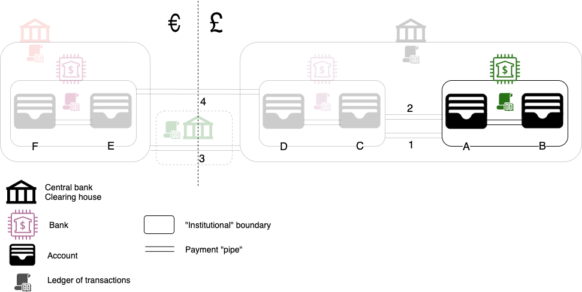
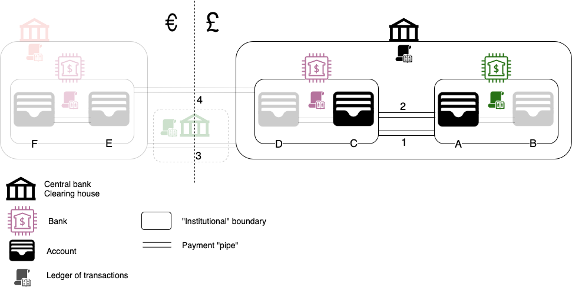
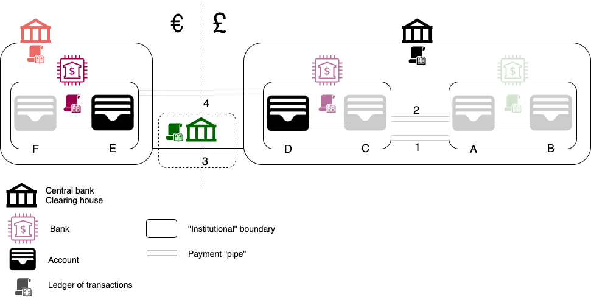
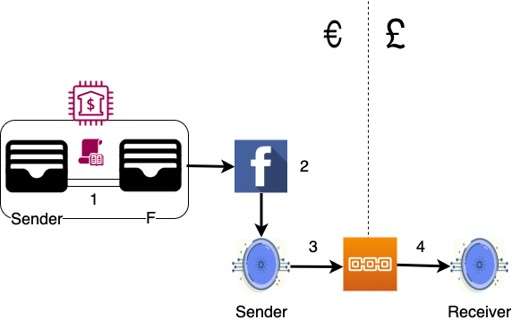

## Please, take my money! 

> Photo by Chris Karidis on Unsplash

You are on holiday in another country
want to buy a coffee 
get your card out, swipe or type your pin and presto! 
coffee paid for your enjoyment

Congratulations, you just participated in the modern marvel of payments
The simple action described above requires levels upon levels 
of financial structures
This post will attempt to give a high level intro on the "what", the "how" and, 
when possible, the "why" of modern payment systems.
    
<!--more-->

## Can I has payment?

### Some definitions

> Photo by Pixabay on Pexels

Let's start with the very basics: what is a payment?  
According to [Wikipedia][1]   
> A payment is the trade of **value** from one party (such as a person or company) to another...

How do we define "value"?  Again, [Wikipedia][2] helps us with  
> Economic value is a measure of the benefit provided by a good or service to an economic agent. 
> It is generally measured relative to units of currency...

Yet another term: currency. We [have][3]  
> ...a currency is a system of money (monetary units) in common use... recognized as stores of value...

Slightly cyclical definition 
but becomes clear that the transfer of value in a payment is *facilitated* by a currency (a.k.a. money)
In other words, exchanging "money" is not a goal in itself 
rather it simply helps in the process, provided that both parties recognize money as value[1](#footnote_1)

### In the olden days...

> Photo by Jordan Rowland on Unsplash

Once upon a time 
transactions and payments would take place in person
starting in the pre-historic times with [barter][4] 
mankind quickly had to move to a separate form of money[2](#footnote_2) 
 
The role of money was eventually filled in by precious metals: gold and silver
Precious metals (gold and at a lesser extent silver) [possess a lot][7] of very [interesting properties][6] which make 
them a great fit as an economic medium

the replacement of barter with precious metals as units of exchange 
still required the physical presence and transfer of gold to make a payment
This is not as easy as it sounds, especially in ancient times with an armed bandit behind every bush

[Merchant][8] and [Templar Knight promisory notes][9] on one hand  

and their logical next step [paper money][10] 

introduced 2 new concepts:
* an alternative medium for the transfer of value in space (in this case paper)
This acts in lieu of the "real thing"[3](#footnote_3)
* a trusted third party facilitating the flow of value
The trust component being that the third party (merchant, Knight Templar, emperor, central bank) will make good on the promise 
to deliver the gold, as "written" on the piece of paper

## Money vs. Currency

going back in time and introducing these basic principles as they emerged
allows us to examine today under a much clearer lens and a much brighter light

2 terms which are used interchangeably: money and currency 
With the slight danger of [splitting hairs][11] 
I will make a distinction between the 2, which I believe is useful 

### Money  
money is something which 
* has value in and of itself
* is a facilitator of financial transactions, and 
* is globally (or at least very widely) recognised as such
The archetypal type of money is precious metals (gold, silver)
where the value is derived by the capital and resources [spent in extracting it][12] from the ground 

as a side-note 
the major [proof of work][13] [cryptocurrencies][14] are also a digital approximate of money 
due to the ever-increasing [capital and operational expenditure][15] required to [mine][16] them

### Currency

On the other hand, currency (in the current [definition of the word][3]) is a medium of exchange
within a bounded economic area, such as a country. 
It is the accepted medium of exchange (many times the only [de jure][17] medium) 

In the modern era, until 1971, the world currency system was underpinned by [precious metals][18] 

From that point on modern currencies (a.k.a fiat money) are only backed by the credibility of their issuing authority[4](#footnote_4)
(government or central bank) 
In much simpler words currency is a promise, 
it is someone else's liability to make good on this promise

if we were to wrap this section up   
> Money is currency.  
> Currency is not necessarily money.

## Back to payments

> Photo by Shukhrat Umarov on Pexels

If one was to depict the global system of payments in a layman way 
it would look a lot like a sequence of "barrels" filled up with "liquid" in a storage room 
these barrels are submerged within larger barrels, which are within even larger ones and so on 
there are a number of different hierarchies of containers in the same room, each one containing a different type of liquid
the containers at the various levels are interconnected with one or more "pipes" allowing the liquid to flow through
Each of these pipes is equipped with one or more "meters" to measure the flow each way

* Liquid is currency
* The barrels are the various structures which can hold currency (from inner- to outer-most): bank account, commercial bank, central bank  
* pipes are the ways of facilitating the transfer of currency between accounts and banks.  
These are called [payment][20] or settlement systems 
* meters are the facilities to keep track of what is moved where and by whom
At their heart these are [double-entry ledgers][21]

There are 2 differences of the global payments system from the mental model of "barrels of liquid" 

* is that currency (the liquid) does not physically "move" down the pipes from one account/bank to the other[5](#footnote_5)
What actually travel are messages of various [types][22] which result in the ledgers (the meters) recording new transactions 
and balances 
in other words, value in the banking world is purely virtual and electronic 
* 

putting everything together in one nice and complex diagram 

Instead of explaining all lines and boxes
let's see how things interact with a few examples

### Intrabank payment

### Interbank payment

### International payment - Central bank clearing

### International payment - Nostro/vostro

### Some comments

delays 
[credit and debit messages][23] between banks are almost instant
even [around the world][24]  
but processing them is slow 
settlements are at end of day
the more hops further away the slower the settlements

payments are primarily "push"
the payer sends money to the payee
the payer's responsibility to give the receiver account "coordinates" (i.e. bank account number) correctly

banks around the world treat international payments differently 
due to [KYC][25], [AML][26] and systems' design 
requiring different levels of detail (e.g. account owner name, address, etc) 
 
the more data points required as input the highwer the possibility for mistakes in account numbers 
surprisingly large number of manual processing and corrections

## Payment rails 

### Cards & mobile

### Remittance services

## ...and the future

### Digital IOUs

#### Libra

### Government cryptocurrencies

### Proof-of-work money 

## Parting thoughts

> Photo by Maxime Lebrun on Unsplash

Money not only makes the world go round 
but also goes around the world 
trillions of times

from the ancient in-person gold-in-hand transactions 
we have evolved into complex currencies and complex structures 
we seem to be going back in full circle 

## Footnotes

1. If someone came to you to buy your house with a handful of green beads and shiny mirrors, you
would probably say no. That is because you may not attribute so much value to them as this imaginary buyer thought.  
2. Money here refers to the [archetypal meaning and definition of the word][5]. If money is not there 
you end up having to figure out how to buy something with 3.5 live sheep.  
3. The "real thing" being the gold or silver sitting in the emperor's or Knight Templar's vault.
4. An extreme example to clarify this point: The people of North Korea are perfectly "happy" to 
be using the [won][19] as a medium of exchange. Their government's credibility is (literally!) a matter of life and death 
to them. How much value would *you* put on a won banknote and why?
5. If we make a payment from Japan to the U.S. at no point in time will anyone put yen bank notes
(or anything else) in a box and send them over the ocean to complete the transaction. 

  [1]: https://en.wikipedia.org/wiki/Payment
  [2]: https://en.wikipedia.org/wiki/Value_(economics)
  [3]: https://en.wikipedia.org/wiki/Currency
  [4]: https://dictionary.cambridge.org/dictionary/english/barter
  [5]: https://www.sparknotes.com/economics/macro/money/section1/
  [6]: https://www.goldmoney.com/research/goldmoney-insights/golds-natural-monetary-properties
  [7]: https://www.weforum.org/agenda/2019/07/why-gold-is-money-a-periodic-perspective/
  [8]: https://en.wikipedia.org/wiki/History_of_money#400%E2%80%931450
  [9]: https://www.bbc.co.uk/news/business-38499883
  [10]: https://en.wikipedia.org/wiki/History_of_money#Banknotes
  [11]: https://www.collinsdictionary.com/dictionary/english/split-hairs
  [12]: https://www.theglobeandmail.com/globe-investor/investment-ideas/how-much-does-it-really-cost-to-mine-an-ounce-of-gold/article20709844/
  [13]: https://cointelegraph.com/explained/proof-of-work-explained
  [14]: https://en.wikipedia.org/wiki/Cryptocurrency
  [15]: https://www.thebalance.com/can-bitcoin-mining-make-a-profit-4157922
  [16]: https://www.bitcoinmining.com/
  [17]: https://en.wikipedia.org/wiki/Legal_tender
  [18]: https://en.wikipedia.org/wiki/Bretton_Woods_system
  [19]: https://en.wikipedia.org/wiki/North_Korean_won
  [20]: https://en.wikipedia.org/wiki/Payment_system
  [21]: https://en.wikipedia.org/wiki/Double-entry_bookkeeping_system
  [22]: https://www.iso20022.org/payments_messages.page
  [23]: https://www.swift.com/
  [24]: https://www.investopedia.com/articles/personal-finance/050515/how-swift-system-works.asp
  [25]: https://en.wikipedia.org/wiki/Know_your_customer
  [26]: https://www.investopedia.com/terms/a/aml.asp