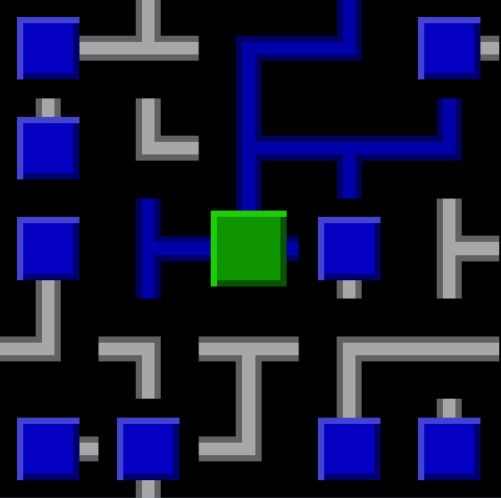
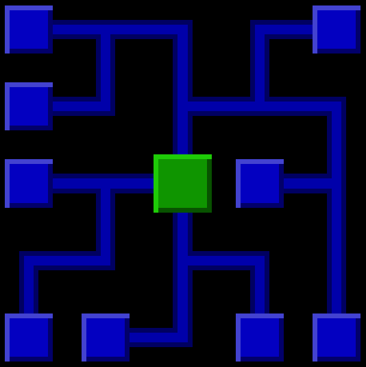
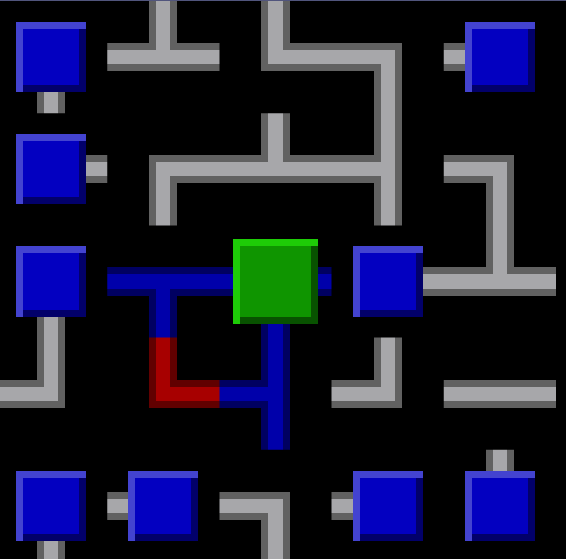

Introducing our 2D puzzle, which the robot needs to solve in order to upgrade itself.

## Why?

In order to be able to repair a rocket and escape from the garbage planet, our little robot needs to upgrade itself.
This involves finding parts and training its brain to put these parts together.
For this brain-training a puzzle needs to be solved, one that requires the player to basically *connect* all the dots; all pieces are already there, they just need to be put in the right order for it to *click*.

## What?

The puzzle to be solved is a game called "NetWalk" originally developed for Windows 95.
You have a grid consisting of wires, terminals (blue square) and servers (green).
Power runs from serves through the wires to terminals.
The goal is to have power flowing through each terminal and each wire without creating cycles.
In order to achieve this, the player can rotate elements.
So at first the player is confronted with something like this:

A real mess of a network, there are some wires powered as random decides to rotate them in this way.
With a bit of time and thinking the player can then produce the one unique solution which looks a little something like this:

But pay attention! Don't short your circuit by creating cycles:

This isn't healthy and won't solve the puzzle!

## How?

The game in its current state (at the time of this post) can generate any size of puzzle with one or more servers in the puzzle, the player cannot yet play as their only interaction - rotation pieces is not yet implemented. It is planned to be put as panel somewhere in the 3D world of the rest of PurposeAndDespair.

### Game logic

The game logic is implemented as completly separated piece of code, it can be ported to any C# platform and thus one could create e.g. daily puzzle for all players as challenge.

The generation algorithm creates tile for a tile a spanning tree by placing servers and then randomly selecting a new place for a branch to grow on. It is guaranteed to never have tiles that are without any connection or with connections to all side (as they could not be rotated)

### Unity integration

The current unity integration uses a tilemap renderer in an offscreen environment. Thus the game should not lag disregarding how big the puzzle gets.
A small script converts the NetGame tile types and their power status to Unity tiles consisting of a sprite (out of a small sprite sheet) and its transform.
Lattern can be used to animate the rotation by the player.
With the camera rendering offscreen, the resulting texture can be applied to any old 3D object in the "real" world of PurposeAndDespair.
