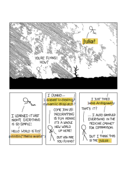

I have been playing around with the [Julia language](https://julialang.org) for about a year now (just before the stable version was released). During that year, I've been converted from a skeptic (did not catch the bug during my stay at the [Poisotlab](https://poisotlab.io/)) to an enthousiast! It is not only about the speed of native Julia code, though this alone would make it worth learning, but just the general pleasure of programming in this language. The type system central to Julia is just something which clicks to me as a scientist in a way that, for example, classes never clicked with me. Here I would like to show two case studies, relevant to the scientific programmer, which I think really demonstrate how natural it is to extend Julia and write powerful, generic code.

## Automatic uncertainty propagation

During my first year of college, I really liked the physics lectures because everything was exact. In my first year of physics, I really disliked the physics labs, because everything was messy. First-year physics labs are generally disliked partially because of the uninspiring topics (measuring resistance in a wire! determining a heat transfer coefficient! measuring chirality of sugar!) and partly because this was the only lab in which 'exact' measurements had to be performed. These labs introduced the complex and unexplained rules for measurement error propagation. Without any prior statistics or probability courses, it was lost on me where these strange rules originated from, as sharp contrast to nearly everything else in physics.

A year later, after plowing through a basic probability course, error propagation is less mysterious. Almost all these rules to account for the error can be derived from a simple principle:

> Given two **independent** random variables $$X$$ and $$Y$$, the variance of a linear combination $$\text{Var}[aX+bY]=a^2\text{Var}[X] + b^2\text{Var}[Y]$$.

Measurement errors are usually given by a standard deviation, the square root of the variance. Given this principle, error propagation is merely bookkeeping of the standard error on the measurement for various computations.

Instead of processing the measurements and the standard error separately, suppose we could just make a new type of number which contains both the observed value and its uncertainty. And suppose we could just compute something with these numbers, plugging them into our formulas where the error is automatically accounted for using the standard error propagation rules. In Julia, it is dead simple to construct such new numbers and just overload existing functions such that they compute in the correct way.

Let us make make a new type of structure `Measurement` which holds a value `x` and a (positive) measurement error `σ`.


```julia
struct Measurement
    x::Real
    σ::Real
    function Measurement(x, σ)
        if σ < zero(σ)
            error("Measurement error should be non-zero")
        end
        new(x, σ)
    end
end
```

We also define a function to extract the value and error from instances of the type `Measurement`. This is similar to how the real and imaginary part of a complex number are extracted. Furthermore, we modify Julia's behavior such that instances are printed as `x ± σ`.


```julia
val(m::Measurement) = m.x;
err(m::Measurement) = m.σ;
```


```julia
Base.show(io::IO, measurement::Measurement) = print(io, "$$(measurement.x) ± $$(measurement.σ)");
```

An intuitive syntax is to make a new binary operator `±` that adds the measurement error to a measured value, thus creating a `Measurement` instance.


```julia
±(x, σ) = Measurement(x, σ);
```


```julia
m = 9.0 ± 0.3
```


    9.0 ± 0.3


Now that we constructed the `Measurement` type, let us tell Julia how to compute with it. We can easily implement the standard [uncertainty propagation rules](https://en.wikipedia.org/wiki/Propagation_of_uncertainty#Example_formulae).


```julia
# scalar multiplication
Base.:*(a::Real, m::Measurement) = a * m.x ± abs(a) * m.σ;
Base.:/(m::Measurement, a::Real) = inv(a) * m;
# adding and substracting measurements
Base.:+(m1::Measurement, m2::Measurement) = (m1.x + m2.x) ± √(m1.σ^2 + m2.σ^2);
Base.:-(m1::Measurement, m2::Measurement) = (m1.x - m2.x) ± √(m1.σ^2 + m2.σ^2);
Base.:-(m::Measurement) = -m.x ± m.σ;
# adding a constant
Base.:+(m::Measurement, a::Real) = m + (a ± zero(a));
Base.:+(a::Real, m::Measurement) = m + a;
# multiplying two measurments
Base.:*(m1::Measurement, m2::Measurement) = m1.x * m2.x ± (m1.x * m2.x) * √((m1.σ / m1.x)^2 + (m2.σ / m2.x)^2);
```

For example:


```julia
2m
```


    18.0 ± 0.6


```julia
m + 1.2
```


    10.2 ± 0.3


```julia
(12 ± 0.3) * (18 ± 0.8)
```


    216 ± 11.014535850411491


```julia
m / 4
```


    2.25 ± 0.075


For nonlinear functions, we can compute an approximate uncertainty propagation using a first-order Taylor approximation. We have, for any function $$f(x)$$:

$$
f(x\pm \sigma) \approx f(x) \pm |f'(x)|\sigma\,.
$$

For example, for squaring a function, we have

$$
(x\pm\sigma)^2 = x^2 \pm 2|x|\sigma\,.
$$

Note that this is consistent with the above rules for multiplication. Let us implement the general formula for raising a measurement to the power $$p$$.


```julia
Base.:^(m::Measurement, p::Integer) = m.x^2 ± abs(p*m.x^(p-1) * m.σ);
```


```julia
m^2
```


    81.0 ± 5.3999999999999995


We can implement this for all the standard mathematical functions one by one. However, Julia provides use with two efficient tools to do this in one swoop: automatic differentiation and metaprogramming. We just loop a list of functions of interest and automatically generate the correct approximate rule.


```julia
using ForwardDiff

for f in [:sin, :cos, :tan, :exp, :log, :log2, :log10, :sqrt, :inv]
    eval(quote
        # this is a line of code generated using string interpolation
        Base.$f(m::Measurement) = $f(m.x) ± abs(ForwardDiff.derivative($f, m.x) * m.σ)
    end)
end
```


```julia
cos(m)
```


    -0.9111302618846769 ± 0.12363554557252697


```julia
log(m^2)
```


    4.394449154672439 ± 0.06666666666666665


```julia
2log(m)  # same
```


    4.394449154672439 ± 0.06666666666666667


Let's apply this to in a somewhat realistic setting. Many methods in analytical chemistry are based on the law of [Beer-Lambert](https://en.wikipedia.org/wiki/Beer%E2%80%93Lambert_law). This law relates the absorption of a ray of light passing through a cuvet with the concentration of a solution. For a given reference intensity $$I_0$$ at concentration of 0 and a lower intensity $$I$$ when it passes through a solution of concentration $$c$$, we have

$$
\log \left(\frac{I_0}{I}\right) = \varepsilon c l\,,
$$

with $$\varepsilon$$ the molar extinction coefficient and $$l$$ the thickness of the cuvet.

Suppose we want to determine the extinction coefficient for some substance, using a cuvet of thickness $$0.02\pm 0.001$$ and a reference solution of a concentration of $$0.73\pm 0.02$$ M.


```julia
c = 0.72 ± 0.02
l = 0.02 ± 1e-4
```


    0.02 ± 0.0001


We perform some intensity measurements, with associated measurement errors.


```julia
I0 = [0.8 ± 0.07, 1.1 ± 0.11, 1.2 ± 0.08]
I1 = [0.2 ± 0.12, 0.3 ± 0.08, 0.2 ± 0.3]
```


    3-element Array{Measurement,1}:
     0.2 ± 0.12
     0.3 ± 0.08
     0.2 ± 0.3


Some straightforward manipulations of the Beer-Lambert formula allows us to compute an estimate of $$\varepsilon$$. Since the estimator only uses operations which allow the uncertainty propagation, the estimate directly gives the value with the standard error.


```julia
mean(x) = sum(x) / length(x)
ε = log(mean(I0) * inv(mean(I1))) * inv(c) * inv(l)
```


    103.33868440484952 ± 33.327646598494475


We can then subsequently use this molecular extinction in further computations, for example to estimate new concentrations, directly with confidence intervals!

## General $$n$$-dimensional convolutions

The flexibility of Julia makes it easy to write general, but highly optimized code. One aspect, I really like is its indexing system. When you get the hang of it, you will never complain again about the 1-based indexing!

Consider an array:


```julia
A = rand(3, 5)
```


    3×5 Array{Float64,2}:
     0.270625  0.397293  0.348364   0.241978   0.424326
     0.850476  0.213356  0.609399   0.0948646  0.665579
     0.789739  0.435704  0.0511797  0.211703   0.586431


Julia's arrays are column major, rather than row major as in Numpy. This means that you should see a matrix as a set of columns, not a set of rows. This is important, when processing matrices, as processing matrices row by row can be substantially slower than processing them column by column.


```julia
using BenchmarkTools

function sum_row_by_row(A)
    result = 0.0
    for i in 1:size(A, 1)
        for j in 1:size(A, 2)
            result += A[i,j]
        end
    end
    return result
end

function sum_col_by_col(A)
    result = 0.0
    for j in 1:size(A, 2)
        for i in 1:size(A, 1)
            result += A[i,j]
        end
    end
    return result
end

B = randn(5000, 5000);  # bigger matrix to illustrate
```


```julia
@btime sum_row_by_row($$B)
```

      164.997 ms (0 allocations: 0 bytes)


    6479.463039431909


```julia
@btime sum_col_by_col($$B)
```

      27.304 ms (0 allocations: 0 bytes)


    6479.463039430924


Not a bad speedup by just switching the order of the two loops! The order of the elements can be accessed using `LinearIndices(A)`. This will generate a matrix of the same size of `A`, containing the index of all elements.


```julia
LinearIndices(A)
```


    3×5 LinearIndices{2,Tuple{Base.OneTo{Int64},Base.OneTo{Int64}}}:
     1  4  7  10  13
     2  5  8  11  14
     3  6  9  12  15


When indexing over an array, such an object can be generated and used to process the array. It seems incredible wasteful, but upon compiling the function this is completely optimized away, so it has no memory footprint!


```julia
function sum_lin_ind(A)
    L = LinearIndices(A)
    result = 0.0
    for I in L
        result += A[I]
    end
    return result
end

@btime sum_lin_ind($$B)
```

      27.468 ms (0 allocations: 0 bytes)


    6479.463039430924


In many cases, `CartesianIndices(A)` is more useful, this will generate an array of the same size, but containing the `CartesianIndex` instances. These hold the indices of the corresponding elements and are in general easier to work with.


```julia
CartesianIndices(A)
```


    3×5 CartesianIndices{2,Tuple{Base.OneTo{Int64},Base.OneTo{Int64}}}:
     CartesianIndex(1, 1)  CartesianIndex(1, 2)  …  CartesianIndex(1, 5)
     CartesianIndex(2, 1)  CartesianIndex(2, 2)     CartesianIndex(2, 5)
     CartesianIndex(3, 1)  CartesianIndex(3, 2)     CartesianIndex(3, 5)


The important thing the note is that this all works agnostic on the dimensionality of the arrays. Whether `A` has one, two, three of $$n$$ dimensions, it all works the same.

I will illustrate this by writing a small piece of code for performing a general convolution, regardless of the dimensionality of `A`. With minor modifications, this can be a versatile building block for many interesting numerical algorithms.


```julia
function generalconvolve!(A::AbstractArray, out, W, f=(v,a)->v)
    @assert size(A) == size(out)
    @assert all(size(W) .% 2 .== 1)  # all dimensions of W odd
    C = CartesianIndices(A)
    Ifirst, Ilast = first(C), last(C)
    I1 = oneunit(Ifirst)
    width = CartesianIndices(W)[div(length(W)+1, 2)] - I1
    for I in (Ifirst+width):(Ilast-width)
        value = 0.0
        for (J, w) in zip((I-width):(I+width), W)
            value += w * A[J]
        end
        out[I] = f(value, A[I])
    end
    return out
end

function generalconvolve(A::AbstractArray, W, f=(v,a)->v)
    out = copy(A)
    return generalconvolve!(A, out, W, f)
end
```


    generalconvolve (generic function with 2 methods)


This function has as inputs:
- `A`: a general array;
- `W`: a smaller array with the same number of dimensions to do the convolution;
- `f`: a function to transform the convolved values, with the convolution result and the original value as input. The identity map is the result, but this can be used for more complex methods.

### Kernel smoothing

Let us start with a basic example from statistics: [kernel smoothing](https://en.wikipedia.org/wiki/Kernel_smoother). In the most simple case, we have some noisy vector $$\mathbf{x}$$ and we want to denoise it by taking a moving window average: the value at every point is replaced by a local average. Given a bandwidth of $$p$$ (taking the average of the elements $$x_{i-p}, x_{i-p+1},\ldots x_{i-1}, x_{i}, x_{i+1},\ldots, x_{i+p-1}, x_{i+p}$$ for at every position $$i$$) is done by setting an appropriate value of `W`.


```julia
kernelsmoothing(x::AbstractVector; p::Int=3) = generalconvolve(x, ones(2p+1) / (2p+1));
```


```julia
# generate a noisy signal
t = 0:0.01:3
x = exp.(t) .* sin.(t) + randn(length(t));
```


```julia
using Plots

plot(t, x, label="signal")
plot!(t, kernelsmoothing(x, p=10), label="smoothed signal")
xlabel!("t")
```


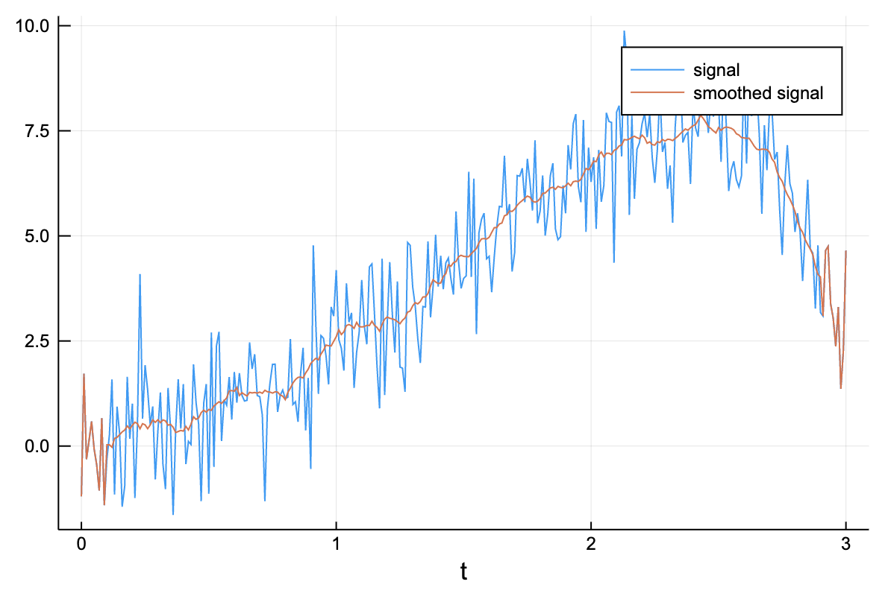


Of course, other kernels can be used just as easily, as long as `W` is a proper probability density function. This way, a decayed importance can be placed on values farther from the center.

### Image gradients

Moving to two dimensions we can implement some basic image processing! To compute the gradient of an image (i.e. how the pixel values change locally in the $$x$$ or $$y$$ direction we just use the correct convolution.


```julia
image_grad_x(image::Matrix) = generalconvolve(image, [-1 0 1; -1 0 1; -1 0 1] / 6)[2:end-1,2:end-1];
image_grad_y(image::Matrix) = generalconvolve(image, [-1 -1 -1; 0 0 0; 1 1 1] / 6)[2:end-1,2:end-1];
```


```julia
A = reshape([2.5x - 0.1y^2 + 2*x*y for x in 1:7 for y in 1:10], 10, 7)
```


    10×7 Array{Float64,2}:
      4.4   8.9  13.4  17.9   22.4   26.9   31.4
      6.1  12.6  19.1  25.6   32.1   38.6   45.1
      7.6  16.1  24.6  33.1   41.6   50.1   58.6
      8.9  19.4  29.9  40.4   50.9   61.4   71.9
     10.0  22.5  35.0  47.5   60.0   72.5   85.0
     10.9  25.4  39.9  54.4   68.9   83.4   97.9
     11.6  28.1  44.6  61.1   77.6   94.1  110.6
     12.1  30.6  49.1  67.6   86.1  104.6  123.1
     12.4  32.9  53.4  73.9   94.4  114.9  135.4
     12.5  35.0  57.5  80.0  102.5  125.0  147.5


```julia
heatmap(A)
```


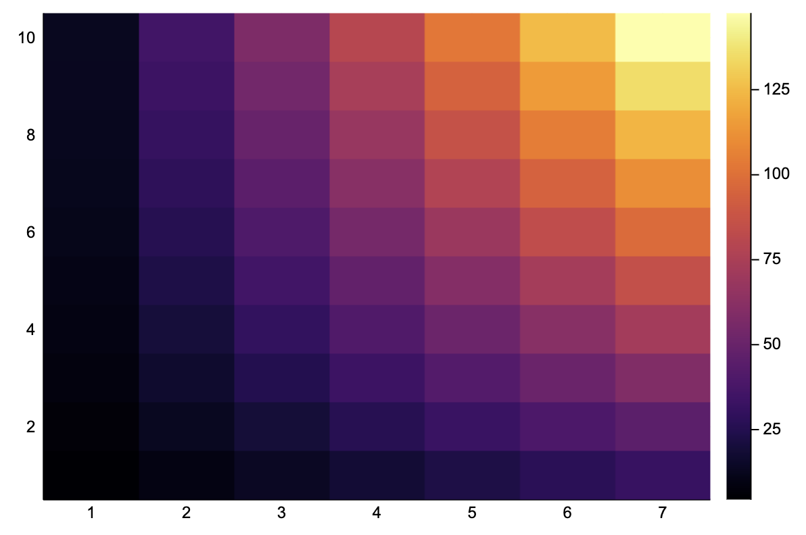


```julia
Ax = image_grad_x(A)
```


    8×5 Array{Float64,2}:
      6.5   6.5   6.5   6.5   6.5
      8.5   8.5   8.5   8.5   8.5
     10.5  10.5  10.5  10.5  10.5
     12.5  12.5  12.5  12.5  12.5
     14.5  14.5  14.5  14.5  14.5
     16.5  16.5  16.5  16.5  16.5
     18.5  18.5  18.5  18.5  18.5
     20.5  20.5  20.5  20.5  20.5


```julia
heatmap(Ax)
```


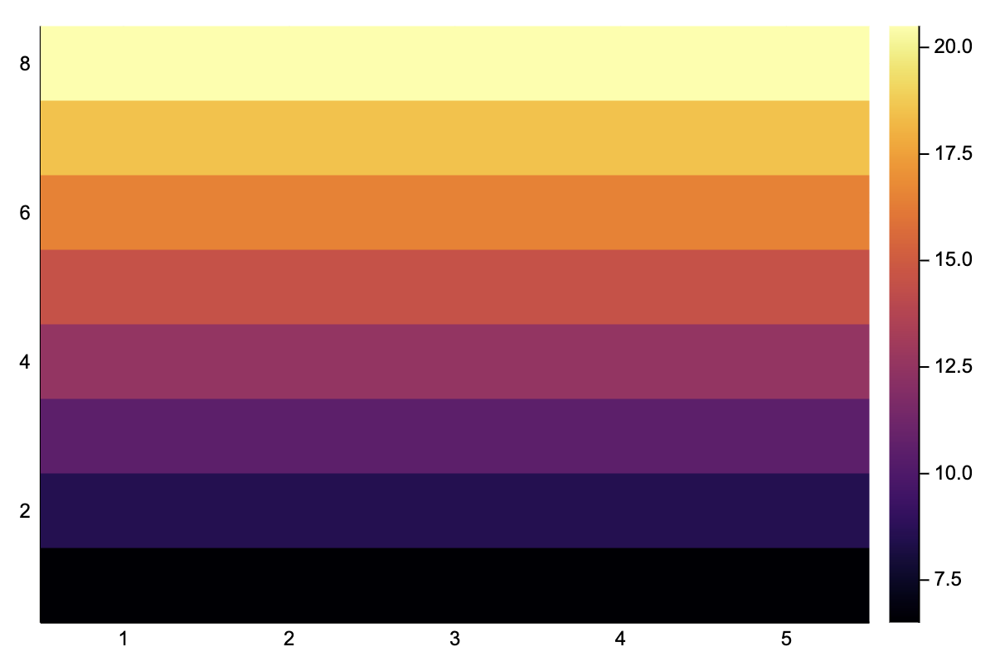


```julia
Ay = image_grad_y(A)
```


    8×5 Array{Float64,2}:
     3.6  5.6  7.6  9.6  11.6
     3.4  5.4  7.4  9.4  11.4
     3.2  5.2  7.2  9.2  11.2
     3.0  5.0  7.0  9.0  11.0
     2.8  4.8  6.8  8.8  10.8
     2.6  4.6  6.6  8.6  10.6
     2.4  4.4  6.4  8.4  10.4
     2.2  4.2  6.2  8.2  10.2


```julia
heatmap(Ay)
```


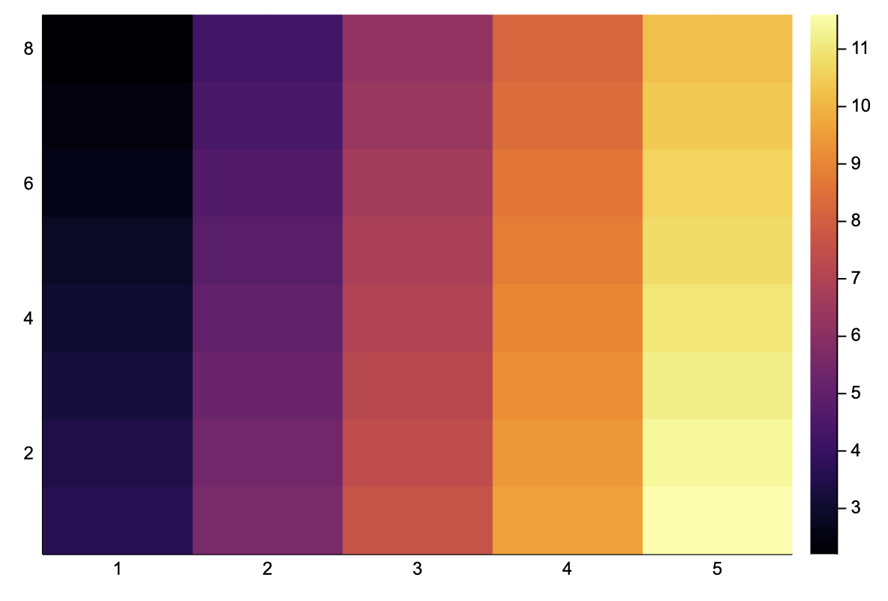


We can directly apply this a real image, and it works!


```julia
using TestImages

img = convert(Array{Float64}, testimage("cameraman"))[end:-1:1,:]
heatmap(img)
```


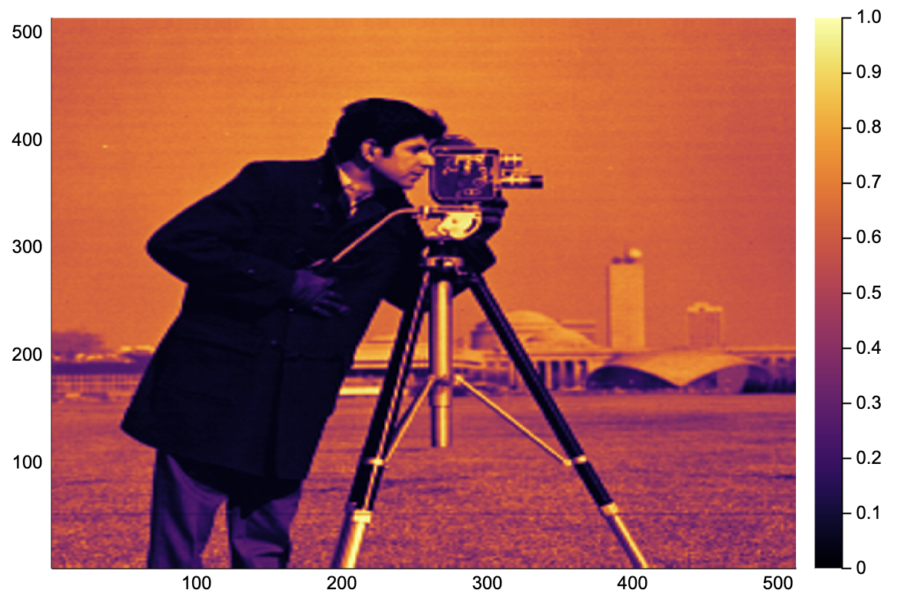


```julia
heatmap(image_grad_x(img))
```


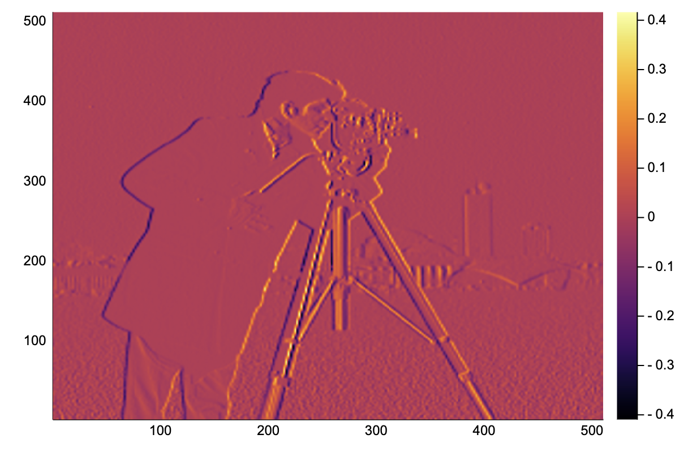


```julia
heatmap(image_grad_y(img))
```


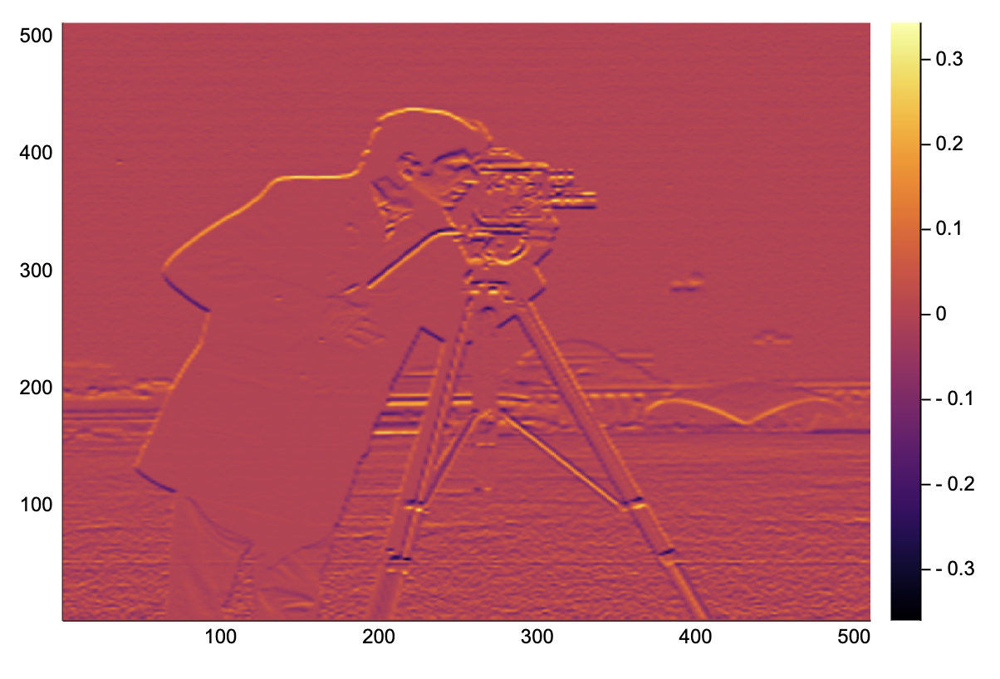


### Game of Life: a cellular automaton

Something different, our piece of code can be hacked to perform the update for [Conway's Game of Life](https://en.wikipedia.org/wiki/Conway%27s_Game_of_Life). This is a simple cellular automata defined on a 2-D grid with binary states, a cell can either be alive or dead. The rules for updating a cell's state from one step to the next follows the following simple rules:

- a living cell with one or two living neighbors dies (underpopulation);
- a living cell with four or more living neighbors dies (overpopulation);
- a living cell with two or three living neighbors remains alive (survival);
- a dead cell with exactly three living neighbors turns alive (procreation).

We choose `W` such that the living neighbors are counted. `f` is chosen to represent the above updating rules.


```julia
gol_rules(nneighbors, state) = (state && 2 <= nneighbors <= 3) || (!state && nneighbors == 3);
gol_update(A::AbstractMatrix{Bool}) = generalconvolve(A, [1 1 1; 1 0 1; 1 1 1], gol_rules);
```


```julia
A = rand(Bool, 100, 100);
heatmap(A)
```


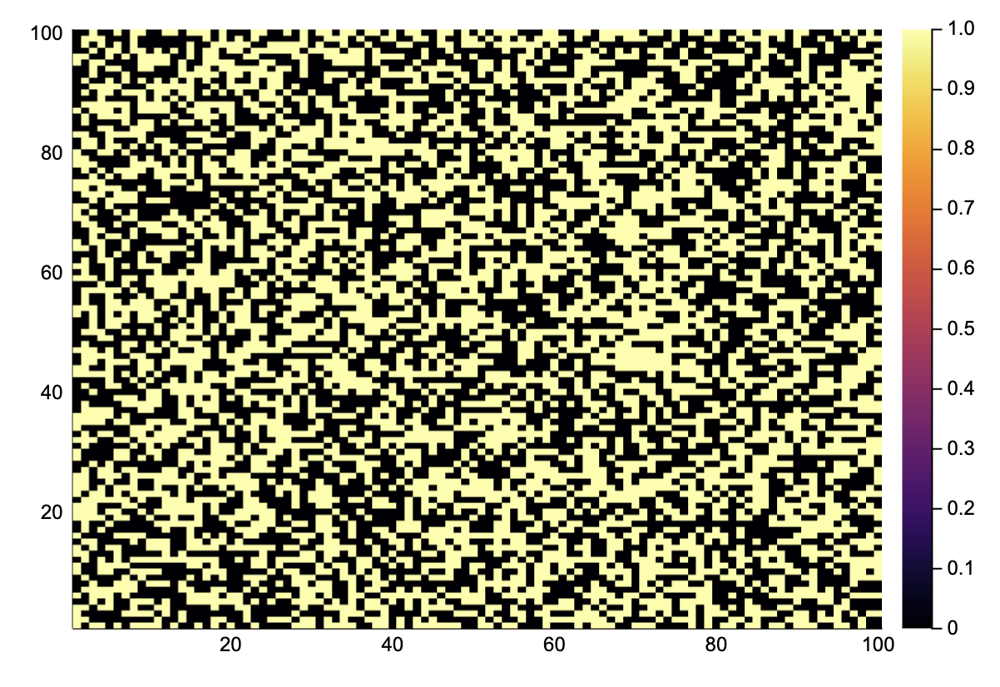


```julia
@btime A = gol_update($$A)  # quite fast!
heatmap(A)
```

      220.606 μs (2 allocations: 10.09 KiB)


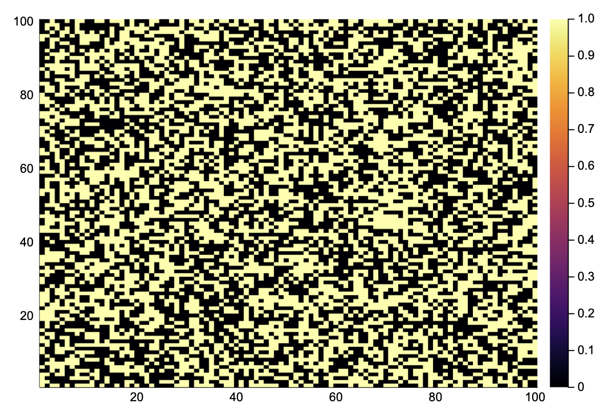


Simulate 1000 time steps.


```julia
for i in 1:1000
    A = gol_update(A)
end
heatmap(A)
```


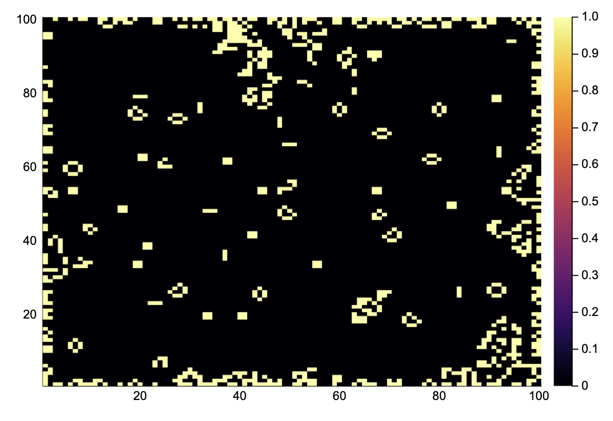


We see that all the random states have been replaced by simple stationary structures and oscillators. Note that the edges are not updated because no correct boundary conditions are implemented.

### Diffusion of ink in 3D

As an example in 3D, consider a volume containing some spots of ink. Using a Gaussian convolution, we can simulate how these drops have diffused after some time.

First, we generate a matrix with ink drops at random places.


```julia
A = zeros(100, 100, 100)
A[rand(CartesianIndices(A), 20)] .= 10.0;  # 20 drops of ink at random spots
```

The diffusion rate is determined by [Fick's law](https://en.wikipedia.org/wiki/Fick%27s_laws_of_diffusion), for the sake of simplicity, we will simulate this using a simple Gaussian convolution in three dimensions.


```julia
W = Array{Float64}(undef, 5, 5, 5)

for I in CartesianIndices(W)
    i, j, k = Tuple(I)
    W[i,j,k] = exp(-(i-3)^2 - (j-3)^2 - (k-3)^2)
end

# normalize
W ./= sum(W);
```


```julia
nsteps = 50
Anew = similar(A)

for step in 1:nsteps
    generalconvolve!(A, Anew, W)
    A, Anew = Anew, A
end
```

By taking a slice, we can see how the ink has spread.


```julia
heatmap(A[31, :, :])
```


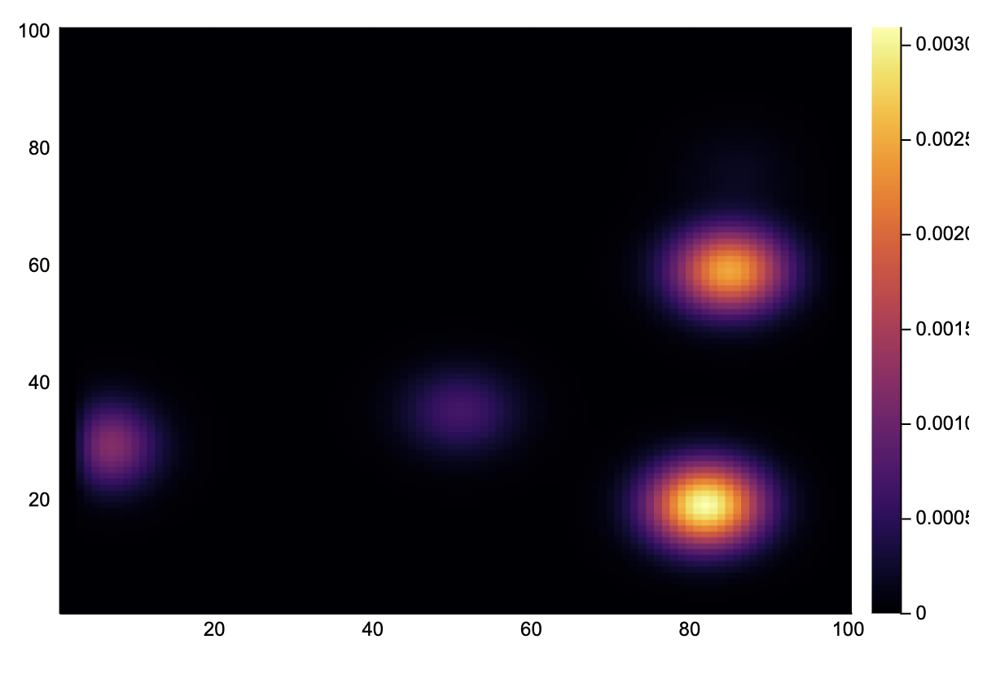


### Piecing it together: convoluton with uncertainty

We developed a structure for dealing with a uncertainty propagation and a general convolution function. Can these two seemingly unrelated concepts play together? Without any problem!

Consider a noise 1-D signal, with an uncertainty proportional to the absolute value of the signal. We first want to do a simple convolution similar to the kernel smoothing of earlier. Finally, we pass the signal to a sigmoid function, such that it is squeezed into the $$[0,1]$$ interval.


```julia
z = 8exp.(-0.4t).*sin.(2t)
z = z .+ 0.1randn(length(t)) .± (0.2abs.(z).+ 0.1);
```


```julia
plot(val.(z), color="blue", label="z")
plot!(val.(z) + 2err.(z), color="red", label="upper bound")
plot!(val.(z) - 2err.(z), color="red", label="lower bound")
```

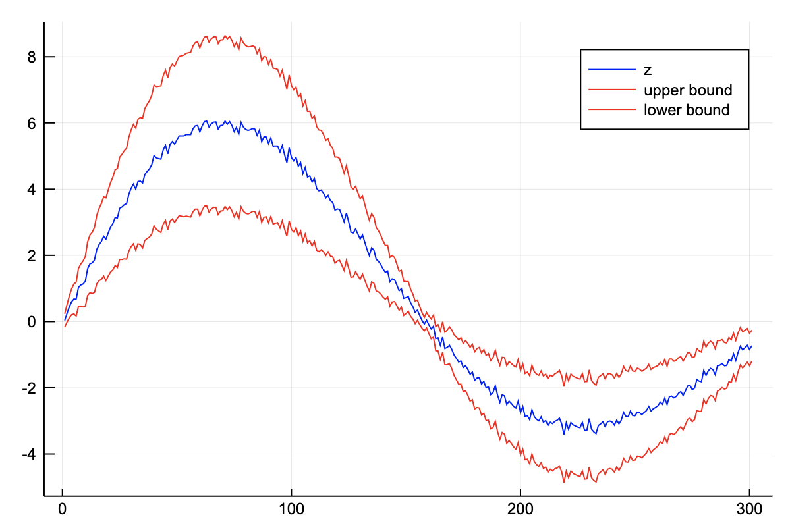


```julia
sigmoid(x, a=0.0) = inv(exp(-x) + 1.0);
```


```julia
conv_sofmax_signal(z::Vector; p::Int=5) = generalconvolve(z, ones(2p+1)/(2p+1), (x,a)->inv(exp(-1x) + 1.0))[p+1:end-p-1];
```


```julia
p = conv_sofmax_signal(z);
plot(val.(p), color="blue", label="processed signal")
plot!(val.(p)+2err.(p), color="red", label="upper bound")
plot!(val.(p)-2err.(p), color="red", label="lower bound")
```


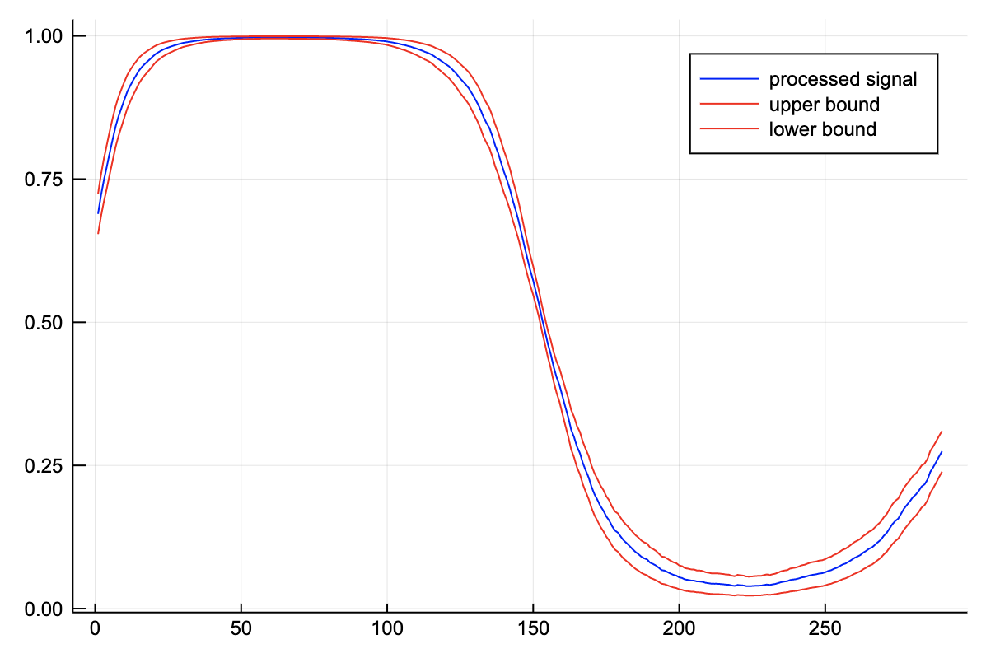


We see that the noise has been filtered and the error has been processed appropriately. Note that the region where the signal is 1, the uncertainty is really low. This corresponds to one of the flat regions of the sigmoid. When the value of `z` is large, the output is close to one, irregardless of noise.

Admittedly, this example seems a bit contrived. However, when you think of `z` as the output of some neural network, this might make some more sense, especially if you image performing binary classification on some space. For example, detecting vegetation in remote sensing data. The methodology that we have developed is not that far from a Bayesian artificial neural network.

The elephant in the room here is that by doing this convolution, the measurements are no longer independent, which leads to a serious underestimation of the uncertainty! Implementing measurements which also keep track of their underlying correlations is left as an exercise for the reader.
