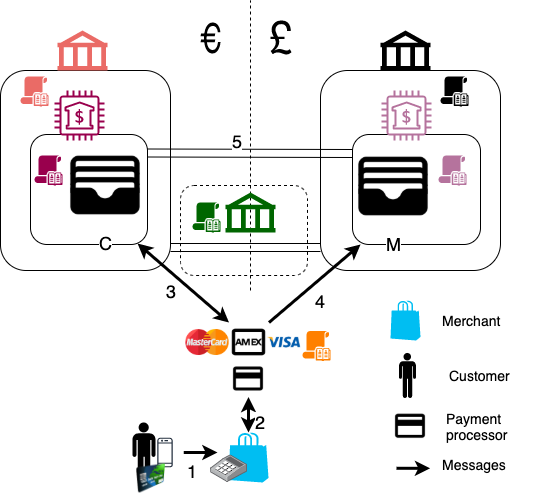
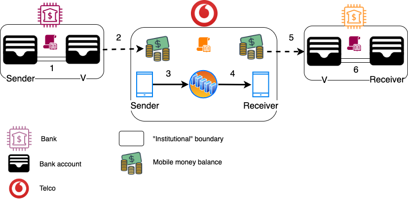
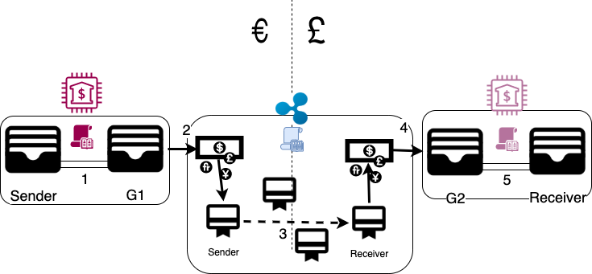

## Going international 

> Photo by JK on Unsplash

 In the [previous installment][1] of this series
 we talked about the history behind payment systems 
 and described how domestic payments work 

 In this post we will cover 
 * cross-border "traditional" payments
 * pull payments (a.k.a. direct debit)
 * go over the alternative payment initiation mechanisms (or "payment rails" in fintec speak)
 * and discuss some of their pros and cons 
    
<!--more-->

Take a look around you.  
Try to count how many items do **not** originate from outside of your country
Chances are you have not managed to count many
 
With international trade so prevalent 
Money crossing borders is crucial to keep our world connected
But how does water turn into oil? [1](#footnote_1)

### International payments - Nostro/vostro

The oldest form of cross-border payment mechanism is via [correspondent banking][3] (a.k.a. [nostro/vostro][4] accounts)

In this model (line 4)
PurpleBank (on the right) has a correspondency relationship with RedBank (on the left) 
What this means is that RedBank holds a bank account under its name in PurpleBank 

When PurpleBank customer D wants to send money to RedBank customer E
what they do is deposit the equivalent amount to RedBank's own account inside PurpleBank
With the note that the amount is intended for E

RedBank sees the amount deposit confirmed (possibly intraday, since it is all part of PurpleBank's systems) 
and credits the account of E with the equivalent amount on the other side 
The deposit in E's account comes from RedBank's "own" money

Notice that in the above scenario, there was no cross-border transfer of value
or even a single payment message. [1](#footnote_1)
The remote account (owned by RedBank, held in PurpleBank) is part of RedBank's assets, even though it is in a far away 
place. [2](#footnote_2)

this setup is the money equivalent of a teleportation gate
it is the legal agreements, the way [balance sheets work][8] and ledgers on both sides of the correspondency which make 
this possible   

obscure and little known 
used as a window for [insiders to bypass][6] the [2015 Greek capital controls][6]
(all credits go to the [original source][5])

There are 2 issues with this 
* much easier to setup and implement as a bilateral agreement when 
world currencies were on [fixed exchange rates][9] 
In the modern world currencies fluctuate momentarily which makes it harder to track the value of transactions
* there is always [counter-party risk][10] from the side of the nostro holder (in the above example RedBank) [3](#footnote_3)
This was demonstrated in a great way in 1974 with the [Herstatt Bank][11] bankruptcy.

This leads to a slightly more complex setup for international payments.

### International payments - FX markets & Central clearing

2 aspects to address

* fluctuating currencies
currencies traded in pairs 
spot price determined in [FX markets][13]
since these are primarily bilateral [OTC][14] trades 
international money movements between 2 banks 
involve the purchase of the equivalent amount of foreign currency from an FX market broker  

* Risk 
as with all other financial transactions 
using a [clearing house][15] as a guarantor 
reduces counter-party risk

Putting this back in our diagram we have line 3 

The fundamental difference between line 3 (nostro/vostro) and 4 (central clearing) is not so much that it has some 3rd party 
facilitating the international movement of funds 
It is **when** the payment will be considered [settled][16] as opposed to netted off or held as a liability from the other bank
(which is the case with nostro/vostro)

Let's take an extreme example of efficiency, EU's [TARGET2][17] settlement system
In TARGET2 all transactions are cross-border but they have the benefit of a single currency 
So the underlying principle and architecture is roughly similar with national payment systems [described in part 1][1]
In this case it is [ECB][18] which holds the virtual central pool of money and
European country central banks play the role of the guarantor for commercial banks with the aim to replenish the outstanding 
balances by [the end of the day][19]   
The flows being international means they are usually [unbalanced][21] [4](#footnote_4) 
This results in the receiving country's central bank lending the sending country's central bank from the excess of the 
money it has just received  
  
The general case of cross-currency payments does not have the slick operation of TARGET2
the mechanisms are more complex
as we have 3 hurdles to overcome

**Currency conversions**  
As discussed previously, large global [market makers][22] buy big sums of foreign currency and then re-sell that "down 
the food chain" to brokers and smaller banks for a fee. 

**Counter-party risk**  
Since there is no "Planet Earth Central Bank" to guarantee all global transactions, international value transfers can be 
facilitated and guaranteed by a [number][23] of regional and [international][24] settlement systems and clearing houses.  
These can and do settle transactions between central banks, companies and everything in between.    

**Routing**  

SWIFT used for addressing
https://transferwise.com/gb/blog/everything-you-need-to-know-about-swift-network

routing charges
https://www.moneymover.com/about/blog/what-are-swift-payments/

### A brief pause

> Photo by Wade Austin Ellis on Unsplash

Target2 not trusted
https://www.telegraph.co.uk/business/2019/06/04/german-bundesbank-comes-clean-euro-default-risks-italys-parallel/
https://www.handelsblatt.com/today/finance/target2-when-is-a-trillion-euro-not-a-trillion-euro/23582376.html?ticket=ST-567213-S69wymscfit5pWXBKtad-ap4

delays 
[credit and debit messages][23] between banks are almost instant
even [around the world][24]  
but processing them is slow 
settlements are at end of day
the more hops further away the slower the settlements

Timings vary wildly
https://fexco.com/fexco/news/how-long-international-bank-transfers-take/

payments are primarily "push"
the payer sends money to the payee
the payer's responsibility to give the receiver account "coordinates" (i.e. bank account number) correctly

banks around the world treat international payments differently 
due to [KYC][25], [AML][26] and systems' design 
requiring different levels of detail (e.g. account owner name, address, etc) 
 
the more data points required as input the higher the possibility for mistakes in account numbers 
surprisingly large number of manual processing and corrections

currency markets vs dependency on dollar 
as reserve currency 

swift payment system 
depends on dollar flows/banks
weaponized for sanctions
tripolar world 

## Pull payments

> Photo by Pixabay on Pexels

### Direct Debit
 
### Cards 

Special case is mobile payment processors
like GooglePay and ApplePay

## Some comments

## Payment rails 

### OpenBanking

TBTF

### Paypal

### M-Pesa

### Remittance services

https://en.wikipedia.org/wiki/Hawala

## ...and the future

### Digital IOUs

### Libra

### Government cryptocurrencies

### Proof-of-work money 

## Parting thoughts

> Photo by Maxime Lebrun on Unsplash

Money not only makes the world go round 
but also goes around the world 
trillions of times

from the ancient in-person gold-in-hand transactions 
we have evolved into complex currencies and complex structures 
we seem to be going back in full circle 

## Footnotes

1. In the olden days, banks would send a telegraphic message and later Telex.  
In the modern day, for all that we know, RedBank may be employing a person to just press [Ctr+F5][7] 
all day, to see new credits in their nostro account. 
2. Which means that by giving money to account E, RedBank did not just "magic" some money up.  
It just counter-balanced its newly acquired asset (money in its PurpleBank account), with a liability (giving money to E). 
So, all is zero in the end. 
3. If PurpleBank proves to be dodgy and its deposits evaporate, then RedBank's asset (their 
account in PurpleBank) is worth nil and has to be written off.  
4. For example, the Spanish buying more German cars than the Germans [jamon iberico][20]. 

  [1]: https://sgerogia.github.io/Payments-Intro-Part1/
  [2]: https://sgerogia.github.io/Payments-Intro-Part1#mental_model
  [3]: https://www.investopedia.com/terms/c/correspondent-bank.asp
  [4]: https://en.wikipedia.org/wiki/Nostro_and_vostro_accounts
  [5]: https://www.techiechan.com/?p=2529
  [6]: ../images/Greel_Bank_Decision.pdf
  [7]: https://www.wikihow.com/Force-Refresh-in-Your-Internet-Browser
  [8]: https://www.guru99.com/assets-and-liabilities.html
  [9]: https://en.wikipedia.org/wiki/Gold_standard
  [10]: https://www.investopedia.com/terms/c/counterpartyrisk.asp
  [11]: https://en.wikipedia.org/wiki/Herstatt_Bank
  [12]: https://en.wikipedia.org/wiki/Capital_controls_in_Greece
  [13]: https://en.wikipedia.org/wiki/Foreign_exchange_market
  [14]: https://en.wikipedia.org/wiki/Over-the-counter_(finance)
  [15]: https://en.wikipedia.org/wiki/Clearing_house_(finance)
  [16]: https://en.wikipedia.org/wiki/Settlement_(finance)
  [17]: https://en.wikipedia.org/wiki/TARGET2
  [18]: https://en.wikipedia.org/wiki/European_Central_Bank
  [19]: https://www.youtube.com/watch?v=fstoINqXJK8
  [20]: https://en.wikipedia.org/wiki/Jam%C3%B3n_ib%C3%A9rico
  [21]: https://www.fxstreet.com/analysis/fuse-is-lit-target2-imbalances-hit-crisis-levels-an-email-exchange-with-the-ecb-over-target2-201702270841
  [22]: https://www.investopedia.com/terms/m/marketmaker.asp
  [23]: https://www.corporatetobank.com/resources/payment-clearing-and-settlement-systems/
  [24]: https://www.bis.org/banking/finserv.htm?m=4%7C20