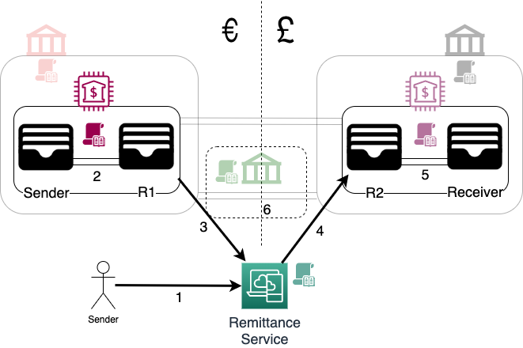

## On the rails 

> Photo by Christian Holzinger on Unsplash

*In the previous 2 instalments ([1][1], [2][2]) of this series, I talked about the history behind payment systems and 
described how domestic and international payments work.*  

*In this post I will cover* 
 * *modern payment "rails"*
 * *blockchain-based systems, and* 
 * *close the "trilogy" with some parting thoughts.* 
    
<!--more-->

### OpenBanking

TBTF

### Paypal

### M-Pesa

### Remittance services

https://en.wikipedia.org/wiki/Hawala

## ...and the future

### Digital IOUs

### Libra

### Government cryptocurrencies

MMT
Helicopter money
demonetization
direct control of velocity of money

panopticon control 

sanctions
direct taxation

role of banks?
multi-sig wallet providers?
pointless to maintain channels

event equivalent to asteroid strike
before and after

### Proof-of-work money 

## Stay tuned... 

> Photo by JESHOOTS.com from Pexels

In the next and final installment, we will go over  
* some modern "payment rails" developed in the last decade, 
* the emerging role of crypto-currencies into the "payments mix", and
* wrap up with some parting thoughts.

## Footnotes

1. To use an analogy from [part 1][1].
2. In the olden days, banks would send a telegraphic message and later Telex.  
In the modern day, for all that we know, RedBank may be employing a person to just press [Ctr+F5][7] 
all day, to see new credits in their nostro account. 
3. Which means that by giving money to account E, RedBank did not just "magic" some money up.  
It just counter-balanced its newly acquired asset (money in its PurpleBank account), with a liability (giving money to E). 
So, all is zero in the end. 
4. If PurpleBank proves to be dodgy and its deposits evaporate, then RedBank's asset (their 
account in PurpleBank) is worth nil and has to be written off.  
5. For example, the Spanish buying more German cars than the Germans [jamon iberico][20]. 
6. Being placed under sanctions goes beyond financial transactions. Any part of the [US 
infrastructure][45] from SWIFT message processing to mail servers etc is blocked for entities considered adversaries. 
And this can increasingly be anyone.
7. The mandate is the equivalent of C declaring "Please allow A to take (debit) from my account 
in PurpleBank every X days and deposit it in her account in GreenBank". 
8. In a "normal" push payment it is first debit (from the payer) and then credit (to the payee).  
In direct debit, it is first credit (to the payee) and then debit (from the payer), or at the very least these 2 happening 
almost in parallel. 
9. Full disclosure: I am an employee of GoCardless, an online direct debit provider, at the 
time of writing this blog post. 
10. Debit and credit cards have no practical difference in this discussion.
11. This used to be exclusively the remit of the Acquiring banks. But as technology and terminals 
started becoming more advanced, it becomes harder and harder for "generalists" (as the banks are) to compete. Hence the 
rise of dedicated processors. 
12. When mentioning 'Apple' in this section, I refer to Apple, Google, Samsung,... 
13. Hard to make sense, I know! I had to re-read that myself... :-/

  [1]: https://sgerogia.github.io/Payments-Intro-Part1/
  [2]: https://sgerogia.github.io/Payments-Intro-Part2/