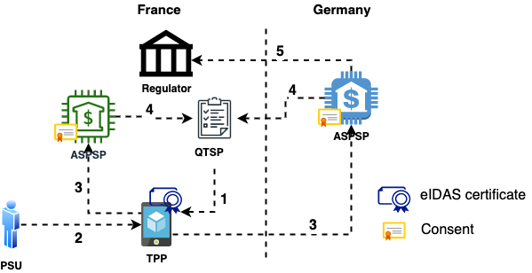
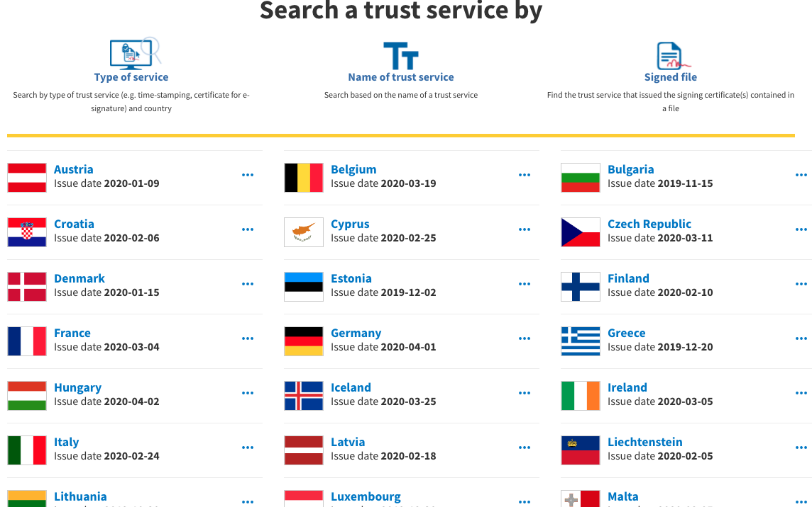

The term OpenBanking describes open financial APIs, giving customers access and control over their data.  
It took its name from the UK regulator's [2016 initiative][11] to front-run the EU [PSD2 directive][12], which was coming 
into full effect in September 2019.  
The successful implementation and roll-out of OpenBanking in the UK has resulted in  
* the name "OpenBanking" becoming almost global, and 
* the UK becoming the pre-Covid [de facto hub][13] for open APIs and fintech innovation.

In this series of two articles I will 
* give a high-level introduction to the key PSD2 and OpenBanking concepts,
* describe the eco-system from the PoV of the banks and external integrators, and
* give an easy-to-follow example of how an integration with the APIs looks like

As this is an evolving ecosystem, I will be using a fusion of OpenBanking and PSD2 terminology. 

## PSD2 

From an end-user standpoint, PSD2 can be (simplistically) summarised in the following sentence  
> Offer functional and security parity between a bank’s [channels][14] and its public APIs.

Or  
> A bank customer must be able to securely do through an API all things she can do through its other channels.

PSD2 is a "meaty" combination of legal text and technical standards to set out the requirements for secure access to 
their accounts by bank customers.  
More specifically, it is composed of  
* The [Payment Services Directive 2][15] which sets out the legal framework and requirements for access to bank customer
accounts by Third Part Providers (TPPs).
* The European Banking Authority [technical standards for customer authentication and communications][16] in PSD2.
* The [Electronic Identification Regulation][17] (eIDAS) which sets out the details on the operation of Trust Service 
Providers (TSPs, more on this below).

PSD2 by its nature (law and technical standards) answers the "why" (legal framework, ownership of data) and "how" 
(public/private cryptography, identification and security).  
The remaining of the technical choices and concepts have evolved, taking into account industry best practice and 
matching the [spirit][18] (if not the exact letter) of the law.  

The following diagram describes the PSD2 ecosystem, the key elements and their interactions from a high level. 

> Note: The scenario shows interactions in both a local and a cross-European level.  
> This is a super-set of all possible interactions and contains all concepts and entities. These will apply to the UK and 
> elsewhere, with little change. 

Let's go through the different entities and how they interact.

### QTSP

[Trust Service Providers][19] (TSPs) are  
> providing and preserving digital certificates to create and validate electronic signatures and to authenticate their 
> signatories as well as websites in general.

In other words, they play the same role as Certification Authorities in a [PKI infrastructure][20]. 
 
Becoming [‘Qualified’][21] means that they have   
> status and permission from a supervisory government body to provide qualified digital certificates which can 
> be used to create qualified electronic signatures
 
In other words, the eIDAS legislation wants to prevent the EU security market from being controlled by [foreign entities][22].  
For this reason, it lays out in detail the assessment and practices to be followed across all EU Member States. This will
result in interoperability and commercial-grade security across the European trust infrastructure.

The list of each country's QTSPs are published and regularly updated in a [common top-level directory][23] (List of Trusted List,
LOTL)

Each QTSP publishes their active top-level [public key certificates][24] as well as what functionality they are meant for
(MA-TLS, e-signatures, timestamping,...). This list is open for inspection and consumption by anyone.

### TPP

A Third Party Provider (TPP) is an entity wishing to provide services to a Payment Services User (PSU, i.e. customer).  
These services can be  
* accessing the customer's transaction data to generate insights (e.g. "you are spending too much on X"), 
* initiating payments (e.g. "automatically invest an amount every month"), etc

Since TPPs are handling sensitive financial data, they are licensed and overseen by their country's financial 
regulator (e.g. the Central Bank in Greece, FCA in the UK,...). 

To participate in the PSD2 ecosystem and start calling banking APIs, a TPP contacts a QTSP (arrow 1) to issue 2 certificates,
a QWAC and a QSEAL. More on them below.  
The QTSP performs a number of background checks on the TPP before issuing the certificates and charges a price (if a 
commercial entity).  
These certificates are used as the identifier of the TPP's Application. A TPP (legal entity) can have many different 
Applications (i.e. brands) it is operating. [1](#footnote_1) In this case it is a best practice to issue 
multiple certificate pairs. 

In the UK, the [OpenBanking Implementation Entity][2] (OBIE) has played the role of QTSP so far, pro bono. 

### Consent
At the core of OpenBanking is the concept of Consent.

A Consent is the equivalent of a notarized contract. 
It is a contract between the Customer and the TPP, with the bank becoming the trusted 3rd party (akin to a notary).

If it was in text, a Consent would read something like 

> I (Customer) authorize TPP XYZ to access my account 123 and read items A, B and C. 
> This authorization is valid until date DD/MM/YYYY.

The Consent is stored in the bank’s systems and becomes the reference, every time TPP makes a call to access account 123.
The bank provides a mechanism for the Customer to revoke the Consent at any time prior to expiration.

### ASPSP 

#### API 

OB Spec links 

Registration 
example of OB self-registration

#### Security 

Qualified Website Authentication Certificates (QWACs) provide a method to authenticate ‘Internet Entity
Identity’ and encrypt communications in order to provide confidentiality. QWACs are used with specific
protocols at the Transport Layer and are not designed to be used at the Application Layer.
• Qualified Electronic Seal Certificates (QSEALCs) are not designed to be used for ‘Internet Entity Identity’
or confidentiality at the Transport Layer for Transport Layer Security (TLS) or Mutual Authentication/
Transport Layer Security (MA/TLS). However, a QSEALC can be used at the Application Layer, with the
messages being passed between communicating parties to prove origin, authenticity, and integrity that
the data comes from the party that it is meant to. Additionally, due to the nature of QSEALC and EBA RTS
for SCA/CSC Under PSD2 requirements needing information about the ‘Legal Persons Owner’ of that
certificate, it can be used to establish the PSD2 ‘Financial Entity Identity’ (as opposed to the ‘Internet
Entity Identity’ in the QWAC).

MA-TLS 
CA revocation lists in LB

https://ec.europa.eu/tools/lotl/eu-lotl.xml

FAPI and OIDC specifications
The OpenBanking technical specification is using the Consent to build on top of the [FAPI][3] and [OIDC][4] specifications.
In particular, it is using the [Hybrid Flow][5] with the intentId being the unique Consent identifier.  

In addition, the overall security and trust is established by 2 key pairs:

Transport layer (a.k.a. QWAC)
This is for MA-TLS communication between TPP and bank.
This is issued by the [OBIE’s Certification Authority][6], one per TPP (legal entity). 
A [revocation][7] of this certificate signals to all the banks “the TPP has lost its license“.

Application layer (a.k.a. QSEAL)
This is used for signing exchanged JWTs.
This can be a key-pair issued by any CA (even a self-signed one) and uploaded to the OB directory. There is one QSEAL per Application.
OBIE publishes all the public keys in its JWKS endpoint. 
Example [showing OBIE’s][8] itself public keys (has security warning). 

Each bank publishes its specific implementation and conformance to the OB spec (link for [RBS][9]).

#### Approval flow
Visualizing the flow from a customer’s point-of-view will make things clearer.

This [document][10] has mockups describing guideline happy and unhappy paths for various interaction scenarios (web, mobile, token-based identification,…).

### Regulator

EU-specific concern 
Check when passporting 

mish-mash of sites
e.g. Austrian passported: https://www.fma.gv.at/en/search-company-database/?cname=&place=&bic=&category=1979&per_page=10&submitted=1
Hungarian: https://www.mnb.hu/en/supervision/licensing-and-institution-oversight/market-participants/hungarian-cross-border-service-providers
Latvia: https://www.fktk.lv/en/market/payment-service-providers/payment-institutions/
Greece: https://www.bankofgreece.gr/en/main-tasks/supervision/supervised-institutions

common APIs on top

e.g. Preta 
https://www.openbankingeurope.eu/regulatory-directory/about-the-regulatory-directory/

Konsentus
https://docs.sandbox.konsentus-dev.com/api-reference/regulatory-checking.html#overview

These are mechanical turk operations 
with an army of people checking regulator websites and updating databases for the APIs to work

### Around the world 

Europe has trail-blazed with the legal framework and the technology definitions choices and concepts are replicated around the world

Australia
https://cdr-register.github.io/register/#dynamic-client-registration
https://consumerdatastandardsaustralia.github.io/standards/#client-authentication

Japan
https://www.zenginkyo.or.jp/fileadmin/res/news/news290713_3.pdf

All countries around the world
https://www.openbankingexpo.com/wp-content/uploads/2019/09/ndgit-Open-Banking-APIs-worldwide-Whitepaper.pdf

## In the next episode

> Photo by Will Francis on Unsplash

## Footnotes

1. A naive example, to make this clear.  
Amazon is the TPP (legal entity) and has a number of separate Applications: Amazon Prime Video, AWS, Alexa,... 

  [1]: https://en.wikipedia.org/wiki/Payment_Services_Directive
  [2]: https://www.openbanking.org.uk/providers/directory/
  [3]: http://openid.net/specs/openid-financial-api-part-2.html
  [4]: http://openid.net/specs/openid-connect-core-1_0.html
  [5]: https://openbanking.atlassian.net/wiki/spaces/DZ/pages/83919096/Open+Banking+Security+Profile+-+Implementer+s+Draft+v1.1.2#OpenBankingSecurityProfile-Implementer%27sDraftv1.1.2-SecurityArchitecture
  [6]: https://openbanking.atlassian.net/wiki/spaces/DZ/pages/80544075/OB+Root+and+Issuing+Certificates+for+Production
  [7]: https://openbanking.atlassian.net/wiki/spaces/DZ/pages/22577944/What+are+the+Open+Banking+CA+and+OCSP+expected+behaviours
  [8]: https://keystore.openbankingtest.org.uk/keystore/openbanking.jwks
  [9]: https://openbanking.atlassian.net/wiki/spaces/AD/pages/110264930/Implementation+Guide+Royal+Bank+of+Scotland
  [10]: https://www.openbanking.org.uk/wp-content/uploads/Customer-Experience-Guidelines-V1-1.pdf
  [11]: https://www.openbanking.org.uk/wp-content/uploads/OB_MediaPDF_FINAL.pdf
  [12]: https://en.wikipedia.org/wiki/Payment_Services_Directive#Revised_Directive_on_Payment_Services_(PSD2)
  [13]: https://www.finextra.com/newsarticle/35199/uk-fintech-scene-sees-record-investment-in-2019
  [14]: https://www.mindmill.com/banking-software/channel-banking.html
  [15]: https://ec.europa.eu/info/law/payment-services-psd-2-directive-eu-2015-2366/law-details_en
  [16]: https://eba.europa.eu/regulation-and-policy/payment-services-and-electronic-money/regulatory-technical-standards-on-strong-customer-authentication-and-secure-communication-under-psd2
  [17]: https://ec.europa.eu/digital-single-market/en/trust-services-and-eid
  [18]: https://en.wikipedia.org/wiki/Letter_and_spirit_of_the_law
  [19]: https://en.wikipedia.org/wiki/Trust_service_provider
  [20]: https://en.wikipedia.org/wiki/Public_key_infrastructure
  [21]: https://en.wikipedia.org/wiki/Trust_service_provider#Role_of_a_qualified_trust_service_provider
  [22]: https://en.wikipedia.org/wiki/Certificate_authority
  [23]: https://webgate.ec.europa.eu/tl-browser/#/
  [24]: https://en.wikipedia.org/wiki/Public_key_certificate