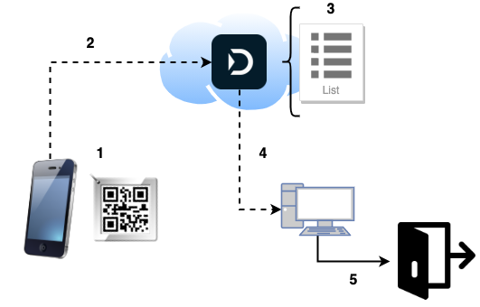
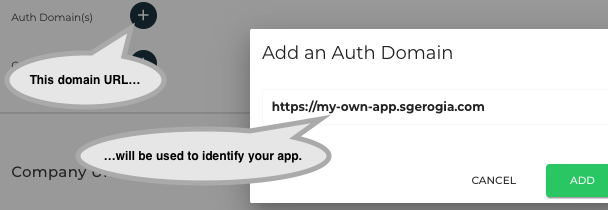
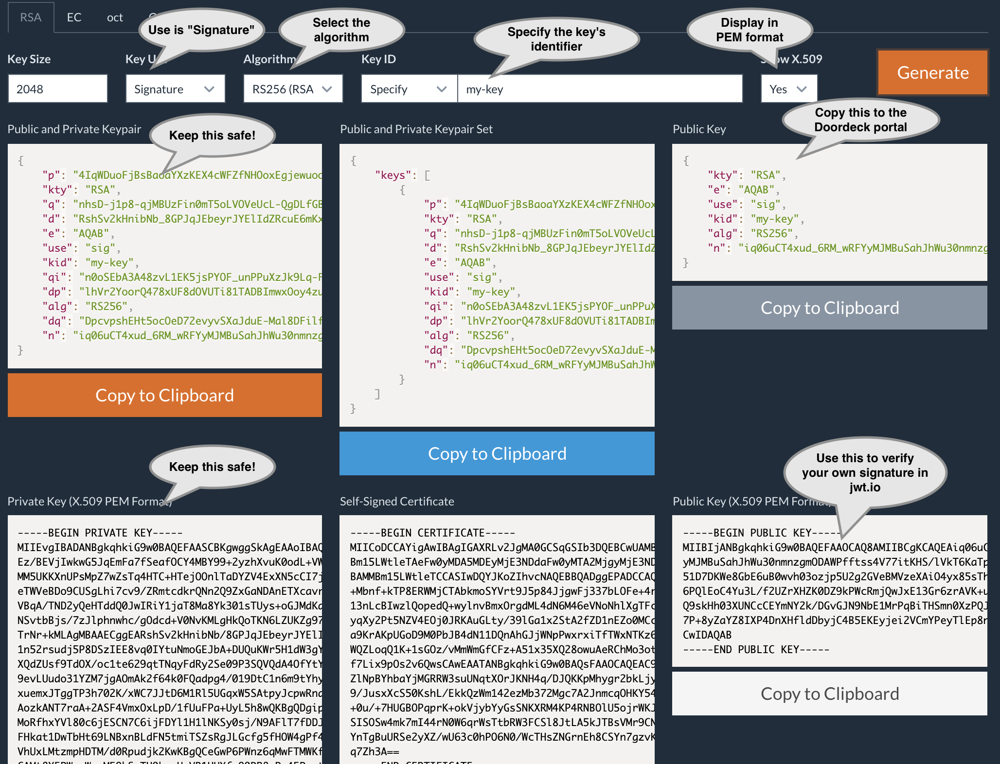
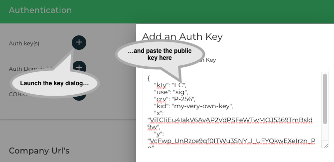

## A new paradigm 

Physical access has been slow to move to the internet age
The key has been with us for millenia 
in the last few decades has been slowly pushed back by the omni-present magnetic and NFC cards 


> Typical card access system

Card goes near reader prompting a read of its unique id
Id travels to controller device where it is checked against the whitelist
If confirmed, the controller opens the lock
  
Cards are easy to lose
they do not recognize an owner  
hard to centrally manage (one-time access, instantly revoke, API integration and automation...)  

Doordeck <sup>[1](#footnote_1)</sup> builds on top of existing physical card infrastructure and brings it online



When the user installs the app, it generates a public/private keypair 
This is securely sent to the Doordeck server and will be used to identify the user from then on 

NFC-enabled mobile phone goes near the Doordeck tile (or scans thew QR code printed on it)
https://doordeck.com/how-it-installs

The device requests access by sending the tile's id, signed with its private key 
This means "user X wants to open door Y"

The server checks the request against a number of possible rules (user allowed for this door, blackout times,...)
If successful instructs the controller add-on to unlock the door 

Application --> User


This only scratches the surface 
and will make more sense through a hands-on example

## Let's get started

### Prerequisites

I will assume you are on a Mac. <sup>[2](#footnote_2)</sup> 
curl
python 2.7.6
install pip 

### Registering the application

First of all the integrator server application 
needs to identify itself to the Doordeck API <sup>[3](#footnote_3)</sup> 

The application is registered in the Doordeck portal (https://developer.doordeck.com/)


The integrator application identifies needs to 1) identify itself and 2) prove its identity.

#### Application identity

Finally the application is going to identify itself using a URL
This will go in the `iss` field of the incoming JWT
and is called Auth domain in the Doordeck portal


> Adding the application's external identifier

#### Application security

itself to the Doordeck server with a signature key

and the current user with an OpenID JWT (link?)



Quickest way to generate a JWK from https://mkjwk.org/
https://tools.ietf.org/html/rfc7517

Select an algorithm from the RFC list 
https://tools.ietf.org/html/rfc7518#section-3.1

Same tool can be launched locally
https://github.com/mitreid-connect/json-web-key-generator


> Adding the integrator application identifier

### Generating a user JWT

The calling user's details are encapsulated in a JWT, signed by the application 
You can use the following template 

<details markdown="1">
  <summary>Click to expand!</summary>

```
--- Header ---
{
  "alg": "RS256",
  "kid": "REPLACE_ME"
}

--- Payload ---
{  
     "iss":"REPLACE_ME",
     "exp":REPLACE_ME,
     "iat":REPLACE_ME,
     "aud":"https://api.doordeck.com",
     "sub":"REPLACE_YOUR_USER_UNIQUE_ID",
     "email":"some@email.com",
     "email_verified":true,
     "telephone":"+441234567890",
     "telephone_verified":true,
     "name":"Your TestUser",
     "locale":"en-gb",
     "zoneinfo":"Europe/London"
}
```  
</details> 

The placeholders named `REPLACE_ME` are values which you should replace for things to work.
You may also want to set the email and phone number to something valid for further testing.

Copy-paste the above template and assemble your final JWT in the online helper at [jwt.io][2].


Timestamps: https://www.unixtimestamp.com/ 

Convert to PEM: https://8gwifi.org/jwkconvertfunctions.jsp
Run locally: https://8gwifi.org/download.jsp

Upgrade OpenSSL
```
brew install openssl
brew info openssl

If you need to have openssl@1.1 first in your PATH run:
  echo 'export PATH="/usr/local/opt/openssl/bin:$PATH"' >> ~/.bash_profile

openssl genpkey -algorithm ed25519
```

## Parting thoughts

Competition 

https://www.getkisi.com/access-control-system

https://tapkey.com/

http://www.controlsoft.com/controlsoft-mobile-access.asp

Bluetooth is double edged sword
https://www.buildings.com/news/industry-news/articleid/21265/title/simplify-access-control-with-smartphones


## Footnotes

1. <a name="footnote_1"></a>Full disclaimer: I am an angel investor in Doordeck. 
2. <a name="footnote_2"></a>It will be easy to follow on another platform. 
3. <a name="footnote_3"></a>This section is a condensed version of the guide found [here][1].


  [1]: https://doordeck.com/developer/authenticating-your-users
  [2]: https://jwt.io/#debugger-io