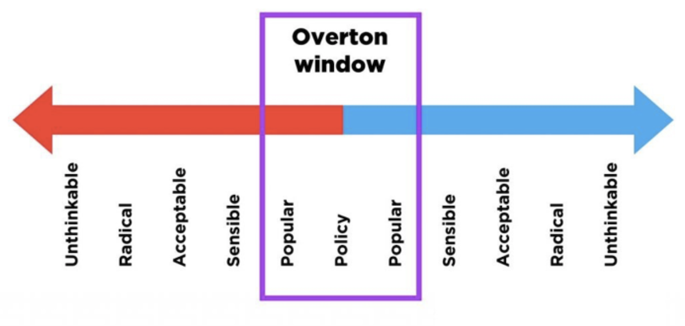
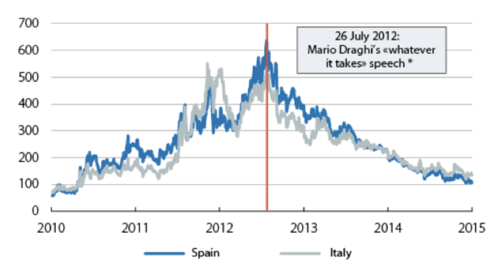
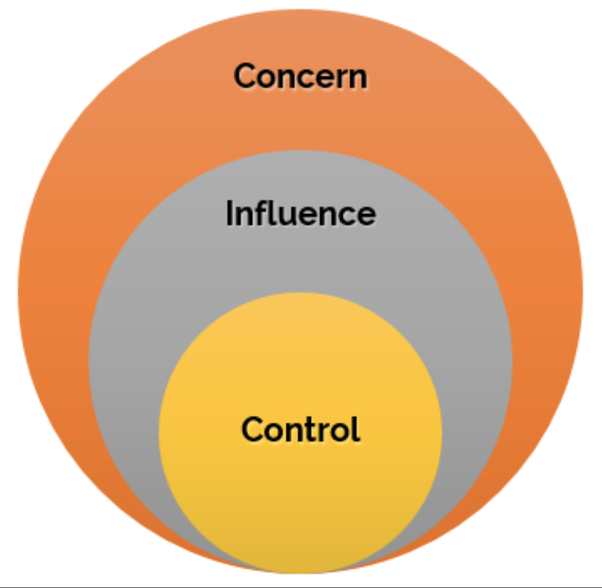

In an ever-changing world, it is easy to think that “things just happen”.  
Change, even of seismic proportions, is constant but not random. Most of the time it takes a certain sequence of events.  
This blog post discusses 2 frameworks for understanding the mechanics behind change. [1](#footnote_1)   

# #metoo

> Image credits: [here][1] and [here][2]

Let's start with a visual juxtaposition.

Chances are, dear reader, that you immediately recognize the man on the left, but are not sure about the woman on the right.  
He is [Harvey Weinstein][8], a former [movie producer][9].  
She is [Rose McGowan][7], a Hollywood actress. 

What connects them is that Rose M is the person who kick-started the avalanche of revelations against Harvey W.  
She had been [tweeting][11], blogging and [interviewing][12] since 2015, becoming increasingly more vocal, leading to a [climactic 
speech][13] in a women’s conference.

Over [100 women][10] have since come forward with accusations against Harvey W.  
These span a period of almost 20 years of abuse against women. These accusations have now lead to his [conviction][14] 
with more trials pending.

That was only the beginning.

Thousands of women (and men) have since come forward with revelations on sexual abuse, resulting in many public figures 
been disgraced around the world. This came to be collectively known as the [#metoo movement][15].  
Most importantly, this kick-started a number of initiatives around the world, focusing on gender inequality in the 
workplace and society.  
The #metoo snowball is still rolling.

Now, Harvey W had been at it for 20 years.  
Countless others before, like him, have been abusing their power. 

Why did it take so long for Harvey W to face justice?  
If anything, it was far from a secret. There had been [public mentions][17] (e.g. [comedy sketches][16]) and even 
[litigations][18] from years ago.

Most importantly: why did the tectonic plates of gender equality only started moving recently?

# A little theory

To answer the above question, let’s examine some key concepts, with regards to influencing people's behavior.  
There are 2 ingredients and a catalyst that are need to “move mountains”.

## Knowledge

The first ingredient is knowledge.

We can classify knowledge in 3 different “types”. 

**Private knowledge**  
There is a fact and only I know it. Or at least so I think...  

This is knowledge about things which I have experienced in my personal life. 
It can range from the trivial (e.g. *I stepped on a chewing gum today*) to the very serious (e.g. *I cannot afford to buy 
food for my children*).  
I am oblivious to the fact that millions of other people might have similar private pieces of information at the same 
time (e.g. they also cannot afford to buy food).

**Public knowledge**  
The fact is out there; for anyone with their eyes & ears tuned in.  

Public knowledge is information (facts, articles, news,...) available in the public domain. This could be anything: from 
truthful facts to fake news.  
For example, [listed company][19] accounts (P & L, revenue,...) are by law in the public domain. So is a [November 2019 
article][20] about a little-known city having an influx of patients at its hospitals.

Public domain can also imply any context.  
E.g. an unrestricted Confluence page in your company's intranet is also public knowledge. In the company's public domain.

In brief, we *can* know about public knowledge. But it is not exactly at the forefront of our thought.

**Common knowledge**
Everyone knows that everyone knows. There is no way of denying or hiding.

This is when you know that everyone else also knows the fact. And the important bit is that will almost surely take action.  
You can no longer ignore the fact, even if you wanted to.

It is also interesting to tie this back to private knowledge, even the trivial sort. [2](#footnote_2)   
Common knowledge is the most interesting type, though it might be a little bit elusive. We will come back to that with 
some examples in a minute.

## Overton window

> Image credits: [here][21]

The 2nd ingredient is the “window of discourse”, a.k.a. [Overton window][22].

This framework describes  
* the range of ideas tolerated, accepted to be discussed in public and eventually turning into policy, and
* how society's appetite changes overtime, with ideas and concepts falling in / out of what is acceptable.  
It describes how “ripe” the environment is to accept a new idea (or reject an old one). 

For example, think how not so long ago it was perfectly acceptable to own slaves or burn people alive.

The Overton window concept was originally meant to formalize applicability and success of public policies. However it can 
very easily be used as a tool in any domain. I would dare say it applies to almost every social situation.   
From the most important (e.g. *locking everyone up for an indefinite period of time*) to the most mandane (e.g. *should 
we re-decorate the living room, honey?*) 

## ...and a catalyst 

> Photo by Skitterphoto on Pexels

What brings these 2 ingredients together? A catalyst.  
The small spec of platinum which will cause a [continuous reaction][23].

The best real-world example is that of a missionary.  
A person who has the courage to stand in front of an ambivalent (even hostile) crowd and "create" common knowledge. 
True to their name, missionaries (of the ["Knowledge Game"][24] sort) are driven to influence people around them.

In the archetypical missionary-meets-Hollywood scenario:  
The tribe is not faring well. Animals are dying, prayers to the gods are not doing anything. But talking about the gods is taboo.  
This is both private and public knowledge. Everyone is affected by the malaise and may be having doubts (private knowledge), 
everyone participates in the ineffective rituals (public knowledge).
But it is only when the missionary stands in front of everyone and says “your animals are dying, because your gods are 
fake” that common knowledge is "created".  
Not because she said something really new.  
It is because *everyone heard what everyone else also heard*; the crowd's Overton window is shaken, if not shifted.

The missionary is not always without danger.   
Ostracisation or persecution might be the result. 

The success or failure of the missionary depends hugely on   
* the missionary’s [gravitas][26]:  
Being considered as an all-knowing wizard certainly helps a lot. 
* her persistence:  
Having the patience and tenacity to repeat the same message.
* the group’s Overton window:  
People of the imaginary tribe might be more receptive to change if old norms are no longer working. 

# Some examples?

Let’s put all of the above into perspective with some examples.

## Little gravitas, huge persistence

> Image credits: [here][4]

Sometimes change can take years to happen.  
Without going very far, the best example of a missionary in recent years is [Nigel Farage][25].

Starting from a point of initial obscurity, he more than made up the lack of gravitas with formidable persistence.  
He catalyzed the transformation of people’s private (I cannot afford rent, another foreign speaker moved next door, I am 
not moving up socially,...) and public knowledge (immigration to the UK, struggling middle class,...) into common 
knowledge (EU participation is a bad deal, the UK has lost its sovereignty,...).  

The British society's Overton window moved far enough for the [Brexit][27] earthquake to happen.

## Huge gravitas, rapid change

> Image credits: [here][4]

Let’s look at another example, when change takes literally seconds.  
All it takes is a formidable missionary.

Summer of 2012, [bond yields of southern EU countries][28] are through the roof, for fear of defaults.  
Normally, [servicing increasing debt payments][29] is possible via one of 3 ways: cheaper debt (i.e. lower yield), 
increasing inflation (i.e. more money around to pay for debt) or expanding GDP (i.e. increased economic activity to tax).  

Southern countries had neither of 3 options.  
A bond yield of 6% was considered the psychological cut-off point, after which they would be unable to service their 
debt as is. They would need a "shock": currency devaluation (i.e. inflation), which would fuel exports and growth (i.e.
GDP expansion).

For southern countries this meant only one thing: leave the euro.  
But without Spain and Italy [3](#footnote_3), it would probably be the end of the euro.

> Image credits: [here][3]

Mr. Draghi [gives a speech][30] and says the (now famous) 3 words “ECB will do **whatever it takes** to save the euro”.

In one sentence the market's public knowledge (ECB intends to [buy EU sovereign bonds][31]) became common knowledge 
(this elephant will crush the market, all sane traders will back off).  
And the euro was spared at that point.

## Shifting Overton window

> Image credits: [here][32]

Let’s see another example-in-the-making.   
In this case common knowledge will probably take years to build.

Global warming, rising seas and a changing climate is more than public knowledge. 
But we are still far from the point when it is common knowledge. At the point, that is, when it is considered such an 
undisputable calamity that everyone knows (that everyone knows) is upon us.

Perhaps we have already seen the missionary; a [teenage girl][34], angry at the world.  
Perhaps it is [thousands of missionaries][33], in different countries, at different times. 

Once this common knowledge settles in, what will ensue?  
Being in the middle of an urgent and scarring [global threat][35], how will the "narrative" of climate change be fused 
into a new common knowledge? 
Should we ban unnecessary travel? Will climate change denial be outlawed, in a [continuing the trend][36] of dealing with 
[COVID dissent][37]? 

Remember that once knowledge, any knowledge, becomes common, there is a [paradigm shift][38].  
The Overton window moves and what was unthinkable or unlikely becomes the new norm.

# And now to something different!

> Photo by Nick Clement on Unsplash

The "Knowledge Game", presented in the previous section, is a way of influencing behavior through non-coercive words 
and information.  
What if there was a way to achieve the same result through non-coercive actions?

It appears there is and it has a name: [Intransigent Minorities][39]. 

The archetypical example is that of a religious minority with strict dietary requirements, e.g. Jews only consuming 
[kosher food][40].  
When a minority will not "back down" on its practice (and, importantly, the majority does not really care), then the 
minority prevails. For example, the UK hospitality industry [catering][43] [halal][42] [meat][41]. 

This behavioral pattern is not restricted just to society and religious groups.  
It can be (and regularly is) replicated across groups of any size and various beliefs. 

Imagine the following not-so-unrealistic example.  
A single member of a family decides to go vegan; no ifs, not buts. 
The hypothetical family, instead of cooking 2 meals, decides it is not a big burden to all turn vegan.  
When this family starts interacting with others (say, social visits), other people now need to cater to this family’s 
new preferences. If the interaction is very frequent, then they may end up changing behavior.

One can easily port the same interactions from a social to a professional setting.  
For example, a team in a company only using Zoom instead of the provided Skype. Or only coding in Python 3, rather than 
Python 2. 

As long as the majority remains flexible [4](#footnote_4), then the minority's **actions** will influence 
and alter the majority's **actions**.

# Recap and parting thought

> Spheres of influence and control

Being in any social environment, personal or professional, it is always useful to place things within the [spheres 
of influence and control][44].  

**Common knowledge**   
Sits in the sphere of influence.  
A missionary influences the behavior of a group by turning public knowledge (information) into common knowledge 
(information which cannot be ignored).

**Intransigent minority**  
Squarely in the sphere of control.  
Using only our actions (and stubbornness), given the right circumstances, we can alter other people’s behavior. 

These 2 behavioral frameworks are so simple that can be used effectively in almost any setting. 

# References

All credit goes to the 2 framework creators:  
* Dr Ben Hunt, creator of the [Knowledge Game][45]
* Nassim Nicholas Taleb, and his book [Skin in the Game][46]

Any mistakes and omissions are mine.

## Footnotes

1. This blog post is based on a presentation given internally at GoCardless.  
If you found it interesting, why not consider joining a [culture of continuous learning][6]? 
2. Consider the example when you stepped on a chewing gum this morning.  
What if everyone in the country knew that everyone else had also stepped on a chewing gum the same morning? 
3. Greece was too small to matter.
4. There is a catch here. The minority’s choices should not materially degrade things in the 
majority's opinion.  
Arguably, halal chicken still tastes like chicken, so no big deal.  
But a company's team wanting to use, say, carrier pigeons instead of Zoom, might face a very strong backlash.  

  [1]: https://wikiglobals.com/tag/how-old-is-harvey-weinstein/
  [2]: https://time.com/4980004/rose-mcgowans-twitter-harvey-weinstein/
  [3]: https://www.caixabankresearch.com/en/economics-markets/monetary-policy/mario-draghi-and-his-parole-parole
  [4]: https://medium.com/@henrikouam/how-low-can-the-european-central-bank-go-4db6a15c8b77
  [5]: https://www.standard.co.uk/news/politics/nigel-farage-probably-would-run-for-parliament-again-if-fraud-probe-sparks-byelection-in-south-a3487836.html
  [6]: https://gocardless.com/blog/life-at-gocardless-behind-the-scenes/
  [7]: https://en.wikipedia.org/wiki/Rose_McGowan
  [8]: https://en.wikipedia.org/wiki/Harvey_Weinstein
  [9]: https://en.wikipedia.org/wiki/The_Weinstein_Company
  [10]: https://en.wikipedia.org/wiki/Harvey_Weinstein_sexual_abuse_cases
  [11]: https://abcnews.go.com/Entertainment/inside-rose-mcgowans-twitter-crusade-harvey-weinstein/story?id=50435550
  [12]: https://www.nytimes.com/2017/10/28/us/rose-mcgowan-harvey-weinstein.html
  [13]: https://www.youtube.com/watch?v=8XfQrMvt94o
  [14]: https://www.npr.org/2020/03/11/814051801/harvey-weinstein-sentenced-to-23-years-in-prison?t=1599838050049
  [15]: https://en.wikipedia.org/wiki/Me_Too_movement
  [16]: https://www.independent.co.uk/arts-entertainment/films/news/harvey-weinstein-sexual-assault-allegations-30-rock-reference-tina-fey-jenna-entourage-oscars-a7995091.html
  [17]: https://www.axios.com/the-previous-hints-of-harvey-weinsteins-behavior-2495642089.html
  [18]: https://www.newyorker.com/sections/news/read-the-settlements-that-harvey-weinstein-used-to-silence-accusers
  [19]: https://dictionary.cambridge.org/dictionary/english/listed-company
  [20]: https://foreignpolicy.com/2019/11/16/china-bubonic-plague-outbreak-pandemic/
  [21]: https://www.amren.com/commentary/2019/10/rethinking-the-overton-window/
  [22]: https://en.wikipedia.org/wiki/Overton_window
  [23]: https://www.youtube.com/watch?v=f4jWDhT2JQU
  [24]: https://www.epsilontheory.com/sheep-logic/
  [25]: https://en.wikipedia.org/wiki/Nigel_Farage
  [26]: https://dictionary.cambridge.org/dictionary/english/gravitas
  [27]: https://en.wikipedia.org/wiki/Brexit
  [28]: https://en.wikipedia.org/wiki/European_debt_crisis
  [29]: https://www.investopedia.com/articles/economics/10/national-debt.asp
  [30]: https://www.kfw.de/KfW-Group/Newsroom/Latest-News/News-Details_426753.html
  [31]: https://www.ecb.europa.eu/press/key/date/2011/html/sp111021_1.en.html
  [32]: https://www.businessinsider.in/entertainment/news/a-viral-video-remixed-greta-thunbergs-un-speech-as-swedish-death-metal-she-said-shell-be-doing-death-metal-only-from-now-on-/articleshow/71383624.cms
  [33]: https://en.wikipedia.org/wiki/Extinction_Rebellion
  [34]: https://en.wikipedia.org/wiki/Greta_Thunberg
  [35]: https://en.wikipedia.org/wiki/Coronavirus_disease_2019
  [36]: https://www.bbc.co.uk/news/world-europe-53959552
  [37]: https://www.10news.com/news/local-news/states-have-authority-to-fine-or-jail-people-who-refuse-coronavirus-vaccine-attorney-says
  [38]: https://dictionary.cambridge.org/dictionary/english/paradigm-shift
  [39]: https://medium.com/incerto/the-most-intolerant-wins-the-dictatorship-of-the-small-minority-3f1f83ce4e15
  [40]: https://en.wikipedia.org/wiki/Kosher_foods
  [41]: https://www.nandos.co.uk/does-nandos-serve-halal-chicken
  [42]: https://www.kfc.co.uk/halal
  [43]: https://www.thesun.co.uk/archives/news/799401/halal-secret-of-pizza-express/
  [44]: https://www.talkingabout.com.au/3ControlInfluenceConcern
  [45]: https://www.epsilontheory.com/harvey-weinstein-common-knowledge-game/
  [46]: https://en.wikipedia.org/wiki/Skin_in_the_Game_(book)