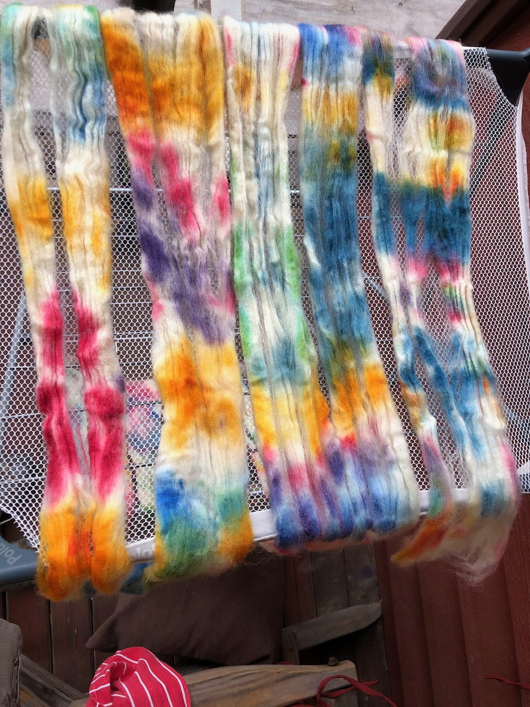
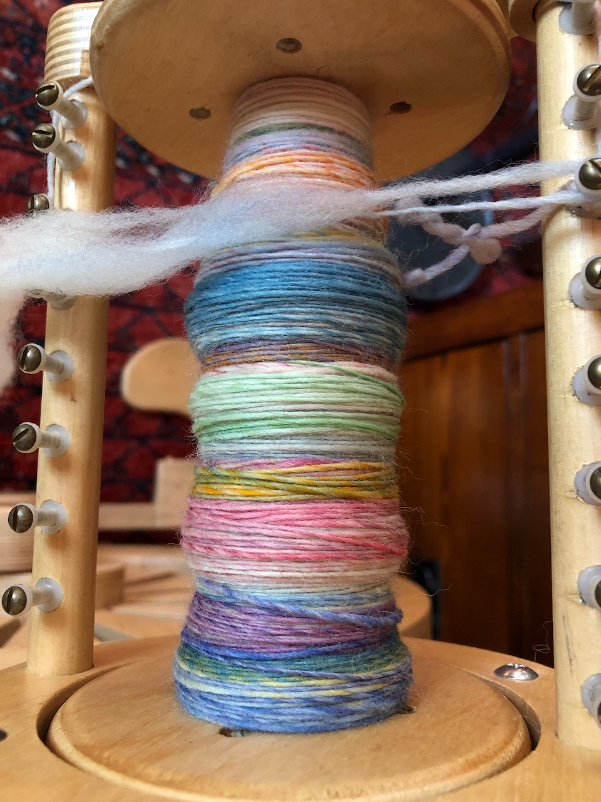
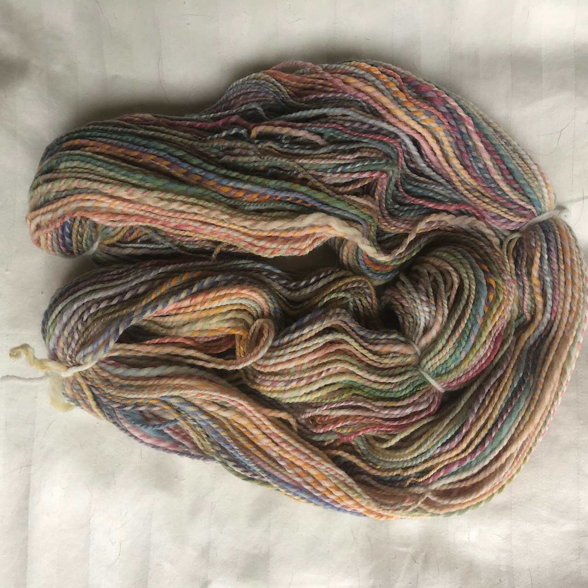

Until fairly recently, in Western cultures where textiles are ubiquitous in clothing, house furnishings, safety equipment, and many other contexts, spun fiber was an absolutely fundamental aspect of life. I say "until fairly recently": spun fiber is still everywhere all around us, but there are now emerging high-tech fibers that are extruded and don't require spinning. Nonetheless, to create usable thread, string, rope, yarn, cord, etc. in the wide range of sizes, strengths, and material properties that we rely on, spinning is still an essential technology.

What is spinning? Spinning is the process by which multiple individual fibers (of wool, silk, cotton, bamboo, plastic, whatever) are twisted together to make a composite strand that is stronger than an untwisted bundle of fiber. It's stronger because the twist prevents the individual fibers from sliding past one another, thus creating tensile strength; when multiple strands are plied together, the resulting fiber resists abrasion and can be both lighter and stronger than a single strand on its own. It is a metaphor for collaboration: the more so because if you twist too tightly, the yarn becomes fragile and tends to tangle.

Until the invention of the spinning frame in the late 18th century, all textiles were produced from yarn spun by hand on either spinning wheels or hand spindles. This is astonishing to imagine, particularly when we reflect on the quantity of cloth needed to create garments, household linens, sails for naval vessels, upholstery. As Abby Franquemont notes in describing the [production of textiles in the Peruvian Andes](http://abbysyarns.com/webshop/2007/01/02/drop-spindle-plying-on-the-go-more-plying-tricks-from-the-andes/), in a yarn-producing culture the production of yarn by spinning is more or less an around-the-clock operation: unless you're doing something that occupies both of your hands, you are probably spinning. I imagine that for many women, in the days when textiles were largely produced at home, that was likely to be the case.

Why do I care? Spinning for me is a hobby (a non-essential activity undertaken for personal enjoyment) but it is also an opportunity to increase my awareness of the made quality and properties of the world around me, even in small ways. Why do some sweaters pill? What's with the recent availability of merino wool undergarments? And it's an opportunity to create beauty and meditate on process, both of which help to settle my brain and make me less grumpy. 

These three photos show the process from unspun fiber, through the spinning process, to the finished product:
{:height="400px"}
{:height="400px"}
{:height="400px"}