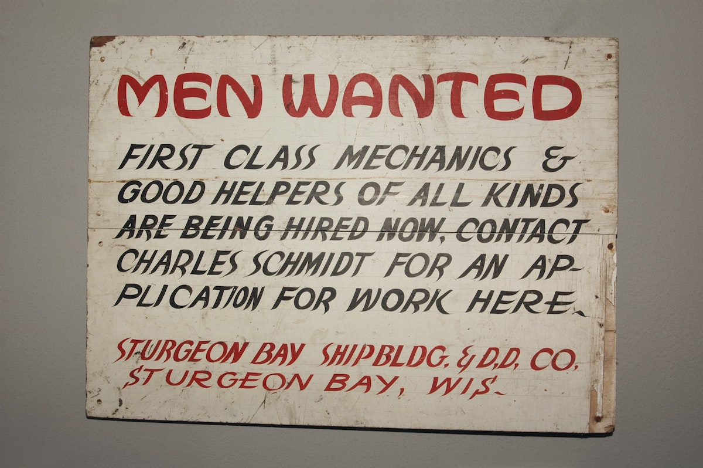

In this second part of the series I will cover some considerations on the financials of a potential investment.  

You can find part 1 [here][46].

# Letter A 

> Photo by Rich Smith on Unsplash

In the [previous article][31], we covered letter P, i.e. the "What" of the business. We are now moving on to letter A, 
which stands for Accounting, i.e. the "How Much" of the business.  
This is where we can get an idea about the profitability (or even plain viability) of the business.

## Assumptions & Hopes 

A also stands for assumptions & hopes, sometimes known as the Business plan.

Let's see the [textbook definition][1]  
> A business plan is a formal written document containing business goals, the methods on how these goals can be attained, 
> and the time frame within which these goals need to be achieved.

The first thought that comes to mind is that of a long, [formal document][3]. A lot of time [spent typing rather than 
doing][2]. This tends to put a lot of people off.

They key thing to note here is that the business plan document is not the goal. The thinking and research that goes into 
it is. The document itself is just the prompt to trigger this process.

If the founder(s) have built the exact same business before and have deep domain knowledge, then a business plan is a 
wasted effort. They have all the answers in their heads.  
For everyone else it is a necessary exercise.

Let's cover some key aspects of the business plan creation.

### TAM & TM

> Photo by Jezael Melgoza on Unsplash

The [total addressable market][4] describes the size of the opportunity.  
Startups are all about growth. Knowing that the total market value has many zeros behind it, gets everyone very excited. 
Who doesn't want to ride the next rocket to the moon?

What is probably more important, though, is to realistically define the initial [target market][5]. Which cohort of 
customers would buy from this business in its first few years? Who are they? What are their 
characteristics and preferences? How many are they? Where can they be found, how can the business reach them?  

Depending on the nature of the business, the answers to these questions may be crystal clear. Or not. [1](#footnote_1)

The important bit here is to have a clear distinction between  
* the size of the TAM (when the business has reached world domination), and
* the possibly more humble initial TM (when the business will be struggling to make ends meet).    

Clearly identifying and defining the TM will keep the business' efforts focused. Once that segment of the market is 
captured, the business can apply the ["tip of the spear strategy"][6] and expand to other TAM segments.

### Competition

> Photo by sergio souza from Pexels

Another important bit of this exercise is identifying the competition. The previous step identified the size of the pie,
this one shows how many are eating from it.

It might be tempting to just skip; identifying competition is a bit like finding hurdles. True.  
However, [identifying competitors][7] can lead to some useful qualitative conclusions both for the founder and potential 
investors.   
* **Validation of the opportunity**  
Having other businesses in the same space is a confirmation that there are customers willing to pay for the product
or service. 
* **Competitive opportunity**  
The identified competitors' short-comings and mistakes are opportunities to take advantage of (and pitfalls to avoid).
* **Customer awareness**  
A corollary of the above is that customers are already aware of the product type.
It is a very different effort to market [something invented than something innovative][8] (hint: inventions take much 
more customer education).
* **Pricing reference**  
Determining what is fair value from a customer's point-of-view may turn out to be a long, hit-and-miss process. 
Having one or more reference price points greatly accelerates the [price discovery][9] for the new offering. 

With regards to the actual quantitative outcome of this exercise, there are 3 possibilities.    
* **No competitors**    
This could mean that the business is very early, the beginning of a new big thing. It could also signify this is 
something that noone wants.     
In this case it takes conviction (on the part of the founders) and persuasion (for both customers and investors) to 
believe the offering is something useful and valuable.
* **Some competitors**  
This is a validation that there is a market. In this case winning is a matter of execution. 
* **Crowded market**  
Qualifying the word "crowded" is a bit subjective.  
In general if it is a crowded and small market it might not be a good sign (i.e. all competitors' revenue is small). Or 
it could be that a single company disproportionately dominates the market (e.g. Google and online search). 
This is especially true if this new business does not have a true differentiating factor. If the market is huge, it is a 
different discussion; there is probably space for one more competitor.

Identifying competition is not meant to dissuade from trying. Having competitors in a field is actually a good thing. 
It will help keep the business' efforts grounded and focused. 

### Pricing  

> Photo by Kate Trifo from Pexels

One of the most important questions to answer is: *How do we charge for this and (hopefully) make money?*

The first aspect is "how much".  
This can be answered more easily if there are already players in the market. Looking at their prices, can provide some 
data points to use as a basis and guide. Then combining that information with its competitive advantage, the business 
can decide its pricing strategy  
* **Undercut**  
If the business is more efficient (e.g. through automation), then it can go to market with lower prices than the 
competition.
* **On par and above**  
If the offering is genuinely superior to everything else, then the business can go with higher prices. In many sectors 
and for many customer cohorts higher prices are part of the [brand equity][32].

Once pricing is decided, the business needs to decide on the revenue model. Luckily, there are not that many to choose 
from, only 2: [per purchase and subscription][10]. 

The first one is straight-forward and as old as time itself. Make a sale and get paid. This can be either the full price 
(if a producer/provider) or a percentage (if a middleman).

The subscription model is getting more and more attention lately. All kinds of businesses are moving into 
this model (from [subscription latte][33] to subscription razors).  
The main reason for this shift is the predictable [revenue stream][11] and (to an extent) the [counter-cyclicality][12] 
of subscriptions. [2](#footnote_2)

Constructing [pricing models][13] for subscription businesses has started to [resemble a science][14]. In most cases, 
businesses offer an initial [freemium][15] tier (to get feet "through the door") and then follow 
a ["Johnnie Walker"][16] pricing structure. [3](#footnote_3)

### Customer acquisition

> Photo by Jose Francisco Fernandez Saura from Pexels

A customer is usually considered an asset: "get them through the door and count the money". But if acquiring customers 
is too expensive, then they can become a liability.  
The business plan is essentially the complex answer to the following simple equation   
> ACoP = LTV - CAC

where ACoP is "Any Chance of Profitability".

Let's see the other 2 components in more detail.

#### CAC

Or Customer Acquisition Cost.

A few [companies out there][17] have such a strong brand that their [CAC][18] is unbelievably close to zero. 
The more people buy their products and services, the more they are delighted and spread the word. Their connections 
follow them and we have a [virtuous cycle][22].  
For every other company customer acquisition is a hard and expensive business. In fact most startups, whether [B2B][20] 
or [B2C][21], are just a covert wealth transfer mechanism: from customers and investors [to Google's and Facebook's ad 
revenue][19].

The first question to answer is *How are customers going to be acquired?*.  
The company will not have Tesla's brand from day 1, so it will have to somehow attract customers. Which brings us to the 
different [customer channels][35]. [4](#footnote_4) 

From a "costs and numbers" point-of-view, we can distinguish these channels in 2 broad categories. 

* **Online**  
Online customer acquisition is almost a [new science field][36]. It continuously grows and spurs new completely different 
verticals. Each one with its own considerations and expense profile. A quick list  
  * [Organic SEO][42]: The business is attracting attention based on the content it produces 
  * [Keyword auctions][38], [PPC][37] and [banners][39]: Displaying advertisements on search results and platforms, after 
  price bidding for the slot. The actual bidding mechanism may be [completely different][40] for each platform.  
  * [Affiliate networks][41]
  * [Influencers][43], the evolution of affiliate networks for a video-first age

* **Offline**  
This is all types of old-school marketing. A non-exhaustive list of offline channels  
  * Traditional marketing: TV, radio and print advertisements, outdoor signage,...
  * Trade shows and conferences: This has traditionally been the most efficient way to get a lot of people's focused 
  attention. It remains to be seen what will happen post-COVID.
  * In-person meetings: From in-person [drug marketing][44] to pre-sales demos and "warming up" decision-makers in the 
  enterprise space 

The second question to answer is *How much will it cost?*.

Online is almost always on a pay-as-you-go basis, which is friendlier to company cash flow. However due to large 
competition for advertising space auctions, the business can easily have runaway marketing costs. It is important to 
have realistic [projections and estimations][45] for online CAC.   

Offline marketing tends to be upfront investment, in large chunks. For example printing leaflets, running a radio 
campaign, setting up a kiosk and exhibiting at a conference. The important thing is to have realistic estimations as to  
* how much offline marketing will cost (this implies some knowledge of the marketing space prices)
* how much offline marketing *should* cost in order to be effective. [5](#footnote_5)   

#### LTV 

The other side of the equation is the [Lifetime Value][23] of the Customer. How much revenue does the business expect to
receive from the average customer?

If the business is operating under a subscription model, how long is the customer expected to stay loyal? Will she 
upgrade the subscription at some point? Or purchase add-on services?

If operating under a "per purchase" model, is the customer expected to return and buy again? How many times and how 
often will this realistically happen?  
Will the customer's return happen organically (i.e. returning by herself) or will the company need additional CAC spend?  

The answer to the LTV question is the correct combination of  
* **Pricing**  
I.e. how much is the customer expected to pay while transacting with the business? Are the add-on services and upgrades 
priced in an attractive way?
* **[Customer churn][24]**  
What probability is there for the customer not returning? Or to flip the question, how will the business make sure that 
the customer is so delighted that they will be loyal and continue generating revenue? 

Customer churn is the harder of the two to nail down correctly.  
Depending on the type of business churn's importance can range from critical (e.g. subscription, like Netflix) to almost 
irrelevant (e.g. selling high-volume-low-cost items on Amazon).   

### Hiring and costs

> Photo by Jen Theodore on Unsplash

Without the right people, the job cannot be done. Without the right tools and services, the job cannot be done. Both will 
somehow need to be paid. 

Let's start by tools and services. This includes everything from cloud infrastructure to payroll software and ISO 
certifications.  
The same business plan can be capital-intensive with costs front-loaded (e.g. purchase of a $5000 server). Or it can 
optimise for future cash-flow (e.g. leasing of the same server for $500/month).  
Unless there is a really good reason, purchasing rather than leasing/renting is usually a bad sign for the business.  
Optimising cash-flow pretty much [trumps everything else][25] in the list of priorities.  

The second important aspect of costs, sometimes the highest, is people. [Hiring talent][34] is super-important to 
deliver any plan.  
Hire too early and you end up wasting money and time managing and interacting with people who have little to do. Hire 
too late and you cannot deliver.  

New joiners in a hiring plan are not just costs. They are tied to specific business milestones; both to drive them as 
well as re-act to. For example, a new salesperson will drive up customer bookings, whereas new customer success agents 
will retain the customers *after* the bookings have materialized. 

### Revenue & Projections

> Photo by Lukas from Pexels

The most important deliverable of this whole process is the cash-flow spreadsheet for the next couple of years. One can 
be creative with words, but there is little hiding behind numbers.

From a founder's PoV there is bias to action and the only resource in abundance is time. So there is a natural tendency 
to just start doing and [figure things later][26]. This is perfectly fine; it is the doing that brings results, not the 
thinking per se. 

From an investor's PoV, though, the cash-flow spreadsheet is one of the few ways to truly peer into the company's strategy. 
This is not because it is a crystal ball. Nor because everything will go according to plan.  
Instead, all of the strengths, assumptions, hopes and blind spots of the business' strategy have been crystallized in 
the numbers.  

If the [burn rate][27] is too big, then revenue targets will probably be unrealistic in order to cover it. Or perhaps 
the CAC is incredibly optimistic. Or a crucial expense has not been included (e.g. regulatory obligations).

A careful read and close scrutiny are a much cheaper way of gaging the business' future, than investing capital and 
waiting to see how things turn out.   

## Runway & Funding rounds 

> Photo by Darli Donizete from Pexels

Few businesses are profitable from the get-go. Even fewer make enough profits to fund rapid growth and expansion. The 
rest will need additional funding in order to live another day and keep growing. 

This introduces us to two important concepts: [runway][28] and [funding rounds][29].

The runway is the length of time a company can continue operating before running out of cash. In plain words it is  
> Runway = cash in the bank / monthly burn rate

If the business is profitable, then the burn rate is zero, i.e an infinite runway. However, increased investment for 
growth (hiring, marketing, capex for new products,...) may exceed current profits and cash in the bank.  
If the burn rate cannot be reduced (i.e. expenses reduced, revenue increased or investment postponed), then the 
cash in the bank needs to be increased. This means additional funding rounds.

Completing a funding round is a full-time job on its own for the founders. [6](#footnote_6)  
They may need to reach out and have meetings with tens - if not hundreds - of prospective investors. This 
involves pre-work of preparing performance data reports, legal paperwork, answering questions,... This process takes a 
few months to complete (more often than not).    
As a consequence, during a fund raise, there is reduced ability to look after and grow the business itself. 

If the runway gets suddenly shortened, raising additional funds is not something that can just be started on a whim. 
It takes careful planning, well in advance. When going out for a fund-raise, the business must have a clear set of 
milestones and future dates when it would go out for the next one.

# In our next episode

> Photo by Anthony from Pexels

In the [next article][47] of this series, we will discuss letters I (Innovation, the "What is New" of the business) and D 
(Distribution / Delivery, the "How" of the business).  
Keep safe!

## Footnotes

1. Another simplistic example.  
The TAM of coffee drinkers around the world is just enormous. But the serviceable and target markets are completely 
different when considering a neighborhood coffee shop and a coffee-at-home subscription service.
2. In plain words, as a consumer you are more likely to "forget" that you have a subscription 
for something, than if you pay for it each time. This helps smooth out the ups and downs that consumers' financial 
situation has on the company's balance sheet. It also makes customers a more reliable "asset" in the subscription business' books.
3. Where the bottom tier has just-about-enough features for a lower price (red label) and the 
top tier(s) a full feature set (with diminishing customer value) for a much higher price (blue label). This guides the 
subscriber to the middle option(s), which look like the best value-for-money (black label).
4. The mechanics of customer acquisition will be discussed in a bit more depth in the next 
article of this series.
5. For example, if the business depends on industry events and conferences for marketing, what 
type of exposure would an annual budget of £1000 get it?  
6. I will cover funding rounds in more detail in a subsequent part of this series.

  [1]: https://en.wikipedia.org/wiki/Business_plan
  [2]: https://knowledge.wharton.upenn.edu/article/burn-the-business-plan/
  [3]: https://www.princes-trust.org.uk/help-for-young-people/tools-resources/business-tools/business-plans
  [4]: https://en.wikipedia.org/wiki/Total_addressable_market
  [5]: https://en.wikipedia.org/wiki/Target_market
  [6]: https://cdixon.org/2010/12/26/the-thin-edge-of-the-wedge-strategy
  [45]: https://en.wikipedia.org/wiki/Startup_accelerator
  [7]: https://www.bizjournals.com/bizjournals/how-to/growth-strategies/2016/05/6-advantages-to-knowing-your-competition.html
  [8]: https://www.uk-cpi.com/blog/the-difference-between-invention-and-innovation
  [9]: https://www.investopedia.com/terms/p/pricediscovery.asp
  [10]: https://redvike.com/subscription-vs-purchase-business-model/
  [11]: https://corporatefinanceinstitute.com/resources/knowledge/accounting/revenue-streams/
  [12]: https://www.investopedia.com/terms/c/countercyclicalstock.asp
  [13]: https://gocardless.com/guides/posts/subscription-business-model/
  [14]: https://www.zuora.com/guides/defining-a-winning-subscription-pricing-model/
  [15]: https://en.wikipedia.org/wiki/Freemium
  [16]: https://en.wikipedia.org/wiki/Johnnie_Walker#Blends
  [17]: https://www.marketingstrategy.com/marketing-strategy-studies/how-tesla-used-a-0-marketing-strategy-to-dominate-a-market/
  [18]: https://neilpatel.com/blog/customer-acquisition-cost
  [19]: https://techstartups.com/2019/10/26/startups-spend-almost-50-percent-investments-facebook-google-ads/
  [20]: https://www.shopify.co.uk/encyclopedia/business-to-business-b2b
  [21]: https://www.investopedia.com/terms/b/btoc.asp
  [22]: https://en.wikipedia.org/wiki/Virtuous_circle_and_vicious_circle
  [23]: https://en.wikipedia.org/wiki/Customer_lifetime_value
  [24]: https://www.investopedia.com/terms/c/churnrate.asp
  [25]: https://www.gapcap.co.uk/whats-biggest-sme-killer/
  [26]: https://www.cbsnews.com/news/go-ahead-write-a-killer-business-plan-just-be-willing-to-tear-it-up/
  [27]: https://www.investopedia.com/terms/b/burnrate.asp
  [28]: https://www.oreilly.com/library/view/the-agile-startup/9781118744482/xhtml/Chapter04_11.html
  [29]: https://www.investopedia.com/articles/personal-finance/102015/series-b-c-funding-what-it-all-means-and-how-it-works.asp
  [30]: https://www.investopedia.com/terms/e/equity.asp
  [31]: https://sgerogia.github.io/Angel-investing-Part-1/
  [32]: https://www.investopedia.com/terms/b/brandequity.asp
  [33]: https://www.bbc.co.uk/news/business-54012055
  [34]: https://sgerogia.github.io/Hiring-a-Great-Technical-Team-Part-1/
  [35]: https://www.planday.com/blog/12-customer-acquisition-channels-and-how-to-choose-the-right-ones/
  [36]: https://scholar.google.co.uk/scholar?q=online+customer+acquisition+scholarly+articles&hl=en&as_sdt=0&as_vis=1&oi=scholart
  [37]: https://www.wordstream.com/ppc
  [38]: https://support.google.com/google-ads/answer/142918?hl=en-GB
  [39]: https://blog.bannersnack.com/banner-advertising-basics/
  [40]: https://pattern.com/blog/google-vs-amazon-advertising-whats-the-difference/
  [41]: https://money.howstuffworks.com/affiliate-program1.htm
  [42]: https://www.321webmarketing.com/what-is-organic-seo
  [43]: https://www.theeword.co.uk/blog/what-is-influencer-marketing-and-how-does-it-work
  [44]: https://www.nih.gov/news-events/nih-research-matters/how-drug-marketing-may-influence-prescriptions
  [45]: https://www.forentrepreneurs.com/startup-killer/
  [46]: https://sgerogia.github.io/Angel-investing-Part-1/
  [47]: https://sgerogia.github.io/Angel-investing-Part-3/