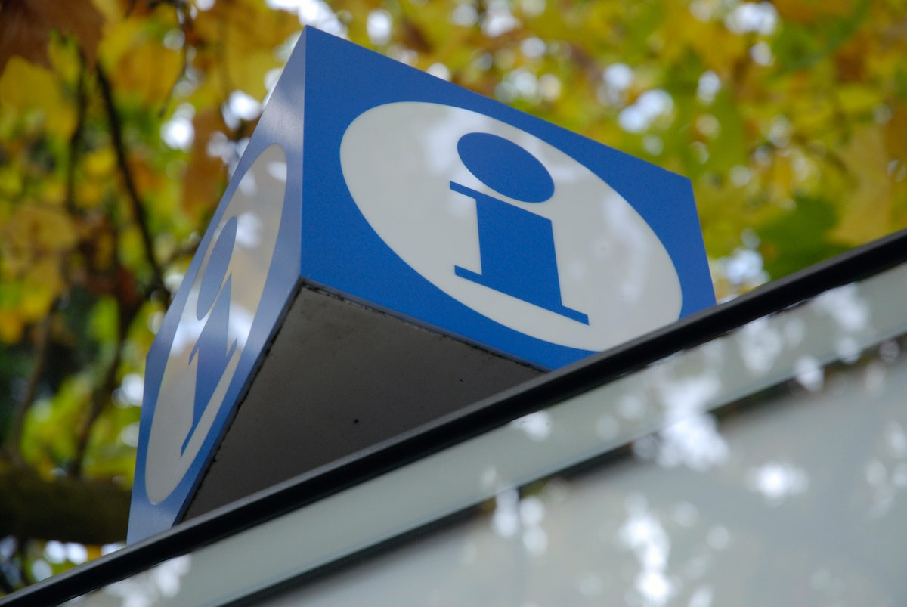
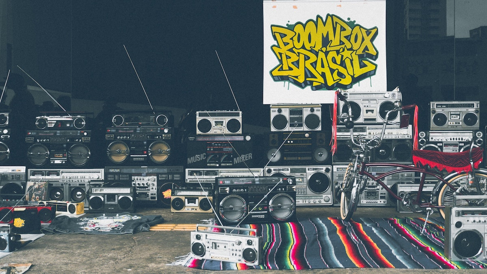

In the third instalment on angel investing, I am discussing the business' defensible moat and its distribution mechanisms.  

You can find part 1 [here][1] and part 2 [here][2].
 
# Letter I

> Photo by Thea M. on Unsplash

I stands for Innovation.  
In [part 1][1] (letter P) we discussed the "What" of the business. I.e. whether the business is  
* solving a Problem, and  
* creating a Product, improving a Process or creating a Platform.  
  
In this section we are considering how innovative the business is, in order to differentiate it from the competition.  

Let's look at the textbook [definition][3] of innovation    
> Innovation is commonly defined as the "carrying out of new combinations" that include "the introduction of new goods, ... 
> new methods of production, ... the opening of new markets, ... the conquest of new sources of supply ... and the 
> carrying out of a new organization of any industry". ... Some common element in the different definitions is a focus on 
> newness, improvement and spread.  

That was a long one!

The key word to note here is "Combination". Combination of existing technologies, services and processes. To better 
qualify this definition, there are 3 key questions to answer. 

* **How does it differ from everything else out there?**  
In almost all cases, the endgame is for the business brand to become the differentiating factor. Until the brand name is 
built, the business needs to attract customers. How is this product/service tangibly different to every other competitor?  
For example, the first [app-based banks][4] were truly innovative. Using a mobile device alone was a completely different 
approach to the formation of the banking relationship. It also caused a radical rethink of the [banking channels][14] 
model. [1](#footnote_1) This made them completely different, compared to incumbents.   
With the number of neobanks growing, both in the [personal][5] and [business][6] banking space, the "innovation 
differential" is inevitably becoming smaller and smaller.
     
* **What is the USP of this innovation?**  
This question is a corollary of the above.  
At its core, the innovation probably results in cost savings and a more [profitable operation][2] for the business itself. 
A "loss-making innovation" would sound like a 3-word joke. In the case of neobanks, the "single channel" innovation 
resulted in radically smaller operating costs (no branches, less staff, simpler IT systems).  
But what are the tangible benefits for the customer?  
Is the customer's life made substantially easier? [2](#footnote_2) Are there economic benefits and incentives 
for the customer? If the benefits are limited, is there a convincing story or ["higher purpose"][15] that the innovation 
embodies, which would do the trick?      
Are the incentives and business story enough for the customer to adopt the offering (and also abandon the competitors)? 
Will the customer's perception and experience be superior to other offerings? How will that be?

* **How hard is it to copy the innovation?**  
How complex is the new product/service to create? [3](#footnote_3) 
Once launched, how trivial would it be for a competitor to copy and launch?   
Is the differentiating factor the complex application of technology, back-end processes, supplier relations, sleek UI, 
all of the above? Is it by any chance something that is already covered by an existing patent, real or [troll][16]? [4](#footnote_4)   
How long would it take someone else to figure things out, implement and successfully launch?

You may have noticed that this section is full of questions and provides few answers. That is because there is no 
prescription for innovation. Instead it is a slightly nebulous concept, sharing many similarities to the [economic moat][7] 
of mature companies.  
I think it is no coincidence that a lot of startups are touting Artificial Intelligence (AI) or blockchain and smart 
contracts as their innovation advantage in their pitch decks. These are equally powerful (when used correctly) as much 
as they are opaque to scrutiny from other stakeholders (if used incorrectly). They are easier to initially claim as 
innovative difference (and harder to actually apply in practice), 

What is truly innovative, purely depends on the particular circumstance and domain of the business. Just like with any 
defense structure - speaking of moats - you cannot prescribe what good innovation is in advance, before it is practically 
applied.  
But, over time, you can kind-of guess a [good moat][8] when you see it.  

## And a word on invention

> Photo by ThisIsEngineering from Pexels

It is worth noting that invention is different to innovation. Again, going back to the [textbook definition][10]  
> An invention is a unique or novel device, method, composition or process...  An invention that achieves a completely 
> unique function or result may be a radical breakthrough. Such works are novel and not obvious to others skilled in the 
> same field.

There is a key difference between [invention and innovation][11]. A true invention is harder to market and achieve wide 
adoption in a short-to-medium timeframe.

This is because of two key reasons:  

* **Creation of new processes**  
We may not realise it, but almost every item around us requires a number of processes built and tailored around it. From 
safety usage guidelines, to manufacturing processes and equipment to supply chains and economies of scale. All of these 
"secondary things" are what makes products accessible and profitable.  
A true invention may lack some or all of these from the get-go. 

* **Market recognition and adoption**  
Can the average customer be easily convinced to purchase the invention from day 1? If, according to the definition, an 
invention is *not obvious to others skilled in the same field*, what would it take to "make it obvious" for everyone? 
This is especially true if the invention is intended for the "man on the street" (B2C), rather than other businesses 
(B2B).  
Inventions require more time and customer education to be accepted, than innovations.

These points are **not** to say that businesses built around an invention are worthless. They merely highlight that the 
effort, conviction and dedication required by all stakeholders in invention businesses (founders and investors) are 
potentially much greater.   

Let's drive this argument home with a widely known example: Bitcoin.    
When the [Satoshi whitepaper][12] was first published in October 2008, Bitcoin had all the characteristics of an invention. 
If Bitcoin had been invented by a commercial enterprise, it would be impossible to market it as a money alternative, 
let alone true hard money. Other than a small group of cryptography enthusiasts, it was something completely new. That 
fictitious enterprise would have [probably gone bankrupt][13] for lack of traction, if viewed under a "conservative" lens.

Fast forward 12 years later.  
An ever growing number of *innovative* products and services are built around Bitcoin and
the blockchain: from smart contracts, to integration with the main financial plumbing, to exchanges and custodial 
solutions. Bitcoin now has firm and exponential traction with a growing part of the "market". [5](#footnote_5)    

# Letter D

> Photo by Arthur Mazi on Unsplash

The next aspect to consider is composed of 2 somewhat related aspects. 

## Distribution

Distribution is the "Where" of the business. I.e. where does the business "meet" its customers.  
This is broken down in two interrelated concepts: customer service and customer acquisition.

Let's give an example of a completely fictitious product to highlight and discuss these concepts. [6](#footnote_6)
 
> The business is using [OpenBanking][17] to allow one-click checkouts and payments in **physical retail stores**; the
> intention is to replace cards.    
> When paying, the customer is presented with a QR code to scan with her smartphone. This triggers an [OpenBanking 
> authorisation][18] and completes the payment from customer to merchant. 

### Customer service

> Photo by Jopwell from Pexels

The first element of distribution is serving customers.  
The key questions to answer here:   
* What will be the channels or touch-points through which the business serves its customers?
* How will the product/service be delivered and used by customers? Will the channel be a digital or a physical one? 
* Can the business confidently implement the channel and easily scale it, once it gains traction? 

In the example product above (OpenBanking checkout) the distribution channel almost stands out: mobile. The customer will 
be using a mobile app (or a mobile site in an MVP) to scan the QR code and start the payment process. 

This electronic channel requires some specific skills from the company. Namely    
* Mobile development engineering: probably adding support for both iPhone and Android
* UX design: ensuring a seamless user experience across all platforms 
* Backend systems engineering: secure communications end-to-end, data handling, connectivity to banks etc to support the 
transaction.

This also points to 2 different things:  

* **App installation**  
(If the company chooses the mobile app route) The only way of getting an app on consumer's phones is via the major 
[app stores][20]. This means establishing a relationship with Apple/Google and ensuring that the app conforms to their T&Cs.

* **Customer support**  
The mobile app is the "way in" to the payments system for the consumer. It will also be the main channel for support in 
case things go wrong. This means that the app must provide a straight-forward way for company support agents to 
communicate with (and solve issues of) the payer.

The payer mobile app is not the end of the story in this example. There is another distribution channel which is crucial 
for the success of the business: the "physical presence" in the merchant's store.  
This is a requirement for the generation of the QR code for the shopper.  
Generating the QR code could be done in a number of ways: a small tablet where the merchant types in the price, maybe 
something connected to the existing [POS terminal][19] or something else.

So our fictitious payments business must also be able to do the following:
    
* **Merchant partnership**  
The business will need to establish a partnership with the merchant, by giving them incentives to join the network. For this, the  
business may offer some initial discounts and promotions to joining merchants (see next section).  
This example business is in money processing, so there are requirements to assess the merchants' legality. This means 
that our business will need to have [KYC][22] and [AML][23] processes to ensure merchants are fit to join the network.   
After joining, the business needs to make sure that the merchants stay partnered.  
For this our business would need to have a merchant engagement strategy, with regular communications, gathering of NPS 
scores etc.   
feeling valued 

* **Device procurement and installation**  
If the business chooses a physical device to generate the QR code
it will need to create a supply chain to get it to the hands of the merchants
design, produce, order and ship it, all in a timely manner so that there are no delays

* **Merchant support**    
After the merchant has joined 
need to offer support
from the moment they unpack and try to install the device 
to many months later when the system is down 
or they have questions about a payment

It becomes clear that our fictitious business has the characteristics of a [Platform][1], 
as defined in [Part 1][1] 
Therefore it needs to establish and maintain 2 separate customer service channels  

### Customer acquisition 

> Photo by Adli Wahid on Unsplash

We touched upon the economics of customer acquisition when [discussing CAC in Part 2][21] 
This section is about the mechanics and the rationale

To put it simply 
for a business to acquire customers, the customers need to know the business exists 
for this to happen 
the business needs to 
* know who the customers are 
* know where they are, and 
* draw their attention 

#### Identifying customers

Not serving everyone from the get-go
At its first steps the business needs to focus on specific customer cohorts 

2 ways of identifying and singling out 

Quantitative 
cohort analysis
https://clevertap.com/blog/cohort-analysis/
Helps define depth and breadth of the target market 
aspects of their behaviour 
income, age, percent of population
or in the case of b2b characteristics of the business (size, revenue,...)  
help identify specific market segments to focus on

Qualitative 
customer personas
https://www.usertesting.com/blog/customer-personas
More fine-grained 
based on observation, experience, intuition 
deep-dive on customer motivations, drivers, wants and needs
habits, where to target them  
In the case of b2b 
roles in the customer organisation who would be champions and decision-makers (https://blog.close.com/b2b-sales-tips-internal-champions-decision-makers/) 

#### Customer location

As close as possible to the point that the need for the product or service materializes 

* **Online**  
Most obvious is online 
push content: advertisements in high-traffic websites (e.g. Facebook, Google, news sites)
pull content: The business is attracting attention based on the content it produces 
i.e. content that customers are actively looking for 
[Organic SEO][42] blog posts that the business itself is creating
[Affiliate networks][41] and [Influencers][43] trusted third parties generating content on behalf of the business 
  
content vs references

* **Offline**  
The importance of offline advertising is thinning over time, as people come to see the real world as a disruption to 
their online activity.  

For specific non-digitally native customer segments (e.g. baby boomers and early GenX'ers)
Offline maybe the only still has value to reach

This is all types of old-school marketing. A non-exhaustive list of offline channels  
  * Traditional marketing: TV, radio and print advertisements, outdoor signage,...
  * Trade shows and conferences: This has traditionally been the most efficient way to get a lot of people's focused 
  attention. It remains to be seen what will happen post-COVID.
  * In-person meetings and calls: From in-person [drug marketing][44] to pre-sales demos and "warming up" decision-makers in the 
  enterprise space 

Finally another offline way of getting attention is "copy behaviour" 
is a stand-out product feature 
which make it easy for other consumers to spot 
classic examples are [apple headphones][https://www.businessinsider.com/why-are-apple-headphones-white-2016-5]
and [brightly coloured cards][https://www.wired.co.uk/article/monzo-card-design] for neobanks 

#### Conversion

incentives vs brand story 

streamline acquisition 
freemium 

tracking and monitoring

The third question to answer is "How do I know that I am not throwing money away?"

The second question to answer is *How much will it cost?*.

Online is almost always on a pay-as-you-go basis, which is friendlier to company cash flow. However due to large 
competition for advertising space auctions, the business can easily have runaway marketing costs. It is important to 
have realistic [projections and estimations][45] for online CAC.   

Offline marketing tends to be upfront investment, in large chunks. For example printing leaflets, running a radio 
campaign, setting up a kiosk and exhibiting at a conference. The important thing is to have realistic estimations as to  
* how much offline marketing will cost (this implies some knowledge of the marketing space prices)
* how much offline marketing *should* cost in order to be effective. [5](#footnote_5) 

# In the next episode

> Photo by Kaique Rocha from Pexels

Talk about 
the letter T (Team, the "Who" of the business)
and discuss your approach as an angel 

Keep safe!

## Footnotes

1. No channels to fall back on for redundancy, no ability to "paper over" technology's gaps with 
a visit to the local branch.
2. This question inevitably takes us back to the identification of a tangible [customer problem][1].
3. To be clear, I am not talking about complexity of usage. The product could be the most 
complex thing internally, but on the outside it should be [as simple as possible][9].   
4. If this is indeed the case, it *might* become a problem once the business grows in size and 
becomes successful. The existence (or not) of patents really does not matter in the early stages. Unless, of course, the 
business model is built [around patents][1].  
5. I am using the word market in the widest possible sense: from companies and government 
institutions to the general public. 
6. In this context, let's disregard every other aspect which could make this particular 
example venture unfeasible.

  [1]: https://sgerogia.github.io/Angel-investing-Part-1/
  [2]: https://sgerogia.github.io/Angel-investing-Part-2/
  [3]: https://en.wikipedia.org/wiki/Innovation
  [4]: https://en.wikipedia.org/wiki/Neobank
  [5]: https://moneytothemasses.com/banking/the-best-app-only-bank-in-the-uk
  [6]: https://www.dumbfunded.co.uk/app-based-business-banking/#Quick-Compare-Business
  [7]: https://www.investopedia.com/ask/answers/05/economicmoat.asp
  [8]: https://en.wikipedia.org/wiki/Fortifications_of_Vauban_UNESCO_World_Heritage_Sites
  [9]: https://en.wikipedia.org/wiki/Antikythera_mechanism
  [10]: https://en.wikipedia.org/wiki/Invention
  [11]: https://www.uk-cpi.com/blog/the-difference-between-invention-and-innovation
  [12]: https://bitcoin.org/bitcoin.pdf
  [13]: https://hackernoon.com/the-amazing-story-of-cryptocurrencies-before-bitcoin-fe1b0e55155b
  [14]: https://howbankswork.com/banking-framework/channels/
  [15]: https://sujanpatel.com/marketing/7-companies-killing-brand-driven-storytelling/
  [16]: https://www.investopedia.com/terms/p/patent-troll.asp
  [17]: https://www.openbanking.org.uk/customers/what-is-open-banking/
  [18]: https://sgerogia.github.io/OpenBanking-Part2/
  [19]: https://en.wikipedia.org/wiki/Point_of_sale
  [20]: https://en.wikipedia.org/wiki/App_store
  [21]: https://sgerogia.github.io/Angel-investing-Part-2/#:~:text=Customer%20Acquisition%20Cost
  [22]: https://complyadvantage.com/knowledgebase/kyc/
  [23]: https://www.investopedia.com/terms/a/aml.asp
