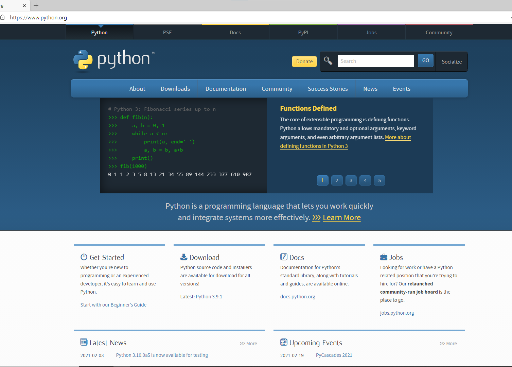
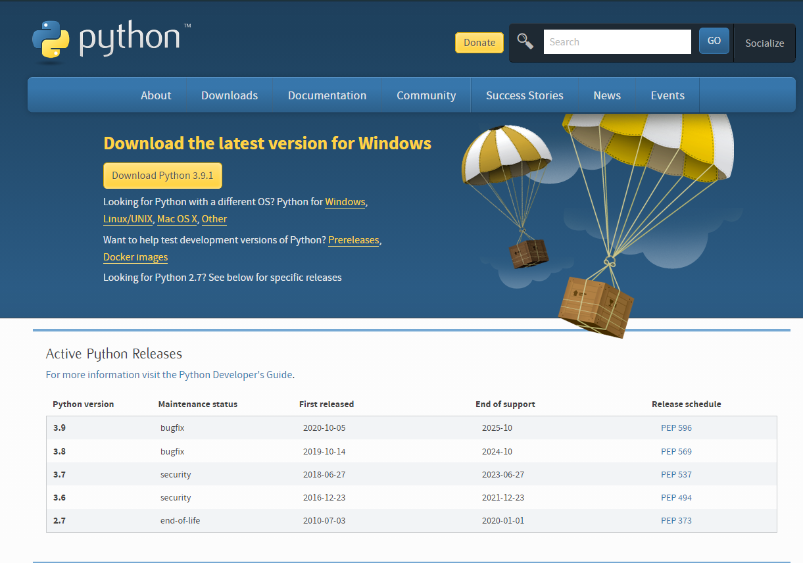
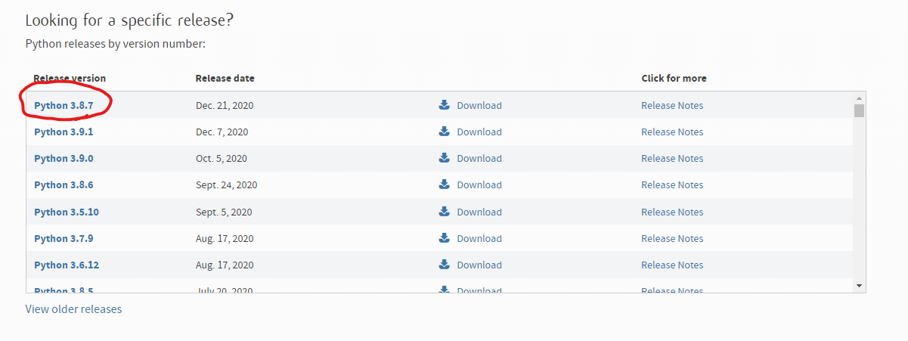

## 목차

- [1. 파이썬 환경 준비](#1-파이썬-환경-준비)
- [1.1. python 설치](#11-python-설치)
- [2. 파이썬 문법](#2-파이썬-문법)
- [2.1. 차이점](#21-차이점)
- [2.1.1 하지만](#211-하지만)
- [2.2. 자료형 선언](#22-자료형-선언)
- [2.3. 변수..?](#221-변수..?)  
- [3. 인터프리터](#3-인터프리터)

***

## 1. 파이썬 환경 준비

더도말고 덜도말고 포스팅이면 충분하다
> Alfonso  

이 시리즈를 끝낸다면,

지인들에게 적어도 "나 python작성할줄 안다! "  
라는 말을 **떳떳하게** 할수 있을 것이다.

***

### 1.1. python 설치

**이미 설치되어 있다면?**

자신이 환경변수가 무엇인지 알고, 그것을 편집할수 있다면
1.1은 건너뛰어도 좋다.

>그러나 잘 설치가 되었는지 자신이 없다면
>
>에서 망설임 없이 지워주자.
>python 관련 프로그램이 2개 있을텐데, 모두 지워줘야 한다.
>관리자 권한을 요청한다면, 두려워하지말고 주자.
>**단! 뭔가 이상하거나, 요청하는 이름이 다른 경우**
에는 일단 주지 말고,
mailto:jihu@sw-ms.gne.go.kr 을 눌러
이메일을 보내면 답변이 곧 올것이다.

코드 작성, 디버깅, 작동 확인 등...
이 모든걸 하기 전 일단 설치부터 해보자.

먼저 python.org 에 들어가자.

영어가 나왔다고 해서 당황하지말고, 차분하게 Downloads 를 누르자.

여기서 나오는 대문짝하게 나오는 3.9.1은 **비추천**이다. 호환되는 모듈 수도 적고, 최신 버전이라 안정화도 덜 되어있고....
~~속편하고 싶으면 조금 더 아래의 3.8.7을 눌러주자.~~

막상 들어가면 다운로드가 보이지 않을텐데, 원래 그렇다.

안심하고 스크롤을 내려 

이걸 받아주자. ~~에이설마 32-bit이 아직 있겠어;;~~

실행한후 먼저 가장 아래의 "add python 3.8 to path"를 누르고,

첫번째것을 눌러 설치하자. 중간에 권한을 요구한다면 허락해주자.
~~권한 없이 설치 가능한것은 그리 많지 않다.~~
설치가 끝났다면, path 추가를 마치기 위해 재부팅해주자.
***

## 2. 파이썬 문법

걱정하지 마시라, 상상 이상으로 쉽다!

그러나 여기, 짚고 넘어가야할 점이 있다.
만약 다른 언어를 배우다가 왔다면 아래를
참고하고, 아니라면 [여기](#22-자료형-선언)
을 눌러 가뿐히 넘어가자.

### 2.1. 차이점

파이썬은 자료형을 지정할 필요가 **없다**.

아니, 정확하게 말하면 지정해줘야 하는것도 있고,

필요없는것도 있다.
예를 들어보자.

~~~c
// c의 경우
int a = 10 //only number
println(a)
~~~

~~~python
#python의 경우
a = 10 #anything ex:1,a,[1,2,3]등등...
print(a)
~~~

**당연히** 다르다.

### 2.1.1. **하지만...**

***
둘 사이에는 중대한 차이가 있다. 바로 '='을 기준으로 C는 '='이전에 형태를 지정해야 하지만

python은 '='이후에 지정한다는 것이다.

>또한 print 명령역시 다르니 헷갈리지 않도록 조심하자.
***

### 2.2. 자료형 선언

~~~python
int_data=1
float_data=3.14
complex_data=1+5j
str_data1="I love python"
str_data2="반갑습니다"
list_data=[1,2,3]
tuple_data=(1,2,3)
dict_data={0:'False',1:'True'}
~~~

첫번째부터

정수 선언

실수 선언

복소수 선언

문자열 선언 (영어)

문자열 선언 (한글)

리스트 선언

튜플 선언

사전 선언이다.

여기서 꼭 변수명을 따라할 필요는 없으며, 그저 예시라는걸 잊지 말자.

**변수명에 따라서 자료형이 정해지는게 아니다!!!**

***

### 추가로

> 만약 이렇게 된다면 출력은 어떻게 될까?

~~~python
a = 100

a = 200

print(a)  #print는 출력하는 명령어이다. print(여기) 에 변수명을 넣어 출력할수 있다.
~~~

결과는

~~~python
200
~~~

왜 그럴까?

그 이유는 파이썬의 특징에서 찾아볼수 있다.

바로 위에서부터 실행된다는 점이다.
따라서 a에
100이 대입된후,

200이 다시 대입되어 print(a) 는 결국 print(200)
과 같게 된다.

따라서 200이 출력된다.

모든것을 외울 필요는 없다. 그러나 형식정도는 외우는게 좋다. ~~나중에 찾느라 엄청 고생한다~~
***

### 2.2.1 변수..?

별거 없다! 자료형 선언을 하고, 그 변수명을 활용하면 된다.

정말 어려울것 없다.

기본적으로는 이정도만 알아두면 된다.

**~~...사실 차고넘친다.~~**

## 3. 인터프리터

사실 이건 개인의 취향에 따라 선택하는것이 속편하다. 그러나 글은

[visual-studio-code](https://code.visualstudio.com)(이하 vs code)에 따라서 진행된다는걸 기억하자.

~~파이썬만 할거라면 pyCharm도 나쁘지 않은 선택이다.~~
>그러나 앞서 말했듯이 이 튜토리얼을 따라하기에는 좋은 선택이 아니다. ~~나쁘다~~

### 다음편에 계속
