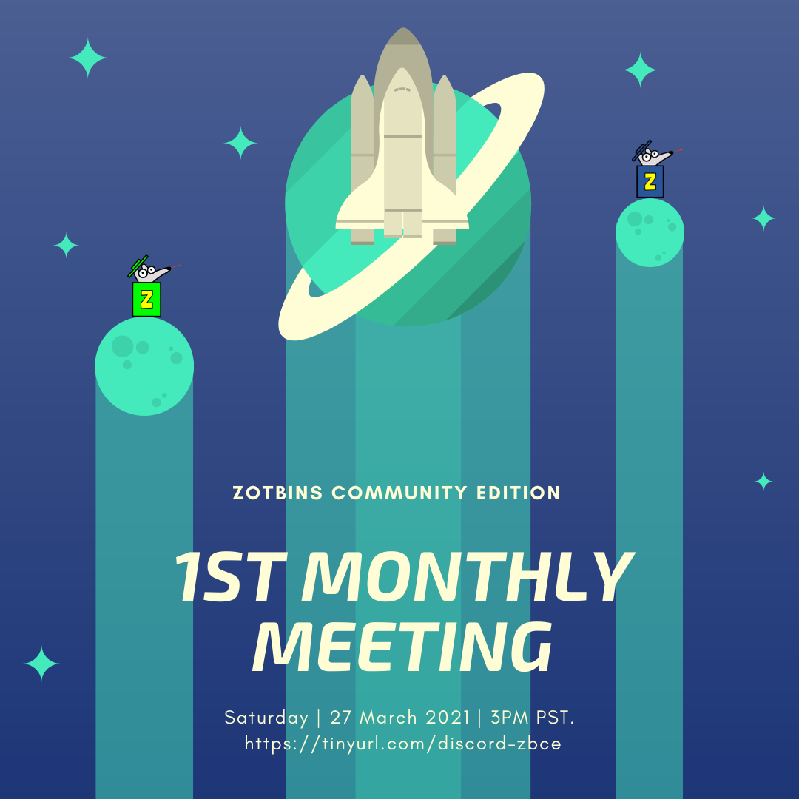
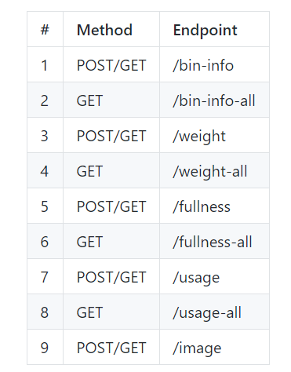
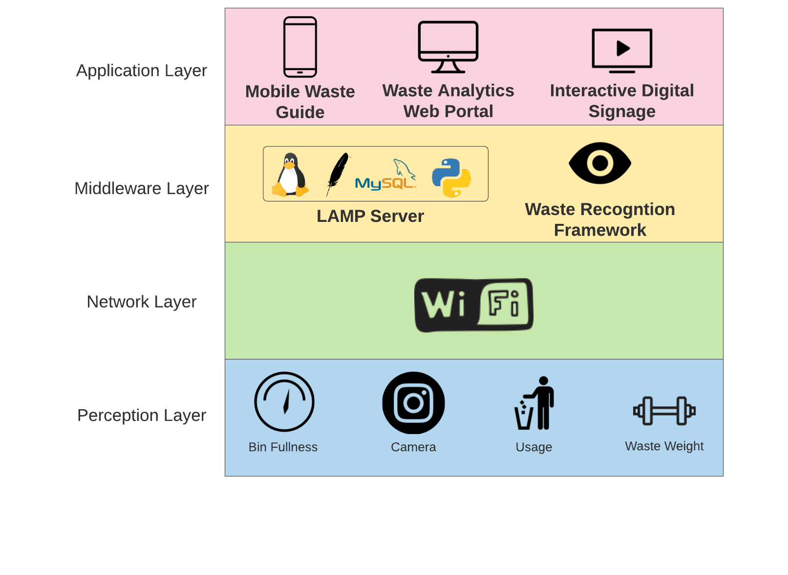
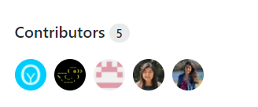
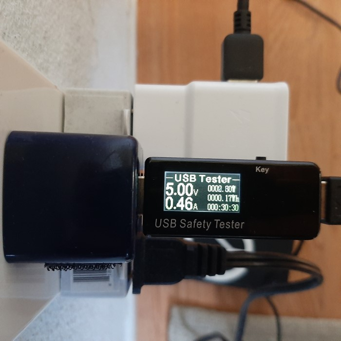
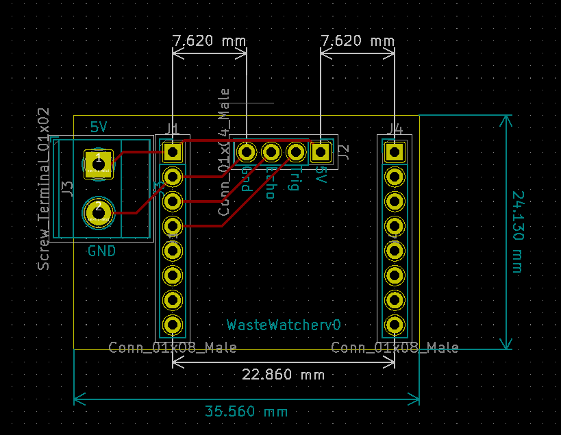
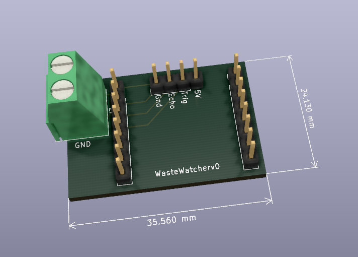
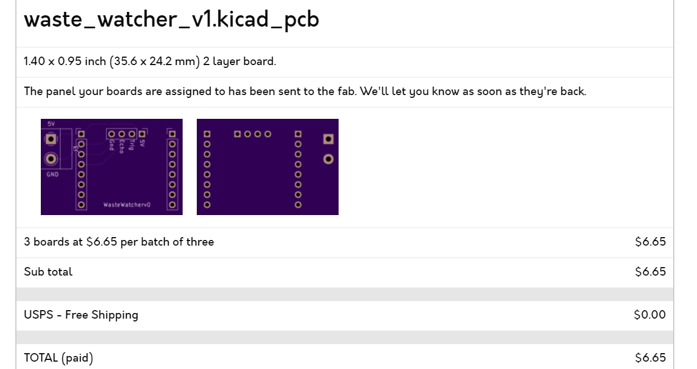

Hello! This month I had a lot of fun learning new things such as designing a PCB (Printed Circuit Board) and working with the UCI ZotBins Team to develop our API's. As mentioned in the previous blog, I wanted to finish phase 3 by the end of this month and I am happy to announce that we met that goal! As a reminder the goals of phase 3 was to (1) develop an IoT-enabled sensor module to collect all the waste data, (2) develop a working LAMP server with API endpoints, and (3) determine some basic data analytics to process our waste data. For more details about the different phases visit this link [here](https://boostnote.io/shared/14a9893a-d4d7-4e40-ac10-4dc1ab77e019).

I also want to start another phase before we go to phase 4. This in-between phase, will just be a testing and reviewing phase just to make sure that the prototype and system we developed are ready for other people/communities to adopt. However, before moving on to the next phases, I am going to take a break next month.

I hope you enjoy this month's blog and as always, feel free to leave a comment below or discuss anything in the [discord server](https://discord.gg/mGKVVpxTPr).

### 1st Community Monthly Meeting 3/27/21, 3PM PST. 🚀
I'm planning a get-together next month for our open-source community. It will be our first get-together like this and will be on 3/27/21 at 3PM PST. on the [discord server](https://discord.gg/mGKVVpxTPr).

Here's the plan!
- Welcome and Introductions (20 minutes)
- Logistics/Updates (10 minutes)
- Community Discussions (10-30 minutes)
- After Party: Hangout/board games

Hope to see you there! 😄

### Hosting Your own API's For Your Waste Data 📔
With the help of Patrick Nguyen, Aishwarya Bhandari, and Grace Choe, we were able to create some basic RESTful API's. In it's most basic sense, REST APIs allow us to communicate with our database to either request data or submit data. The two types of APIs we mainly used are POST and GET. POST APIs are the type of API's that allow us to **submit** data to our database. These APIs are mainly used by our [Waste Watcher](https://github.com/zotbins/waste_watcher) modules which can collect data such as bin fullness and send that number to our database. GET APIs are the type of API's that allow us to **receive** data from our database (usually in the form of a [JSON object](https://en.wikipedia.org/wiki/JSON)). These APIs are mainly used by any web-based applications we have such as a website that helps notify facilities management when bins are full. Below are all the APIs that we have created. You can find more details about the APIs in our [guide](https://github.com/zotbins/zbce_api/blob/main/api_guide.md).

Though creating APIs may not seem very exciting yet, it is still a necessary step that will allow us to have all sorts of applications. If you look at our 4-layer IoT Architecture in the image below, the APIs reside in the Middleware Layer (more specifically with the LAMP server) and will be the bridge of data flow between all the sensors in the Perception Layer and all the applications in the Application Layer. Being done with a some basic functioning API's, we can finally start testing ZBCE working as an entire system among all the layers. With that said, there are still some improvements to be made such as creating more APIs for data analysis and also transitioning to a faster Python Library called [FastAPI](https://fastapi.tiangolo.com/) instead of what we are currently using, [Flask](https://palletsprojects.com/p/flask/). Thanks Patrick for suggesting this!

Thanks again to all the contributors!

### Waste Watcher Power Draw Analysis Revisiting 🔋
In December 2020's [blog](https://zotbins.github.io/zbceblog/december2020update/) I observed that the battery operated [Waste Watcher](https://github.com/zotbins/waste_watcher) was operating for ~4 days with my 8,400 mAH power source when I expected the operating time to be about 2 weeks. The following suspicions I had from December 2020 were:

1. Flash LED was consuming power during Deep Sleep (I could see a dim light from the flash LED)
2. Flash LED might be on for too long when taking photos (sometimes for ~ 4 seconds)
3. HC-SR04 consuming power during deep sleep (I could actually hear some high pitched noises from the sensor during deep sleep)

So I bought this volt and current USB meter (shown in the image below) to observe the current draw during my active mode (when the ESP32CAM takes photos and fullness measurements). From my observations I learned that the main problem was item 2, where the Flash LED was on for too long. This is the main culprit because turning on the Flash has the highest power consumption where  45 mA - 740 mA is consumed (compared to 0.01 mA being consumed during deep sleep)! The problem is that if the image capture does not finish the flash will not turn off. I suspect there may be some internal operations of the camera where some filtering or processing is going on during certain lighting conditions that is stalling the image capture process. Or maybe there is a bug in my code 🙃. Regardless, I think there needs to be a timing implementation of my code to limit certain operations such as turning the flash on to prevent unnecessary power consumption.

I also discovered that the high pitched noise from suspicion 3, did not come from my ultrasonic sensor, but from my boost converter. According to this [blog](https://e2e.ti.com/blogs_/b/powerhouse/archive/2017/11/27/make-a-boost-converter-quieter) on Texas Instruments, "The multi-layer ceramic capacitors are the main source of audible noises." Ok, to be honest, I don't know what to do about that right now, and I'm not sure if it's a huge problem. The sound is barely audible, but I'm pretty sensitive to noise so it bothers me and will probably bother some dogs as well. I'll probably try some alternative power options by either having different boost converters than I am currently using or just coming up with new solutions that don't use boost converters. We'll see 😄.

### Designing a Custom PCB for Waste Watcher 📐

I actually had a lot of fun learning about custom PCB design. Why did I learn PCB design? I felt that if I ever wanted to scale ZBCE's [Waste Watcher](https://github.com/zotbins/waste_watcher) into deployable kits that anyone could adopt, then having a PCB is critical. It would allow me to create the circuits for all the [Waste Watchers](https://github.com/zotbins/waste_watcher) very quickly. Soldering the circuit by hand (what I'm currently doing right now) is fine for now, but soldering dozens of them could quickly become tedious and tiresome. Also, I'm human and will probably make a bunch of mistakes when soldering.

The software I decided to use was [KiCad](https://www.kicad.org/) because it was free and open-source. To learn how to design a PCB I decided to follow this tutorial [Designing a Raspberry Pi plugin PCB in KiCAD in 20 minutes](https://www.youtube.com/watch?v=PlDOnSHkX2c). The tutorial actually uses a older version of KiCad than what is currently available, but I was still able to follow along. However, for the smoothest possible learning experience I recommend using the same version of KiCad the tutorial uses.

I'm oversimplifying here, but here are some of the basic steps that allowed me to create my custom PCB for [Waste Watcher](https://github.com/zotbins/waste_watcher).

My first step was to create generate a schematic for my circuit. My circuit for this PCB was really simple since it only had 4 total components. Just some headers for the ESP32-CAM and the HCSR04 (ultrasonic sensor). I also included a header block for a 2 pin screw-terminal for my power supply. Once I had those components placed on the interface, I just connected them to how I wanted it to be. Simple!

![]../images/feb2021-images/schematic.png)

There are some extra steps after generating the schematic such as generating the netlist and assigning footprints and values to each component, but I won't go over that here. If you're interested just follow the tutorial linked above!

After my schematic was created, I got to do the PCB layout. This basically allowed me to place all the footprints of each component, dictate the cutout of the PCB, add labels, and route connections between pins as you can see in the image below.

After the layout I was able to view my PCB in CAD, which was probably the most satisfying part of the entire process. Even though this circuit is really basic, I was still really proud of it. This was an awesome experience and I'm working on developing these skills more and am working on more complex PCB's for ZBCE.

Finally, I also decided to order my PCB from a vendor in the United States. It's definitely hard to find manufacturers to make PCB's on such a small scale, but I was able to use OshPark (not sponsored) as highlighted in the tutorial video above. They are a pretty great option for makers who may only want a couple PCBs for personal purposes and not a whole lot of PCBs for manufacturing purposes. I was able to purchase 3 of my PCBs for $6.65 total, which is pretty awesome. They also accept KiCAD files, which was also really convenient for me.

 ------
 Thanks for following the blog! Here's a picture of Waste Watcher with googly eyes haha. Have a great day.

-- Owen Y.
