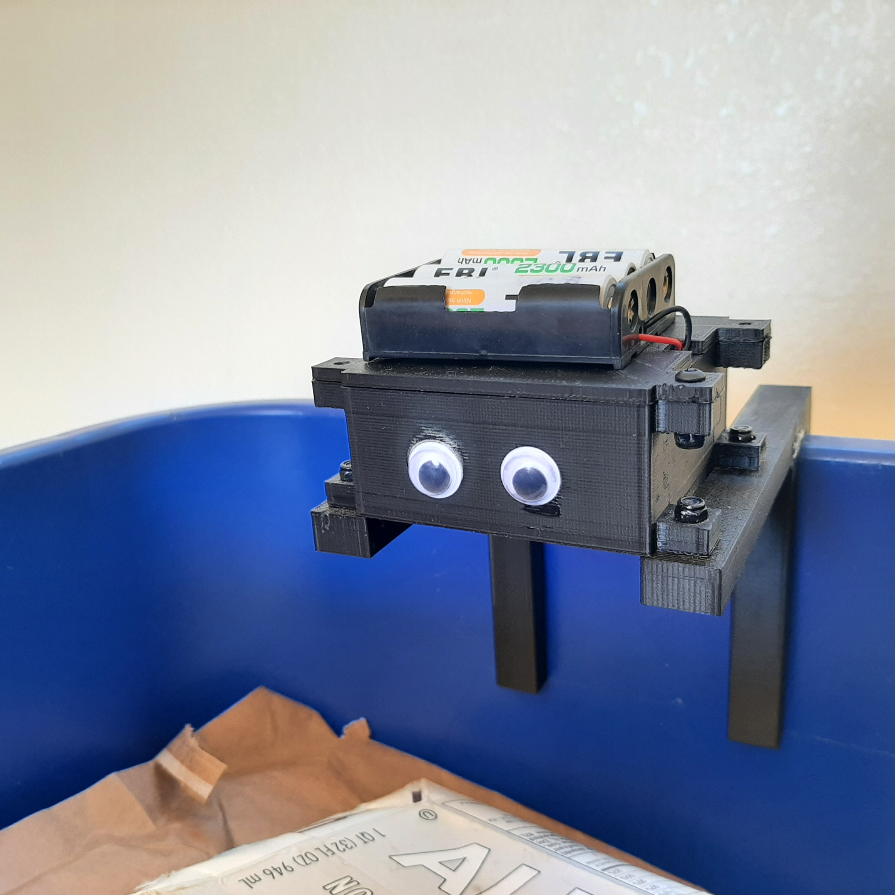
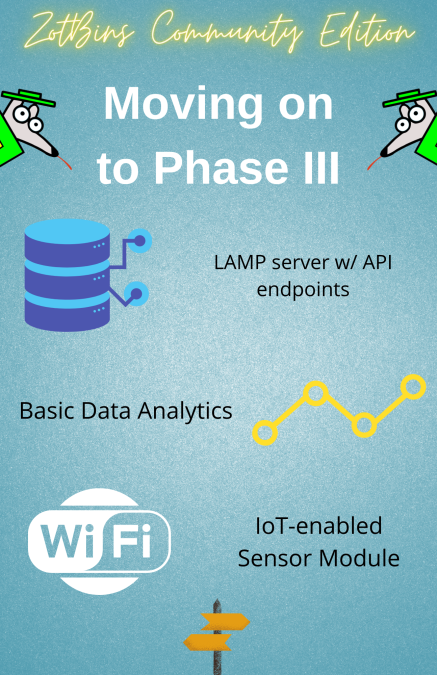
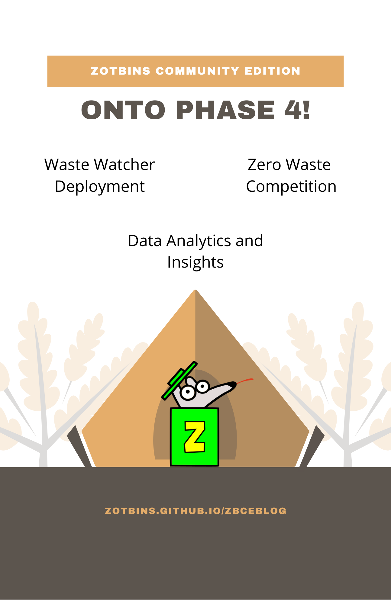

Hello! This blog is going to be short and sweet! I will be going over some milestones that we were able to reach this month and also some exciting plans for our community!

### Releases! 🌱

After a lot of time put into this endeavor, I am happy to announce that we have two software releases!

Our first release is for the [Waste Watcher](https://github.com/zotbins/waste_watcher). We are currently on [version 1.0.1](https://github.com/zotbins/waste_watcher/releases/tag/1.0.1) and this release features a guide to build your very own Waste Watcher (as seen in the image below) and also the code you need to send data to the [ZBCE_API](https://github.com/zotbins/zbce_api).

Our second release is for the [ZBCE_API](https://github.com/zotbins/zbce_api). We are currently on [version 0.0.0](https://github.com/zotbins/zbce_api/releases/tag/0.0.0) and this release features a Python Anywhere API that receives data from the  [Waste Watcher](https://github.com/zotbins/waste_watcher) and also handles any GET requests for users to track waste data. There are also multiple deployment options and guides for some of those deployment options that you can check out on the repo README.

## Onto Phase 4! 🥳

The above update pretty much covers Phase 3. As a refresher this was the plan for Phase 3:

With these two releases phase 3 is pretty much done. We will now be moving on to phase 4!

## Thoughts on Improvements So Far 🔧

Oh boy there are so many improvements to be made. Here are a two big ones that I think should be made.

**Use an IoT Platform such as [Adafruit IO](https://io.adafruit.com/), [InfluxData](https://www.influxdata.com/blog/introduction-to-influxdatas-influxdb-and-tick-stack/), [kaaiot](https://www.kaaiot.com/), [Amazon IoT](https://aws.amazon.com/iot/), and so much more to choose from.**

There's a lot to choose from, but I think using one of these IoT Platforms will save a lot of time in development. A lot of these platforms include a lot of useful features such as dashboards. Keeping the userbase in mind, I want the platform to be as user-friendly as possible, but still have to option to scale. Based on these two criteria I think the two contenders are Adafruit IO and InfluxData. By far Adafruit IO is the most user-friendly and has a well-supported community, but the scalability of handling hundreds of sensors might be hard. InfluxData might be the better option for scalability, but may not be as user-friendly to setup.

**Record Weight**

Probably one of the most important metrics for this project is weight. Weight allows us to have quantifiable metrics such as waste diversion. If you look at waste reports such the one from the [EPA](https://archive.epa.gov/epawaste/nonhaz/municipal/web/html/), a lot of the data is represented in a waste metric such as tons or pounds. This is a key metric and something that I have struggled to get working consistently with [ZotBins](https://zotbins.github.io/), but I'm ready to try again!

----

Thank you so much for reading. I really hope that will actually help people and communties achieve our mission "to better inform all actors in the [Municipal Solid Waste](https://en.wikipedia.org/wiki/Municipal_solid_waste) Stream system and help close the [loop](https://en.wikipedia.org/wiki/Circular_economy) for a sustainable society." Thank you for all the love and support. If you haven't already I encourage you to get involved with the [Discord Community](https://discord.gg/mGKVVpxTPr).

- Owen Y.
