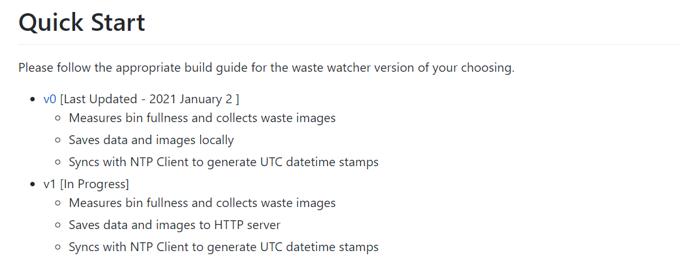
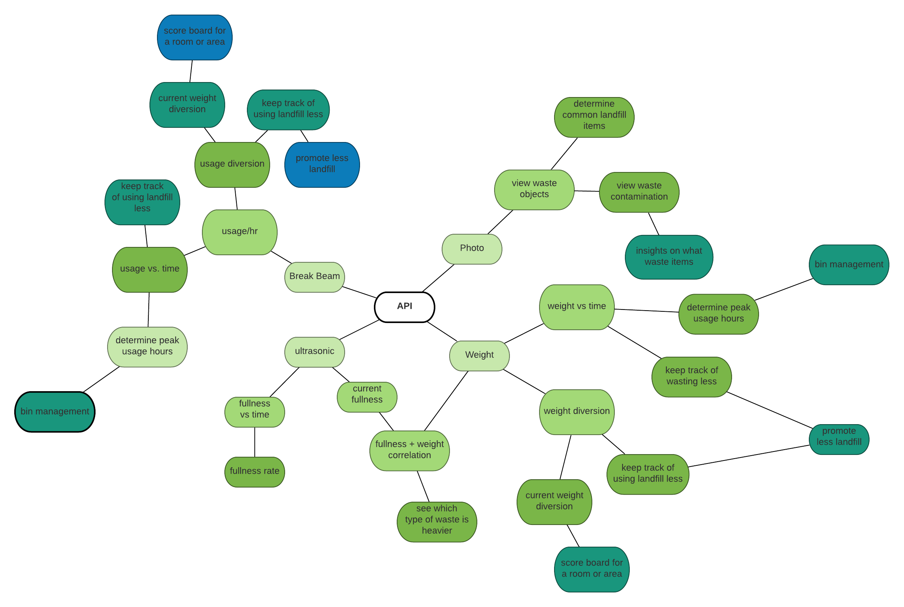
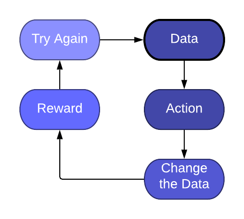

Happy New Year everyone! This month I'll be going over some of the updates for the progress on phase 3 of ZotBins Community Edition. For more details about the different phases visit this link [here](https://boostnote.io/shared/14a9893a-d4d7-4e40-ac10-4dc1ab77e019). As a reminder the goals of phase 3 was to (1) develop an IoT-enabled sensor module to collect all the waste data, (2) develop a working LAMP server with API endpoints, and (3) determine some basic data analytics to process our waste data.

### Developing IoT-enabled Sensor Module: Waste Watcher 🔎
In last month's [blog](https://zotbins.github.io/zbceblog/december2020update/), I demonstrated my new circuit for the sensor module, which I now call Waste Watcher. I still need to test my circuit a bit more thoroughly, but it seems to work for my preliminary tests. I will update you more on this in the next blog.

I have also updated the [Waste Watcher](https://github.com/zotbins/waste_watcher#quick-start) repository with some quick start guides to help others build and deploy their own sensor modules. If you check it out, let me know what you think in the comments below!

### LAMP Server 💡
There's not much to update here. I Just need to finish writing a setup guide so anyone can deploy their own LAMP server on their network. I explain more about this in last month's [blog](https://zotbins.github.io/zbceblog/december2020update/).

### Developing Basic Analytics API's for Waste Data 💻
With ZotBins, we are able to collect a variety of different waste metrics in real-time, but how should we process and present it in meaningful ways? How do we also present our data that can influence human action?

Currently our system is able to collect the following waste data:
1. bin fullness
2. waste weight
3. usage (records when the bin was used)
4. photos (of the waste)

To find meaningful ways to present the data I decided to start a [mind mapping](https://en.wikipedia.org/wiki/Mind_map) exercise as shown below. Starting from the center I classify 4 different API calls: break-beam, photo, ultrasonic, and weight all related to waste data mentioned above. From each of those classes, I develop the type of analysis that users would want to see. For example, for the break beam bubble, one analysis that would be useful is seeing the amount of times the number of bins was used per hour (usage/hr). Then from that metric we may want to determine, how much more recycling or compost bins were used (usage diversion) or track the amount of times used over a period of time (usage vs. time). From there, I also determine how this analysis will be used. For example, keeping track of usage vs. time could quantify how much landfill bins were used less. This could be a real-time statistic that could be used to apply gamification principles, which I will explore in the section below.

### Applying Gamification with APIs 🎮
I started reading a book called *How to Save the World* by Katie Patrick, where she talks about applying gamification principles to solve environmental problems. Katie Patrick is an environmental engineer and software designer, and I started reading her book after watching her present in a video webinar because she talks about some very meaningful ideas that could be applied to ZotBins.

For a long time ZotBins has taken a educational approach, where we try to educate users in how to recycle/compost more and waste less. However, sometimes, this doesn't lead to significant behavioral changes to actually increase recycling and composting rates. This is actually a common problem that Katie Patrick likes to call the **Value-Action Gap**. She states that scientific studies show educating people on important environmental topics contributed to mainly peoples' environmental values, but doesn't necessarily translate into action. That means that yes, they cared about environmental issues more, but didn't necessarily do anything about it.

Ok, so how do we apply some basic gamification principles to our data. One method is to introduce a simple feedback loop as shown below. If you play any popular game there is a concept of having an HP-bar. You know that if you are low on HP, your bar usually turns red and sometimes it blinks or makes sounds, which motivates you to do something to try to regain your health back into the green zone. This itself already applies a feedback loop!
1. **Data**: You're low on HP
2. **Action**: You need to heal or eat food!
3. **Change the Data**: Your HP bar starts to fill up and turns green as you heal.
4. **Reward**: Your HP restores.
5. **Try Again**: You die! You didn't complete the healing action so you need to try again!

We can apply this same concept with our waste data. For example:
1. **Data**: You landfill usage is going up, your bin HP is low.
2. **Action**: You need to waste less and/or recycle and compost more.
3. **Change the Data**: Your HP bar fills up as you waste less.
4. **Reward**: Your bin HP restores.
5. **Try Again**: Your bin "dies" (we'll need to workshop this)! You didn't reduce your waste and/or recycle and compost more.

There are actually a bunch of ways ZotBins has explored options in the past such as introducing point systems for a leaderboard or even converting the points into some sort of crypto currency. Anyway, there are plenty of ways that ZotBins can utilize gamification so stay tuned as the project continues to expand!

For more ideas in applying gamification principles watch Katie Patrick's video [Five Easy Low Tech Gamification Techniques: How to Save the World](https://www.youtube.com/watch?v=PjeKUbzffCs)

----
It's already been a pretty busy month for me, but I hope to make some more significant progress and finish phase 3 soon! I've been dealing with a lot of logistical stuff this month so I haven't been as active in developing the project. However, I've been getting a lot of help! Huge shout out to Aishwarya Bhandari and Patrick Nguyen for contributing to the [ZBCE API Repository](https://github.com/zotbins/zbce_api). Stay tuned and have a great day!

-- Owen Y.
