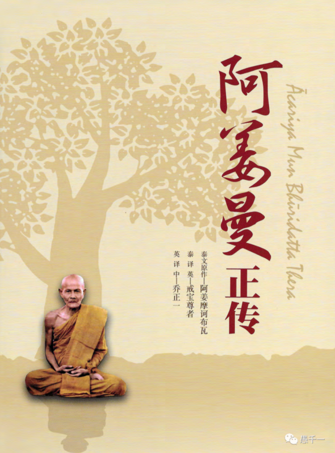

# 一位汉传佛教爱好者的《阿姜曼正传》读后感

在一个唯识学的群组里面，有一位非常博学的学长多次提到了南传的高僧——阿姜曼尊者(1870-1949)，不知不觉被种草了。正好最近在阅读《大智度论》时发现有相当的难度，不仅速度很慢，还时常令人犯困……咬牙坚持之际，突然想要读一本快书来调节一下，于是就决定阅读《阿姜曼正传》了。  

虽然对于汉传佛学略有所闻，但对于南传佛学（上座部）还是非常陌生的，不仅没有阅读过什么资料，对于南传的重要人物也是一无所知。如果不是因为一个同学把觉音当作自己的昵称，我连《清净道论》也不会知道的。

阅读完这本书的收获还是很多的，这也是促成了我想要一下。尤其是从汉传佛学的背景出发，可以看到和南传有很多差异，这些差异也是非常有趣的。

第一，头陀行。非常钦佩阿姜曼的头陀行（俗称苦行僧），常年奉行了十三头陀[注1]里面的七支。分别是：冢间坐、常行乞食、受一食法、一钵食、时后不食、阿练若住、树下止。佛教史上有记载的第一位头陀比丘应该是大迦叶（念she）尊者，他的苦行连佛陀都非常称赞，乃至等到大迦叶尊者年老以后，佛陀劝导他说，可以不用再去乞食了，直接接收信众的供养就好，结果大迦叶十动然拒，他连佛陀的劝告都敢拒绝，可谓是非常坚持了。和所有的苦行僧一样，阿姜曼的苦行也是非常令人敬佩和感动的，尤其是在泰国的森林里面，疟疾横行，在没有特效药的年代，特别容易丧命。没有对法的坚定信仰和赴死的决心，头陀行不可能可以坚持到底。[注2]

第二，刻苦禅修。汉传里面虽然也有个别宗派非常强调打坐，但多数都不只是打坐而已，而是包含了各种方便法门，当然，这里的禅定指的是非常狭义的四禅八定，并非禅宗广义上的禅定而言。阿姜曼尊者无论是本人还是教导弟子，都非常重视禅定的训练，且要求在各种危机四伏的情况下入定，甚至是在老虎潜伏的洞窟旁边，老虎捕食的领地内，几乎100%必定遭遇老虎，面对如此危急的时刻，可以说是生死一线间，要么入定，要么成为老虎的口中餐。不过，为何入定了老虎就不吃他们了，这应该涉及到了神异部分了，按下不表，就算当作神异故事来看也无妨。除了利用老虎来训练禅定之外，还有坟地，和在坟地过夜，人类对于死亡的恐惧几乎是与生俱来的，尤其是有新坟的时候，往往更加令人毛骨悚然，可越是这样的恐怖场景，阿姜曼尊者和他的弟子们越是要去面对并探究恐惧的本质，然后战胜他们，从而达到超越生死的目的 —— 涅槃。

第三，直面目标。阿姜曼尊者和他的弟子们都说以解脱生死——涅槃——为第一目标的，可以说他们一切的修行都是直取这个目标的，无论是禅修还是经行等。用正念和观智觉照每时每刻，除了睡觉，不敢松懈一分一毫，唯恐一不留神就被无明带偏了，而无明又是涅槃最大的，甚至是唯一的敌人，不是你死就是我活。对此的描述，书中多次用到在战场奋力杀敌的战士来比喻，可见程度之严格。这点和以大乘为主的汉传佛学则非常不同，虽然大乘的目标都是成佛，可是成佛是一个无比久远的目标，经常用三大阿僧祇劫来表示，而阿僧祇本身的含义就是无数的意思，用了一个无数还不够，还说要三个这样无数无量才行，可见久远程度，不是一般可以用数字去表示。既然是这样久远的目标，“紧迫性”就不容易凸显出来了。

第四，曾经的菩萨道。正传中最开始就提到，阿姜曼尊者的前世有行过菩萨道，即表示发愿成佛，这和大乘佛学非常一致。然而出于今生对涅槃的追求，舍弃了这个成佛的愿望。这令我想起来曾经和一位南传同学的交流，根据南传观智的次第教法，如果曾经发愿成佛，想要涅槃就必须先舍弃这个成佛的愿望，然后观智才有能够更进一步，最终达到涅槃。虽然从南传的角度而言，佛陀的涅槃和阿罗汉的涅槃是一样的，佛陀的不共之处仅在于在无佛无佛法之世，行者依旧可以觉悟涅槃并能够传承教法，而阿罗汉则是佛世或有佛法的时候，觉悟和涅槃。然后大乘佛学的角度则非常不同，只有菩萨才是成佛的必经之路，舍弃成佛之愿就不会有成佛的可能了。

第五，戒律。应该说头陀行是守持戒律最好的充分条件了，这样严苛的条件下，甚至都不用去探讨“小小戒可舍”的小小戒是什么了，何况南传本身就不舍弃“小小戒”，坚守大迦叶尊者最初的规定，“隨佛所說，當奉行之，佛不說 者，此莫說也。” [注3]  然而令我感到诧异的地方是，正传中既然有弟子供养阿姜曼香烟的描述，由此可以推断，尊者是会吸烟的。而汉传佛教大多都是禁止出家人抽烟的，虽然抽烟并没有在戒律的明文规定当中，但因为其上瘾属性的关系，还是被大多数的道场明令禁止。

PDF文件下载地址：阿姜曼正传 (Simplified) | Forest Dhamma

https://forestdhamma.org/2018/06/03/%E9%98%BF%E5%A7%9C%E6%9B%BC%E6%AD%A3%E4%BC%A0-simplified/

*[注1] 正传中列举的十三头陀分别是：粪扫衣、但三衣、常行乞食、次第乞食、受一食法、一钵食、时后不食、阿练若住、树下止、在露地坐、冢间住、随处住、常坐不卧。 汉传佛学通常叫做十二头陀，没有其中的“随处住”，意思是：“不选择居住的地方，随自己游行所至而住。 ”*

*[注2] 虽然佛教是中道，不赞成“只有苦行才能解脱”的观点，但是对于符合佛学中道教义的苦行，还是非常赞许和鼓励的。*

*[注3] “隨佛所說，當奉行之，佛不說者，此莫說也。”出处https://cbetaonline.cn/zh/T24n1463_p0818b11 T1463 毘尼母經 - 卷/篇章 3 | CBETA 线上阅读 (cbetaonline.cn)*

