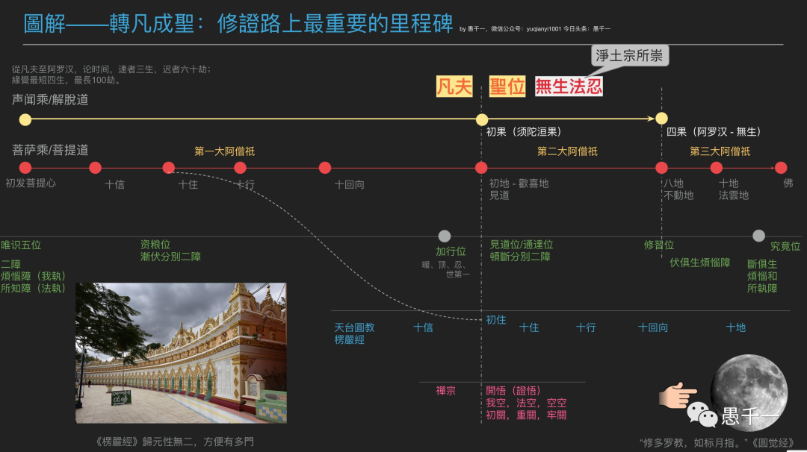
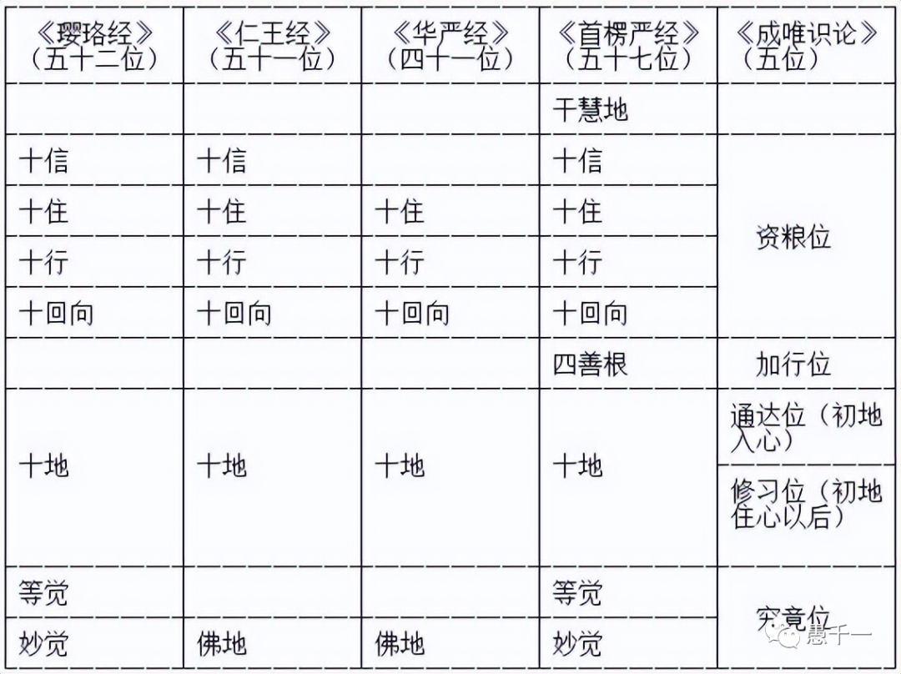

**上接前文**

前文《浅谈对全体佛学的略解》中简单介绍了全体佛学乃至全体佛教的知识体系、系统架构。从一纵一横的角度分别来看，一纵，即是佛教史，一横，即是天台判教，这里的判教也可以换成其他判教体系，如华严等。从一纵佛教史的角度，可以清晰地看到佛教的发展脉络，从原始佛教，到部派佛教，再到大乘和秘密大乘。从一横角度则可以看到整个的佛学的知识层次，体系架构，了解人、天、声闻、缘觉和菩萨乘，甚至对于菩萨乘里面又可以再细分为通教（空宗），别教（中观）和圆教（一真法界）等。最后再合纵连横，联合起来看，就能一窥全体佛教的样貌了。

尤其是笔者身在美国，而美国佛教的发展相对而言非常均衡，南传，汉传和藏传三大体系都在美国蓬勃发展，而且很平衡，各自都在开花结果。也正是因为这个因缘促使笔者想要一窥全体佛教的样貌了。了解之后的好处当然也不限于身在美国的佛学爱好者，其实对于一切佛学的爱好者都是可以借鉴和参考的。

有了一个全面的、系统性的了解之后，自然就想要寻找一个比较符合自身需求的学派、宗派继续深入学习和实践了。这其实是一个特别漫长，但却必不可少的过程。听一位年轻的出家法师介绍自己的经历时说，即使是她这样的出家专业学佛人士，依旧花费了将近10年的时间，最终才找到了一个适合自己的方向和入手处，或相应的法门。连出家法师都是如此，何况我等业余之人呢？所以这个过程还是很需要耐心的，切忌急于求成。选择一个法门之前，也可以通过先对各个宗派有个大概的了解，这里可以推荐下《佛教各宗大义》吴信如著，或其他类似性质的书籍。

无论选择哪一个法门入手，最终的归宿都应该是一样的。假如归宿不一样，那就不是佛教了，而是其他宗教了，甚至是佛教里面经常提及的“外道” —— 心外求法。

无论您最终选择的是南传还是北传（汉传和藏传），对于终极目标和阶段目标都要有清晰和深刻的认识。这样避免两个主要问题：

第一，被误导，被欺骗：是指被很多附佛外道，不如法、不正规、充满争议的宗教团体所迷惑，所欺骗，这样不仅仅是偏离了正道，甚至会误入歧途，害人害己。所以禅宗有句话提醒到：“宁可千年不悟，不可一日错路”就是这个意思。

第二，自以为是，以凡滥圣，未得谓得：排除一些明显为了名誉和利益而故意误导大众的以外，还有一类，虽然本身并无恶心，但是真的是不清楚自己的水平，就以为自己得道了、证果了、成就了。然后再有利益大众的想法，结果以讹传讹，误人误己。禅宗的“野狐禅”，就是最典型的公案了。

因此树立正见，了解终极目标和重要过程就是非常重要的了。

**终极目标**

如果是南传上座部，目标就是涅槃，就是证阿罗汉。
如果是汉传和藏传，目标就是成就佛果，即成佛。

南传的贤友对于目标和过程非常重视，尤其是南传的大德们不断有证果的案例出现，更是鼓舞和激励人心，令人敢于直接奔向了涅槃这个最终目标，可以参考笔者的《一位汉传佛教爱好者的《阿姜曼正传》读后感》一文。

顺便一提：按照《法华经》的观点，虽然声闻乘的涅槃都只是个中转站 —— 一个供大众临时休息，然后继续上路的化城。但笔者还是想要兼顾下南传的部分，即使笔者本身的背景是以汉传为主的。

而大乘成佛的终极目标则因为非常长远，经典上说需要三大阿僧祇劫，甚至有说百阿僧祇劫，给人感觉遥不可及，导致大家不太重视目标，不想要去了解它的过程，甚至中间重要的阶段也都不去学习。这不得不说是非常遗憾和可惜的了。虽然最终成佛的目标确实是非常长远，但是里面的重要的阶段确是可以努力达成的目标的，类似南传有很多大德可以亲证阿罗汉果一样，北传的大德们也一直有获得此阶段成果的，延续传承。

**最重要的阶段目标，没有之一**

有的宗派如禅宗会非常强调这个目标，直面这个目标，不绕任何的弯子。有的宗派则会隐晦地谈及，有的宗派会故意回避，甚至有人问起来时，祖师会严厉批评甚至是“阻扰”，如净土。其实这些祖师只是担心学人浪费时间，不好好练习方法（如念佛）而已。只要方法用得好，不用从理论上获得，直接就能够体会到，所以说这些祖师真的是良苦用心啊。禅宗也说是“老婆心切” —— 像老婆婆疼孙子一样爱护和叮嘱。

以前和现代的情况又有不同，以前和古代的文盲率95%以上，现在的高等教育普及率都非常高了，全国高等教育（即高中以上）毛入学率57.8% [注1]，累积而言，高等教育要超过70-80%了。尤其是现在还是信息爆炸时期，互联网上什么知识都可以轻松获取到，以前想要阅读《大藏经》那门槛是相当高的，条件是非常苛刻的。现在好了，一个网页随时随地就能查看。这样的背景下，大家已经接触到了大量知识，如果不做梳理就会一盘散沙，难以消化，不仅连一个成体系的知识架构都无法形成，何谈指导和参照进行对照修行呢？因此理论学习和知识梳理对于现代的学人来说是非常重要的。注意：但不是唯一的，兼顾下其他条件和因缘下的特殊情况，如还是有不识字的人，不能上网的人等。

**转凡成圣**

这个最重要的阶段目标就是转凡成圣。从声闻乘来说，就是初果以上。从大乘来说，就是初地以上。声闻的初果至少证我空，生空，无我。大乘的菩萨初地则同时证我空和法空才行。笔者整理了一个图表如下。

声闻乘的四果，最重要的阶段就是初果。根据《大智度论》上说初果需要断三结（身見、戒取、疑），根据《天台宗》的观点则要断见惑（身见、边见、见取见、戒禁取见、邪见）。两者其实是一个意思，只是分类方式不同，佛学上的开合不同。

北传52个阶位的菩萨乘是最流行的版本，其他版本还有41、51、57位之说，但是52位的版本是最常见的版本了，出自《璎珞经》。其中最重要的里程碑就是初地，需要证我空和法空。

初地也是最普遍的说法，也有不同的说法说是初住，如天台圆教。为何会有不同的标准呢，这就好比同样是汉语，中国的汉语标准和外国人学习汉语的标准自然是不一样的，外国在大学里面的汉语水平可能类似于中国初中生的语文水平。反过来，中国在英语四级水平也不会超过美国中学生的英语水平，道理是一样的，所以这个标准是依据不同的背景而设立的。但无论标准如何设立，能否用另一种语言来进行日常生活和工作则是更加实际的了。初地或初住也是如此，只是标准不同，但实际的内容却是比较一致的，即证我空和法空。

**见地和功夫缺一不可 —— 即解行并重**

禅宗的流弊之一就是因为把见地和功夫混为一谈，不做严格区分，就容易导致误解，令人以为禅宗的人只是喜欢玩文字游戏而已，或只是口头禅。见地是理论、观念，虽然见地无比重要，犹如指南针，北极星，但只有见地是不够的，必须还要有功夫，才能不随境转，不被烦恼转，才能时时做主，解脱生死。

这里先简略地提一下见地，以后有机会再另写文章来展开说明。见地，即是了解空性，包括我空和法空，简称空。在不同的学派，宗派里面也会经常使用不同的概念和名词，他们只是表述的方式不同、侧重点不同、角度不同而已。比如：

般若、实相、胜义谛、了义、究竟、第一义谛……

佛性、自性、本来面目、明心见性、开悟……

真如、无我、涅槃、如来藏、一真法界、心性、寂静、禅……

无我、无为、无生、无生法忍……

法性、法身、佛、如来……

等等，当然这里只是非常简略地说，严格区分的话，它们还是会有很多不同的解释，代表不同的含义。

**烦恼是检验的不二选择**

只有见地但是没有功夫或功夫不够时，烦恼还会常常发生，甚至会通过语言（口业）和行为（身业）爆发出来，因为烦恼而产生的语言往往最伤害人，轻则嘲讽、争执、吵闹，重则粗口、恶骂、诅咒。由于烦恼而产生的身体行为也是损人损己，轻则破坏物品、偷窃、男女关系混乱、打架，重则杀人、报复社会、伤害无辜甚至发动战争。

所以检视自我一个最好的手段就是觉察自己的烦恼，从粗到细，当口业和身业的现行慢慢被调伏以后，再从表由内觉察，观察自己是否还有不如法的想法和念头（意业）产生，产生之后的多久可以觉察并调伏。

从多到少，慢慢降低口业、身业和意业三种烦恼起现行的频率，直至完全调伏，完全不起现行了。然后保持这种状态，量变引起质变，最终不用用心故意觉察，烦恼也不会再升起了，这样才算是了。即禅宗的“不怕念起，就怕觉迟”。

不仅南传重视打坐，其实大乘也同样重视打坐的。但大乘打坐目的并不完全只是练习禅定，即四禅八定，因为四禅八定是共外道的，其他宗教也有。而大乘打坐、禅修，尤其是禅宗，目的是练习方法，练习觉察和调伏的能力，并希望这种能力能够延续到下坐以后，离开蒲团以后，在日常生活中依旧能够保证这种觉照。换句话说，不打坐时还能保持这种觉照才是更重要。这就是为何翻遍了禅宗至宝的《六祖坛经》，也找不到打坐的具体指导了。因为六祖本人有了见地以后，立即知行合一，不起任何烦恼了，自然就不需要像我们普罗大众一样，逐渐地调伏烦恼，从粗到细，由表及里，即渐修。

**常见的误区**

一切佛学可以分为两类：智慧和神学。

上面的讨论都是围绕智慧而展开的，这也是笔者想要关注和提倡的部分。对于神学的部分没有提及，神学部分虽然非常有趣，不仅有各种神通，还有很多传奇故事。相信不少人也看过很多遍电视剧《西游记》了。这说明神学的部分是非常有趣的，可以帮助佛学进行传播，但在学习上来说，这些既不算是重点，也不算是核心。了解下这些也无妨，毕竟也是佛学的一部分，可以当茶余饭后的谈资，接引的方便。但要切记，它们都不是佛学的核心。

常见的误解便是把某种神通、某种异能当成是证果了。不可否认，很多大德和大成就者的确也展示过一些神异，但却不等于将两者轻易划上等号。换句话说，很有禅定功夫的人，是很容易就开发出来这些能力，但是有这些能力的却不一定是证果的人，唯一可靠可信就是智慧，先用智慧觉察和调伏自己的烦恼，然后再不令他人起烦恼，进一步再帮助他人深入学习，自利利人，只觉觉他。

最后感谢阅读，祝您健康平安、自由自在。

参考：
[1] 高等教育毛入学率_百度百科 (baidu.com) https://baike.baidu.com/item/%E9%AB%98%E7%AD%89%E6%95%99%E8%82%B2%E6%AF%9B%E5%85%A5%E5%AD%A6%E7%8E%87/2488634

