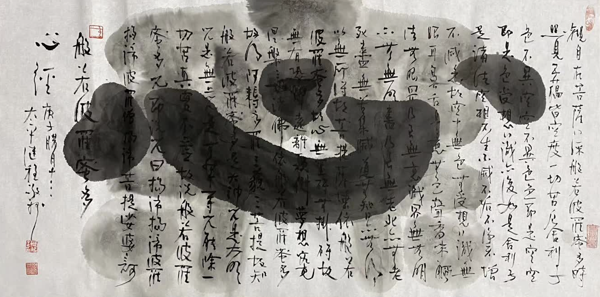

（图片来源：继程法师）

## 缘起

大乘佛教里面尤其注重忏悔的修行法门，无论是汉传佛教的各种忏法，法华忏，大悲忏，弥陀忏，五十三佛忏，八十八佛忏，梁皇宝忏等。还是藏传佛教的各种咒语（应该叫真言更恰当），如百字明，金刚萨埵心咒等。无论哪种忏法，都会强调其殊胜性，即能够将一切罪业忏悔清净。尤其是在弥陀信仰为主的净土法门中，以《佛说观无量寿佛经》卷一的“称佛名故，于念念中，除八十亿劫生死之罪。”为最常见的灭罪言说之一。

以我所见所闻来说，周围的大乘佛法修行人无一不强调忏法的重要性，尤其是在所谓的末法时代。然而，当我们深入探讨下忏悔背后的道理时，能够完全了知，彻底了知的人却不多见。因此本文想要略述一下忏悔的逻辑，希望可以提供一点参考，启发提高对忏悔法门的认知，这样再进行忏悔时，则达到事半功倍的效果。当然因为本人的水平有限，还请各位大德读者们，不吝批评指正和补充。

## 该选择哪种忏法或真言？

无论是忏法仪轨还是持咒，其本身都是一项重要的修行法门，从共性的角度来说，一切忏法、持咒都是广义上的禅修。以大家最熟悉的禅宗语录来说，即是“行住坐卧皆是禅”，“语默动静皆是禅”，连生活中最普通的吃饭、喝水、打柴、烧火、做饭都是禅法，更何况是专门的为修行所制定的仪轨以及真言（咒语）呢？

除了共性的角度，每一种仪轨和真言背后又有不共的地方，有各自的特色和相应的地方。如法华忏来说，即是以法华经作为整部仪轨的理论基础，对于喜爱和深信《法华经》的修行人来说就有其不共的相应力和加持力。如金刚萨埵心咒也是如此，即是以金刚萨埵为缘起，产生不共的相应力和加持力。

每个人都有其不同的背景、习惯，以口味举例，有些人喜欢吃甜的，有些人喜欢吃咸的，而有些人喜欢吃酸的，还有人喜欢吃辣的，无论是哪种，只要在健康的前提下，选择哪种都是可以的。如此丰富的仪轨和咒语也是如此，都是为了满足有不同“口味”的信众而设的。经言：“佛说一切法，为度一切心”。因此，法门本身没有高下，只要适合自己的就是最好的，同时要能允许和理解，他人的方法可能不同，但目的都是一样的。

## 忏法的根本逻辑（智慧篇）

无论忏法本身的宣传如何殊胜，如何有力，最根本的逻辑无非还是因缘法 —— 对于过去所犯的错误，认识它、面对它，承认它，不逃避，不再为自己寻找借口，然后有勇气去面对、去承担其一切后果。并且保证以后不再犯同类的错误，以及其他不同类错误。忏法的关键，在于提升内心承担的力量，而非否认、害怕和逃避事项上的惩罚和后果。

《大智度论》卷十说，“诸佛实语不破因缘法相”。因此忏法在因缘上也不会违背世间法。举例来说，假设A杀害了B，在铁的事实面前，无非是两种结果，A认罪，并真心忏悔，最终求得B家属的原谅，B家属出具符合法律要求的谅解书。最终A必定会是较轻的判决，但不可能直接无罪释放，因为杀害的事实依然存在，所以A还要受到应有的惩罚。另一种情况A死不悔改，不认罪，冷酷无情，冷血，甚至反社会，反人类，这种情况下，等待A的必定是重判，甚至是极端的死刑惩罚等。

以上是世间法逻辑，也是完完全全的因缘法逻辑，佛法上的忏法的逻辑也是如此。充分认识到错误，并真心悔改后，对于一切惩罚都会心甘情愿，不再抱怨，不再违抗。对于较轻的错误来说，发自内心的忏悔，则会减轻甚至完全免除惩罚。对于较重的错误来说，也是“死罪可免，活罪难逃”。一个真心忏悔的人，对于“活罪”的部分，必定会心甘情愿地接受，因为这已经是最低程度的惩罚了 —— 即佛法上常说的“重罪轻报”。

因此，从智慧和逻辑的角度而言。忏法的根本在于承担责任，以负责任的态度对待自己的一切言行，对于更严格的修行者，甚至要对待自己内心的起心动念，即每一个想法，每一个念头，都应如理思维，如理作意。对于已经犯过的错误，如果还有补救的机会，则应该地补救，通过道歉，弥补的方式，求得原谅。对于因缘不具足时候，即无法去弥补的时候，则应该在内心真诚地忏悔，在佛菩萨面前忏悔，请佛菩萨和一切护法作证。待到以后因缘成熟时，再去主动受罚 —— 安世高的故事[1]即是后者的一个例证。

## 忏法的神学篇

如果对于因缘果报的基本佛理还不能彻底地理解，再加上各种忏法和咒语的各种巧妙说辞，则会不自然地进入到神学范畴了，需要仰仗依赖“信”的力量。这种情况在佛教里面的其实非常之多，尤其是以前和古代时，因为人们的教育程度普遍低下，到处都是文盲，没有基本的文化知识，何谈逻辑性的知见呢？虽然当今的教育普及率已经大幅提高，文盲人数不断下降，但这种情况依旧会存在的。

以单纯的“信”的力量，也并非不好，但更多的是一种方便法，依赖的是以敬畏之心的“仰信”。这种情况下更要提防“流弊”，即是过度相信忏法的“神奇”结果，而违背了基本的因缘法，认为可以清除一切外界的果报（违缘） —— 等到真正出现违缘时，很容易信仰崩塌。笔者就听过这样的例子，一个在平时非常用功，修行非常精进的人，但因为量变没有到质变，再加上见解上的不究竟，在年老时因为感受到巨大的病苦，最终变得破口大骂三宝，认为佛法都是骗人的、虚妄的东西，从一个虔诚的佛教徒走到了另一个极端。这种例子就是非常可惜、非常遗憾的了，这正是缺少了对因缘果报的基本正见，过于依赖“方便法”的情况下，掉入了“流弊”中的“陷阱”之中，可悲可叹。

## 安全和稳妥忏法需理事结合

最安全和最稳妥的忏法莫过于两者的结合，行解并重，理事并行。但首先，应该多多学习佛法上的善恶之别，了解什么是善法，什么是不善法（恶法），什么是无记法。其次是尽快、尽早地学习和了解因缘果报的核心教理，一切佛法的根本和核心都是因缘法，或者是以因缘法作为基础而开展的。最终，如果还能了解下方便法和究竟法的区分，深入了解究竟法（即胜义谛，空性），之后方能建立最彻底的正见。从忏悔的角度来说，最究竟的道理莫过于 —— “罪从心起将心忏，忏罪何如莫起心，罪灭心亡两俱空，是则名为真忏悔”[2]。

对于理论的深入了解，对于忏罪必定会很有帮助，甚至是事半功倍的效果。其次，无论对于理论的理解到了何种程度，从佛法上来说，作为凡夫的我们来说，虽然可以列举此生有记忆以来的很多错误，但还无法了解储存在阿赖耶识中的一切罪业，尤其是无始以来的罪业和微细的部分。所以我们依然需要实践各种忏法或真言（咒语），以便在事项上减少违缘，早证菩提。所以《华严经》中的《普贤行愿品》说：“往昔所造诸恶业，皆由无始贪嗔痴，从身语意之所生，一切我今皆忏悔”。

理事结合的忏悔，必定是最安全，最稳妥的方法了，不仅可以预防上一节中提到的“流弊”，还可以帮助我们增强忏悔的力量，最终达到事半功倍的效果。

## 略释“念佛一声灭八十亿劫生死之罪”的逻辑

那么，念佛一声灭八十亿劫生死重罪的逻辑是什么呢？如果不懂其逻辑，可能有人会挑战说，那么A杀了人，A是否可以念佛一声就免掉死罪呢？显然是不行的，前文已经叙述了死罪可免的情况，也只限于少数的真心忏悔情况，不忏悔，不认罪的情况下不仅死罪不可免，活罪也不可逃。如果是这样的话，那八十亿劫的生死之罪又是指什么呢？

这还需要从菩萨道的完整时间跨度说起，以大乘佛法而言，成佛是需要三大阿僧祇劫的[3]。一个小劫的数量级还是可以计算的，虽然计算方法有多种，但以最熟知的计算方式，不过是1679万年[4]，一个大劫的时间则是13亿年。而阿僧祇的意思是无量，比天文数字还大，所以一个阿僧祇劫即是一个无比大的数乘以13亿年，这本身就是一个无比大的数了，实在无法形容，可以简单理解为1后面一亿个零好了。而成佛的时间比此还长，一个阿僧祇劫不够，还需要三个大阿僧伽劫，有说“三”也不是具体数字，而是代表多的意思。所以根本就是一个无法明确表达的天文数字，但还是要尽量表达，那就是简约成1后面一亿亿个零吧。

那八十亿劫是多少呢？以大劫来算，不过是13亿年再乘以80亿，即1040亿亿年（1后面16个零）。这个数量在前面的数量（1后面一亿亿个零）面前还是一个很小很小的数字了（即1后面是19个零，对比1后面一亿亿个零）。这个比喻没有体感，因此再举一例，如果把成佛的过程比作一个人的一生，那么八十亿劫不过就是一眨眼了。但无论多小，都是进步了一点点的，而不是在轮回，轮回即是在原地打转了。所以念佛一句的实际作用是说，在成佛的道路上前进了一小步，如果不念佛，则是在轮回的原地打转，因此念佛越多，即是在成佛的路上前进得更多了，因为距离成佛更近了一点点，自然就减少了分段生死的总次数了。

以上是从逻辑的角度来阐述的“念佛一声，灭八十亿劫的生死之罪”。众所周知，弥陀的净土法门时非常强调他力的，而且也是以临终往生净土为继续修行的中转站的，所以，念佛的第一目标即是保证临终往生，以此得到三种或四种不再退转的果位，最后才是毕竟成佛。这些在净土法门里面都有非常多和详细的参考了，在此就不再赘述了。

## 略释“代一切众生忏罪”的逻辑

只要紧扣最基本、最核心的因缘法即可解释一切基础佛法。龙树菩萨在《大智度论》中说，类似慈悲喜舍一样[5]。如此的修行其实是在扩大修行者本人的心量和福业。而不是真的可以超越因缘代一切众生承担真实的果报了，否则的话，一切的佛和菩萨都承诺并在实践代一切众生的法门，那为何还有如此多的众生在受苦受难呢？难道是佛菩萨的誓言是虚妄的吗？显然不是，这些都是教菩萨道行者们的修心之法，并不会违背因缘法的基本义理。所谓“个人吃饭个人饱，个人业障个人了”，即使是圆满如佛菩萨，也是“菩萨畏因”，而无法真实地代一切众生在事项上、因缘上的后果了，而只能通过教育信众们学习和深入因缘法，让众生自己来完成自我救度了。（因缘、因果即是因缘果报的简称。）

## 后记

无论哪种忏法，无论如何殊胜，其背后必定有理论依据的，否则就不是智慧的、正信的佛法，而变成了纯粹的信仰和纯粹的神学了。而纯粹的信仰，纯粹的神学，则非常容易被人误解为“迷信”，或者稍不留意，就堕入了“迷信”的陷阱当中了。如果我们都能够深入了解一切修行法门背后的理论基础，我们则能向他人进行逻辑性的叙述，不仅可以增强自己对佛法的信心，还可以遣除他人对于佛法的误解了。这样才是真正的、究竟的佛陀的教育了。

最后祝大家都能早证菩提。
愚夫合十。
阿弥陀佛。

注：
[1] 《高僧传》（卷一）：“高后复到广州。寻其前世害己少年。时少年尚在。高经至其家。说昔日偿对之事。并叙宿缘。欢喜相向云。吾犹有余报。今当往会稽毕对。广州客悟高非凡。豁然意解追悔前愆。厚相资供。随高东游遂达会稽。至便入市。正值市中有乱。相打者误著高头应时陨命。”
[2] “罪从心起将心忏，忏罪何如莫起心，罪灭心亡两俱空，是则名为真忏悔”，有很多不同的版本，如：“罪業本空由心
造，心若滅時罪亦亡，心亡罪滅兩俱空，是則名為真懺悔。” 或者是“罪從心生，還從心滅”等。 可参考：《邱玉琴 「罪從心起將心懺，心若滅時罪亦亡」偈頌來源之探討》 https://www.huayencollege.org/files/paper/thesis/pdf/2020/20_%E9%82%B1%E7%8E%89%E7%90%B4_%E3%80%8C%E7%BD%AA%E5%BE%9E%E5%BF%83%E8%B5%B7%E5%B0%87%E5%BF%83%E6%87%BA%EF%BC%8C%E5%BF%83%E8%8B%A5%E6%BB%85%E6%99%82%E7%BD%AA%E4%BA%A6%E4%BA%A1%E3%80%8D%E5%81%88%E9%A0%8C%E4%BE%86%E6%BA%90%E4%B9%8B%E6%8E%A2%E8%A8%8E.pdf 
[3] https://zh.wikipedia.org/wiki/%E4%B8%89%E9%98%BF%E5%83%A7%E7%A5%87%E5%8A%AB
[4] https://zh.wikipedia.org/wiki/%E5%8A%AB_(%E6%99%82%E9%96%93)
[5] 《大智度論》卷二十：“問曰：若如是深愛眾生，復何以行捨心？
答曰：行者如是觀，常不捨眾生，但念捨是三種心。何以故？妨廢餘法故。亦以是慈心欲令眾生樂，而不能令得樂；悲心欲令眾生離苦，亦不能令得離苦；行喜心時，亦不能令眾生得大喜。此但憶想，未有實事；欲令眾生得實事，當發心作佛，行六波羅蜜，具足佛法，令眾生得是實樂。以是故，捨是三心，入是捨心。復次，如慈、悲、喜心愛深故捨眾生難，入是捨心故易得出離。”

