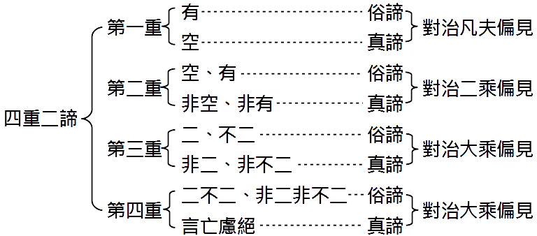

## 神通与开悟的误解

### 问：开天眼了就是开悟吗？
答：不是。无论是报得天眼，还是修得天眼，都不是开悟。报得天眼，即一些人出生后，或经历一些事情后，有了天眼，俗称阴阳眼。也有人在禅修（主要指打坐）中开启了天眼。无论哪种形式获得的天眼，和开悟都没有直接联系。

### 问：有他心通了就是开悟吗？
答：不是。他心通也有报的和修得，方式同上，但都不是开悟。

### 问：有天耳通、宿命通、神足通了就是开悟吗？
答：不是。解释同上。

### 问：有神通的人就是开悟者吗？
答：不是。一般是的神通都涵盖在指天眼通，天耳通，他心通，宿命通和神足通之内了。神通不等于开悟，无论哪种神通，报得或修得，都不直接等于开悟。

## 入定与开悟的误解

### 问：能入定了就是开悟吗？
答：不是。禅定分为：正定和邪定。正定都不等于开悟，何况邪定。

### 问：打坐时，有很多神奇的体验，如身体消失了，闻到异味了，看到一些神奇的景象了，甚至看到鬼神和佛菩萨了，这些是开悟吗？
答：都不是。把打坐时遇到的一切境界当做幻境是最安全和稳妥的。如果只是见到佛菩萨，但是没有跟你讲话，情况还稍微好点。如果有跟你讲话，则要非常谨慎，一定要用佛法的根本原则（三法印：诸行无常、诸法无我、涅槃寂静）来校验，否则见到的佛菩萨也可能是鬼神变化的。建议多看一些禅师和禅宗的公案，看看禅师们遇到“显现”的佛菩萨们的态度。（净土宗行者在临终时见到佛菩萨的景象，也必须对照净土宗的经典才行。比如说，明明是念诵阿弥陀佛求生西方极乐净土，结果来的其他佛和其他菩萨，则不一定是真的。）

### 问：修到初禅、二禅、三禅、四禅等就是开悟吗？
答：不是。外道也可以修到四禅。四禅八定是共外道的，佛教把其他宗教统称外道，尤其是指心外求法的其他宗教，即是是佛教内部，也有因为对佛法的理解上的不足，而在心外求法，也可以称之为“外道”了。这里的意思是说，其他宗教的人也可以获得四禅八定，即四禅八定不是佛教独有的禅定。

## 其他误解

### 问：如果可以这样，可以那样，就是开悟吗？

答：都不是。开悟不直接等于任何有为法，因缘法。这里的“可以这样”，“可以那样”可以代指一切具体的事物，具象的事物。比如有人说，吃大便好像吃饭一样。某行为艺术家还表演过吃大便呢，日本还有黄金餐（吃大便），以前还有人喝过不少童子尿，甚至是在绝境求生的情况下喝尿等等，这些当然不是开悟了，有些甚至和佛法都没有直接关系了。因为有太多这类奇奇怪怪的说法了，暂不一一列举了，但道理是一样的。

## 什么是真正的开悟？

最早的开悟应该只有一种，即是证悟，即是见道，甚至是最高级的证悟，彻底证悟我空，法空，空空。但后来因为禅宗的流行，以及禅修的日常化，普及化，大众化。对于开悟的说法越来越笼统，门槛也越来越低了，但只要是正信的佛法，这个门槛还是有一个底线的。为了更好地对此进行说明，整了一个图表如下：

### 世间的感悟、领悟、体悟
在图中把开悟分了七个层次，从下至上，最底下的一层标记为 0 层，原因是这层的“开悟”和佛法上的开悟没有直接关系，要么是一些非佛教徒的人对于日常生活、工作、学习上的突然领悟。比如“不养儿不知父母恩”是很多初为父母的人最大的“感悟”。比如是做数学题，苦思冥想很久都不懂，突然遇到一个厉害的老师讲解了一番，突然就“领悟”了这种题的解法，并且能够触类旁通。这种情况无非是因为大众受到了佛学上的影响，把这些原本是修道人的专业词汇，用到普通生活当中了，但这和真正的开悟并无关联，仅仅能说明佛学对于大众的影响了。

当然，对于佛教徒来说，也可能在闻思修的过程中有一些心得体会，尤其是遇到一些特殊的事情，然后再思维佛法的时候，突然对一些佛理有了更进一步的理解，比如无常，因果，缘起等等。这种情况当然是修行上的进步，但和开悟依然还有距离。

因为和开悟的关系不够直接，所以把这一层 —— 世间的感悟、领悟、体悟 —— 标记为 0 层 。

### 解悟 —— 最低层次的开悟

这应该是佛法上最低层次的开悟了，那么这个开悟具体是指什么内容呢？—— 即是对于空性的正确理解。可以参考前文[《理解空、有（空性）是打开大乘佛学的金钥匙》](https://mp.weixin.qq.com/s/ssQNk0gTppehzDgpzaQb6g)，佛性，自性，空性，这些到底是什么意思？本文提供了一种理解的思路，供仁者参考。

空性是大乘佛法最核心最重要的内容，而大乘的三大体系：中观、唯识和如来藏（法性）都是对于空性的完整阐述，只是侧重点会有所不同而已，但本质都是一致的。

对此有兴趣的佛友们不妨选择三者中的任何一个深入下去，即可以根据自己的偏好选择某一个，也可以根据自己周边的佛友一起学习和讨论某一个。一旦对于任何一个有了比较透彻的理解之后，再看另外两个都会容易得的多，毕竟空性的本质是一样的，只是各个体系的出发点和阐述方式不同，但终点毕竟是一致的。

严格说来，应该是99%是一致的，各个体系之间还是会存在少许的差异，这些少许的差异是各体系在发展和传播过程中的方便法，毕竟在言语表达上的究竟不究竟，了义不了义都是还是方便法。真正的空性、胜义谛、无为法是不二的，即不会有任何的二元对立，究竟 vs 不究竟，了义 vs 不了义其实还是有对立，而更进一步的对胜义谛的理解，则是以完全超越性的姿态展示了，如胜义胜义谛，用一个胜义已经不足以表达，所以才用两个胜义胜义或离言胜义来强调了。

如星云大师整理的《三论宗》的四重二谛，请参考：http://books.masterhsingyun.org/ArticleDetail/artcle6837

这就是为何会有各种四重二谛的说法了，上图是三论宗的例子，还有其他宗的版本，但个人觉得四重二谛的表达过于学术和严格，难以理解和记忆，因此想要简化一下，归纳于两层即可：

**第一层**
* 有 —— 因缘有，现象有，暂时有，假有，世俗谛
* 空 —— 自性空，毕竟空，不可得空，胜义谛

**第二层**
* 空有不二，或空空，或离言绝虑，胜义胜义谛

**为何是最低层次？**

因为虽然对于空性有正确的理解，但是力度不够，深度不够，因此还不能断烦恼。这里并不是说有一个实有的“烦恼”可断，“实有”的定义请参考前面的理解空性的文章。而是说因为对于“烦恼”的种子和习气还在，遇到境界时，还会起烦恼。

而起了烦恼以后，取决于“觉照”的迅速程度，对于非常有修行的人来说，他们可以在烦恼起来的第二念起觉照到烦恼，然后就看破它，不会再随烦恼而转。

对于修行得比较好的人来说，则要到很多很多念以后，才能觉照到，但必定还在第六识的意识以内，即能够觉照到，此时只有“意业”，即不会再随烦恼转，不会通过语言表达出烦恼，不会有四种“口业”（妄语，绮语，两舌，恶口），不会通过身体表达出烦恼，因此就不会“身业”（杀，盗，淫）。

再其次的修行人则会在身业，口业的现行当中“觉照”，前面的身业和口业的现行已经发生，但不会再继续进行下去。比如恶口，骂了几句之后即“觉照”到，然后就不会再骂了。

最差的修行人，则要到完全的现行过后，即事后才“觉照”到。比如晚上睡觉时，才反省到白天时的烦恼，不该和辱骂某人，不该吵架等等。然后依靠正知，正见后，必定会有忏悔的想法，从而希望下次不再如此。

所以这里把“解悟”的情况归纳为最低的层次的原因，是因为这里的行者还会有烦恼，尤其是指“不正见”（身见，边见，见取见，戒禁取见，邪见）相关的烦恼，以及和猛烈的“贪嗔痴”相关的烦恼。而且因为定力的不足，察觉的迅速程度不够，所以还会处在烦恼当中。但只要持续地练习禅定和觉照的功夫，相信不久即可达到下一个层次 —— 证悟。

## 证悟

从第二个层次以上都属于证悟 —— 只要证悟的人，必定是圣人，必定有对应的圣果位。

### 我空（初级）

即声闻乘的须陀洹果，已经断除了五种“不正见”，并且断除了猛烈的“贪嗔痴”。即已经脱落了自私自利的“自我中心”，不再是一个自私的人了。

### 我空，法空（初级）

即菩萨道中的登地菩萨，“我空”的基础上，还增加了“法空”，即不会执着于任何外境的法了，内境的法在“我空”时已破除。

### 我空（最高级）

声闻乘的最高级，即彻底地证悟我空，彻底地断除了“贪嗔痴”，成就了涅槃，无我，无学 —— 阿罗汉果。

