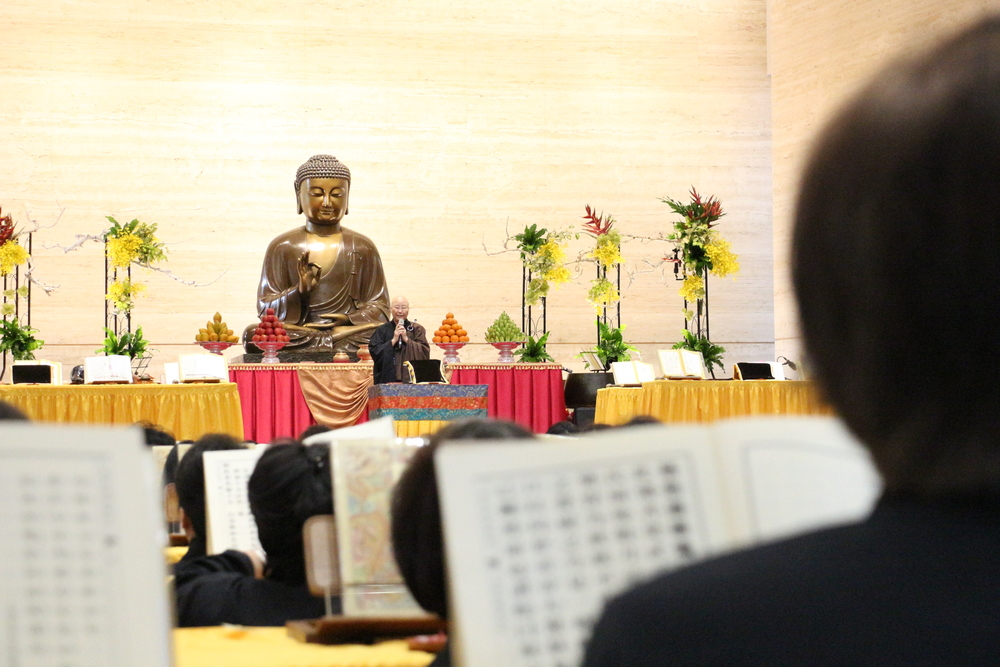
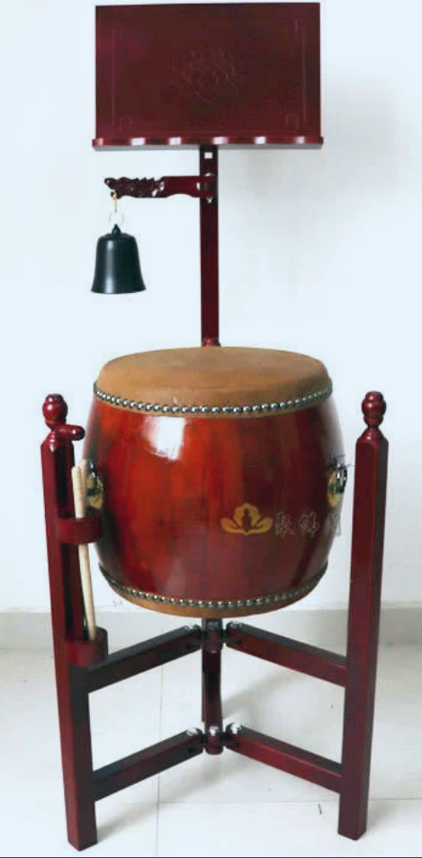
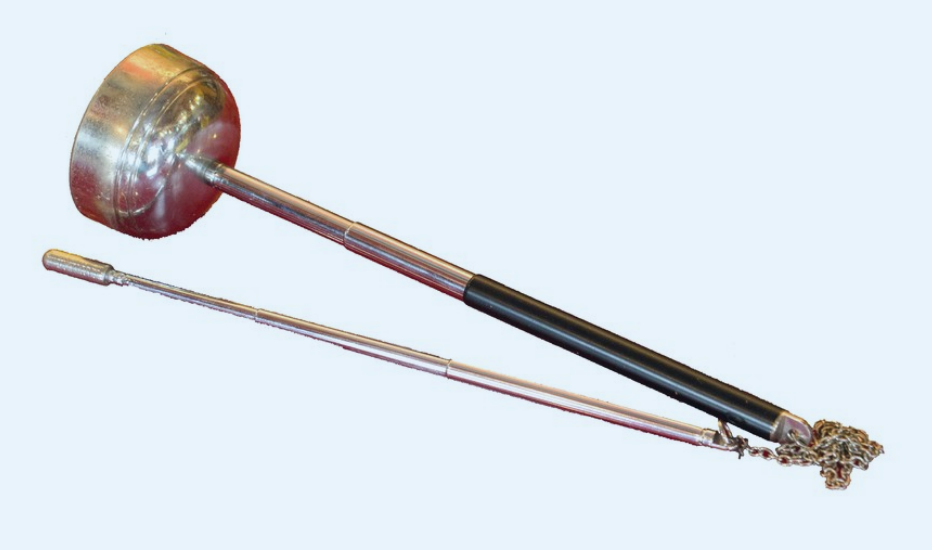
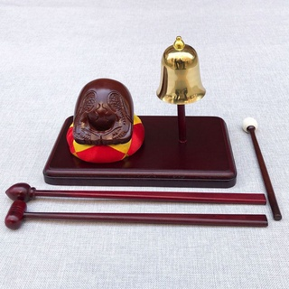

（图片来源：法鼓山网站）

汉传佛教举行法会时，都少不了唱诵，而唱诵就少不了配套的“音乐” —— 经由佛教的乐器 —— 法器的敲打所组成的乐律 —— 梵呗。每次参加法会时，都有所耳闻，但却从未有兴趣过。既然没有兴趣，自然也就没有深入过。说到对梵呗有兴趣，还要回到我所“薰修”时间最长的净土，以及净土所推崇的临终关怀了。而在临终关怀里面，又以助念 —— 重复唱诵阿弥陀佛（或南无阿弥陀佛）——为主，而更加庄严的助念，则需要用到法器了 —— 引磬或小鱼。使用引磬是印光大师的推荐，而使用小鱼则是弘一大师的推荐，很显然，被尊为净土十三祖的印光大师的推荐更为流行，更为普遍了。这是我第一次想学法器的缘由。虽然后来学修的范围从净土扩展到了其他的更有体系，偏重教理的宗派 —— 如天台，唯识等。但对净土和助念的信愿，依旧保持至今。

碰巧看到法鼓山西雅图道场有举办梵呗培训，于是欣然报名。虽然因为忘记了日程而错失了部分课程，但依旧得以完成后续的培训，而且越是偏后的培训，越有更多的实践和演练，所以虽有遗憾，但结果尚可接受。尤其意外的是，梵呗的培训是以“念佛法会”为框架的，梵呗演练自然也是“念佛法会”的全流程 —— 而这点并未在海报中体现，所以是属于意外的惊喜了，因为这更契合我对“净土”的热爱 —— 至于为何海报中没有提及“念佛法会”，就不得而知了 —— 也许是要保留灵活性以便安排法师，也许是想要给大家的惊喜。

每一次演练之后，我们这些“学员”都会长须一口气，如释重负的感觉。这些法器 —— 引磬，钟鼓，木鱼（小、中、大），地钟 —— 表面上看起来都很简单，用一个简单的词 —— 敲敲打打 —— 还真的可以概括了，这是相对于传统的音乐而言 —— 无论是以前的古筝，二胡等，还是现代的钢琴，吉他等 —— 这些乐器的演奏方式就远不能用一个“敲敲打打”来形容了。对比以后，演奏梵呗的法器，真的不算复杂了。但放到一场法会里面，又不简单了。

首先是钟鼓，钟鼓首先有集众的作用，钟鼓一响，就是告诉大家应该各就各位，法会马上就要开始了。然后便是在赞佛偈、三皈依和最后的回向中了，其中最难的部分是三皈依，每句前后分别有一次九钟十五鼓，总共四次。这个九钟十五鼓，每次能打对就不错了，但要在两句的间隙打完，就倍感压力。就算是勉强打完，但听上去的效果就毫无节奏可言了。法师打了一遍作为示范，相比之下，就像是小学生的字和楷体书法的差别了。

其次是引磬，用来承上启下并做引导和转折。从开始时礼佛开始，再到回向后的礼佛结束，以及拜佛，拜忏和皈依。以及念佛部分，念佛法会中最核心的部分了，这部分引导，从六字佛号，到四字佛号，从出位绕佛，再回座位，以及后续地钟的对接。法师时，如果是拜佛时，引磬忘记敲的话，那么所有的人都只能保持跪拜的姿势而不能站起来了。而如果敲的间隔太短，大家由必须在跪下后，马上站起来，这对于年龄大一些的信众来说，是非常不人道的了。所以，引磬的节奏必须要和现场的信众保持协调，不快不缓，中道而敲。

然后就是重头戏了 —— 地钟（即钟和小鱼的组合）。自引磬的引导后，大众保持在阿弥陀佛四字佛号的唱诵阶段，地钟开始。刚开始时，唱诵佛号的速度比较舒缓，每个字的发音1-2秒之长，这样保持几分钟之后，速度逐步加快，此时每个字的发音大概就只有0.5秒了，这样再保持几分钟，速度再次加快，这样每个佛号的时间大概只有1秒，甚至更短了。这样总共有三个速度，慢，中，快，分别对于地钟一，地钟二，地钟三。在练习时，地钟一大家基本上都没有问题，毕竟每秒敲一下，或钟和鱼，两个一起敲，还算可以合拍。但到了地钟二的时候，就感觉非常困难了，要么合不上拍，要么就傻傻地愣在那里，呆若木鸡了 —— 双手完全不知道该如何敲打了，直到法师再放慢节奏。地钟三的样子没有见到，据法师自己说，她自己也还是地钟二的阶段了，可见地钟三的阶段之难了 —— 即在差不多1秒的时间内，钟和鱼需要分4次，共敲击6下，每次敲击间隔只有250毫秒，且每次间隔敲法还不同，一次仅敲钟，另一次敲钟和鱼。

法师给大家解释说，念佛法会中的念佛，实际上是禅定的一种练习，到了地钟二和地钟三的阶段，除了双手的配合要非常熟练之外，还必须心无杂念，念念之间没有缝隙让杂念进入，一旦杂念生起，节奏就乱，手就乱了。这样看来，念佛和地钟的练习即可以用来测试自己的念佛水平了。平常的念佛或散或专，散念时不用说，必定不是“一心”的状态，就专念来说，这个“一心”的状态也不好客观评估到了什么程度了。而通过这个地钟即可衡量，是地钟一的水平（基础水平），还是地钟二的水平（中级），还是地钟一的水平（高级），衡量结果，一目了然。更重要的是，这种衡量的客观结果，不仅自己会知道，参加法会的人也都能听到，当然，如果有法师或师父在场，那更是十分清楚了。到此，我甚至暗自佩服起创造和发扬此念佛梵呗的祖师大德们来。真是一个测试的好手段。

我本身五音不全，不懂乐理，对于这种节奏很强的事情，不太容易描述。为了让读者更有体感，我想起来一部电影，《海上钢琴师》 里面的天台钢琴师，生在船上，以弹琴为生，有一次遇到一个人来挑战琴技 —— 这位钢琴师为了表现自己的水平，在演奏了一个单人四手联弹，弹完之后，用钢琴里面的琴弦直接点燃了一根香烟，可见温度之高，以此来体现琴技高超。这个感觉，大概就是我能想象的地钟三的感觉了吧。

在完成了培训以后，我又在网上观看了一场完整的念佛法会，当我看到法会中间的一次摆出三部地钟的时候 —— 我突然有了一种看武功高手的感觉，只听见佛号声越来越快，高手们一个一个上场，到了最快的时候，只看见地钟三的“武功高手”缓缓地把双棒举向眉间，向佛致意，然后放下，再分开，左右手各一支，右手轻轻地在小鱼上先敲三下，示意前面的地钟二说，你就到这吧，接下来就看我的吧。地钟二也敲三下小鱼作为回应，此时的法会现场除了地钟三的钟鱼声，以及极快的念佛声 —— 再也听不到其他任何的声音了，大家都在紧张而有序的声音中念佛，或许也间杂了大家对地钟三的敬仰之情了。

补充：法器的部分还有木鱼（小中大）和大磬，或许是因为有缺课的关系，我只体验了一次小鱼，没有体验到中鱼和大鱼，所以认识不深，总体感觉是在配合或跟随其他法器进行。还有大磬，它的声音非常洪亮，有重点强调之意，但因为不是此次培训的范围，因此先略过，等以后有机缘再学习吧。

谢谢阅读。 
愚夫合十。

