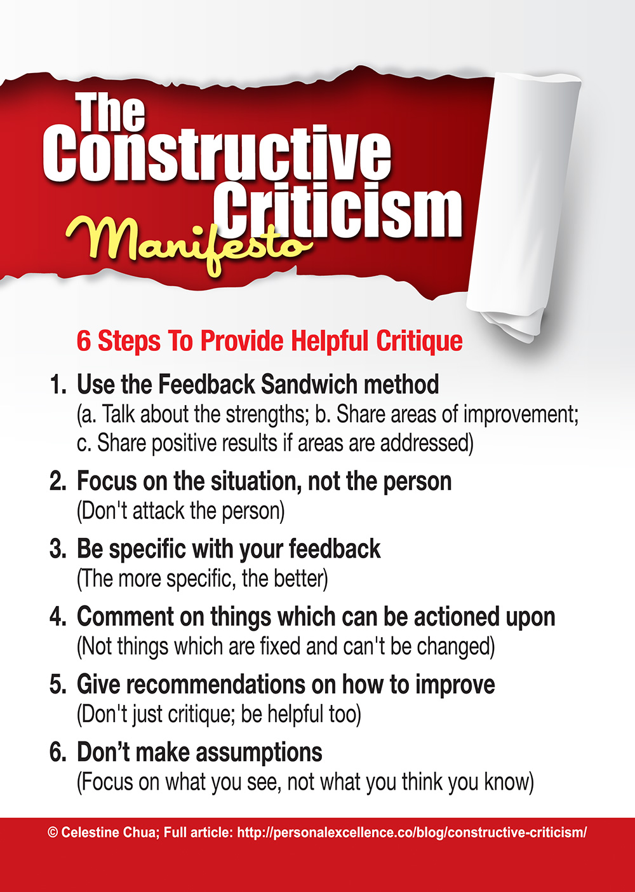

学佛的本质就是学习 —— 学习佛陀的精神，寺院和道场的本质就是学校 —— 提供学习的场所，所以我经常用学习和学校来做比喻和说明。

## 从打骂学生到鼓励学生

回想起我还在小学、中学的时候，老师打骂和体罚学生是常有的事情。父母们不仅不反对，甚至还对老师们说，孩子不听话的时候，随便打，使劲打。所以老师们对待不听话的学生们也真是不客气，打骂是常有的事情，我见过的最严重的情况是，老师扇了学生一巴掌，而且很用力，结果在脸上有五个红红的手指印，清晰可见。父母受不了，跑到学校要找老师算账，结果老师躲了起来，于是父母就在学校叫骂了一天。还有的老师，把骂人当做口头禅 —— 动不动就骂“笨蛋”，脏话兼职张口就来。还有体罚学生，做错了就跑步多少圈，上课不听讲就把学生倒立着上课等。

这类事情在我上小学，初中的时候，真是的非常常见。父母受教育水平普遍偏低，很多父母根本就是文盲，对于如何教育孩子也的确没有办法，完全依赖学校的教育。那时的老师人才也不多，每个老师都要带好多学生，也根本没有办法做到因材施教，所以也就只好采取一些 —— 简答粗暴的教育方式了。

好在教育在发展，老师人才也不断丰富 —— 当今社会的学校，打骂学生已经不多见了，尤其是在经济较发达的城市和地区。也越来越向欧美看齐 —— 老师如果再打骂、再体罚学生甚至会犯法，不仅要被取消教师资格，甚至还有牢狱之灾了。由此可见，随着社会进步，教育水平普遍的提高，短短几十年，就发生了如此之大的变化，从简单粗暴的教育方式，变成了以鼓励为主，更文明更人性的教育方式。

这种改变不仅发生在教育行业，佛教领域也是如此。有很多佛友都同时体验在东方的道场和在西方的道场，对比两者的风格也能得出上述的结论。普遍来说，在欧美的教育理念也深深地影响着这边佛教的运作方式，软言慰语的鼓励远多于严厉的批评。

不仅学校的教育如此，就是父母对子女的教育也是如此，从以前普遍存在的打骂粗线教育，变成了鼓励表扬为主的教育方式了。受过现代教育们的父母，也越来越少打着“都是为了你好”而对子女横加干涉了。

## 批评要有善巧

这并不是说不要批评，而是对于批评也有更高的要求了 —— 批评要有方便善巧，要注意方式方法，要能觉察到对方的感受，把握对于能够接受的方式，最终达到批评的效果 —— 即真正地帮助到了对方，认识到问题，并能够接受指导。要能够做到如此的批评 —— 还真的不是一件容易的事情呢。所以现代教育也总结了一下关于批评的6个原则：

（图片来源：https://personalexcellence.co/blog/constructive-criticism-manifesto/ ）

1. 三明治批评法。三明治有三层，第一层先表扬，第二层再说明哪些地方可以提高（即隐晦的批评），第三层最后再鼓励说，提高了以后的效果会更好。
2. 对事不对人。不攻击，不否定他人，不随便衍生，更不轻易全盘否定。
3. 反馈要具体，越具体越好。
4. 批评要务实，是当前可以改变的事情。（杜绝鸡汤，听起来似乎很有道理，却不知如何实践 —— 只给鸡汤不给勺子）
5. 要有实质性的建议，不能一味批评，更不能为了批评而批评。
6. 不要基于假设。应该基于事实 —— Facts。

如果能够遵循这6项批评的原则，那么这个批评就会非常有实际的效果，对方接受和改变的可能性很大了。也许有人会发现，这里所说的批评和佛学并无关系，不过是现代社会里面的通行原则，适用于一切场合，学校，公司，家庭…… 当然也应该适合道场和寺院了（尤其是对待一般的信众）。

## 正向的教育

若以佛法来说，这就是正向的鼓励式教育了，这尤其是在显宗（指南传和汉传）里面，尤为强调和重要 —— 如道谛中的八正道：正见、正思惟、正语、正业、正命、正勤、正念、正定。每一道前面就有一个“正”字，其含义则非常明显了。“正念”修行是目前非常普遍的修行理念，甚至很多非佛教徒也会参与正念的练习，冥想的练习。但如果忽略了“正念”之前的“六个正”，那正念得起来吗？会真正的、稳定的“正念”吗？显然不会，前面每一个“正”都是后面一个“正”的基础和前提，缺乏前面的“正”，后面的”正“就会像是空中楼阁，沙中建楼了。

虽然佛法中也有“金刚怒目”的说法，但从现在社会教育的发展和现状来看，很显然“慈眉善目”更符合主流，更符合文明的，人性的，以人为本的人间佛教了。非主流的意思是并不是否定“金刚怒目”的意义和作用，而是说，“金刚怒目”试用的范围和普及性不及“慈眉善目”了，应该优先考虑“慈眉善目”，而不是优先“金刚怒目”。

以我作为父母教育子女的情况来看，大多数情况下都是以“慈眉善目”开头的，然后随着时间的推移，30分钟后，一个小时候，耐心逐步消失，情绪逐渐转为愤怒，最后经常以“咆哮”和“怒目”收场。我从未觉得自己的“发怒”可以归属到“金刚怒目”的范畴，所有的“发怒”无一不是烦恼的发作，情绪的失控，最终从身体和语言表现出来的“愤怒”的景象，全身发热，心跳加速，声音刺耳，甚至还会沙哑。所以我也经常向孩子道歉，不该如此发脾气，然后请求孩子也“慈悲”下父母，尽量不要做令父母发脾气的事情，最后导致“两败俱伤”。

## 警惕以学佛为名的PUA

最后这个标题可能会令人不适，但实际情况下，还真的不少。若以佛教的立场来看，99.9999999999%以上的人都是有“烦恼”的，有“贪嗔痴“的，有“问题”，是可以提高的 —— 唯一例外的就是佛陀，只有佛陀才具有100%的圆满人格，换句话说，从佛陀的层次来批判他人的话，那可以把我们所非常熟悉的大菩萨们 —— 观世音菩萨，弥勒菩萨，文殊师利菩萨等，都排排坐，挨个都可以训斥一番 —— 因为他们都还有“一分微细无明”没有破，还有提高的空间。

这是从佛法上说，可以任意批评他人的理论基础 —— 即除了佛陀外的任何人，包括大菩萨们，都有“问题”，都有可以提升的空间。如果连大菩萨们都如此，何况我们这些凡夫俗子呢？所以“批评”在佛教里面，特别容易被“滥用”，因为可以打着“一切为了你好”的名义随意批评，而且批评的“事实基础”还牢固的很呢 —— 只要是凡夫俗子，就离不开“贪嗔痴”的事实。所以“批评”的话语、文章在佛教随处可见。

唯独容易被忽视的就是“批评”的真实效果了 —— 不考虑对方的个人因缘，个人情况，方式方法 —— 一顿“乱棍”打下来，有些人莫名其妙愤然离去，有些人委屈求全有话也不敢说，有些人碍于“佛菩萨”或“大德高僧”的威势下不得不继续“苟且”，甚至有人因此造成更严重的心理伤害…… 再甚者，被一些别有用心的“神棍”利用，最终达到“精神控制”的目的，得以骗财骗色了。如此的情形，如何不令人扼腕。

## 一个小建议

所以我想对那些正在学佛，但却在心里感受不到佛法带来的快乐的人，尤其是在心里觉得苦闷，越学越委屈的人说几句 —— 如果你有这样的情况，请不用再怀疑自己了，虽然我们是凡夫俗子，但并不是无可救药，换个地方也许会有不同的体验。佛法上讲究“相应”和“对机”，如果经过长时间（3月或半年以上）的接触还是感觉很不好，很想离开，那就离开吧，继续上路，继续寻找。对于过往，我们接受，因为这也是因缘，但不去随意评判，如果需要，只需要如实地分享自己的所见所闻和感触即可。

山不转水转，水不转人转 —— 继续保持求学，继续保持功课，假以时日，必定可以拨开云雾重见天日。更何况现代社会里面的佛法资料，文章，视频，资讯非常发达，搓手可得，无论何宗何派，都可以找到足够的“基础内容”，足够我们先行自修自学很久了。又如果对于宗派也没有选择，或无从择决，那就推荐最最稳妥的净土法门或最最基础的阿含经了（二选一即可）。

PUA：最近的网络用语，全称是Pick-Up Artist，但现在多用于一些“过度批评”的场景，或是企图通过“批评”和“否定”他人，以达到对其进行精神控制的非法目的。轻则危害他人心理健康，重则害人害命，是很多非法组织用来蛊惑人心的常见“套路”。

谢谢阅读。 
愚夫合十。

