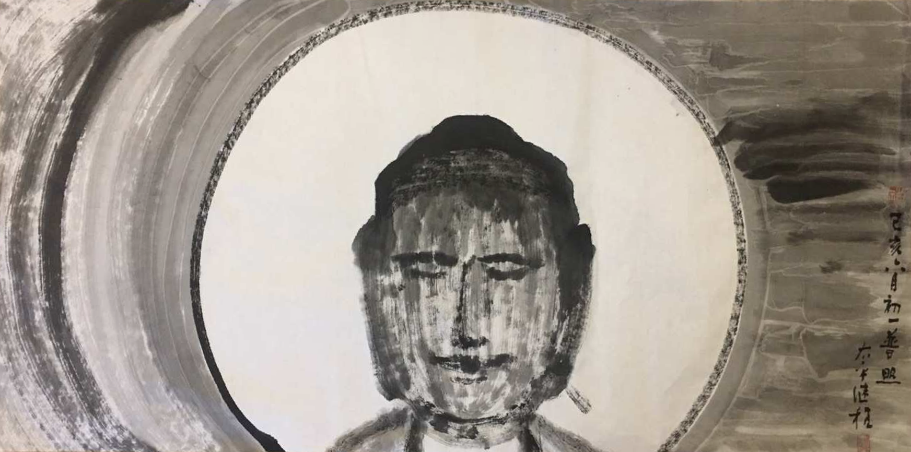

（图片来源：继程法师 chernart.com）

## 重要的哲学课题 —— 什么是我？

什么是我？这一直是哲学上的一个重要话题，古今中外的哲学家们无一未尝思考过这个重要问题，并因此产生了各种各样的观点和学说，如法国哲学家笛卡尔的“我思故我在”，《世说新语》中的“我与我周旋久，宁作我！”，古希腊的箴言“认识你自己”。古印度时期的哲学思想自然也包括这个重要的问题，什么是我？不过这里有一个隐含的概念，值得讨论的其实是真实的我（或说实我，真我），而不是假我，但也不能不区分两者。

## 生活中的假我和实我

生活中虽然大家天天都在用“我”，也在说“我”，但是对于“什么是我”这个话题却少有研究和探索。即便如此，生活中也还是有很多“假我”和“真我”的概念，比如照片中的“我”是“假我”，虽然不妨碍我们用来思念或想念某人，但却也知道照片中的某人，不是真实的人。真实的“我”必须是一个有呼吸的、有心跳的人，最好还能活蹦乱跳的。

## 佛学上的假我和实我

佛法上中的我，也经常分为“假我”和“实我”两个概念，假我是一个虚假的、幻象的我。实我则是一个真实的我。和一般笼统的概念不同，佛学上实我是有一个又清晰且明确的定义，这个定义也是古印度各宗教共同奉行的一个原则了。

* 实的定义：“常”和“一”。常的意思，恒常不变，过去，现在，未来都如此，任何地点，任何条件下都不会发生改变；始终保持“整体”或“单一”的不变，后面这点即是“一”的定义，不能被分割、被拆解，始终保持一个固定的样子。

* 我的定义：“主宰”，或说“自在”。即是一个能够主动控制、自由自在的个体。自主控制表示不需要依赖任务的条件，自由自在表示不受任何条件的约束、束缚。这听起来和现代哲学上的“自由意志”有类似之处。

* 实我的定义：就是以上的“实”和“我”的合称了，即一个“常”，“一”，“主宰”的个体了。而不满足这个条件的“我”，就不是“实我”，那就可以称之为“假我”了。建立了这个“实我”的概念后，再去看佛教经典里面的“非我”，“无我”有关的论述就会非常非常容易了。

## 身体不是我 —— 身见

以佛学上来说，众生最容易犯的错误就是把这个身体当做（实）我了，而这也是佛学上首要破除的第一个错误的观点 —— 身见。经文中经常会进一步分析，身体不是我，意识（或念头）不是我。说身体不是我时，会进一步分析，手，脚，躯干等都不是我，里面的五脏六腑也不是我 —— 这点对于有现代医学背景的人理解起来是非常容易的，无论是手和脚，还是内部的器官，都可以发生改变甚至替代，生命依旧可以延续。所以没有一个是永恒不变的，即使是不生病，也会变大变老的，也还是有变化的。既然有变化，能变化，就不是符合“常”的概念，就不是（实）我了。

而意识不是我，也很容易理解，因为我们的想法随时都在发生改变，一会儿高兴，一会儿难过，一会儿想吃零食，一会儿想看电视……，这里的想法（念头），没有一个会持续不变，永恒不变，不仅会变，而且变化得非常迅猛，以至于一分钟内就可以出现几个，乃至几十个不同的想法。变来变去，也没有一个固定的想法恒久不变了，再次对照“常”和“一”的定义，则很容易下结论说，意识也不是（实）我。

懂得了以上的道理即可破除部分“身见”，但是还有更深层的身见，下面继续说明。

## 百法和边见

以百法的总结来说，共有五种“不正见”，分别是“身见”，“边见”，“见取见”，“戒禁取见”，“邪见”。其中的“身见”是最常见的误解，也是最首要的应该被破除的观点，除此之外，还应该继续审查是否有其他四种不正确的见解。首先是另一个比较常见的误解 —— “边见”。

* 边见：落入两边的见解，一边是“常见”，另一边是“断见”。
  * 常见：“常的一边”，即类似于其他宗教关于“灵魂”的概念，认为“灵魂可以永生”。
  * 断见：“断的一边”，则是认为“人死如灯灭”，“一了百了”的错误观点，科学发达了以后，只认可物质世界的人，“断见”是普遍存在的错误见解了。而在以前，类似灵魂永在的“常见”是普遍存在的误解。

* 见取见：非果计果。
* 戒禁取见：非因计因。

后两个可以合并起来是说，无非是错误地理解了因果，因为因果是相对的关系，所以可以一并来说，分开来说反而不容易理解。最常见的例子依旧是“持牛戒”，“持狗戒”等 —— 某人因为有天眼，观察到一头牛死后升天了，即认为只要像牛一样生活，那么也就可以像牛一样，死后生天了。

这个例子在现代人来看好像很可笑，但在古印度，宗教非常发达，各种奇能异士也是非常多，他们各抒己见，再将自己的观点慢慢发展成一个宗派，最终乃至形成了古印度时期的96种宗派，而他们的见解总结起来，也有62类之多。而这62类异见中，多数又属于这类“非果计果，非因计因”的分类了。这96种宗派的多数到现在都消失了，少数被融入了其他的宗教，但某些见解依旧是存在的。例如提到人类的起源 —— 无论是女娲造人说，还是梵天造世说，或神造世界说等，这类说法都不符合佛教的因缘法，因此都可以算做是第五类的“邪见”了。

* 邪见：其他任何错误的见解。佛教的核心即是因缘法，所以可以归纳说，排除了上面专门提出来的四种错误的见解，其他的一切不符合佛法的见解，都归入此类了。
 
按照现代分类的方法，或许可以叫做“其他邪见”。其中也有典型例子，例如拔无因果（即不承认因果律的），不承认圣贤的存在（如否定释迦牟尼成佛，否定阿罗汉能解脱，否定他人可以成佛成阿罗汉的等等），否定通过圣道修行必得圣果，以及其他一些常见的误解 —— 如恶取空，“梵我一如”等观点都属于“邪见”了。

## 我执 = 分别我执 + 俱生我执

* 我执：即认为有一个“实我”的存在。看懂了上面的论述，就可以破除“身见”的错误观点了，但这还不是“无我”，因为还有“我执”。根据唯识学的分类来说，“我执”进一步又可以分为“分别我执”和“俱生我执”。

* 分别我执：即受到了后天的错误的教育而生起的关于“我”的错误见解 —— 如身见，边见。这里的错误教育即不符合佛法（主要指因缘法）。分别我执只会在第六识（意识）上有作用。因此通过理论上的学习，正确了解没有一个“实我”后，即可破除“分别我执”了。

* 俱生我执：与身俱来的我执。只要有身体的存在，就会产生俱生我执。再深入一点，用唯识学来解释，即是第七识（末那）自始至终都会错误地认为第八识（阿赖耶）为内在的我，因此产生了俱生我执。只要有我执，就是有漏，就会引发贪爱，生起烦恼，深陷轮回。

关于理解俱生我执这点非常非常关键，它可以用来解释好几个重要的问题。

## 第一个问题 —— 动物有我执吗？
问：为何动物们没有受过后天教育也会有我执呢？

虽然动物们不受教育不会有“分别我执”，但动物们都还会有与身俱来的“俱生我执”，因此动物们也会有贪嗔痴，会继续造恶业和轮回。

## 第二个问题：为何学佛许久也没有证悟"无我"?

问：为何我们学佛很久，也听懂了很多道理，却还是无法证悟“无我”呢？或者说，我们已经学习了很多“无我”的知见，也破除了很多错误的观点，但为何依然做不到“无我”呢？

原因是，通过学习佛法上的正确知见只能破除“分别我执”，不再把身体当我，不再把想法、观念当我，也不认为有一个“实我”存在。但是产生“俱生我执”的第七末那识，它的染污作用却像影子一样始终纠缠着第六识（意识），令我们时时刻刻产生“我执”，继而引发贪爱，生起烦恼。好比用现代心理学来说，“我执”还存在于“潜意识”里面。

而对治这种“俱生我执”的最直接的办法，即是运用第六意识升起“无我的胜解”，用强大的“慧心所”（智慧）来对治它，来反制它的染污作用。这也是禅宗所推崇的觉察功夫，不怕念起，只怕觉迟。如果能够时刻保持觉察，就能及时反制被第七识染污的作用。久而久之，从量变达成质变，即可“见道”了，也就是证悟、证果了。

至少是初果须陀洹 —— 伏住第七末那识对第六意识的染污作用，此时粗重的贪嗔痴现行也会被断除了，但依旧会有微细的贪嗔痴，因为第七识本身的“我执”作用还在 —— 还需要继续努力对治，直到第七识上的“俱生我执”被彻底断除了 —— 即此时的第七识发生了根本性地转变，不再认第八识（阿赖耶识）为内我了，不再是“我执”的状态了，这样才达到了真正的、彻底的“无我” —— 即证阿罗汉了。

再说“无我的胜解”虽然是最为直接的反制第七识染污第六识的办法，但如果对于“无我”的理解总是似懂非懂时，也没关系，不用死磕。佛教里面通行的各种修法，各种功课（念佛，诵经，拜佛，拜忏，打坐等），只要运用得当。再加上对佛教和方法的信心，持续不断地努力，最终也会达成从量变到质变的转变，达到伏住和断除俱生我执的最终效果，从而证悟和达到彻底的“无我”。

## 总结下证果

对于认真学佛的人来说，应该要对证果有所了解，否则如何制定长远的目标和短期的目标呢？又如何对照和会通经典中各种各样的圣贤境界呢？当有人宣称自己的“证悟”时，又如何客观评判呢？简略地介绍下我执和证果的关系 —— 顺便一提，这样也可以会通到南传上座部了，因为从我执的角度来说，两者的目标和路径都是一致的。

* 初果，须陀洹果：
  * 断除分别我执。此分别我执仅在第六识（意识）上有。
  * 伏住俱生我执在第六识（意识）上的染污作用（现行）。
  * 断除粗重的贪嗔痴。
* 二果、三果：
  * 渐伏俱生我执在第七识（末那）上的染污作用（种子）。
  * 渐伏微细的贪嗔痴。
* 四果，阿罗汉果：
  * 断除俱生我执在第七识（末那）上的染污作用（种子）。
  * 断除一切贪嗔痴。

若以菩提道来说，大约初果可以对应初地，只是菩提道在初地还需要破除“分别法执”（所知障），以及伏住“俱生法执”在第六识（意识）上的现行；阿罗汉果则可以对应八地菩萨，伏住第七识上的俱生我执和俱生法执而不起现行，任运不起，就无需加功用行去对治了；或对应到佛果，因为只有佛果位才是彻底断除了俱生我执和俱生法执了。

谢谢阅读。 
愚夫合十。

