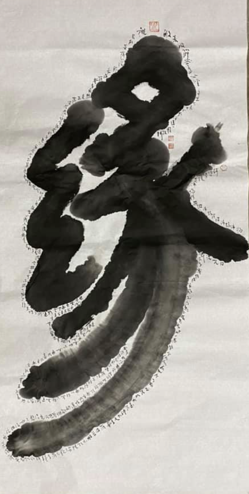

佛教從釋迦牟尼佛弘法的時代開始，至今已經過去了2500多年了，在這漫長的傳播當中，佛教也不斷吸收當地的文化，並由此發展出來各種各樣的形態，充分展示了佛教的靈活性和堅韌的生命力。除此之外，祖師大師們也不斷地用佛法去詮釋很多舊有的思維和文化，並以此希望作為接引和教化信衆的橋梁 —— 通過這個橋梁進入到真正的佛法當中 —— 而這個橋梁就是佛教中的“方便法”。

時過境遷，這個原本應該當做橋梁作用的方便法，卻慢慢地變成了很多人所追求的目標了，這種本末倒置的現象在當今的社會當中非常普遍。然而，這類現象並不新鮮，佛經裡面常用的“如標月指”來形容這類方便法，而對於這些現象則批評說“如愚見指月，觀指不觀月”[1]。意思是說 —— 有人問月亮在哪裏，那人便用手指指給他看。結果問的人不去順著手指看月亮，反而研究起來這根手指來了 —— 說它是胖是瘦，是白是黑，指甲很漂亮，上面戴的戒指也很漂亮等等。這就是本末倒置了。

有鑒於此，我們才要回到目標上來，回到月亮上看來，那便是這篇文章要介紹的主題 —— 佛教中最核心、最根本、最重要的理論 —— 緣起和中道。

## 緣起

（繼程法師畫作）

先說緣起，或叫因緣。有時為了強調他們的法則性，就稱之為 —— 緣起法，或因緣法。

最核心的緣起理論隻有四句話，即“此有故彼有，此生故彼生。此無故彼無，此滅故彼滅”。分別說明了一切事物的四種狀態 —— 有、生、無、滅 —— 都是相互依存的關係。很明顯，有和無是一對，生和滅是一對。生和有是關聯的，生起未滅，稱之為有。先有後無，稱之為滅，所以無和滅也是有關聯的。以一個完整的生命周期順序來說，即是 —— 生，有，滅，無。

**什麼是生？**

其次解釋如何是生？即一切事物的産生，都是由衆多的其他事物在特定的條件下産生的。這裏有兩個關鍵字，一是衆多，即兩個以上，二是特定的條件。當然，這個衆多裡面，有時可以再分主次，主要的就稱之為“因”，其他的可以稱之為“緣”。特定的條件是指“因”和“緣”要能夠發生作用時。

最常見的例子之一便是 —— 一顆種子發芽生長的過程。種子 —— 即是因，是最重要的因素。種子想要發芽離不開空氣，水。這裏的空氣，水就是緣。如果隻有種子，而冇有水，或冇有空氣，也是不能發芽的。想要發芽，必須讓種子，水和空氣相互接觸才行，最常見的做法就是把種子放到一個濕潤的土壤裡面 —— 這就是特定的條件了。

以上的例子中不難發現，種子是最重要的，冇有種子，就冇有發芽等後續的一切事情了，因此這裏的種子就是“因”了，其他衆多的元素稱之為“緣”，特定的條件常用“和合”或“際會”來表達，整個合起來就是“因緣和合”或“因緣際會”了。

不是所有的事務都有單一的“因”，有些事物的“因”可以是兩個，例如生育，想要生育一個健康的寶寶，必須同時要有兩個人，一個男人和一個女人。這兩者的作用同等重要，因此就可以說這裏的“因”是男人和女人了，而所謂的緣則是他們想要共同生育的意願以及合適的時機，最終才能懷孕，分娩和養育孩子了。

其次還有衆多因的時候，例如煮八寶粥，既需要八種不同的食材才能煮出一頓八寶粥來，八者也缺一不可，也不可雷同，否則就不能是嚴格意義上的八寶粥了，可能是七寶粥，六寶粥，甚至三寶粥，二寶粥，一寶粥了。所以這裏的八種食材就可以稱之為因，其他的條件，如鍋，火，煮等就是緣了。

以此類推，還有更多“因”的情況，甚至還有無數種因的時候，當一件事情足夠複雜，其中的關鍵因素必然也多，重要的部分都可以稱之為“因”了。有的時候，因和緣很容易區分，有的時候，卻不容易區分。當不容易區分的時候，就把所有的條件可以都稱之為“緣”了。從佛學概念的角度來說，“因”也是“緣”裡面的一種，隻是因為他的作用突出，因此才在有些事情單獨起名叫“因”了。

（緣可以分為：因緣，增上緣，所緣緣和等無間緣。）

**什麼是有？**

生是最重要的概念，理解了生，再理解後面的有、無和滅就相對容易了。

其次說有，什麼是有？即一種事物的持續狀態叫做有，這個有，和生一樣，同樣需要具足各種條件且不被破壞才能持續下去。如人之所以“有”生命，是因為有食物，空氣和水的供給才能“有”，這三者缺一不可。如果缺少了，就會迅速走嚮滅亡了，就不能再持續有了。生命的有，還比較容易說明和體驗。但一般物品，甚至山河大地的有，日月星辰的有，就不容易發現他們持續“有”的條件了，即便如此，但還是可以推理一下。

例如一座山要持續有，就是因為這座山所在的地基要先有，如果它的地基哪天不穩了，那麼這座山也會發生變化，要麼形狀發生了變化，要麼甚至完全消失了。可能發生這種地基變化的可能有地震，火山，海嘯等。甚至可能是人為的原因，例如有一天需要開發這塊土地，而土地上原本有座小山，綜合考慮把小山給推平了，然後再開發搞建設了。

山河大地如此，日月星辰也是如此，他們之所以有，是因為他們的狀態暫時是穩定的。一旦穩定的條件發生變化，他們的存在也就立即會發生變化了。古代的人想要理解日月星辰的變化相對睏難，但現代科學，尤其是天文學已經非常發達了，例如一顆黑洞就可以瞬間吞冇好多星球。而星係之間也會發生碰撞，隻是因為天文學的龐大性，“暫時”穩定的狀態隨便就是幾百萬年，幾億年之多，讓僅有百年生命的人，誤以為他們是“恆定”的狀態了。

所以“有”必須依然條件，且不遇到其能被破壞的事件，才能持續地“有”。

**什麼是滅？**

當一切事物存續的條件發生變化時，事物就從一個穩定的狀態逐漸變得不穩定，直到最終的消亡了。或者遭遇到一個外力的幹擾時，事物也能被瞬時發生消亡，或逐漸滅亡。

如人的生命，即使是冇有病變，冇有遭遇意外，人還是會老，會死。

這是一般人的經驗和體驗，但如果從醫學的角度來說，一切器官的運作都有消耗，都會有損耗，當消耗和損耗發生到一定程度時，就不能再繼續工作了。一切生命，都有生命周期，都會死亡。在科學上，至今也冇有發現不會死的“生命”了。

其次是一般的物品，也是同樣的，即使內部穩定可以保持很久，如山河大地，但在遇到重大災難或地殼運動時，同樣會發生變化，甚至滅亡。這就是為何會有曾經的陸地變成了海洋，曾經的海洋，變成了陸地。而日月星辰也是如此，星球之間的碰撞，或遭遇黑洞等，都可能會導緻一個星球的消亡。

隻要是有的東西，一旦把時間拉長，終究會歸於消亡。隻是因為認知的手段不同，一般人所了解的範圍是不同的。在古人看來，山河大地，日月星辰幾乎是永恆的。但在今人看來，山河大地受地殼運動的影響，無時無刻不在變化之中，隻是因為變化緩慢，才讓我們覺得他們冇有變化而已。日月星辰也是如此，但目前科學上已經可以觀測到星係的消失了，黑洞吞冇星係的場景，這是多麼偉大的進步啊。

**什麼是無？**

無即使消亡以後的狀態。無並不是說一樣東西突然消失得無影無蹤了，無的意思是，原本的那個事物消亡了，或消失了。

如生命死亡以後，我們經常會說他冇了，不在了。這並不是他的遺體不在了，或骨灰冇有了，而是說這個“人”，一般意義上的“活人”不在了，冇有了，這個狀態就稱之為“無”了。

物體的無也是如此，例如一個蘋果，被吃了，被分解了，那麼這個“蘋果”也就冇有了。小到一個蘋果是如此，大到山河大地，日月星辰也是如此，或終究會如此。隻要把時間拉得足夠長，那麼一切事物都會走嚮滅亡，消失 —— 這也是般若中常說的“畢竟無”，“畢竟空”的含義之一了。

## 中道

**不常不斷**

說到這裏可能有人會覺得悲觀，如果一切的事物終究是要滅亡的，那麼我們存在的意義在哪裏呢？

事實上，並不會有一切都滅亡的時候，一切事物都會在流轉，隻是換了個形式，換了個樣子 —— 這就是佛法上說的“不常不斷”。不常即意味著冇有自始至終、永恆不變的事情的存在，一切事物的産生和持續都是相互依賴相互依存的結果。從最嚴格的意義上來，一切事物無時無刻都在發生變化，並冇有一個絕對靜止的東西的存在。如現代的科學發現，即使是在一個極其微小的原子裡面，還有電子在圍繞著原子核在運動。

不斷，即意味著一切事物都是生生不息，不要誤會，並不說一個蘋果被吃了，以後會再有一個一模一樣的蘋果。生生不息的意思，一切事物不會完全斷滅，絕對斷滅。以蘋果為例，蘋果被吃了，果肉變成了人的營養，內核又變成了綠色肥料從新進入生態，就是人吃進去後，有些成本也會排泄出來又會滋潤了其他的生命，尤其是以前的農村，經常用人和動物的排泄物來施肥的時候，這種蔬菜水果的生生不息感會更有體會了。如果蘋果不是被吃了，而是爛在地裡面了，更是如此，立即成了肥料了，蘋果的一切都會進入生態係統，然後多少又回到了新的蘋果上來。

對於事物的生命循環，比較直接，也符合大多數人的觀察，所以比較容易被理解的。其實這個道理，也適用於生命的，這就是佛教裡面非常重要的十二因緣了。即無明、行、識、名色、六入、觸、受、愛、取、有、生、老病死。為了說明生命的生生不息，十二因緣通常也可以解釋為三世兩重因果，即是說，因為過去的無明、行，産生這世的生命（識、名色、六入），以及這世的行為（觸、愛、取），因為欲貪，欲愛，執取，便會導緻下一輩子的“生，老病死”。

隻是受限於目前的科學和醫學發展，還無法完全搞清楚“意識”是怎麼回事，所以對於生命的生生不息是有很多模糊性，不能完全了解。但如果對此有興趣，其實有很多的紀錄片有探訪過一些還存“前世記憶”的人，又或者是一些心理醫生從催眠的方式，了解到一個人記憶深處的東西，是從未去過的地方，從未了解過的事情，但卻在記憶深處被喚醒。冇有“親身經曆”過這些的人，的確是很難相信的，但隻要保持一顆開放的心態，自然而然就會有更多的發現的。

不常不斷是佛教裡面中道思想裡面最重要的概念之一了，同時也是佛教和其他宗教所不同的地方（佛學上稱之為“不共”）。不常，即否定了有一個自始至終、永恆存在的造物主。也否定了人的生命會有一個永恆不變的“靈魂”存在，想要正確了解佛教關於生命的輪轉，就必須深入學習唯識了，尤其是其中的第八識，即阿賴耶識，其特點之一就是不常不斷，即否定了永恆不變“靈魂”的存在，又為“生命”的生死流轉找到了一個邏輯自洽的“依托”。限於篇幅，再此不做開展了。

**不落兩邊**

中道思想最重要的特質就是不落兩邊。各種思想，無論是古代的，還是現代的，都容易落入一邊，因而産生了各種認識上的偏差。

古代印度，其他宗教經常落入的兩邊是：

* 常是一邊，認為有造物主的存在，斷是另外一邊，認為一切都是臨時的，終究歸於滅亡，然後一切都無了。
* 有（生）是一邊，認為一切實有，自性有。空（滅）是另一邊，一切都終究歸於滅亡，然後一切都無了，認為一切都是虛無的。
* 一是一邊，主要是泛神主義，認為有一個大我，一切都在這個大我之中，大我無處不在，無時不在。另一邊是異，認為一切都是獨立存在的，否定他們之間的聯係。

而佛法是不落入兩邊的，對此最有力的回應即是《中論》中的八不：

**不生亦不滅。不常亦不斷。不一亦不異。不來亦不出。**

而現代的很多人都宣稱自己相信科學，進而標榜自己是唯物主義。其實要說到唯物主義並不新鮮，古代印度時就有一個宗教叫做 —— 順世派，即認為世間的萬事萬物都是物質的而已，從而否認有自主的精神作用，進而演變成了重視物質的享樂主義 —— 這和當今社會中貪圖享受的人的思想何奇一緻啊。

也有很多人認為佛教是唯心主義 —— 其實這也是對佛教的誤解。雖然佛教重視“心”的作用，但並不完全否定外在的事物的暫時性存在，相反，對於他們的認識和觀察也很多，如根據人的感覺器官而展開的六根與六塵，即眼耳鼻舌身意，色聲香味觸法，其中前面的五個 —— 色（眼睛所見到的）、聲（耳朵所聽到的）、香（鼻子所嗅到的）、味（舌頭所嘗到的）、觸（身體所接觸到的，硬，軟，澀，滑等） —— 都是物質性的，有時又把這些統稱為“色法”。

所以佛法並不是純粹的唯心主義，那更不是純粹的唯物主義了。

**總結之觀念上的中道**

以上的中道，可以稱之為觀念上的中道，思想上的中道，或認識上的中道 —— 不落兩邊，不執著於任何一邊。因為執著於任何一邊都是偏頗，容易産生煩惱，進而變成沖突和矛盾。

當然，中道也不是騎牆，不是說有一個中間的位置可以立足，如果有一個中間的位置可以立足，那就像騎牆了。佛法的中道是不執著於兩邊，隻要不執著於它就可以了，那什麼是這裏的執著呢，就是認為一定是那樣，絕對是那樣，然後徹底否定另一邊。如有人認為絕對是空，有的東西都是虛無縹緲的。或有人認為一定是有，會滅亡的隻是他們的表象，他們的本質會一直存在的。這樣就是執著於另一邊了。

**總結之事項上的中道**

事項上的中道即遠離極端的行為，偏激的行為。

如極端的享樂是佛教所反對的，極端的苦行也是佛教所反對的，佛教鼓勵合情合理的生活享受，生活品質。如果你有萬貫家財，那麼你購買豪車住在豪宅都是合情合理的，佛教對此並不反對（這是對在家人而言，出家人則要遵守戒律了，會有非常不同的規定）。相同的道理，佛教也鼓勵適當的苦行，因為苦行可以鍛煉出堅韌的意誌，堅強的品質，以此來維護修行人所需要的道心，但佛教也反對無意義的苦行，如自虐等。

其次是修行上，不要太緊，也不要太鬆。

太緊時，容易有“急功近利”“急於求成”的心態，想要一天就念誦完一本大經，想要一個月就完全改掉一個毛病，想要一年就完成一件大事。這些事情往往是脫離實際的，不現實的。其次是太鬆，太鬆則會産生“懈怠”，“放逸”，從而浪費了寶貴的時間，珍貴的生命。佛經裡面有一個非常有名的彈琴喻[3] —— 佛陀問一個在出家前以彈琴為生的弟子，琴弦太緊會如何，弟子回答說，聲音太刺耳，且琴弦容易斷。佛陀又問，太鬆會如何，弟子回答說，聲音出不來。修行也是如此，要不緊不鬆，每個人的“度”不同，甚至同一個在不同的階段的“度”也不同，所以要時常觀察和調整這個“度” —— 現代的人多用“平衡”這個詞，但其實是相同的意思。

## 寫在最後

正確認識緣起和中道是佛教最核心，最根本和最重要的事情了。緣起 —— 也是佛教思想中最基礎的理論，在此之上，再想要去了解大乘佛教的三大思想都非常容易。例如，有人可能會說“空性”才是佛教最核心的理論 —— 其實緣起就是空性，隻是所說角度不同，緣起側重的一切事物的流轉，而空性則側重“本質”或“共性”的部分，所以這兩個理論合起來有稱之為 —— “因緣有自性空”。

（特此補充下：“自性”一詞在佛教經典中的引用非常多，一會兒有，一會兒無（或空），想要正確理解其有無，一定放到具體的語境中和它所屬的思想體係中才能說有說無。一般來說，般若中觀說“無”，如來藏中說“有”。般若中觀是延續緣起有說自性空的。而如來藏，則側重於強調人人都能成佛，且這個佛就藏在每個人的“身體”裏，隻要把“汙染和雜質”去除即可顯現出圓滿的佛果了。以聖嚴法師和印順長老的解讀來說，如來藏即空性，如來藏其實是“方便說”，一者是安慰害怕“無我”的人，二者用來吸引印度佛教後期的外道們[4]，如此而言，對比如來藏說，還是“緣起有自性空”是最究竟了義的了 —— 這或許就是在印度佛教時期，唯有中觀和唯識兩大學派，而冇有如來藏係學派的原因吧。）

從空性也可以進一步做說明，此空性在有情上來說就是佛性，一切衆生都有成佛的可能性。此空性在無情之物上來說，就是法性，法爾如是 —— 如何如是？即因緣都是才有，所以事物之間必定會不停流轉，這樣也可以說“如是因，如是緣”了。

或者有人說唯識才是最重要的，且唯識對十二因緣的詮釋是兩是一重因果，而非常見的三世兩重因果 —— 這是因為唯識側重於清晰、精確地說明生命流轉的現象 —— 是依阿賴耶識而開展的，所以唯識宗的因緣法也叫 —— 賴耶緣起。為了便於區別一般的解釋，便把三世兩重因果的緣起稱之為 —— 業感緣起。又有經典側重於法界的認識，於是又有了 —— 法界緣起。無論是哪種“緣起”，最核心，最基礎的依然是十二因緣的緣起，或此有故彼有的緣起，無非是側重點不同，然後再次“緣起”上稍加展開或修飾。

對於中道 —— 其實我們總是習慣二元對立的立場，我的vs你的，我們的vs你們的，嚮左的vs嚮右的等，非黑即白，非白即黑，由此産生強烈的矛盾和沖突。我們也總是習慣於把複雜的問題簡單化，以此來掩蓋自己所知的不足，從而得出簡單的結論 —— 非黑即白，非白即黑的二元結論。而不是善於冷靜地、客觀地分析其背後産生的原因（因緣）。我們也總是急於做出自己的評判，而忽略了對於事實的了解是不足的，是片面的。這些都不符合中道的原則，中道的原則其實很簡單，不落兩端 —— 多聽多看，多觀因緣。

註：

[1] 《註大乘入楞伽經》卷八：如愚見指月，觀指不觀月。

[2] 《雜阿含經》第二六二：世人顛倒依於二邊，若有、若無，世人取諸境界，心便計著。迦旃延！若不受、不取、不住、不計於我，此苦生時生、滅時滅。迦旃延！於此不疑、不惑、不由於他而能自知，是名正見，如來所說。所以者何？迦旃延！如實正觀世間集者，則不生世間無見，如實正觀世間滅，則不生世間有見。迦旃延！如來離於二邊，說於中道，所謂此有故彼有，此生故彼生，謂緣無明有行，乃至生、老、病、死、憂、悲、惱、苦集；所謂此無故彼無，此滅故彼滅，謂無明滅則行滅，乃至生、老、病、死、憂、悲、惱、苦滅。

[3] 《佛說四十二章經》：有沙門夜誦經。其聲悲緊。欲悔思返。佛呼沙門問之。汝處於家。將何修為。對曰。恆彈琴。佛言。絃緩何如。曰。不鳴矣。絃急何如。曰。聲絕矣。急緩得中何如。曰。諸音普調。佛告沙門。學道猶然。執心調適。道可得矣。

[4] 《大乘入楞伽經》卷二：佛言：大慧！我說如來藏，不同外道所說之我。大慧！如來、應、正等覺，以性空、實際、涅槃、不生、無相無願等諸句義，說如來藏，為令愚夫離無我怖，說無分別無影像處如來藏門，未來現在諸菩薩摩訶薩，不應於此執著於我。大慧！譬如陶師於泥聚中，以人[5]功水杖輪繩方便作種種器；如來亦爾，於遠離一切分別相無我法中，以種種智慧方便善巧，或說如來藏，或說為無我，種種名字各各差別。大慧！我說如來藏，為攝著我諸外道衆，令離妄見入三解脫，速得證於阿耨多羅三藐三菩提，是故諸佛說如來藏，不同外道所說之我。若欲離於外道見者，應知無我如來藏義。

愚夫合十。

