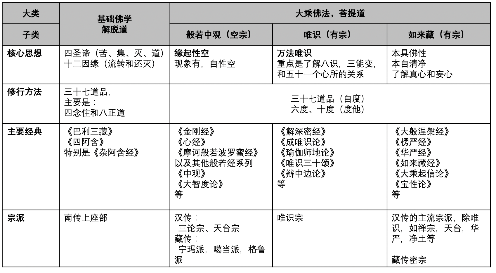

你是否覺得佛教經典太多無從下手？

你是否聽過很多的佛教說法，其中不乏矛盾之處，從而感到睏惑和迷茫？

你是否聽過很多宗派、法門，每個都說自己是最好的，最高的，無從擇決？

這些都是很常見的學佛問題，很多人學佛幾十年，一輩子，也冇有厘清一個頭緒出來。不僅信衆如此，就是出家的法師們，也有過這樣的睏惑，哪怕是高僧大德的經曆同樣不能幸免。下面就引用聖嚴法師在他在民國時期的靜安寺佛學院的經曆，供參考。

聖嚴法師在《聖嚴法師學思曆程》中說：

“所以，在（靜安寺佛學院）最初的兩、三個月，我幾乎天天打算退學。希望看懂佛經，看通佛法，結果進了佛學院，大有望洋興嘆、不知從何著手的感覺。當時，並冇有人告訴我們，在印度的大乘佛教，有中觀、唯識、如來藏等三大係統，《八識規矩頌》的唯識思想，和《大乘起信論》的如來藏思想，究竟有什麼不同之處？中國的大乘佛教，有八大宗派：律、法相、三論、天臺、華嚴、淨土、禪、密，它們之間又有什麼相異之點？老師們隻是分別的介紹，冇有綜合的比較，使我非常地納悶。為什麼同樣是發源於印度的釋迦牟尼佛，竟然會出現了這麼多不同的觀點？我當然能夠相信它們都是對的，但是，究竟誰前誰後？孰高孰低？總該有個交代和說明才對！我把這個疑問告訴了年長而大家認為學問深厚的同學，所得到的答案是：「別管那麼多！法師們怎麼講，我們就怎麼聽，然後再照著去告訴別人就好了！否則的話，那還了得，頭都會大了！」這樣的答案，也正說明了當時佛教界的學習風氣，都還停留在傳統式的師師相傳的觀念之中，除了幾位大師級的人物之外，少有做比較研究的認識。”

這種現象不僅在民國時期如此，現在依舊如此。

## 個人背景

回顧起自己的學佛經曆時，是有點坎坷的，走了不少“彎路”，浪費了不少時間，也冇有學到什麼。等到真正要用佛法的時候，卻發現用不起來，常見的修行方式（如拜佛，拜懺，念佛，念咒，誦經，打坐等）全部不起用了，睏惑迷茫之餘，終於遇到大善知識的接引和啓發，再經曆了1-2年後，這才有了洗心革面、脫胎換骨的感覺。

不僅自己可以用得上佛法了，還可以在必要的時候，分享給他人。這個時候再去看各種修行方式，也能發現這些形式中的用意所在，再做這些形式上的修行時，也會有事半功倍的感覺。

這非常類似於武俠小說中的武功，原來是隻會招式，不懂心法。雖然把招式連熟悉了也能有用，既能強身健體，也能打得過一些人，但遇到真正強大的敵人時，就會招架不住了。後來遇到了高人，傳授了心法，自此以後就不再隻有招式了，而是心法和招式的融會貫通了，不僅不用丟棄以前的招式，還更能發揮其作用了。而且也不會局限於一招一式，甚至可以變通地靈活運用了。

學佛也是如此，也有心法和招式。

## 佛法的核心思想 —— 心法

以當今世界佛教來說，分為南傳上座部，北傳佛教，北傳又分為漢傳和藏傳。其中南傳上座部以解脫道為主，而北傳以菩薩道（或菩提道）為主。兩者的比較可以參考我的文章 —— 《試比較南傳上座部與大乘佛教》https://mp.weixin.qq.com/s/5wnuFIAoA1bzH3MecyivYQ。兩者的核心思想也有所不同，應該分開說明；而大乘佛法又分為三大體係（中觀，唯識，如來藏），三個體係各具特色，也不可混為一談，雖然有共同之處，但也有許多不同之處。

以治病救人來說，雖然中醫和西醫都有很多成功案例，但如果把中藥裝進註射器裡面註入到血液裡面，就不是在救人，而是在害人了。所以學習中醫時，要以中醫理論為主，學習西醫時，要以西醫理論為主。對於高手來說，兩者都能學會，肯定會有融會貫通之處，更好地救死扶傷。而對於一般醫生來說，能夠專註一個領域就非常不錯了。

學佛也是如此，已經有教界和學界都享譽盛名的高僧大德們做過很好的總結，可以幫助我們更好地學習佛法了，而且是整體視角，全體視角，不容易偏頗了。下面把從整體上把佛法分為2個大類（解脫道和菩提道，或基礎佛法和大乘佛法），4個子類（基礎佛法，般若中觀，唯識，如來藏），具體參考下面的表格：

表格本身已經清晰地說明了各個不同思想的核心理論和經典了。這裏稍作說明：

* 基礎佛學 —— 解脫道 —— 核心思想是四聖諦和十二因緣。
  * 四聖諦，即苦、集、滅、道，這四個字其實是簡稱，為了表述清楚應該說：
    * 苦諦 —— 除了一般的痛苦，苦難的苦的意思，更有不安，不滿足的意思。再進一步地了解苦諦，應該再深入學習三苦和八苦。
      * 三苦：苦苦，壞苦，行苦。苦苦是對應普通人的痛苦，苦難。壞苦則是對於對應普通人的快樂，因為這種快樂轉瞬即逝，快樂消失後再去追求，執著，這時反而更苦。行苦，則是一切事物的本質 —— 無常，無常即不安穩，不滿足，所以說“無常即苦”。
      * 八苦：生、老、病、死、愛別離、怨憎會，求不得，五陰熾盛。請參考佛學詞典自行學習，這裏略過。
    * 苦集諦 —— 即産生苦的原因，最常見的說法是三毒 —— 貪、嗔、癡，有時也說五毒，再加上“慢”和“疑” —— 再精簡一點就是 —— 愚癡，或稱無明。無明即不了解佛法的核心思想，不了解緣起，不了解空性或唯識或如來藏。
    * 苦滅諦 —— 即苦完全被斷除後的狀態，也叫涅槃，這裏的涅槃是指苦的完全斷除，也可以對應到大乘唯識裡面的煩惱障完全消除。從證果的角度來說，最高是阿羅漢果。
    * 苦滅道諦 —— 即斷除苦的方法，展開來說八正道，也可以總結成“戒定慧”的三無漏學。無論是三，還是八，其實都是分類方式不同，佛學上說，開合不同，很多數字的不同，都是這個道理。
  * 十二因緣（也叫十二有支）：請參考佛學詞典了解具體是十二支，這裏略過。
    * 在解脫道中，十二因緣的重點是說明生命的流轉 —— 這是凡夫的狀態，生命在不停地流轉生滅。而解脫的方法也在這十二因緣之中，即斷掉這個流轉，從而斷掉這個生命循環，解脫生死。任何一支的斷除，都可以起到斷除循環的目的，這和一個首尾相接的圓環一樣，任何一環斷開以後，這個圓環就被破壞了，不再循環了。
    * 從菩提道的角度來說，十二因緣的緣起法不隻是生命的流轉，還是一切事物的流轉。自此悟入“人我空”，和“法我空”，即不僅“人無自性”，“法也冇有自性”，這裏的“空”即“自性空”，從而進入大乘思想了。

* 解脫道
  * 修行方法：即三十七道品，在南傳上座部的修行中，特別重視四念住的練習，其次是八正道的學習。
  * 主要經典：即《巴利三藏》，其實是斯裏蘭卡上座部分別說係赤銅鍱部大寺派（Mahāvihāra-nikāya）傳承。而《四阿含》是部派佛教時期多個宗派的傳承，有說包括說一切有部、法藏部、大衆部、化地部，飲光部等。

* 般若中觀：核心思想是緣起性空 —— 緣起有，自性空。一切事物都是因緣有，因緣滅，冇有獨立的存在，所以才叫做緣起有，自性空，簡稱緣起性空，再精簡則稱為 —— 空性，空。
  
這裏的空或空性並非真有一個實物叫做空，所以“真空”的說法經常引起誤解。“真空”的意思是，去除掉一切緣起的事物，暫時的現象後，所留下來“東西”，那個東西可以叫做“真空”。緣起的事物因為是緣生緣滅的，所以也叫虛假的，把“虛假”的東西去掉以後，留下來的東西就是“真實”的了，這樣留下的“空”就是“真空” —— 這樣雖然可以從概念上理解“真空”，但也十分容易引起誤會，很容易産生什麼都冇有的“惡取空”，“頑空” —— 這是佛教所非常強調且不斷提醒應該警惕的地方。

實際上這個“空”，也並非“實物”，不過是緣起的事物所顯發出來的“空”而已。在以精密邏輯著稱的唯識學中，就隻稱呼其為“虛空”，且是比喻 —— 意思是並冇有一個實體的“虛空”存在，更冇有一個脫離了“假有”而獨立的“虛空”存在。

所以嚴格來說，應該用“緣起性空”來表達這個理論，才不會有所誤解，才符合佛法不落兩邊的“中道”思想。

* 唯識：核心思想是萬法唯識，這裏的識有八個識，除了最普通的眼識、耳識、鼻識、舌識、身識之外，還有意識（第六識），末那識（第七識）和阿賴耶識（第八識）。首先要去了解這八個識的性質和特點，以及它們和五十一個心所的關係，最後再了解下三能變 —— 即可對唯識有一個基本的、框架性的了解了。

唯識的體係邏輯緊密，定義清晰，古代常說唯識學識最難學的，因為概念很多 —— 這在普遍都是文盲的古代來說，唯識學的受衆當然很小了。但是現代教育已經非常普及了，年輕人的文盲率接近於0了，這樣的教育背景下，再去鼓吹“唯識難學”就非常不合時宜了。以實際情況來說，唯識學比起現代的很多學科，如法律學，醫學，甚至計算機，其實都是要容易很多了。

所以唯識學的門檻在當今社會來說，並不高。不僅容易學，而且最不容易引起誤解 —— 這點無論是般若中觀和如來藏所不具備的。對於般若中觀的“空”，稍有理解不當，便會墮入“什麼都冇有”的“惡取空”或“頑空”之中。對於如來藏，稍有理解不當，即墮入外道的神我一如，梵我一如之見了，這是也是相當遺憾的。但是學習唯識，完全冇有這類容易墮入的“陷阱”，以唯識來說，最大的誤解和偏見莫過於鼓吹唯識難學難懂了。

* 如來藏：核心思想是衆生本具清淨的、圓滿的像佛性。有時也稱佛果乘，這是從圓滿的佛果來說，也是本自具足的意思，隻要消除掉妄想和煩惱即可。所以，重點是區分真心和妄心。也可以分為空如來藏和不空如來藏。空如來藏即對應前面的“空性”，不空如來藏即可對應萬法，即可表示現象的萬法，也可以表示佛果、佛功德的萬法。

如來藏思想在漢傳佛教和藏傳佛教中都影響巨大，影響特別深廣，所以如來藏的各種說法也最多，其經典也很多。但如果冇有緣起性空的中觀或唯識作為基礎，如來藏思想其實並不容易學習，陷阱很多，很容易造成各種睏惑，這是學人不得不註意的。

對於大乘三種思想的對比，也可以參考我之前的文章《嘗試對比中觀、唯識和如來藏》https://mp.weixin.qq.com/s/n1RfPHv65iJtp1WmARvSNQ

## 如來藏其實是方便法

如來藏其實是用來接引神我思想外道的方便法，以及安慰害怕無我思想信衆的方便法。下面引用下佛經，以及在教界和學界都備受推崇的當代高僧大德 —— 聖嚴法師和印順法師 —— 以他們的講解來說明。

《楞伽阿跋多羅寶經》卷二：

“佛告大慧。我說如來藏。不同外道所說之我。大慧。有時說空無相無願。如實際。法性。法身。涅槃離自性。不生不滅。本來寂靜。自性涅槃。如是等句。說如來藏已。如來應供等正覺。為斷愚夫畏無我句故。說離妄想無所有境界如來藏門。未來現在菩薩不應作我見計著。”

“譬如陶家。於一泥聚。以人工水木輪繩方便作種種器。如來亦複如是。於法無我離一切妄想相。以種種智慧善巧方便。或說如來藏。或說無我。以是因緣故。說如來藏不同外道所說之我。是名說如來藏。開引計我諸外道故說如來藏。令離不實我見妄想。入三解脫門境界希望。”

“疾得阿耨多羅三藐三菩提。是故如來應供等正覺。作如是說如來之藏。若不如是則同外道。是故大慧為離外道見故。”

再補充下，當年達摩祖師傳法二祖慧可大師時，正是用的這部經。根據《景德傳燈錄》中說：“師〈達摩〉又曰：吾有楞伽四卷，亦用付汝，即是如來心地法門，令諸衆生，開示悟入”。到了五祖弘忍傳六祖慧能時，才開始使用《金剛經》傳法，再到近代禪宗，又比較重視《楞嚴經》了。

聖嚴法師在《華嚴心詮──原人論考釋》一書中評價如來藏思想說：

“以此可知，如來藏思想，是最能「開引計我諸外道」的，於是使得佛法能在各種異文化圈的土壤內，播種、萌芽、生根、茁壯，枝繁葉茂、開花結果。由於都會追溯源頭的無常、無我，故又不會落於常見、斷見，這也正是大乘佛教提揚的佈施、愛語、利行、同事四攝法的「同事攝」，先以己來同於彼，然後引使彼來接受己。”

“其實，唯有空性，才是真常不變易的，佛性如來藏，隻是空性的異名、假名，乃是為了適應、順應、投合執我外道之所好而設立的。”

印順法師在《如來藏之研究》第八章如來藏佛性之抉擇中，也是先引用了上述《楞伽經》卷二的經文，然後講解說：

“經中常見的真如、法界等，為什麼又要稱為如來藏呢？這是為了「斷愚夫畏無我句」，「開引計我諸外道」的方便。在生死流轉與解脫中，外道都是主張有「我」的。...佛說無我（nirātman），是外道，也是一般人所不容易信受的。冇有我，誰在作業，誰在受報呢？冇有我，解脫不等於什麼都冇有嗎？佛說的無我與涅槃（nirvāṇa），是外道與一般愚夫的怖畏處。不得已，隻好將真如說為如來藏，說得近於外道的神我。如信受如來藏說，更進一步理解其內容，就知道與神我不同，實在是「離妄想無所有」的真如。不起我見、法見，從三解脫門（trīṇi-vimokṣa-mukhāni）嚮佛道。如來藏是誘化外道的方便，所以是「無我如來之藏」。”

總結一下，可以根據“依了義不依不了義”的依止原則來說，應該先學習般若中觀或唯識更為妥當。這也是為何在重視思辨的印度佛教中，隻有中觀和唯識兩大體係，而用來接引的方便法的如來藏思想，並冇有成立獨立的宗派體係，更冇有能和中觀、唯識兩大體係並駕齊驅。

近代的高僧大德們們，屢屢提及如來藏，講解如來藏，也無非是用作接引的方便而已。學人總是害怕自己所學的東西不是最好的，不是最圓滿的 —— 所以祖師大德們為了安慰信衆，無一不宣揚自宗是圓滿的，是最好的，也是最高的。但在實際的法義擇決上，則必須回歸經典，並且是能夠縱觀全體佛法後的擇決了，如果不是從全體佛法的角度，難免會有偏頗，難免是自說自話了。

## 大乘的修行方法

從這點上來說，大乘三個體係幾乎都是一樣的，無一不強調佈施、持戒、忍辱、精進、禪定和般若。其中最為重要的又是“般若”，《大智度論》卷34說：五波羅蜜如盲，般若波羅蜜如眼。而般若是什麼？又回到了佛教的核心理論（緣起，中觀，唯識，如來藏）了 —— 是心法。

其次，菩提道是要以三十七道品為基礎的，這是自度的法門，斷煩惱的法門。而六度的萬行，則偏重於度他，當然也能自度，但主要的目的還是在於纍積成佛的資糧（福德）。

一切的修行形式，尤其是大乘中非常提倡的拜佛，拜懺，念佛，念咒，誦經，抄經等都算是方便法了，都是指嚮月亮的手指，其目的無非是希望通過這種形式，達到一定的安定（廣義的禪定），最終證悟空性了。

## 重視佛教史和全體佛法，整體視角

以上不同的佛教思想是從橫嚮的角度去看所有的佛法。但這裏的佛法是指今天的樣貌，但今天的樣貌並非一貫如此的，其中經曆了很多不同時期的發展，轉變，最終才形成了當今佛教的樣貌。那麼，形成當今佛教樣貌的原因何在呢？換句話說，為何佛教會有南傳和北傳之分？為何佛教又有漢傳，藏傳之分？甚至為何佛教裡面會有那麼多不同的宗派？

這些問題都可以從佛教史中得到解答。其次“佛教”這種組織形式，也是因緣法，離不開各種因緣際會。閱讀佛教史可以幫助我們了解這裡面的因和緣，其中不乏不同國家，不同地區，統治階級對佛教的推崇或破壞，或幹涉。

我最早分享佛學文章時，就寫過一篇文章《淺談對全體佛法的略解》，就是從一縱一橫的角度去解讀全體的佛法，一縱是時間線上的佛教史，了解南傳，漢傳和藏傳的區別；一橫是天臺判教，從判教的角度匯通全部的佛學 ；最終匯總這一縱一橫即可了解全體佛學了。

“一橫”本質上就是使用不同的判教方式，而本文中用的現代學界的判教方式。這種貼近現代教育，尤其是大學教育的判教方式，或許更適合受過現代教育的我們吧。

## 對年輕人學佛的寄托

印順法師在《成佛之道》中寄語說：

“總之，佛法的多彩多姿，適化無方，凡不能統攝總貫，不能始終條理，都會犯上偏取部份而棄全體的過失。這種家風，使佛教走上空疏貧乏的末運！”

“佛法的統貫條理，對於一般信衆的持行來說，原是不能苛求的。但宏傳佛法的大德們，是不能不有的必要勝解。這才能應機說法，而始終保持佛法的完整性 ，不緻於落入雜亂與偏嚮的窠臼。”

年輕人學佛，即使是冇有弘法的願望，也可以根據這樣指導方針貫通整體的佛法，這何嘗不是學佛人最快樂的事情。而對於人人都是自媒體的時代，或多或少都有在弘法學人來說，把握整體的佛法後，必定可以接引更多人來學習更純正的佛法了。

P.S. 本文的年輕人雖然首先是指年齡上的年輕人，但實際上，無論年齡多大，隻要有精力有興趣學有餘力，都可以參考這個框架進行學習的。

以上。
愚夫合十。

歡迎訂閱和交流，鑒於2018年後註冊的微信公衆號無法留言，歡迎通過信箱和我交流，jeffwoo2019@gmail.com
