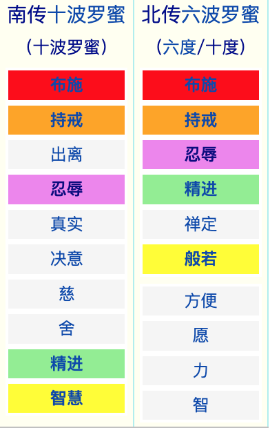

封面插圖

## 《南传菩萨道》簡介

## 南传也有菩萨道

这个标题可能会令很多人感觉惊讶，因为大多数人在听说南传佛教时，都是说他们是小乘，声闻，二乘人，修行解脱道，却少有人知道，南传也是有菩萨道的。

事实上，南传不仅有菩萨道，而且对于修行菩萨道也有详细的说明，这对于即使是在南传佛教很兴盛的地区，有人想要发心成佛，也是值得鼓励，且有经典为依据可修可证的。

## 为何南传不是以菩萨道为主呢？

以阿含经为主的经典表明，以苦集灭道，十二缘起为核心理论的教法里面，其目的是断苦，灭苦，彻底地断除苦 —— 这便是涅槃。而且依据《阿含经》来说，只要达到了这灭苦的涅槃，在阿罗汉与佛来说，并无不同。阿罗汉与佛的不同之处，最主要的不同则在于是否要听闻佛法才证涅槃，佛是自悟后而证涅槃的，而阿罗汉则需要听闻佛陀说法才能证涅槃了。正因为依据《阿含经》来说，佛陀的涅槃和阿罗汉的涅槃是相同的，因此以《阿含经》为主的教法里面，便没有太提及如何成佛的事情。

虽然以北传佛教的角度来说，经常批评声闻乘行者是小乘，自了汉，但这是因为根据大乘经典而言的，对于只知道，或只信仰《阿含经》的人来说，知苦，断集，修道，灭苦这是一个完整的、自洽的修证体系的。

## 南传对于菩萨认定标准极高

南傳的菩薩必須被佛授記後，才能稱之為菩薩，这类菩萨而且不会退转成凡夫。而被授记则需要具足八个条件，八个条件值得注意的是“有能力在那一生证得阿罗汉位”，但为了成佛而不取证。其次还要具備四禪八定與五神通，即除阿罗汉才有的漏尽通。

而北傳的菩薩稱謂則是非常普遍的，原則上，只要發心成佛就可以稱之為菩薩了，甚至只要發心學佛，無論發心是否成佛，都可以稱之為菩薩了。這是依據《法華經》裡面的，沒有三乘道，只有一佛乘來說的。所以有道場把所有的信眾稱之為菩薩，也就不足為奇了。

# 菩薩的分類或級別

南传菩萨可以分为三个级别：

1. 慧者菩薩，即慧根，慧力或慧心所比较强大。
2. 信者菩薩，即信根，信力或信心所比较强大。也表面其慧和信相比不够强大。
3. 精進者菩薩，和以上两者相比，慧和信都不够强大，但很精进。

三者菩萨修行成佛的时间分别是：
1. 慧者菩薩 —— 四阿僧祗與十萬大劫
2. 信者菩薩 —— 八阿僧祗與十萬大劫
3. 精進者菩薩 —— 十六阿僧祗與十萬大劫

《南传菩萨道》中甚至说，辟支佛需要经历兩阿僧祗與十萬大劫才能成就，而希望成就像目犍连和舍利佛两位大尊者这样的“上首弟子”，则需要一阿僧祗與十萬大劫，其次的“大弟子”们则需要十萬大劫。

北传的菩萨分类则更加精细，说法也多，这里只采用最被流传的五十二阶位之说，其可以分为5大类，和最后的等觉和妙觉。其五大类是：十信、十住、十行、十回向和十地。

而修行时间则需要三大阿僧祇劫或百阿僧祇劫之说，如果以三大阿僧祇劫之说，可以分成三大阶段，第一阶段是初地之前为第一阿僧祇劫，第二阶段是从初地到八地，第三阶段是八地到成佛。

# 波罗蜜

一个阿僧祇劫就是无比久远的时间，何况多个。所以无论是三个，四个，八个，十六个还是一百个，在这么长的时间内，菩萨们都是修行波罗蜜，累积波罗蜜，这点总体的原则是一样的。

《南传菩萨道》列举了所需要修行的十种波罗蜜，分别是：布施、持戒、出离、智慧、精进、忍耐、真实、决意、慈、舍。

其中的布施、持戒、智慧、精进、忍耐和北传的六波罗密中的五种是类似的，北传的菩萨道需要六种波罗蜜，即除了前面五种，再加上禅定。而北传也有十波罗蜜的说法，即从般若中再开出四种波罗蜜，方便，愿，力和智。简单的对应关系可以参考下表：

# 菩萨名字

鉴于以上的高标准（被授记，不退转）来说，弥勒菩萨是南传唯一承认的菩萨了。除此之外，就不再承认有其他菩萨了，即使是有发心修行菩萨道的人，但是因为还没有达到被授记的程度，所以不会承认他的菩萨身份。

而北传佛教的菩萨们数量则非常多，最常见的菩萨们有：观世音菩萨，文殊师利菩萨，地藏菩萨，弥勒菩萨，大势至菩萨，准提菩萨等。这些菩萨们都是大菩萨，即菩萨摩诃萨，按照上面的52阶位来说，也都是等觉菩萨的级别了。

当然，这里没有包括释迦牟尼成佛之前的菩萨名字了，或其他佛成佛之前的菩萨名字了，只要是共同认可的佛，那么他们之前的菩萨身份也是大多被认可的。

# 聞思修

《南傳菩薩道》中也把智慧波羅蜜分成三種，分別是：一、聞所成慧（sutamaya paññā）；二、思所成慧（cintāmaya paññā）；三、修所成慧（bhāvanāmaya paññā）。

一、聞所成慧：
（i）五蘊、十二處、十八界、四聖諦、廿二根、十二因緣、由四念處等所組成的三十七菩提分，以及善惡等各種法的排式。
（ii）無可責備、有助於為眾生帶來快樂與福利的世間知識。如此菩薩培育了聞所成慧而成為智者，成就自己，也為他人建立智慧。

二、思所成慧：
菩薩通過深入地省察五蘊等究竟法，以培育思所成慧。

三、修所成慧：
在體驗到禪那、觀智或道果時所獲得智慧是修所成慧。即是前九個觀智，譬如觀察有為法無常、苦、無我的思惟智。

南傳佛教把智慧（或觀智）分成十六個層次，分別是：
　　　　
1. ‘名色分別智’(Namarupaparicchedañāna)是首先要作的工作，用來破世人的“一個”，“一體”的邪見。
2. ‘緣攝受智’(Paccayapariggahañāna)是幫助我們觀照名、色法個別的生起因緣。
3. ‘三相思惟智’(Sammasanañāna)是斷除我們對五蘊的執著。
4. ‘生滅隨觀智’(Udayabbayañāna)是觀照名、色法的生滅。
5. ‘壞隨觀智’(Bhangañāna)是覺知名、色法的壞滅。
6. ‘怖畏現起智’(Bhanyañāna)是生起對諸行法的怖畏。
7. ‘過患隨觀智’(Ādinavañāna)是觀照色法的過患與危厄。
8. ‘厭離隨觀智’(Nibbidāñāna)是對諸行法的厭離。
9. ‘欲解脫智’(Muñcitukamyatāñāna)是欲解脫出離於一切行。
10. ‘審察隨觀智’(Patisankhāñāna)是審察前面的六智，它也是三相思惟智。
11. ‘行舍智’(Sankhārupekkāñāna)是舍離諸行的智。
12. ‘隨順智’(Anulomañāna)是隨順於前面的八智及後面的三十七菩提分法，以行道而得其道果。
13. ‘種姓智’(Gotrabhūcittā)是超越凡夫種姓的智。
14. ‘四道智’(Magga cittā)是走向四位聖人的道智。
15. ‘四果智’(Phala cittā)是產生四位聖人的果智。
16. ‘余漏智’(Paccavekkhaņañāna)是審察自己的剩余的煩惱，而用擇法去斷除這些煩惱的智慧。

這裡是的前九個，即是截止到“欲解脫智”了，後面又說最多可以達到“行捨智”（第11個觀智）的一部分，再繼續修觀智，就無法成佛，而只能成阿羅漢了，所以菩薩會在修行到“行捨智”的一部分，就不會繼續修觀智了。

而聞思部分，南傳北傳幾乎是一樣的解釋了。北傳的聞所成慧也可以用五明來總結，即是內明（佛學）、醫方明（醫學）、工巧明（技藝）、聲明（音樂）、因明（邏輯學）。也可以總結為兩類：佛學和世間學問，學習世間學問的目的，也不外乎是廣結善緣了（累積福德），為圓滿其他波羅蜜提供前提條件了。

# 菩薩和佛在智慧上的差別

前面已經提到了南傳菩薩最多可以修證到第11個觀智 —— 即行捨智的一部分。直到要成佛的那一世，才會繼續修證第11個觀智，直到第16個觀智，即成佛了。從上述的列表可以看到，這中間一共還有5個觀智的區別。

北傳的菩薩有52階位，但第52階位為妙覺，即是佛了。所有菩薩位的最高位是第51位，稱之為等覺菩薩。再查佛典，等覺菩薩和佛已經沒什麼區別了，和佛的覺悟是平等的，所以稱之為等覺。也可以說，其差別太微細太微細了。有時也會解釋說還有一份微細無明未斷，所以還未成佛，還是菩薩了。

# 俗諦和究竟諦

俗諦：俗諦是符合一般上人們給予事物的名稱。一般人們是根據形狀來為東西命名。他們稱這種形狀的東西為「人」，那種形狀的東西為「牛」，另一種形狀的東西為「馬」。

究竟諦：在究竟上存在的真實法是為究竟諦。譬如，當人們說：「識知各種事物的是心」，那認知之法本身即是究竟諦，因為在究竟上它是存在的。當人們說：「由於熱和冷等相對的現象而變化的東西即是色」，那變化之法本身即是究竟諦，因為在究竟上它們是存在的。如此，心所及涅槃也是究竟諦，因為在究竟上它們是存在的。

究竟諦有兩種：一、自性諦；二、聖諦。所有四種究竟法即，心、心所、色法及涅槃組成了自性諦（sabhāva-sacca），因為在究竟上它們是真實的。

在世間的事裡，有屬於自性諦的身體快樂和心的愉悅兩者。若某人接觸到可喜的目標，由於觸覺他會感到快樂。無人能夠否認說：「不，那不是真的」，或是說：「接觸可喜的目標是不可喜的。」無人能這麼說是因為那人所接觸的是真正的可喜觸所緣。

聖諦：即是苦集滅道四聖諦了。

北傳佛法裡面也用二諦來詮釋全體佛法，不過在究竟諦（北傳通常稱之為勝義諦）上，南北的詮釋是不同的。北傳一句三個體系，分別有自己的勝義諦。如般若中觀把空觀當做勝義諦，而唯識則把圓成實性作為勝義諦，如來藏則把如來藏當做勝義諦。這只是最簡單的二諦分類了，再複雜一點，則會把二諦也分成多個層次，如四重二諦說。其中最初級的，和南傳類似，或把空性作為勝義，而最高級的二諦，則是超越一切語言文字、經驗體會，而變成不可思，不可議，不可說了。

