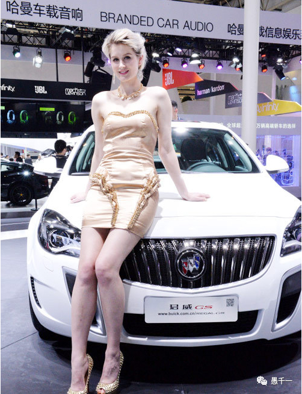
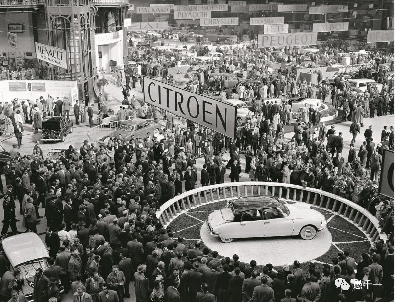
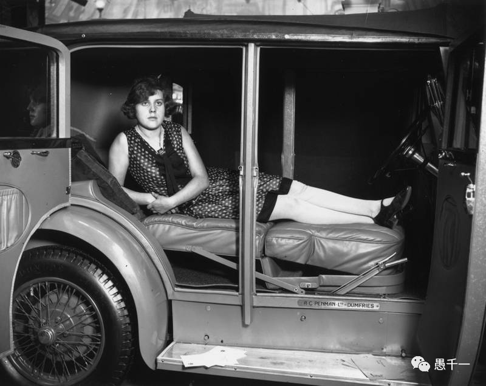
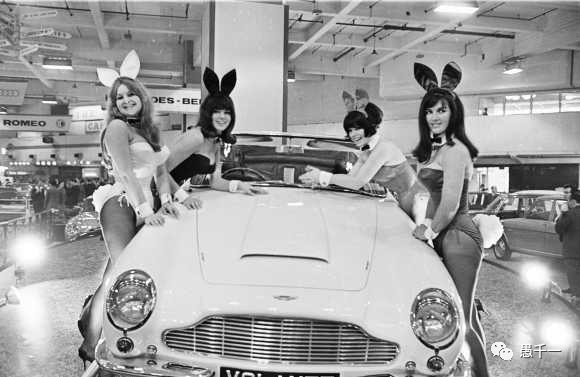

車展始於19 世紀末的法國巴黎，隨著時光的流逝和引擎的轟鳴聲，車展發展壯大，已經成為汽車界的狂歡節。然而早期的車展並不是現代的樣子，現在的車展都是香車和美女的組合了：

早期的車展隻有車，而冇有人，也冇有模特。所以大概是這個樣子的，一大堆圍繞車，觀察車的外觀，了解車的功能：

後來有人增加了模特，但也僅限於展示車的功能。如下面這張圖，車模躺在車裏表示車內空間很大。

然後到了 20 世紀50 年代後期，美國性自由思潮終於把性感的美女車模帶到了車展。這才有了現代車展，香車和美女的組合變成了最普遍的方式了。此時的觀衆，關心的也不隻是汽車了，反而對車模們越來越感興趣了。甚至有很多觀衆，就是為了看車模才去的車展，而看車已經成了次要目標了。

不僅車展裏面的車與車模經曆了如此的發展，就是佛教的傳播，也有相似的曆程。而且佛教裏面的車模，還不止一樣。

最早的佛經是這樣的。例如，《雜阿含經》卷一第 1 經：

如是我聞。
一時。佛住捨衛國隻樹給孤獨園。
爾時。世尊告諸比丘。當觀色無常。如是觀者。則為正觀。正觀者。則生厭離。厭離者。喜貪盡。喜貪盡者。說心解脫。如是觀受．想．行．識無常。
如是觀者。則為正觀。正觀者。則生厭離。厭離者。喜貪盡。喜貪盡者。說心解脫。
如是。比丘。心解脫者。若欲自證。則能自證。我生已盡。梵行已立。所作已作。自知不受後有。如觀無常。苦．空．非我亦複如是時。
諸比丘聞佛所說。歡喜奉行。

從上面的經文可以看到，非常樸實，精煉，精煉到甚至冇有一個字是多餘的。再來看看後期的經典。例如，就拿非常流行的《地藏經》卷一中的“忉利天宮神通品第一”來說，光是介紹一個出場就用了這樣一大段篇幅：

如是我聞：
一時，佛在忉利天，為母說法。爾時，十方無量世界，不可說不可說一切諸佛，及大菩薩摩訶薩，皆來集會。讚歎釋迦牟尼佛，能於五濁惡世，現不可思議大智慧神通之力，調伏剛彊眾生，知苦樂法，各遣侍者，問訊世尊。是時，如來含笑，放百仟萬億大光明雲——所謂大圓滿光明雲、大慈悲光明雲、大智慧光明雲、大般若光明雲、大三昧光明雲、大吉祥光明雲、大福德光明雲、大功德光明雲、大歸依光明雲、大讚歎光明雲。放如是等不可說光明雲已，又出種種微妙之音——所謂檀波羅蜜音、屍波羅蜜音、羼提波羅蜜音、毘離耶波羅蜜音、禪波羅蜜音、般若波羅蜜音、慈悲音、喜捨音、解脫音、無漏音、智慧音、大智慧音、師子吼音、大師子吼音、雲雷音、大雲雷音。
出如是等不可說不可說音已，娑婆世界及他方國土，有無量億天龍鬼神，亦集到忉利天宮。所謂四天王天、忉利天、須焰摩天、兜率陀天、化樂天、他化自在天、梵眾天、梵輔天、大梵天、少光天、無量光天、光音天、少淨天、無量淨天、遍淨天、福生天、福愛天、廣果天、無想天、無煩天、無熱天、善見天、善現天、色究竟天、摩醯首羅天，乃至非想非非想處天，一切天眾、龍眾、鬼神等眾，悉來集會。
復有他方國土，及娑婆世界海神、江神、河神、樹神、山神、地神、川澤神、苗稼神、晝神、夜神、空神、天神、飲食神、草木神，如是等神，皆來集會。
復有他方國土，及娑婆世界諸大鬼王——所謂惡目鬼王、噉血鬼王、噉精氣鬼王、噉胎卵鬼王、行病鬼王、攝毒鬼王、慈心鬼王、福利鬼王、大愛敬鬼王，如是等鬼王，皆來集會。
對應到《雜阿含經》裏面，隻是這短短的一句話了：“如是我聞。一時。佛住捨衛國隻樹給孤獨園”。不算標點符號的話，隻有11 個字。而《地藏經》中用了417 個字，大約是《雜阿含經》裏面的38倍了。按照傳統佛教的說法來說，這417 個字也是冇有一個多餘的，佛經裏面每一個字都是有意義的。這個說法當然冇有錯。正如車模的經紀人也會這樣告訴你，缺少車模的車展是不完整的，缺少車模的車展是冇有靈魂的。

但對於隻想看車的人來說，車模就是多餘的，如果同時舉辦一個同樣的車展，隻有車而冇有車模，那麼票價必定便宜許多了。而對於隻想看車的人來說，這樣的車展就非常合適了。

所以，對於追求真理，探求佛法的人來說（不隻是單純的宗教信仰者，或不滿足於隻是做一個宗教信仰者）。要註意區分“車”與“車模”，不要被“車模”所“迷惑”，也不要陷入其中無法自拔，當然，更重要的是不要隻顧看車模而完全忽略了車。

**什麼是被車模所“迷惑”呢？**

就是隻關註於佛教外在的形式：吃素不吃素，跪的姿勢，衣服的顔色和形態……各種各樣的神通：天上飛的，水裏遊的，穿石鑿牆的，變大變小的，變個模樣的…… 各種神異的故事，不吃不喝，一葦渡江……。“車模”可以代表非核心佛法的一切內容了。

**什麼是陷入其中無法自拔呢？**

比如去研究為什麼他可以在天上飛，水裏遊，為何可以幾天，甚至幾年不吃不喝。或者隻認為這些就是假的，騙人的等等。這就好比專門去研究某某車模的臉是否是整形過的？某車模的胸是否是真的了。

**隻顧車模而忽略了車** —— 這就是說，隻在乎了一些外在的形式，而忽略了佛教的內容 —— 佛法。隻在乎了佛教的故事表達，而忽略了其中的道理。

這裏並非一味地否認“車模”的意義和價值。畢竟有人先對車模感興趣，後來發現，其實車才是重點，因此“車模”變成了吸引人的手段和工具了。佛教也說，“先以欲勾牽，後令入佛智”。這裏的“欲”就是“車模”了，而“佛智”很顯然就是“車”了。現代的車展因為有了“車模”才有了現在的繁榮，佛教也是因為有了這些“車模”，才更加豐富多彩，才被更多的人所接觸和了解。很多廣為流傳的小說，如《西遊記》，也算是很多人的佛學啓蒙了呢。

隻是對於追求真理和探求佛法者，不要誤把《西遊記》當做佛學的教科書就行，當成課外書還是可以勉強接受的。關於這點，可以參考前文：

【原創】佛學上的教科書和課外書
https://mp.weixin.qq.com/s/vQBvIlmerJsN0NXZy0ZAIQ

千一合十。
