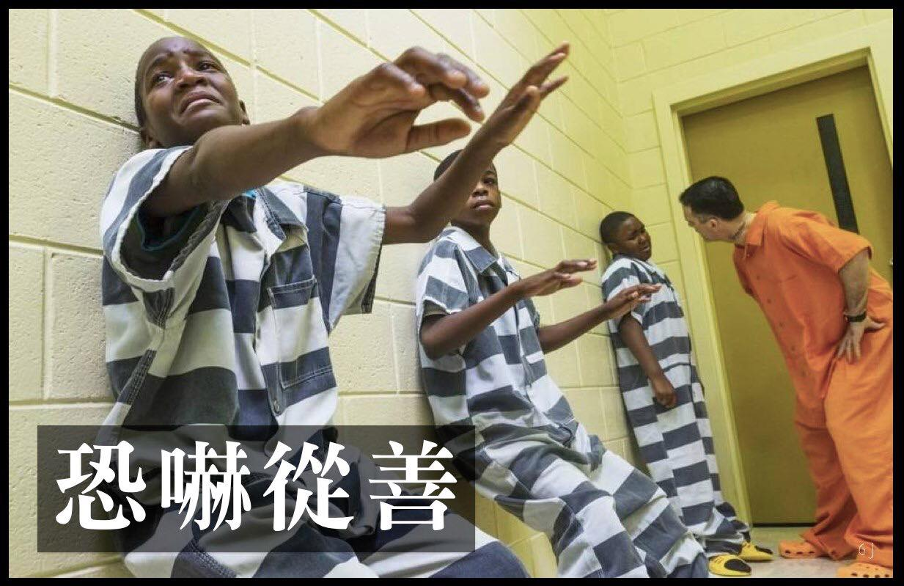

## 恐吓从善

美国有一个历史悠久、非常冷门的节目叫《Beyond Scared Straight》，中文翻作「少年监狱之旅」或「以恐吓改善」，这节目搭配的是亚特兰大政府在青少年预防犯罪计划中推出的一项「体验活动」，他们选中了一些令父母和学校都头疼的问题孩子，让他们去体验坐牢生活，由狱卒管理，跟最穷凶恶极的犯人关在一起，体验坐牢的真实样貌，以恐惧入狱、进而改过向善。

被选中的孩子都不是普通的坏孩子，而是那些具备明显犯罪倾向甚至有犯罪前科的孩子，他们打架、偷窃、抢劫、纵火、辱骂亲人，让家长束手无策、感到无望。

这个创意听起来似乎很有道理，节目的效果非常真实，一开始也受到了很多人的支持。然而结果非常意外，首先受到了司法部和其他专家的批评和反对，因为这行为本身涉嫌违反了联邦的《青少年司法和预防犯罪法》。其次2002年NGO组织康培尔研究团队对此专案进行了一个系统性回顾的研究，最终证实：

1. 以恐吓改善无效。
2. 以恐吓改善反而刺激了犯罪率的增长。
3. 以恐吓改善是一个失败的计划。

中文参考：https://www.facebook.com/rulescreative/photos/a.1579532998941143/2782560101971754/?type=3
英文参考：https://en.wikipedia.org/wiki/Beyond_Scared_Straight

## 正向教育

教育可以分成两类，一类是正向教育，以教育和鼓励为主。另一类就是逆向教育，以威胁、恐吓和打击的方式迫使他不得不接受教育。现代社会和文明的地区都做出了自己的选择，选择了越来越正向的教育。

以我本人的求学经历而言，上小学的时候，班里也是有几位问题学生的，他们的个头还不小，结果就是经常可以看到老师在教育他，体罚他，打他。他们还会还手，结果就变成了老师和学生打架了，结果还是因为老师更强壮一些，最终总能武力制服他们。我们那个时候上学，老师体罚学生是非常普遍的事情，父母们也经常对老师说，孩子在学校，不听话的话，该打就打，打坏了也不要紧。有时，父母还会帮着老师打学生。

短短几十年过去了，这类现象完全倒正过来了。现在的老师，连学生的一根毫毛都不敢碰了，体罚也被教育部明令禁止了。老师们的言语也变得温柔了，不再是那种轻易侮辱人的话语了。现在也再也没有家长去跟老师说，可以打孩子了，要打也是父母带回家自己教育了。而在欧美国家，即使是父母在家里，也不能打孩子了。

## 阳光大道和独木桥

阳光大道，顾名思义就是指适合大多数人走的路，而且是安全的，稳妥的，路途中不会有大坑，不会让你葬送生命，最重要的是，最终都可以到达终点。当然，其中会有少数的意外发生。总体来说，阳光大道是安全的、稳妥的、容易达到目的。

相比之下，独木桥则是一种充满风险的选择，而且对于行人来说，是首先需要懂得平衡的技巧，才有可能平安到达终点的。稍不留神，就会跌落桥下，轻则伤筋动骨，重则丢失性命。

对于大多数人来说，很自然都会主动选择平稳的、安全的阳光大道了。除非是无路可走，只有独木桥了，这个时候才会为了到达终点而不得不冒险一试。

以社会上的教育体系来说，其实也可以粗略地分为两种，一种教育是学校的教育体系，从小学，中学再到大学。但其实还有一个教育机构，同样具备“教育”的功能 —— 那这个教育机构是什么地方呢？就是监狱，去里面的人通常说就是去坐牢。但还有一种叫法，其实是叫“劳改”，即“劳动改造”，期望通过劳动改造的方式，令犯人能够认识错误，改过自新。虽然监狱的功能不只是教育，还有惩罚和限制人身的作用，但也兼有教育的价值，毕竟都是希望他们可以改过自新，好好做人的。

## 密法

**显密法是相对的**

佛法也可以大概分成两类：显宗和密宗，对应的佛法则是：显法和密法。有显就有密，有公开的佛法，就会有秘密的佛法，这两者是辩证的关系。用佛学术语来说，就是相待的关系。如有大，就会有小。一样地，有显法就会有密法。所以，密法的存在是必然的。

**显密法也是因缘法**

所谓密法，就是秘密的法门，即只要不公开流传的，都可以算作是密法了。如咒语（也叫真言）早先就是在密法中非常推崇和鼓励的佛法。但随着时间的推移，咒语被越来越多的人所接受，最终变成了显法，乃至成为了很多寺院和道场的早晚课内容了。例如《大悲咒》《准提咒》等。

由此可见，密法也不总是固定的密法，也是可能变成显法的。这是因为密法的定义，是根据佛法的传播方式来定义的。而传播方式也显然是属于世间法，有为法的范畴，因此它们也不是固定的、永恒不变的，而是会根据因缘的变化而变化的。上面就给出了一个密法变显法的例子了。

那么有没有可能显法变密法呢？其实也是有的。其实历史上也短暂有过，但考虑到文章需要发表的风险，我就用一个假设的场景好了。假设有一个特殊的国家，在这个国家里面严格限制宗教，不允许传教。但因为宗教的需求旺盛，大家心灵缺乏寄托，最终还是会“传教”，这是这种传教的方式会被限定在指定的地方进行，而无法公开地，普遍地传教了。

如果这个国家再进一步，直接把所有的宗教定性为非法活动，命令禁止一切传教活动，同时毁灭所有的宗教建筑，典籍。就好像穆斯林在古印度时做的那样，对佛教赶尽杀绝。最终，一切的佛教活动就会全面转下低下，掩盖，掩藏，大家口耳相传，严密公开暴露。这种极端的情况下，那么一切佛法都会转为密法了，因为只会通过秘密的方式进行传播了。

由此可见，只要因缘变化，密法可以变显法，显法也可以变密法了。

**应该如何看待密法**

如果只从传播方式的不同来看，那么显密法并无本质的区别。尤其是当社会发展到比较文明的时候，对各种事物都比较包容的时候，还需要通过秘密方式来传播的必要性就降低了。

如果是在宗教自由的文明社会里面，还依赖秘密的方式来传播，只能通过秘密的方式来传播。那么这种密法大概率就是和现代法治社会相冲突了，也就更不符合大多数人的道德观了。说得再直白一点，那就是违法的。如果公开或者被揭露的话，有确凿证据的情况下，都是可以被提起刑事诉讼的。当然，宗教是一个很复杂的问题，也会有政治上的考量，所以并不是每一起案件都会被公布于众的。

所以对于这种和现代法律相冲突的密法，是要极其谨慎对待的。对于普通人来说，遇到骗子的概率超过99%。毕竟有太多人钻这个“密法”的漏洞，从而干起了见不得人的勾当，而这些勾当里面，最常见的和最严重的莫过于骗色和淫乱了。（剩下的不到1%的概率，也不在我文章的讨论范围之内了。世界很大，总会有比较落后的地方，缺乏现代教育的地方，还能够接纳那类事情了。）

**密法也分正向教育和逆向教育**

目前的显法（截止到我写文章的时候），绝大多数都是正向教育的，即以鼓励和教育为主。

而密法里面，虽然也有正向教育，比如密宗里面的净土法门。但密法里面，逆向教育的比重相当之大，从各种护法的形象便可一目了然，许许多多都是面目狰狞的。对于这类逆向教育的方法，因为和现代教育的正向教育理念相违背，也免不了变成了密法。即只能通过较秘密的方式才能传播了。

这种逆向教育的密法，就像是在遍地汽车的现代社会里面走独木桥了。
